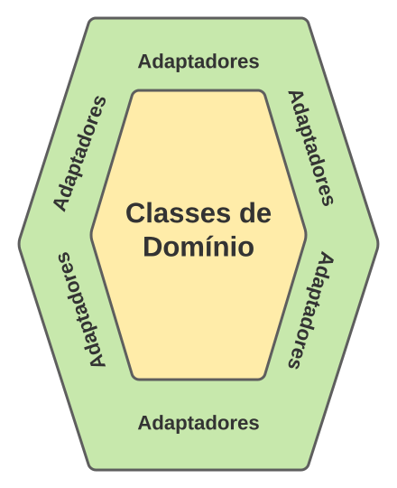

# O que é uma Arquitetura Hexagonal? {.unnumbered}

## Introdução {.unnumbered}

O conceito de Arquitetura Hexagonal foi proposto por Alistair Cockburn, 
em meados dos anos 90, em um [artigo](http://wiki.c2.com/?HexagonalArchitecture) 
postado na primeira wiki que foi desenvolvida, chamada WikiWikiWeb 
(cujos artigos tratavam principalmente de temas relacionados com 
Engenharia de Software).

Os objetivos de uma Arquitetura Hexagonal são parecidos com os
de uma Arquitetura Limpa, tal como descrevemos em um outro 
[artigo](./arquitetura-limpa.html). Mas, 
para reforçar, a ideia é construir sistemas que favorecem 
reusabilidade de código, alta coesão, baixo acoplamento, independência 
de tecnologia e que são mais fáceis de serem testados. 

Uma Arquitetura Hexagonal divide as classes de um sistema em
dois grupos principais: 

* Classes de domínio, isto é, diretamente relacionadas com o negócio do sistema. 
* Classes relacionadas com infraestrutura, tecnologias e responsáveis
pela integração com sistemas externos (tais como bancos de dados). 

Além disso, em uma Arquitetura Hexagonal, **classes de domínio não devem 
depender de classes relacionadas com infraestrutura, tecnologias ou 
sistemas externos**. A vantagem dessa divisão é desacoplar esses dois 
tipos de classes.

Assim, as classes de domínio não conhecem as tecnologias -- bancos 
de dados, interfaces com usuário e quaisquer outras bibliotecas -- 
usadas pelo sistema. Consequentemente, mudanças de tecnologia 
podem ser feitas sem impactar as classes de domínio. Talvez ainda 
mais importante, as classes de domínio podem ser compartilhadas 
por mais de uma tecnologia. Por exemplo, um sistema pode ter diversas 
interfaces (Web, mobile, etc). 

Em uma arquitetura hexagonal, a comunicação entre as classes dos dois 
grupos é mediada por **adaptadores**, isto é, por classes que 
implementam o padrão de projeto de mesmo nome que estudamos no 
[Capítulo 6](../cap6.html#adaptador). Iremos explicar
melhor o papel dos adaptadores logo a seguir.

Visualmente, a arquitetura é representada por meio de dois hexágonos 
concêntricos (veja figura). No hexágono interno, ficam as classes do domínio 
(ou classes de negócio, se você preferir). No hexágono externo, ficam os 
adaptadores. Por fim, as classes de interface com o usuário, classes de
tecnologia ou de sistemas externos ficam fora desses dois hexágonos.

{width=40%}

Assim, o nome hexagonal tem sua origem na figura acima.
Cockburn justifica o uso de um hexágono do seguinte modo:

> Cada face do hexágono representa um motivo pelo qual o sistema deve 
se comunicar com o mundo exterior. É por isso que são hexágonos 
concêntricos e não círculos concêntricos.

Dentre os motivos que requerem comunicação com o mundo
exterior podemos citar os seguintes: interagir com seus usuários
(por meio de algum tipo de interface, seja ela gráfica, Web, mobile, 
terminal, etc), persistir informações, enviar informações para 
outros sistemas, etc.

## Adaptadores e Portas {.unnumbered}

Em uma Arquitetura Hexagonal, o termo **porta** designa as interfaces
usadas para comunicação com as classes de domínio (veja que interface
aqui significa interface de programação; por exemplo, uma **interface**
de Java).

Existem dois tipos de portas:

* **Portas de entrada:** são interfaces usadas para comunicação 
de fora para dentro, isto é, quando uma classe externa precisa chamar 
um método de uma classe de domínio. 

* **Portas de saída:** são interfaces usadas para comunicação de 
dentro para fora, isto é, quando uma classe de domínio precisa 
chamar um método de uma classe externa. 

O importante é que **as portas são independentes de tecnologia**. 
Portanto, elas estão localizadas no hexágono interior.

Por outro lado, os sistemas externos, normalmente, usam alguma tecnologia, 
seja ela de comunicação (REST, gRPC, GraphQL, etc), de bancos de dados 
(SQL, noSQL, etc), de interação com o usuário (Web, mobile, etc), etc.

Daí a necessidade de componentes localizados no hexágono mais externo 
da arquitetura -- os **adaptadores** --, os quais atuam de um dos dois 
modos a seguir:

* Eles recebem chamadas de métodos vindas de fora do sistema e  
encaminham essas chamadas para métodos adequados das portas de 
entrada.

* Eles recebem chamadas vindas de dentro do sistema, isto é,
das classes de domínio, e as direcionam para um sistema externo, 
tais como um banco de dados, um outro sistema da organização ou mesmo
de terceiros.

## Exemplo: Sistema de Bibliotecas {.unnumbered}

A próxima figura mostra a arquitetura hexagonal de um sistema para
gerenciamento de bibliotecas:

{width=90%}

Na figura, podemos observar que os usuários acessam o sistema por meio 
de três interfaces: Web, mobile e por meio de um sistema externo. Qualquer 
que seja a forma de acesso, ele é sempre mediado por adaptadores. Em seguida, 
esses adaptadores comunicam-se com uma porta de entrada, que define métodos 
para pesquisa no catálogo da biblioteca, para realização de empréstimos, 
para cadastro de usuários, etc. Concretamente, esses métodos são implementados 
pelas classes de domínio. No sistema em questão, essas classes incluem `Livro`, 
`Usuario`,  `Bibliotecario`, `Emprestimo`, `Reserva`, etc.

O sistema precisa também persistir algumas informações. Para isso, 
ele usa uma porta de saída, com métodos para salvar e ler dados de livros, 
salvar e ler dados de empréstimos, etc. Plugado nessa porta temos um 
adaptador, que realiza as operações em um banco de dados relacional.

Um sistema pode possuir várias portas de entrada e de saída (sempre 
localizadas no hexágono interior, junto às classes de domínio). Em uma 
determinada porta, seja ela de entrada ou de saída, podemos plugar 
um ou mais adaptadores, os quais ficam sempre localizados no hexágono
mais externo.

## Comentário Final {.unnumbered}

Em 2005, Cockburn tentou renomear o nome de sua arquitetura para 
**Arquitetura baseada em Portas e Adaptadores**, com a seguinte
justificativa:

> Eu finalmente tive esse momento "aha!" (junho de 2005) no qual vi 
que as faces do hexágono [interno] são "portas"... e os objetos entre 
os dois hexágonos são "adaptadores" e, portanto, o padrão arquitetural 
consiste em uma Arquitetura Baseada em Portas e Adaptadores. Esse nome 
admite uma explicação melhor do que aquela que eu propus com o nome 
Arquitetura Hexagonal. 

No entanto, a tentativa de renomeação não deu tão certo e a arquitetura,
provavelmente, continua sendo mais conhecida como Arquitetura Hexagonal.

### Para Saber Mais {.unnumbered}

Se quiser conhecer mais sobre Arquitetura Hexagonal, recomendamos dois
pequenos artigos do Alistair Cockburn na WikiWikiWeb. O primeiro 
[artigo](http://wiki.c2.com/?HexagonalArchitecture) define a arquitetura. 
Já o segundo [artigo](http://wiki.c2.com/?PortsAndAdaptersArchitecture) 
tenta renomeá-la para incluir os termos portas e adaptadores.

Se quiser, veja também nosso artigo sobre
[Arquitetura Limpa](./arquitetura-limpa.html).

## Exercícios {.unnumbered}

1. Em uma Arquitetura Hexagonal, um adaptador é uma implementação do 
padrão de projeto de mesmo nome. E as portas? Elas podem ser 
vistas como sendo uma implementação -- pelo menos aproximada -- de 
qual padrão de projeto? Se necessário, consulte o 
[Capítulo 6](../cap6.html) para responder.

2. Na figura que mostra a arquitetura hexagonal do sistema de bibliotecas,
por que os adaptadores de interface externa (HTTP, GraphQL e REST) e
o adaptador de persistência (SQL) estão em faces distintas do hexágono?
Eles poderiam ser desenhados na mesma face?

3. A definição do termo hexagonal é arbitrária, pois, dependendo
da aplicação, ela poderia ser chamada de quadrangular, pentagonal, heptagonal,
octogonal, etc. Justifique essa afirmação.

4. Descreva, resumidamente, as diferenças entre a Arquitetura Hexagonal
e a Arquitetura Limpa (que estudamos em um outro 
[artigo](./arquitetura-limpa.html) didático).

* * * 

Voltar para a lista de [artigos](./artigos.html). 

