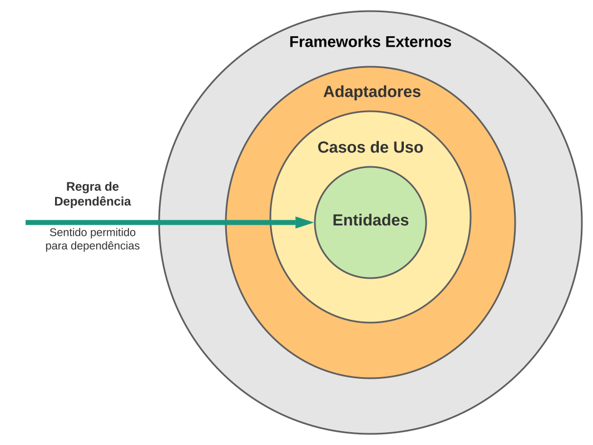
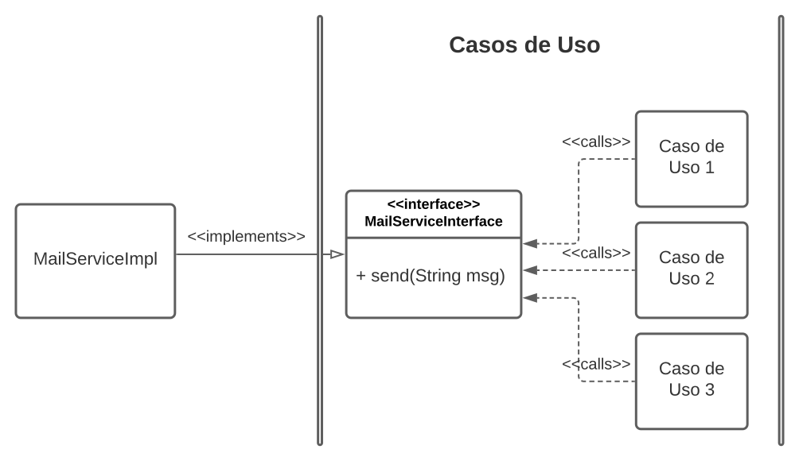

# Construindo Sistemas com uma Arquitetura Limpa {.unnumbered}

## Introdução {.unnumbered}

**Arquitetura Limpa** (*Clean Architecture*) é um padrão arquitetural proposto
por Robert Martin -- mais conhecido como Uncle Bob -- com o objetivo de 
promover a implementação de sistemas que favorecem reusabilidade de código,
coesão, independência de tecnologia e testabilidade. Se quisermos adotar a 
classificação do [Capítulo 7](https://engsoftmoderna.info/cap7.html), 
a Arquitetura Limpa pode ser considerada como uma arquitetura em camadas.

Normalmente, Arquitetura Limpa é ilustrada por meio da seguinte figura
(baseada em uma figura semelhante do seguinte [post](https://blog.cleancoder.com/uncle-bob/2012/08/13/the-clean-architecture.html) do "The Clean Code Blog").

{width=70%}

A seguir, vamos comentar sobre cada um das camadas da arquitetura.

## Entidades e Casos de Uso {.unnumbered}

No centro da arquitetura, temos as classes responsáveis pelas regras de negócio, 
que podem ser de dois tipos: Entidades e Casos de Uso.

**Entidades** são classes comuns a vários sistemas da empresa. Suponha, por
exemplo, uma universidade com sistemas acadêmico, financeiro, extensão, etc.
Todos esses sistemas têm que lidar com classes como `Aluno`, `Professor`, `Curso`,
`Departamento`, etc. Essas classes são então chamadas de Entidades. Além de dados, entidades
podem implementar regras de negócio genéricas. Por exemplo, uma regra da universidade
define que todo `Professor` deve pertencer a exatamente um `Departamento`.

Já as classes da camada **Casos de Uso** implementam regras de negócio 
específicas de um sistema. Por exemplo, o sistema acadêmico do nosso exemplo 
pode ter uma classe  `DiarioDeClasse` que armazena a lista de objetos 
do tipo `Aluno` matriculados em 
uma `Disciplina` que está sendo ofertada em um determinado 
semestre. Uma regra de negócio define que um `Aluno` 
somente pode ser incluído em um `DiarioDeClasse` se tiver cursado os 
pré-requisitos da sua `Disciplina`. 

Para evitar qualquer tipo de confusão, gostaríamos de comentar que 
os casos de uso em uma Arquitetura Limpa não tem uma correspondência,
pelo menos direta, com casos de uso para especificação de requisitos 
e, menos ainda, com diagramas de casos de uso da UML, tal como 
estudamos no [Capítulo 3](https://engsoftmoderna.info/cap3.html).
 
## Adaptadores {.unnumbered}

Na terceira camada, de dentro para fora, temos classes e interfaces
chamadas de **Adaptadores**. A função delas é converter dados de um 
formato para outro.

Suponha, por exemplo, que o sistema use uma API REST para comunicação
com seus clientes. As classes adaptadoras serão então 
responsáveis por implementar os *endpoints* REST da API. Isto é, elas
devem receber as requisições e encaminhá-las para os casos de uso 
correspondentes. E, também, fazer o caminho inverso: receber os resultados 
retornados pelos casos de uso e convertê-los em documentos JSON 
que serão enviados para os clientes.

Se o sistema for implementado usando-se um framework MVC Web, os 
controladores pertencerão a essa camada.

## Frameworks Externos {.unnumbered}

Na camada mais externa, temos as classes de bibliotecas e frameworks 
externos (de terceiros), as quais podem ser responsáveis por persistência, 
construção de interfaces com usuários, envio de mails, integração com 
outros sistemas, comunicação com um determinado hardware, etc.

Por exemplo, a universidade do nosso exemplo pode possuir 
um sistema para gerenciamento de cursos de extensão, que aceita 
pagamento por meio de cartões de crédito. 
Para isso, o sistema usa um serviço de terceiros, que oferece 
algumas classes para processamento de pagamentos. Logo, essa classes
ficam na camada mais externa de uma Arquitetura Limpa.

No livro [Arquitetura Limpa](https://dl.acm.org/doi/book/10.5555/3175742), 
veja como essa camada é descrita:

> Todos os detalhes ficam na camada de frameworks e drivers.
> A Web é um detalhe. O banco de dados é um detalhe. Mantemos
> essas tecnologias na camada mais externa porque é onde elas
> podem fazer menos mal.


## Regra de Dependência {.unnumbered}

Em uma Arquitetura Limpa, as classes de uma camada X não devem conhecer nenhuma 
classe de uma camada Y mais externa. No seu livro, Uncle Bob afirma categoricamente:

> O nome de um elemento declarado em uma camada externa não deve ser 
> mencionado pelo código de uma camada interna. Isso inclui funções, classes, 
> variáveis e qualquer outro elemento de código.

Assim, em uma Arquitetura Limpa, as camadas centrais são mais estáveis -- menos
sujeitas a mudanças -- do que as camadas mais externas. Por exemplo, as
entidades de um sistema raramente precisam ser modificadas. 
Sobre os casos de uso, é verdade que eles, às vezes, precisam ser mantidos.
Porém, queremos evitar que essas mudanças sejam motivadas por mudanças 
nas tecnologias adotadas na aplicação, como bancos de dados, frameworks 
e bibliotecas. 

Resumindo, a Regra de Dependência garante que **entidades e casos de uso
são classes "limpas" de qualquer tecnologia** ou serviço externo ao sistema.

## Invertendo o Fluxo de Controle {.unnumbered}

Em uma Arquitetura Limpa, fluxos de controle de "fora para dentro" são 
implementados de forma "natural", pois eles seguem o mesmo sentido 
da Regra de Dependência. Por exemplo, uma camada mais externa Y
pode criar um objeto de um tipo mais interno X e então chamar um
método desse objeto.

No entanto, em alguns cenários, um caso de uso pode ter que chamar um método 
de uma classe de uma camada mais externa. Para ficar claro, suponha 
que um caso de uso precise enviar um mail. Antes de mais nada, vamos supor 
que existe no sistema uma classe, de uma camada mais externa,
chamada `MailServiceImpl` e com um método `send`:

```
public class MailServiceImpl {
  public void send(String msg);
}
```

No entanto, esse exemplo implica em um fluxo de dentro para fora: 
o caso de uso tem que declarar uma variável de uma classe 
de uma camada mais externa, o que contraria a regra da dependência!

A solução consiste em ter uma interface na camada de caso de uso chamada
`MailServiceInterface` com um método `send(String msg)`. 

```
package CasosDeUso;

public interface MailServiceInterface {
  void send(String msg);
}

// outras classes da camada Casos de Uso
```

Essa interface foi criada para funcionar como uma abstração para o serviço 
de envio de mail. Ou seja, para evitar que o caso de uso tenha que se 
acoplar a uma classe concreta desse serviço. 

Além disso, como `MailServiceInterface` pertence à camada Caso de Uso, 
as outras classes dessa camada podem chamar `send` sem violar a Regra 
de Dependência.

Prosseguindo, a classe `MailServiceImpl` deve implementar
a interface `MailServiceInterface`. 

```
import CasosDeUso.MailServiceInterface;

public class MailServiceImpl implements MailServiceInterface {
  public void send(String msg) {
  	// chama serviço externo para enviar e-mail
  }
}
```

Essa implementação não viola a Regra de Dependência, pois uma classe de uma
camada mais externa (`MailServiceImpl`) está dependendo de um elemento de código de 
uma camada mais interna. No caso, esse elemento é uma interface 
(`MailServiceInterface`).

O seguinte diagrama de classes ilustra a solução que acabamos de descrever.

{width=75%}

## Conclusão {.unnumbered}

Uma Arquitetura Limpa é uma aplicação de diversos conceitos
que estudamos no [Capítulo 5](https://engsoftmoderna.info/cap5.html), 
incluindo propriedades de projeto
como **coesão**, **acoplamento** e **separação de interesses** e princípios
de projeto como **responsabilidade única** e **inversão de dependências**.
Ela faz uso também do padrão de projeto **adaptador**, que estudamos no
[Capítulo 6](https://engsoftmoderna.info/cap6.html).

As recomendações principais de uma Arquitetura Limpa são as seguintes:

* Ao implementar uma aplicação, pense nas suas Entidades, que são classes
que armazenam principalmente dados e que poderão ser reusadas em
outros sistemas que você vai construir no futuro.

* Depois, pense nos Casos de Uso, que vão implementar regras de negócio 
relacionadas com as Entidades de seu sistema. Mas torne as classes que 
representam Entidades e Casos de Uso "limpas" de qualquer tecnologia. 
Lembre-se "a Web é um detalhe; o banco de dados é um detalhe".

* Por fim, pense nas classes Adaptadoras, que vão funcionar como 
portas de entrada e saída, para comunicação entre as classes internas 
e o mundo externo.

Seguindo essas recomendações, você vai produzir uma arquitetura que separa
dois tipos de interesses (ou requisitos): interesses de negócio
e interesses de tecnologia. E assim, será mais fácil testar seu sistema
e também adaptá-lo às novas tecnologias que, com certeza, vão surgir no
futuro.

### Para Saber Mais {.unnumbered}

Para saber mais sobre Arquitetura Limpa, você pode consultar o 
[livro](https://dl.acm.org/doi/book/10.5555/3175742) de 
mesmo nome do Uncle Bob. O Prof. Otavio Lemos (UNIFESP) tem também uma lista interessante de 
[vídeos](https://www.youtube.com/playlist?list=PLpJIjBkNnEt_IyTngYRkXXwxqz-Ae74ub) 
no YouTube sobre o tema.

Se quiser, veja também nosso artigo sobre
[Arquitetura Hexagonal](https://engsoftmoderna.info/artigos/arquitetura-hexagonal.html).

## Exercícios {.unnumbered}

1. Em uma arquitetura limpa "o nome de um elemento declarado em uma camada 
externa não deve ser mencionado pelo código de uma camada interna"? Qual a 
principal vantagem ou benefício dessa regra?


2. No texto do artigo, propositalmente não mencionamos a camada da classe `MailServiceImpl`.

   * Se quisermos ter um código totalmente aderente aos princípios de uma Arquitetura Limpa,
     por que `MailServiceImpl` não pode pertencer à camada de Adaptadores?

   * Em qual camada você implementaria então `MailServiceImpl`?

3. Suponha um Sistema de Bibliotecas. Um Caso de Uso desse sistema
precisa obter a lista de livros que estão emprestados para um 
certo usuário da biblioteca. Fisicamente, essa informação
está armazenada em um banco de dados relacional. Modele então
a implementação desse requisito assumindo que o sistema adota
uma Arquitetura Limpa. Especificamente, responda:

   * Em qual camada será implementada a classe com o código da 
     consulta SQL que vai retornar os livros emprestados?

   * Mostre a assinatura do principal método da interface implementada 
     por essa classe (com os comandos SQL)? Essa interface pertence 
     a qual camada? 
 

* * * 

Voltar para a lista de [artigos](./artigos.html).
