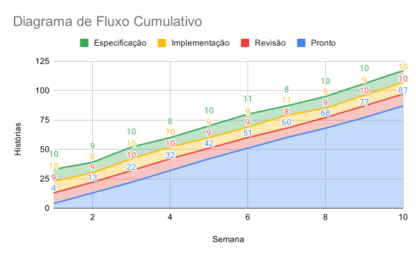

# Diagramas de Fluxo Cumulativo {.unnumbered}

No [Capítulo 2](https://engsoftmoderna.info/cap2.html), estudamos
sobre Gráficos de Burndown e comentamos que eles podem ser usados 
para acompanhar o fluxo de trabalho em um sprint, quando usa-se Scrum.

No entanto, Gráficos de Burndown não são adequados para times 
Kanban, pois eles assumem que o objetivo é implementar um certo número
de story points em um determinado sprint. E, quando usamos Kanban,
não existe mais essa ideia de sprints.

Por isso, times Kanban costumam usar um outro tipo de gráfico para 
acompanhar o seu fluxo de trabalho, chamado de **Diagrama de Fluxo 
Cumulativo** (CFD, de *Cumulative Flow Diagram*).

### Definição {.unnumbered}

Um CFD é gerado a partir de uma tabela como a seguinte

  Semana	  Especificação	      Implementação	    Revisão      Pronto
----------  -----------------  ------------------ -----------  ---------- 
    1           10                      10             9            4
    2		     9	                     8	           9           13
    3		    10	                    10	          10           22
    4		     8	                    10	          10           32
    5		    10	                     9	           9           42
   ...         ...                     ...           ...          ...

onde:

* Especificação, Implementação, Revisão e Pronto são as colunas do Quadro 
Kanban usado pelo time.

* Em cada linha, mostra-se o número de histórias de usuários que estão em
cada coluna no final da respectiva semana. Por exemplo, no final da Semana
1, existiam 10 histórias em Especificação, 10 histórias em Implementação,
9 histórias em Revisão e 4 histórias Prontas.

* E, muito importante, assume-se que as histórias -- ou, se você quiser, 
os post-its -- não saem do quadro. Em vez disso, elas vão se acumulando 
na coluna Pronto. Daí o nome **cumulativo** do diagrama. Por exemplo, 
da semana 1 até a semana 5, um total de 42 histórias foram finalizadas 
pelo time.

A partir dessa tabela gera-se um gráfico de áreas empilhadas, que é chamado
de **Diagrama de Fluxo Cumulativo** (CFD, de *Cumulative Flow Diagram*).
Veja o CFD gerado a partir da tabela anterior:

{width=80%}

Em um CFD, a faixa inferior corresponde à coluna mais à direita
do quadro Kanban. No nosso exemplo, a coluna Pronto. A partir dela, são
empilhadas as demais colunas, da direita para a esquerda do quadro. 
Assim, a última coluna empilhada, no nosso exemplo, é Especificação.

Para facilitar o entendimento, segue uma segunda versão do CFD anterior, 
agora com labels indicando o valor de cada ponto do gráfico:

{width=80%}

No exemplo, consideramos que o eixo y de um CFD é o número de histórias
em cada coluna de um Quadro Kanban, em cada semana. No entanto, dependendo 
do contexto, pode-se adotar outras unidades, como número de tarefas, 
bugs, itens de trabalho, *story points*, etc. De forma semelhante, no eixo 
x podemos usar uma outra unidade de tempo, como dias, quinzenas, meses, etc.

### Para que serve um CFD? {.unnumbered}

Um CFD é usado para indicar se o fluxo de trabalho de um time Kanban 
está **estável** ou não.

Especificamente, o fluxo está normal e estável quando as áreas do diagrama 
crescem de forma linear, com praticamente a mesma inclinação, como no 
CFD mostrado na seção anterior.

Por outro, quando existem problemas em um passo, a sua área no diagrama 
tende a crescer, como mostrado no seguinte exemplo:

{width=80%}

Nesse CFD, o passo de implementação está ocupando, gradativamente, uma 
área maior no diagrama, o que significa que as histórias estão se acumulando 
nesse passo. Consequentemente, menos histórias estão ficando prontas, ou 
seja, a inclinação da linha "Pronto" está diminuindo. Podemos observar 
também que menos histórias estão sendo revisadas, pois a faixa vermelha 
praticamente sumiu. E, por fim, o acúmulo de histórias em Implementação 
começa a gerar um represamento também em Especificação.

### CFDs e Lei de Little {.unnumbered}

Como vimos no [Capítulo 2](https://engsoftmoderna.info/cap2.html), a 
Lei de Little diz que:

WIP = TP * LT

onde:

* WIP é o *work in progress*, isto é, o número de histórias
em um passo do quadro Kanban.

* TP é o *throughput* do passo, isto é,
o número de histórias finalizadas por unidade de tempo.

* LT é o *lead time*, isto é, o intervalo de tempo que uma história 
leva para "atravessar" um passo do quadro Kanban.

Reescrevendo a fórmula temos que:

TP = WIP / LT

Essa fórmula pode ser visualizada em um CFD, como mostrado
abaixo:

{width=80%}

Analisando o diagrama, podemos concluir que:

* O número de novas histórias que entraram em revisão no período 
de tempo LT é igual a WIP. Logo, a taxa de chegada de histórias 
(ou throughput)  é  WIP / LT.

* O número de semanas que as histórias que estavam em Revisão na 
semana 2 levaram para sair desse estágio e chegarem no passo 
Pronto é igual a LT. No diagrama, essas histórias são representadas 
pela barra vertical de cor verde. Logo, LT é o lead time médio 
dessas histórias.

Portanto, podemos usar um CFD para calcular o lead time e throughput 
de cada passo de um quadro Kanban. No exemplo, fizemos isso para o 
passo de Revisão, representado pela área em azul no diagrama.

### Para Saber Mais {.unnumbered}

CFDs são tratados na maioria dos livros sobre Kanban. Especificamente,
o livro "Diagramas de Fluxo Cumulativo, de autoria de Paulo Caroli, 
constitui uma introdução bastante objetiva ao assunto. O livro do 
David Anderson -- *Kanban: Successful Evolutionary Change for Your 
Technology Business* -- é uma outra referência importante sobre CFDs.

### Exercícios {.unnumbered}

1. Neste artigo, comentamos que Diagramas de Fluxo Cumulativo (CFD) são 
muito usados com Kanban. Mas é possível usar CFDs também com Scrum? 
Justifique sua resposta.

2. Se quisermos diminuir o lead time de um passo de um Quadro Kanban, 
devemos aumentar ou diminuir o seu limite WIP? Justifique sua resposta 
usando a Lei de Little.

3. Em um CFD estável, a taxa de chegada de novas histórias é igual à 
taxa com que histórias são puxadas para o próximo passo. Verdadeiro ou 
Falso? Justifique.

4. Suponha um processo de desenvolvimento do tipo Waterfall, com três 
fases: Especificação, Implementação e Testes. Crie um CFD para um projeto 
desenvolvido nesse processo. No seu CFD, assuma um sistema cujo 
desenvolvimento inclui 25 funcionalidades. As fases Especificação, 
Implementação e Testes levam, respectivamente, 2, 3 e 1 semestre.

5. Use um software de planilhas para criar CFDs hipotéticos, tal como 
fizemos neste artigo. Defina um horizonte de tempo (eixo x) e alguns 
passos (colunas da planilha e, consequentemente, áreas do diagrama). 
Em seguida, lance valores hipotéticos na sua planilha. Crie pelo menos 
dois CFDs: um CFD representando um fluxo de trabalho estável e também 
um CFD com instabilidade em algum passo do quadro.

* * * 

Voltar para a lista de [artigos](./artigos.html).
