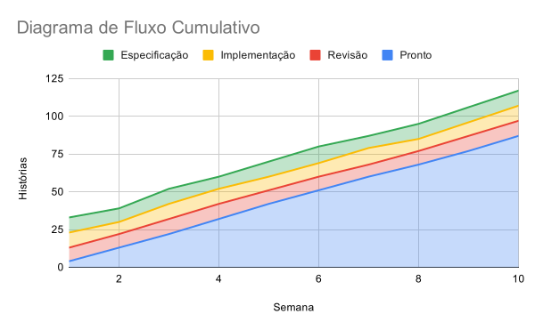
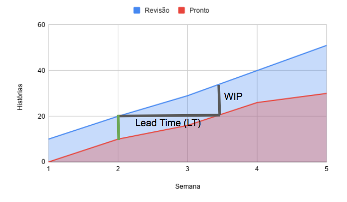

# Diagramas de Fluxo Cumulativo {.unnumbered}

No [Capítulo 2](https://engsoftmoderna.info/cap2.html), estudamos
sobre Gráficos de Burndown e comentamos que eles podem ser usados 
para acompanhar o fluxo de trabalho em um sprint, quando usa-se Scrum.

No entanto, Gráficos de Burndown não são adequados para times que usam
Kanban, pois eles assumem que o objetivo é implementar um certo número
de story points em um determinado sprint. E, quando usamos Kanban,
não existe mais essa ideia de sprints.

Por isso, times Kanban costumam usar um outro tipo de gráfico para 
acompanhar o seu fluxo de trabalho, chamado de **Diagrama de Fluxo 
Cumulativo** (CFD, de *Cumulative Flow Diagram*).

### Definição {.unnumbered}

Um CFD é gerado a partir de uma tabela como a seguinte

  Semana	  Especificação	      Implementação	    Revisão      Pronto
----------  -----------------  ------------------ -----------  ---------- 
    1           10                      10             9            4
    2		     9	                     8	           9           13
    3		    10	                    10	          10           22
    4		     8	                    10	          10           32
    5		    10	                     9	           9           42
   ...         ...                     ...           ...          ...

onde:

* Especificação, Implementação, Revisão e Pronto são as colunas do Quadro 
Kanban usado pelo time.

* Em cada linha, mostra-se o número de histórias de usuários que estão em
cada coluna no final da respectiva semana. Por exemplo, no final da Semana
1, existiam 10 histórias em Especificação, 10 histórias em Implementação,
9 histórias em Revisão e 4 histórias Prontas.

* E, muito importante, assume-se que as histórias -- ou, se você quiser, 
os post-its -- não saem do quadro. Em vez disso, elas vão se acumulando 
na coluna Pronto. Daí o nome **cumulativo** do diagrama. Por exemplo, 
da semana 1 até a semana 5, um total de 42 histórias foram finalizadas 
pelo time.

A partir dessa tabela gera-se um gráfico de áreas empilhadas, que é chamado
de **Diagrama de Fluxo Cumulativo** (CFD, de *Cumulative Flow Diagram*).
Veja o CFD gerado a partir da tabela anterior:

{width=80%}

Em um CFD, a faixa inferior corresponde à coluna mais à direita
do quadro Kanban. No nosso exemplo, a coluna Pronto. A partir dela, vão sendo empilhadas as demais colunas, da direita para a esquerda do quadro. Assim, a última coluna empilhada, no nosso exemplo, é Especificação.

Para facilitar o entendimento de um CFD, segue uma segunda versão do nosso
CFD, agora com labels indicando o valor de cada ponto do gráfico:

{width=80%}

Como já afirmamos, consideramos que o eixo y de um CFD é o número de histórias
em cada coluna de um Quadro Kanban, em cada semana. No entanto, dependendo 
do contexto, pode-se adotar outras unidades, como número de tarefas, 
bugs, itens de trabalho, *story points*, etc.

### Para que serve um CFD? {.unnumbered}

Um CFD é usado para indicar se o fluxo de trabalho de um time Kanban está estável ou não.

Analisando um CFD, podemos concluir que o fluxo está normal 
e estável quando as áreas do diagrama crescem de forma
linear, com praticamente a mesma inclinação, como ocorre 
no CFD mostrado na seção anterior.

Por outro, quando existem problemas em um passo, a sua área no diagrama tende a crescer, como mostrado no seguinte exemplo:

{width=80%}

Podemos ver neste CFD que o passo de implementação está ocupando, gradativamente, uma área maior no diagrama, o que significa que
as histórias estão se acumulando nesse passo. Consequentemente,
menos histórias estão ficando prontas, ou seja, a inclinação da
linha "Pronto" está diminuindo. Podemos observar também que menos histórias estão sendo revisadas, pois a faixa verde do diagrama
praticamente sumiu. E, por fim, o acúmulo de histórias em
Implementação começa a gerar um represamento também em Especificação.

### CFD e Lei de Little {.unnumbered}

Como vimos no [Capítulo 2](https://engsoftmoderna.info/cap2.html), a Lei de Little diz que:

WIP = TP * LT

onde:

* WIP é o *work in progress*, isto é, o número de histórias
em um passo do quadro Kanban.

* TP é o *throughput* do passo, isto é,
o número de histórias finalizadas por unidade de tempo.

* LT é o *lead time*, isto é, o intervalo de tempo que uma história leva para "atravessar" um passo do quadro Kanban.

Reescrevendo a fórmula da Lei de Little temos que:

TP = WIP / LT

Essa fórmula pode ser visualizada em um CFD, como mostrado
abaixo:

{width=80%}

Olhando para esse diagrama, podemos concluir que:

* O número de novas histórias que entraram em revisão no período de tempo LT é igual a WIP. Logo, a taxa de chegada de histórias (ou throughput)  é  WIP / LT.

* LT é também o intervalo de tempo que as histórias que estavam em Revisão na semana 2 levaram para sair desse
estágio e migrarem para Pronto. No diagrama, essas histórias
são representadas pela barra vertical de cor verde. Logo, LT é o lead time dessas histórias.

* * * 

Voltar para a lista de [artigos](./artigos.html).
