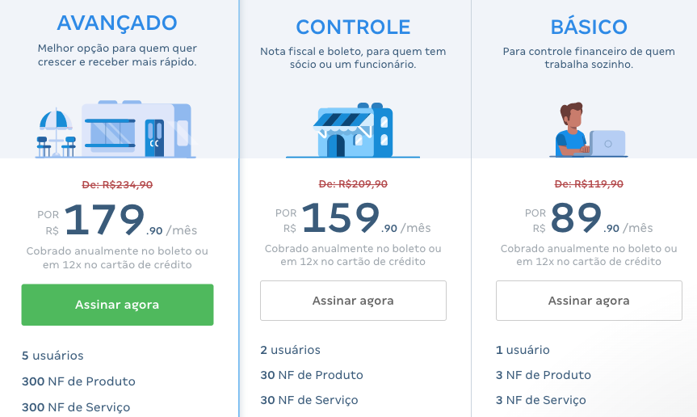

# Como monetizar produtos de software? {.unnumbered}

Este é um **artigo em andamento**. Provavelmente, ainda vamos acrescentar mais
informações nele. No entanto, na versão atual, acreditamos que ele já
oferece uma boa visão sobre modelos de monetização (ou precificação) de
produtos de software.

## Licenças {.unnumbered}

Até um tempo atrás, a principal maneira de comercializar um sistema
de software -- que você ou sua empresa desenvolveu e pretende agora
lucrar com ele -- era por meio de uma licença de uso. 

Por exemplo, no início da empresa, a Microsoft somente vendia licenças
de uso de seus sistemas. Veja um exemplo de anúncio do sistema
operacional Windows na próxima figura:

{width=60%}

Os usuários compravam licenças de sistemas como
Windows e Office e, assim, ganhavam o direito de instalá-los na 
sua máquina e receber gratuitamente atualizações. Basicamente, 
essas atualizações consistiam em manutenções corretivas, com correções de bugs. 
Depois de um certo tempo, a Microsoft criava novas versões de seus sistemas, 
com novas funcionalidades e então os clientes tinham que adquirir novas
licenças.

Licenças de uso podem ser individuais, para uso em um único computador, ou
para uso em mais de um computador. Além disso, algumas licenças podem
implicar em alguma restrição ao funcionamento do sistema. Um bom exemplo
são servidores de bancos de dados, onde o cliente pode pagar pelo número
de conexões simultâneas que serão aceitas pelo servidor.

## Licenças & Serviços {.unnumbered}

Uma alternativa ao modelo de licenças puro consiste na aquisição
de uma licença e também na contração de serviços. 

Dentre eles, podemos citar serviços de manutenção, incluindo 
manutenções corretivas e também algumas manutenções adaptativas (por
exemplo, criar um novo relatório ou integrar o sistema licenciado a sistemas 
de terceiros). Particularmente, a contratação de serviços de manutenção 
é mais comum no caso de sistemas de informações, como sistemas 
integrados de gestão (ERPs).

Além de serviços de manutenção, podem ser firmados também contratos
relativos a serviços de treinamento de usuários, instalação e suporte.

## SaaS: Software as a Service{.unnumbered}

Esse modelo popularizou-se com o surgimento da Web. 
A ideia é que os clientes não adquirem
mais uma licença que dá direito a uso do sistema pelo tempo que
for necessário (ou então, até que ele se torne obsoleto). 
Em vez disso, paga-se uma assinatura mensal (ou anual) para a empresa
que desenvolve e mantém o sistema. Mediante esse pagamento, o usuário
ganha um login e senha, que dá direito ao uso do sistema.

Portanto, o modelo SaaS requer que a empresa vendedora
hospede e mantenha alguma infraestrutura computacional para execução
do sistema. Ou seja, os clientes não precisam comprar 
servidores e software básico para rodar o sistema, pois eles 
são de responsabilidade da própria empresa vendedora. 

Atualmente, SaaS é o modelo predominante para monetização de sistemas
de software, devido à popularização da Web e de plataformas de 
computação em nuvem. 

Para dar um exemplo de um sistema SaaS brasileiro, a próxima 
figura mostra os preços do sistema de gestão financeira 
e contábil da empresa ContaAzul.

{width=85%}

Veja que o sistema oferece diferentes planos de assinatura
(Básico, Controle, Avançado, etc). Cada plano possui um
número máximo de usuários e um número máximo de notas fiscais
que podem ser emitidas por mês.

Podemos citar também diversos outros exemplos de sistemas 
comercializados no modelo SaaS:

* sistemas de folhas de pagamento, como Gusto.
* sistemas de gerenciamento clientes, como Salesforce.
* Sistemas de escritório, como Office 365.
* sistemas de comunicação, como Slack.
* sistemas de compartilhamento de arquivos, como Dropbox.
* sistemas de mail, como o GMail.
* sistemas de conferência, como Zoom.
* sistemas de pagamento, como Shopify.
* sistemas de gerenciamento de projetos, como Basecamp.
* sistemas de controle de versões, como GitHub e GitLab.
* etc

O leitor pode estar pensando que alguns desses serviços são gratuitos,
como GMail, Dropbox ou GitHub. No entanto, é comum que sistemas SaaS
adotem uma estratégia de marketing chamada de **freemium**. Nesse
caso, o sistema possui uma versão aberta e gratuita, mas com algumas
limitações e uma versão paga, com um conjunto completo de funcionalidades.
Veja alguns exemplos:

* O GMail é gratuito, mas se o usuário quiser suporte ou quiser
ter endereços de mail com um domínio próprio, o Google oferece um serviço pago.

* O GitHub e GitLab são gratuitos apenas para repositórios públicos; 
repositórios privados requerem o pagamento de uma assinatura. 

* O Dropbox  é gratuito até um limite de armazenamento, de alguns gigabytes. 
Se o usuário precisar de mais armazenamento, ele deve pagar.

Também existem empresas bem menores do que aquelas mencionadas acima e que 
sobrevivem oferecendo sistemas SaaS. Algumas são constituídas por um único desenvolvedor.
Elas identificaram algum nicho de mercado, desenvolveram
um sistema para atuar nesse nicho e então possuem algumas centenas
de usuários, no máximo milhares, que pagam valores relativamente
baixo de assinaturas. 

## Anúncios {.unnumbered}

No mundo da Web, existe uma máxima que diz que quando você usa
"um sistema gratuito, você não é um usuário, mas sim um produto". 
Atualmente, essa frase aplica-se perfeitamente a grandes redes sociais, como 
Facebook, Instagram e Twitter; e também a serviços de busca, como o Google. 
Todos eles são serviços "gratuitos", no sentido de que você não precisa pagar 
uma assinatura, como no caso de sistemas SaaS.

O modelo de monetização desses sistemas depende da atração de um grande 
número de usuários, da coleta de dados sobre o perfil e as preferências 
deles, e então da oferta de anúncios.

Pode-se também combinar modelos de monetização. Por exemplo, a versão
gratuita de um sistema SaaS pode incluir anúncios. No entanto, ao realizar
uma assinatura, o usuário fica livre dos anúncios e, possivelmente, 
tem acesso a mais funcionalidades.

## Open Source {.unnumbered}

Talvez, esse seja o tipo de sistema mais desafiador de se monetizar.
O motivo é que, por definição, sistemas de código aberto podem ser
livremente copiados, modificados e instalados, sem pagamento de nenhum
valor monetário para o autor do código.

No entanto, mesmo no caso de sistemas de código aberto, existem pelo
menos duas formas de monetização:

* Por meio de doações dos usuários. Por exemplo, o sistema operacional
Linux é mantido por uma fundação, sem fins lucrativos, que sobrevive
graças a contribuições de grandes empresas usuárias do sistema operacional.
Outros exemplos são a Fundação Mozilla e a Fundação Apache. No entanto,
nem sempre é necessário criar uma fundação para receber doações. Muitas
vezes, elas são feitas diretamente para os mantenedores do sistema
de código aberto, por meio de plataformas de captação de recursos, como
Patreon. Mais recentemente, o GitHub está também habilitando um
serviço de doações.

* Por meio de prestação de serviços relacionados com o sistema open source,
incluindo treinamento e customizações. Um exemplo de empresa que adotou
esse padrão foi a Red Hat, que oferece serviços de suporte e consultoria
para empresas que usam Linux.

## Conclusão {.unnumbered}

Neste artigo, apresentamos os modelos que você pode usar para monetizar
um software que você ou sua empresa pretende desenvolver. Faltou, no 
entanto, comentar sobre como definir realmente o preço da licença,
assinatura, dos serviços associados, etc. Para não deixar essa questão
sem nenhuma resposta, vamos rascunhar uma nesta conclusão.
A resposta a seguir aplica-se a principalmente a desenvolvedores independentes 
que não querem depender de financiamento externo. Neste caso, 
a definição do preço de um produto de software
depende das seguintes variáveis principais:

* Custos de desenvolvimento do produto, incluindo salários, 
computadores, conexão de Internet, aluguel de serviços de cloud, 
propaganda, marketing, etc.

* Capital disponível para desenvolvimento e operação do sistema. Ou seja, 
se você dispõe de um capital inicial pequeno, você não deve tentar 
construir um sistema grande e complexo, pois irá
gastar seu capital completamente antes de ter um produto rentável.

* Preços praticados por sistemas concorrentes, além da capacidade de 
pagamento dos potenciais clientes do seu sistema. Por exemplo, se 
seu mercado são pequenas empresas, você não pode cobrar uma assinatura 
que não esteja ao alcance delas. Ou então cobrar uma assinatura muito acima
de um sistema concorrente, que resolve problemas semelhantes aos do
seu sistema.

## Exercícios {.unnumbered}

1. Pesquise sistemas de empresas brasileiras que adotam o modelo SaaS.
O que esses sistemas fazem? Qual o valor da assinatura cobrada?
Eles adotam o modelo freemium?

2. Descreva duas vantagens do modelo SaaS em relação ao modelo baseado em 
licenças de uso.

* * * 

Voltar para a lista de [artigos](./artigos.html).
