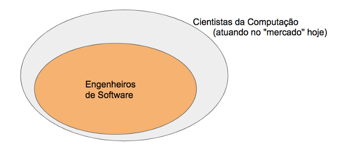

# Desafios do Ensino de Engenharia de Software {.unnumbered}

Por: Marco Tulio Valente (maio de 2020)

Em 2019, ministrei pela primeira vez um curso de Engenharia de Software para alunos de graduação. Desde então, tenho estudado, trabalhado e refletido bastante sobre questões ligadas ao ensino dessa disciplina.

Assim, neste artigo, vou compartilhar minha visão sobre os desafios envolvidos em tal tarefa.

## Importância de Engenharia de Software {.unnumbered}

Primeiro, para delimitar o contexto deste artigo, acho importante começar lembrando que Engenharia de Software é cada vez mais essencial na formação de alunos de Ciência da Computação, Sistemas de Informação, Engenharia de Computação, etc.

Para ressaltar esse fato, na primeira aula da minha disciplina apresento para os alunos o seguinte 
diagrama.

Esclareço que ele não é baseado em nenhum estudo científico, mas apenas na minha experiência acadêmica e profissional. Porém, a mensagem para os alunos é clara: quando vocês se formarem, a maioria será Engenheiro de Software ou terá um título equivalente, como Frontend/Backend/Fullstack/Mobile developer, Arquiteto de Software, Tech/Squad Lead, etc.

* * *

Contexto brasileiro: Temos também no Brasil capacidade, vocação e potencial para desenvolver um mercado de software relevante e com impacto e atuação global. Na verdade, não estou falando nenhuma novidade, pois sempre se falou nesse assunto. Também, não estou sugerindo que nosso mercado de software seja inexistente e inexpressivo. Pelo contrário, estamos avançando muito e com vários casos de sucesso.
Porém, podemos melhorar e avançar mais ainda! Mas, para isso, o recurso fundamental é a disponibilidade de mão de obra bem formada, qualificada e motivada.

* * *

Retomando o tema, o propósito central deste artigo é destacar que os desafios envolvidos na formação de um Engenheiro de Software são imensos, pois essa formação requer um conjunto de esforços em pelo menos três dimensões: conceitual, prática e comportamental.

A seguir, detalho um pouco mais essas dimensões.

## Formação Conceitual {.unnumbered}

Quando ministrei a disciplina de Engenharia de Software pela primeira vez, na graduação, fiquei surpreso com a falta de livros didáticos mais modernos na área. Por pelo menos um mês, não me saiu da cabeça uma frase que ouvi, uma vez, em uma palestra:

> A maturidade e capacidade de impacto de uma área do conhecimento pode ser medida pela qualidade e profundidade de seus livros didáticos.

(Infelizmente, não lembro mais o autor, nem o enunciado exato que ele usou, mas foi algo parecido com o que acabei de citar).

Por isso (e, para tirar a tal frase da minha cabeça!), resolvi dedicar um ano de intenso trabalho para escrever um [livro-texto](https://engsoftmoderna.info/) sobre Engenharia de Software.

Sou suspeito para afirmar, mas acredito que, após a escrita desse livro, estou conseguindo cobrir essa dimensão do ensino de Engenharia de Software de maneira adequada. Isso envolve transmitir bons conceitos, práticas e princípios, sempre modernos, de processos, projeto, arquitetura, testes, manutenção, etc de software.

## Formação Prática {.unnumbered}

Porém, de nada adianta dominar a teoria, se o aluno nunca colocou ela em prática. Ou seja, o aluno tem também que aplicar os conceitos que viu na teoria, dentro do ambiente acadêmico e de sua estrutura curricular.

Ao comentar sobre isso, sempre me lembro da frase do Torvalds (Linus):

> Falar é fácil, mas quero ver o código!

Então, sobre a dimensão prática da formação do Engenheiro de Software, quero dizer que não concordo que ela possa ser completamente terceirizada por meio de um estágio ou atividade semelhante.

Por outro lado, quando a universidade assume parte da responsabilidade pela formação prática dos alunos, surgem complicações naturais do ambiente acadêmico. Por exemplo, torna-se desafiador pedir que os alunos implementem, do zero, um sistema real em uma disciplina acadêmica.

Da mesma forma, pedir para que os alunos trabalhem em sistemas de terceiros, como sistemas de código aberto, também não é trivial. O motivo é que o aluno, normalmente, não tem tempo, no escopo de uma disciplina acadêmica, para entender um sistema real.

Tentando explicar melhor, o aluno pode, por exemplo, até corrigir bugs menos críticos ou implementar pequenas features em um sistema de código aberto, mas sem entender como de fato as coisas acontecem no sistema.

Assim, para atender à formação prática dos alunos, a solução mais promissora que vejo consiste no desenvolvimento de um conjunto de sistemas e programas "educativos", de pequeno porte e que exercitem conceitos básicos de divisão de trabalho (isto é, de processos), projeto e arquitetura de software, testes, refatoração, devops, etc.

Esses programas seriam construídos exclusivamente para permitir, exercitar e ilustrar o uso de bons princípios e práticas de Engenharia de Software.
No entanto, pelo menos até onde eu consegui pesquisar, tais sistemas educativos para ensino de Engenharia de Software não são prevalentes. É verdade que existe algum esforço nesse sentido, mas a minha impressão é que ele é ainda distanciado e desconectado de uma prática real.

Vou dar dois exemplos pessoais: na minhas disciplina, eu planejo duas aulas práticas. Na primeira aula, uso o sistema de locadora do Fowler para ilustrar conceitos de refatoração. Em outra aula, uso o sistema de armazenamento de valores monetários, do Beck, para ilustrar e praticar conceitos de Desenvolvimento Dirigido por Testes (TDD).
Acho ambos os sistemas interessantes e, em geral, recebo um bom feedback dos alunos sobre essa aulas. Algo na seguinte linha:

> Professor, muito bom esse exercício, para a gente não ficar só na teoria. Você deveria ter mais aulas assim ...

Porém, sei que existe um amplo espaço para fazer algo ainda melhor, no tocante a essas duas aulas, especificamente.

E, claro, teríamos que ter "sistemas educativos" cobrindo outras práticas de programação, como testes, padrões de projeto, arquitetura, integração contínua, controle de versões, git, etc.

## Formação Comportamental {.unnumbered}

Concluindo e, na falta de um nome melhor, estou usando o termo "formação comportamental" para referenciar os soft skills que são fundamentais em um Engenheiro de Software. Isto é, hoje em dia, não basta saber programar e dominar os conceitos básicos da área (formação conceitual). Não basta também ter capacidade de realização (formação prática).

Além disso, o Engenheiro de Software moderno tem que saber trabalhar em equipe, saber liderar e ser liderado, saber se comunicar e se expressar, de forma escrita e oral, saber ouvir e saber falar na hora certa, ser capaz de entender o que a organização espera dele, etc.
Porém, a abordagem dessa dimensão comportamental em cursos de Engenharia de Software é ainda um problema em aberto, pelo menos para mim. Talvez, na verdade, o problema não seja exclusivo de disciplinas de Engenharia de Software, mas de caráter mais transversal na formação de profissionais de Computação.

* * *

Bem, esse é um artigo em andamento! A ideia é atualizá-lo, à medida que consiga respostas mais concretas sobre as dimensões prática e comportamental.

* * *

P.S. Recebi um interessante comentário, por e-mail, sugerindo uma quarta dimensão: **formação empreendedora**. Certamente, muito importante! Pois em uma época de transformação digital — como a que estamos vivemos —, as oportunidades que existem são imensas. E Engenharia de Software é o motor da maioria dos 
processos de transformação digital. Adicionalmente, as empresas cobram cada vez mais uma
mentalidade empreendedora de seus colaboradores. Ou seja, os engenheiros de software modernos estão sendo
incentivados a também entender do negócio da empresa, a propor soluções diferentes daquelas 
que chegam de cima para baixo, a assumir riscos, etc. Esse processo é conhecido 
como **empreendedorismo interno**.

* * * 

Voltar para a lista de [artigos](./artigos.html).
