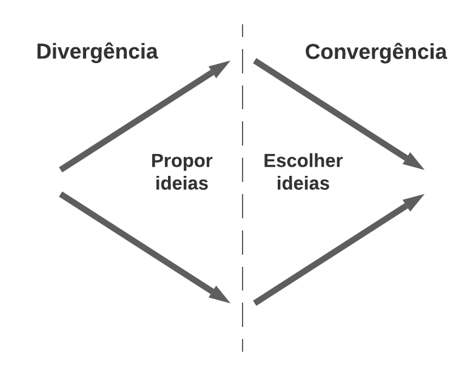
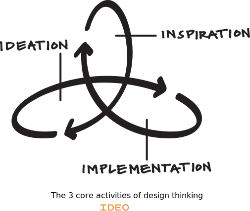

# O que é Design Thinking?   {.unnumbered}

## Introdução {.unnumbered}

Design Thinking é uma abordagem para solução de problemas -- não apenas
de Engenharia de Software, mas qualquer tipo de problema.
A abordagem é inspirada em métodos e técnicas usados há tempo
por designers industriais, designers gráficos, designers
de interface com o usuário, etc.

Com o passar dos anos, os designers perceberam que esses métodos
e técnicas poderiam ser usados não apenas para melhorar a ergonomia 
de um produto ou criar uma interface mais amigável, mas também para 
resolver diversos outros problemas. Daí o nome **Design Thinking**,
ou seja, o objetivo é levar o *pensamento* dos designers para 
outras áreas.

Apesar de seus conceitos principais existirem desde os anos 60,
Design Thinking tornou-se popular a partir da década de 90 
com seu uso pela IDEO, uma empresa de design norte-americana. 
A IDEO ajudou a projetar, por exemplo, os primeiros
mouses da Apple.

Outro motivo para essa popularidade deve-se ao fato de Design 
Thinking ser considerado uma abordagem capaz de propor **soluções 
criativas e inovadoras** para problemas de maior complexidade. 
Ou seja, o objetivo **não** é desenvolver um produto ou sistema 
cujos requisitos já estão bem definidos.

### Exemplos {.unnumbered}

Primeiro, vamos apresentar um cenário onde o uso de Design Thinking 
**não** é recomendado.
Suponha que uma empresa seja contratada para construir um sistema Web
para gerenciar a aplicação de provas online com questões de múltipla
escolha. Nesse caso, a solução que está sendo demandada está
bastante clara e **não** precisamos usar Design Thinking. A empresa pode, 
por exemplo, usar usar práticas de métodos ágeis, como histórias 
de usuários e conversas com um  Product Owner (PO) para clarificar 
e priorizar os requisitos do sistema.

E agora um exemplo de cenário no qual Design Thinking pode
ser interessante: suponha que uma empresa -- ou melhor, uma universidade
-- esteja interessada em desenvolver um método inovador 
para ensino de Engenharia de Software. Ou seja, nesse caso, não temos 
clareza sobre a demanda que está sendo pedida. Não sabemos nem 
ao certo se esse método demandará a implementação de um sistema de
software. Então, a universidade -- ou um departamento dela -- pode usar 
Design Thinking para entender melhor o problema e delinear as linhas 
gerais de uma possível solução.

## Principais Atividades {.unnumbered}

Design Thinking não é definido por meio de um conjunto de passos, 
tarefas e papéis. Isto é, Design Thinking não é uma fórmula ou um algoritmo, 
que recebe como entrada um problema genérico, abstrato e desafiador e 
gera como saída uma solução inovadora. 

Porém, as seguintes atividades principais caracterizam um processo de
Design Thinking:

* Inspiração
* Ideação
* Implementação

Nas próximas seções, vamos detalhar essas atividades e também os conceitos 
e princípios que são usados ao longo de um processo de Design Thinking. 
Antes, no entanto, já gostaríamos de comentar que esses processos 
são conduzidos por **equipes multidisciplinares**, 
que incluem profissionais de diversas áreas e com diferentes experiências. 
Argumenta-se que multidisciplinaridade é um ingrediente fundamental para 
fomentar *pensamentos e ideias fora da caixa* e, portanto, maximizar as 
chances de se chegar a soluções inovadoras.

### Inspiração {.unnumbered}

Design Thinking recomenda que, antes de propor soluções para qualquer problema, 
os designers devem entender e vivenciar esse problema, sob o ponto de 
vista daqueles que estão sofrendo com ele e que depois irão se beneficiar 
da solução proposta. Isso é importante para ter insights de soluções
interessantes.

Para entender o problema, o designer deve entrevistar os usuários, visitar seus
locais de trabalho, observar e estudar seus comportamentos, etc. Como vimos no
[Capítulo 3](https://engsoftmoderna.info/cap3.html), tais estudos que observam 
*ao vivo* os usuários afetados por uma solução são chamados de **estudos etnográficos**. 
No limite, o designer pode até se passar por um usuário. Por exemplo, em seu 
livro sobre Design Thinking, Tim Brown -- que por um tempo foi um dos principais 
executivos da IDEO -- reporta o caso de um designer encarregado de melhorar 
o serviço de atendimento de um hospital. Para isso, ele simulou que tinha 
quebrado o pé e, então, experimentou na própria pele o serviço de atendimento 
desse hospital.

Por outro lado, Design Thinking dá menos ênfase a instrumentos como questionários
e pesquisas de mercado. A seguinte frase de Steve Jobs ilustra bem os limites 
desses instrumentos:

> Nosso trabalho é descobrir antes o que os clientes querem. Acho que Henry 
Ford disse uma vez: se eu perguntasse aos meus clientes o que eles queriam, 
eles teriam me dito um "cavalo mais rápido". As pessoas não sabem o que querem 
até que você mostre a elas.  

Design Thinking recomenda também prestar atenção a "usuário extremos", 
como crianças, idosos, adotantes iniciais de tecnologias, etc.

### Ideação {.unnumbered}

Após entender o problema, pode-se avançar para atividades de **geração 
e testes de ideias** para solucioná-lo. Tais atividades são chamadas 
de **ideação**. Mais precisamente, incentivam-se dois tipos 
de atividades:

* Pensamento divergente e convergente
* Prototipação e Testes

#### Pensamento divergente e convergente {.unnumbered}

Essa primeira atividade é ilustrada na próxima figura:

{width=60%}

Em um primeiro momento, todos os membros da equipe são incentivados a 
rascunhar soluções para o problema proposto, sejam elas convencionais 
ou não. Ou seja, em um processo de **brainstorming**, soluções 
"fora da caixa" são incentivadas. 

Lembre-se que o objetivo de Design Thinking é gerar soluções 
inovadoras e não incrementar marginalmente a qualidade de um produto 
ou serviço existente. A seguinte frase, do cientista Linus Pauling — 
ganhador de dois prêmios Nobel, em Química e da Paz —
ilustra a importância desse primeiro momento:

> Para ter uma boa ideia, você precisa antes ter muitas ideias. 

Prosseguindo com o processo, em um segundo momento, deve-se convergir para 
um número limitado de soluções. Ou seja, a equipe deve descartar algumas 
das soluções propostas inicialmente. O próprio proponente de uma solução 
pode desistir da sua proposta ou então pode-se escolher, por meio de uma 
votação, as soluções que continuarão no processo.

#### Prototipação e Testes {.unnumbered}

Em seguida, ainda como uma atividade de ideação, deve-se construir 
**protótipos** para as melhores ideias
e testá-los com usuários reais. Os protótipos iniciais podem ser bem
simples. Por exemplo, o primeiro protótipo de mouse que a IDEO criou
para a Apple era formado pela esfera de um desodorante *roll-on*
colada em uma embalagem de margarina.

Porém, a criação de protótipos é mais difícil em certos tipos de
problemas. Por exemplo, na área de serviços pode ser necessário criar espaços
físicos, mesmo que de forma improvisada e, por exemplo, com móveis de isopor.
Uma alternativa a protótipos físicos consiste no desenho de **storyboards**
(ilustrações) descrevendo a jornada de um usuário ao usar 
um determinado serviço. No caso de software, storyboards podem
ser usados para prototipar pelo menos a interface do sistema.

### Implementação {.unnumbered}

Por fim, escolhida uma solução, o designer deve acompanhar a sua implementação
ou implantação. Por exemplo, deve ajudar a explicar a solução para o
resto da organização. Deve também ajudar na criação de uma estratégia de 
divulgação e marketing.

## Comentários Finais {.unnumbered}

Talvez, a explicação anterior leve o leitor a pensar que Design 
Thinking é um processo sequencial. No entanto, 
em qualquer atividade pode-se "retroceder" para um ponto anterior. Por exemplo,
durante as atividades de ideação pode-se perceber que são necessários mais
dados e insights sobre os problemas dos usuários. Como um outro exemplo,
após uma prototipação, pode-se perceber que a ideia que foi 
escolhida não está funcionando bem. Logo, deve-se retroceder
e escolher -- ou mesmo gerar -- uma nova ideia.

Por isso, costuma ilustrar essas atividades por meio de
"anéis" (ou espaços) interconectados, como na seguinte figura 
(extraída do seguinte [site](https://designthinking.ideo.com/)
da IDEO):

{width=50%}

Para concluir gostaríamos de listar as habilidades importantes
em um Design Thinker, segundo Tim Brown: "capacidade de identificar
padrões na desordem de informações complexas, de sintetizar novas
ideias a partir de fragmentos e de sentir empatia por pessoas
diferentes dele mesmo."

#### Para Saber Mais {.unnumbered}

Existe um vasto material sobre Design Thinking. Uma das boas
referência sobre o assunto é o 
[livro](https://www.altabooks.com.br/produto/design-thinking/) 
de Tim Brown, que usamos como referência para elaboração 
deste artigo.

## Exercícios {.unnumbered}

1. Por que é importante que um Engenheiro de Software tenha uma conhecimento
básico de Design Thinking?

2. Pense e descreva resumidamente um problema que pode se beneficiar do 
uso de Design Thinking.

3. Qual a diferença entre Design Thinking e Design Sprint? Uma descrição
resumida de Design Sprint é apresentada na Seção 3.5.3 do 
[Capítulo 3](https://engsoftmoderna.info/cap3.html) do livro.

* * * 

Voltar para a lista de [artigos](./artigos.html).
