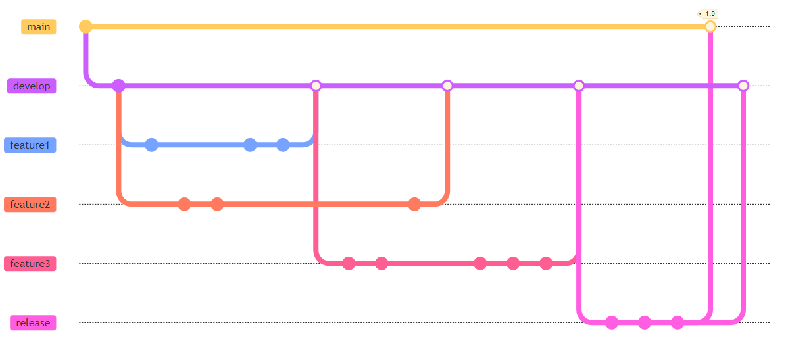
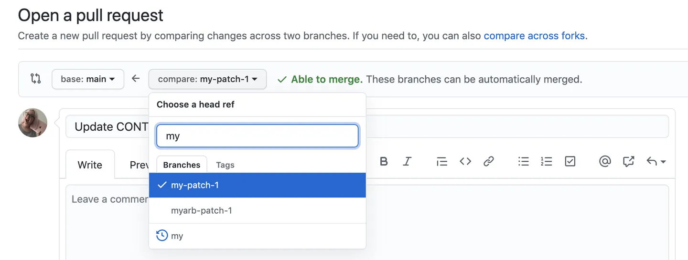

# Gerenciando Branches com Git-flow, GitHubFlow e TBD

Neste artigo vamos apresentar três modelos que padronizam os branches
que devem ser criados por times de desenvolvimento
de software. Trata-se de um assunto importante e prático, pois
ele disciplina o fluxo de trabalho que deve ser usado por times 
para implementar novas funcionalidades ou para corrigir bugs, 
por exemplo.

## Git-flow

Git-flow é um modelo de gerenciamento de branches muito comum em times 
que usam Git, tendo sido proposto por Vincent Driessen em 2010 
([link](https://nvie.com/posts/a-successful-git-branching-model/)).
Basicamente, o modelo usa dois branches principais e permanentes:

* `Main` — também conhecido por `master` ou `trunk` — é usado para 
armazenar as versões de um sistema que estão em produção.

* `Develop` é usado para armazenar código com funcionalidades que já foram
implementadas, mas que ainda não passaram por um teste final.
Normalmente, esse teste é realizado por um analista de qualidade (QA).

Git-flow prevê três branches temporários: 

* Branches de funcionalidade
* Branches de release
* Branches de hotfix

Esses branches serão descritos a seguir. Eles podem ser criados usando-se
os próprios comandos do git (veja alguns exemplos 
[aqui](https://nvie.com/posts/a-successful-git-branching-model)) ou então
usando plugins com macros que facilitam o uso do Git-flow.

#### Branches de Funcionalidade {.unnumbered}

Esses branches nascem de `develop` e devem ser criados por 
desenvolvedores antes de começar a implementação de uma nova 
funcionalidade. Quando essa funcionalidade fica pronta, eles 
são integrados (via um `merge`) de volta em `develop` e 
são então removidos. Por isso, são branches que muitas vezes 
existem apenas no repositório local de um desenvolvedor.

**Exemplo:** Na próxima figura, mostramos três branches de 
funcionalidades. Os círculos cheios representam `commits`
e os círculos vazios representam `merges`. 
Veja que os branches de funcionalidade sempre nascem e 
voltam para `develop`. 

{width=85%}

#### Branches de Release {.unnumbered}

Esses branches também nascem de `develop`. E eles são usados 
para preparar uma nova release, a qual deve ser aprovada 
(ou homologada) pelo cliente final. Quando o cliente dá o 
sinal verde, os branches de release são integrados no `main`, 
já que agora temos uma nova versão do sistema pronta para 
entrar em produção. 

Se no processo de aprovação forem realizadas mudanças 
no código, o branch de release deve ser integrado de volta 
também em `develop`. 

**Exemplo:**  Após implementar as três funcionalidades da 
figura anterior, o líder do time decidiu gerar uma release 1.0 
do sistema. Para isso, ele criou um branch de release (veja figura), 
que foi usado para mostrar o sistema para o seu cliente final. 
Após algumas modificações requisitadas pelo cliente,  o sistema 
foi aprovado e entrou em produção, isto é, foi integrado 
no `main`.  Por fim, as mudanças realizadas no branch de release 
foram também aplicadas em `develop`.

{width=95%}

#### Branches de Hotfix {.unnumbered}

Esses branches são usados para corrigir um erro
crítico que foi detectado em produção, ou seja, em um código que está
no `main`. Por isso, eles nascem do `main`, recebem commits que corrigem
o bug crítico e, por último, são de novo integrados no `main` e também
em `develop`.

**Exemplo:** Após lançar a nova release, os usuários começaram a 
reportar um bug crítico na mesma. Assim, criou-se um branch para
corrigir esse bug crítico (veja na figura a seguir), o qual nasceu 
do `main`. Após a correção do bug, o branch foi integrado de volta 
no `main` e uma nova release foi gerada, com a tag 1.0.1. Por fim, 
o branch foi também integrado em *develop*.

{width=95%}

#### Comentários Finais {.unnumbered}

Em resumo, o fluxo mais comum quando se usa Git-flow é o seguinte:

Funcionalidade $\Rightarrow$ develop $\Rightarrow$ release $\Rightarrow$ main

Ou seja, uma funcionalidade é sempre implementada em um branch 
específico. Em seguida, esse branch é integrado em `develop`, onde 
a funcionalidade passa por testes de integração. De tempos em 
tempos, um branch de release é gerado para mostrar uma nova versão 
do sistema para o cliente final. Uma vez aprovada, essa versão
é integrada no `main` e disponibilizada para a base completa 
de usuários.

Git-flow dever ser usado, principalmente, quando existem 
testes manuais e times de QA. E também quando os clientes precisam 
aprovar e homologar qualquer nova versão do código antes que ela entre 
em produção.

Porém, quando se usa Git-flow, os branches de funcionalidade podem 
demorar muito tempo para serem integrados em `develop`, o que pode 
ocasionar diversos conflitos de integração (*merge hell*). 
Adicionalmente, caso a integração dos branches de release também 
demore, os desenvolvedores vão demorar para receber feedback 
sobre as novas funcionalidades que eles implementaram.

## GitHubFlow 

GitHubFlow é um modelo de branches muito comum quando se usa GitHub.
Trata-se de um modelo mais simples do que Git-Flow, pois existem
apenas o branch principal e branches de funcionalidade. Por outro lado, 
existe suporte a revisão de código antes de integração, por meio do 
mecanismo de Pull Requests (PR) do GitHub.

Quando se usa GitHubFlow, os principais passos são os seguintes:

1. Uma desenvolvedora cria um branch no seu repositório local.
2. Implementa uma funcionalidade ou corrige um bug.
3. Faz um push do branch para o GitHub.
4. Entra no GitHub e abre um Pull Request (PR), isto é, um
  pedido para alguém revisar seu branch. 
5. Um revisor, isto é, um outro desenvolvedor revisa e, eventualmente,
  faz o merge do PR no `main`.

Um exemplo de pedido de abertura de PR é mostrado na próxima figura,
a qual foi extraída da documentação do GitHub. Nessa figura, um PR
está sendo aberto para revisar o branch de nome  `my-patch-1`. 
Terminada essa revisão, esse branch será integrado no `main`.

{width=85%}

No [apêndice](https://engsoftmoderna.info/capAp.html#pull-requests) 
sobre git nós comentamos e explicamos melhor o conceito de Pull Request. 
Se quiser, você pode conferir também o artigo didático sobre 
[revisão de código](https://engsoftmoderna.info/artigos/revisao-codigo.html).

GitHubFlow é usado, principalmente, em sistemas com apenas uma 
versão em produção, como costuma ser o caso de sistemas Web.
Uma desvantagem do modelo é que os PRs podem levar muito tempo 
para serem revisados.

Apesar do nome, o mesmo fluxo pode ser usado com outros serviços
de controle de versão, como GitLab. 

## Desenvolvimento Baseado no Trunk (TBD) 

TBD é ainda mais simples do que GitHubFlow, pois usa apenas um branch, 
isto é, o branch principal, chamado também de `main`, `master` ou 
`trunk`. Ou seja, todos os desenvolvedores realizam seus commits 
diretamente no branch principal.

Na verdade, mesmo em TBD, desenvolvedores podem criar branches de 
funcionalidade, mas tais branches devem ter uma duração limitada, 
por exemplo, de no máximo dois dias, conforme sugerido por 
Paul Hammant em um livro sobre TBD (e também neste 
[post](https://trunkbaseddevelopment.com/short-lived-feature-branches/)):

> Uma regra importante é a duração do branch antes de ser integrado
e removido. Colocando de forma simples, o branch deve durar apenas 
alguns dias. Após mais de dois dias há o risco de que ele se torne
um branch de longa duração, o que constitui a antítese de TBD.

Para usar TBD, é importante que exista uma boa quantidade de testes
de unidade e de integração, para evitar que bugs e regressões sejam
introduzidos no `main`. Por outro lado, ao se usar TBD, fica mais
fácil adotar práticas como integração contínua (CI) e deployment
contínuo (CD). 

No [Capítulo 10](https://engsoftmoderna.info/cap10.html#desenvolvimento-baseado-no-trunk) do livro apresentamos uma 
descrição mais detalhada de TBD e também explicamos o mecanismo de 
[feature flags](https://engsoftmoderna.info/cap10.html#feature-flags), 
que é usado para evitar que implementações incompletas de uma
funcionalidade entrem em produção.


* * * 

```{=html}
<p>Voltar para a lista de <a href="./artigos.html">artigos</a>.</p>
```