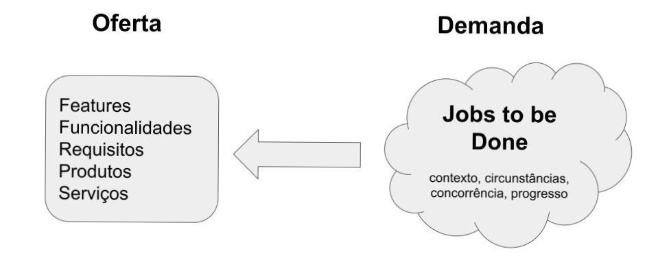

# Jobs to be Done (JTBD) Aplicado a Produtos de Software {.unnumbered}
 
## Introdução {.unnumbered}

*Jobs to be done (JTBD)* é uma teoria desenvolvida por Clayton Christensen
e colegas, em 2005, para explicar porque clientes escolhem comprar 
determinados produtos ou serviços. A ideia é que as pessoas, muitas
vezes, não consideram todas as funcionalidades de um produto 
ao tomar uma decisão de compra. Em vez disso, elas têm um 
"trabalho que precisa ser feito" e para isso elas "contratam" 
o melhor produto capaz de ajudá-las a realizar esse trabalho
com sucesso.

Portanto, segundo JTBD, as perguntas centrais que devemos responder 
ao projetar e desenvolver qualquer produto, seja ele digital 
ou não, são as seguintes: 

* Por que os clientes "contratam" nossos produtos? Em quais "circunstâncias"?
* Quais os "problemas" de sua vida eles querem resolver com nossos produtos? 
* Qual o "progresso" eles querem alcançar ao comprar nossos produtos?

JTBD é então uma teoria que foca nas origens das decisões de compra, isto é,
nos mecanismos que explicam porque uma pessoa decide introduzir um produto 
ou serviço na sua vida.  Por isso, os autores da teoria sempre ressaltam
que JTBD procura entender o **mecanismo causal** subjacente às decisões 
de adoção de produtos, serviços ou inovações.

### Exemplo: Milk-shakes do McDonalds {.unnumbered}

O exemplo mais comum para explicar JTBD refere-se a 
consumidores de milk-shake de franquias do McDonalds 
nos EUA. Ao prestar uma consultoria para a rede de fast-food, os
autores da teoria descobriram que um grande número de vendas de 
milk-shake ocorria nas primeiras horas da manhã. 

Após algumas entrevistas, eles concluíram que os clientes 
"contratavam" esses milk-shakes para resolver um "trabalho" 
específico: para chegar ao seu emprego, eles tinham que dirigir por 
um longo tempo e então eles usavam um milk-shake para tornar a 
viagem menos tediosa.

Como o exemplo tenta ilustrar, nem sempre é trivial para as 
empresas descobrir os "trabalhos" para os quais seus "produtos" 
são contratados. Particularmente, essa "contratação" pode acontecer 
em circunstâncias específicas. E também os "trabalhos" podem evoluir 
com o tempo e "trabalhos" inesperados podem aparecer.

### Por que é importante conhecer os "trabalhos" que motivam a "contratação" de nossos produtos? {.unnumbered}

Porque assim você pode se preparar para atender seus clientes melhor. 
Por exemplo, no caso da rede de fast-food, eles poderiam abrir 
mais cedo as vendas no drive-thru, evitando que os clientes 
tivessem que estacionar o carro e entrar na loja. 
Uma outra alternativa seria criar um tipo especial de milk-shake 
para ser consumido durante viagens matutinas e, por exemplo, 
com menos açúcar e mais viscosidade.

Ao pensar com as lentes de JTBD, nós também entendemos melhor
quais são os concorrentes de nossos produtos. Por exemplo,
os concorrentes de um software podem incluir não apenas 
sistemas semelhantes de outras empresas, mas também uma 
simples planilha eletrônica ou mesmo um caderno de anotações.

## O que JTBD tem a ver com Software? {.unnumbered}

A resposta é que tem tudo a ver, pois software é cada vez mais um 
produto. Quando um software é visto dessa maneira, o desenvolvimento 
nunca termina, no sentido de que o sistema está em constante 
evolução e sempre precisa incorporar novas funcionalidades para 
preservar e ganhar mercados e clientes. Na verdade, essa visão de 
software-produto é cada vez mais comum, principalmente em empresas 
digitais, cujo negócio é concretizado em um ou vários aplicativos. 

Por isso, ao desenvolver e evoluir um produto de software é importante
ter em mente os "trabalhos" para os quais ele está sendo 
"contratado". Caso contrário, corremos o risco de ter um sistema 
lotado de funcionalidades, mas que não ajuda nos "trabalhos" que 
seus clientes precisam entregar. 

E, como comentamos antes, em alguns sistemas não é trivial 
identificar os seus clientes e os trabalhos que eles precisam fazer.

### Exemplo: QuickBooks {.unnumbered} 

No livro no qual apresentam a teoria de JTBD, Christensen e colegas 
mencionam o caso do QuickBooks, um software de contabilidade para 
pequenas empresas vendido pela Intuit. 

Essa empresa tinha um sistema de controle de finanças pessoais muito 
popular nos EUA, chamado Quicken. A Intuit então percebeu que alguns 
dos usuários do Quicken também usavam o sistema, de forma improvisada, 
para fazer a contabilidade de suas pequenas empresas. 

Ou seja, eles preferiam usar o Quicken do que os sistemas de 
contabilidade que existiam no mercado, os quais eram complexos 
e voltados para contadores profissionais.

A Intuit teve então a ideia de lançar o seu próprio sistema
de contabilidade, chamado QuickBooks, destinado a pequenas 
empresas e que obteve um grande sucesso. Inclusive, seu
preço era superior ao de vários sistemas concorrentes com 
mais funcionalidades.

No livro, Christensen e colegas resumem assim esse estudo 
de caso:

> Os concorrentes estavam preocupados em produzir o melhor
software contábil possível. Por outro lado, Cook [CEO da Intuit] 
e sua equipe se concentraram no trabalho que os clientes estavam
tentando realizar [...] E, quando os clientes encontram o produto 
correto para atender ao trabalho que eles têm em mãos, 
normalmente estão dispostos a pagar mais.

### Exemplo: Twitter {.unnumbered} 

Recentemente, o CEO do Twitter declarou que eles pretendiam 
focar a evolução da rede social em três "trabalhos" estratégicos 
para seus usuários: descobrir o que está acontecendo, conversar 
online e receber compensações financeiras pelos seus tweets. 
O interessante é que ele não usou o termo requisitos na sua 
declaração, mas sim "trabalhos". Para mais detalhes, veja o 
seguinte [artigo](https://hbr.org/2021/10/how-twitter-applied-the-jobs-to-be-done-approach-to-strategy) 
do site da revista Harvard Business Review. 

## Descobrindo os "Trabalhos" {.unnumbered} 

Para descobrir os trabalhos para os quais os clientes contratam 
seu produto de software, é preciso observá-los e conversar com 
eles. No exemplo do milkshake, os autores contam que fizeram 
exatamente isso: foram cedo para o McDonalds e perguntaram 
para os clientes porque eles estavam "contratando" aqueles 
milkshakes logo nas primeiras horas da manhã.

Então, quando estiver definindo histórias de usuário, é 
importante esclarecer com os clientes **porque** eles estão 
pedindo certas histórias, isto é, qual a motivação e o contexto 
delas. 

Para deixar a motivação de histórias de usuário mais claras, 
existe o conceito de **job stories**, que é um template alternativo 
para escrita de histórias com o seguinte formato:

> Quando [situação], eu gosto de [motivo] de tal forma que [benefício]

Veja um exemplo: quando eu *dirijo meu carro para o trabalho*, eu 
gosto de *tomar um milkshake* de tal forma que *a viagem fique mais 
agradável e eu não fique com fome logo ao começar a trabalhar*.

No entanto, "histórias de trabalhos" devem ser usadas apenas para 
histórias menos usuais. Ou seja, para muitas histórias, a motivação 
é bem clara e, portanto, o template não agrega muito valor.

Outra técnica importante é perguntar ao cliente como ele resolve 
o problema atualmente, isto é, quando o sistema ainda não inclui 
a história que ele está pedindo. Isso ajuda a entender 
o contexto e a motivação do seu pedido.

## Comentários Finais {.unnumbered} 

Quando projetamos um produto, incluindo um software, devemos pensar
na oferta, representada pelas funcionalidades do produto e na
demanda, representada pelas reais necessidades dos clientes. Muitas
vezes, começamos pela oferta para então conectá-la à demanda. 
Por outro lado, JTBD advoga que o caminho inverso -- da demanda 
para a oferta -- tem mais chances de dar certo, conforme ilustrado
na seguinte figura.

{width=77%}

No caso específico de software, JTBD destaca-se -- junto com outras teorias, 
como [Design Thinking](./design-thinking.html) -- em sistemas
cujos requisitos são emergentes, ou seja, não estão claros 
na cabeça de nenhum cliente em particular.  Nesses casos,
vale a pena iniciar entendendo as reais demandas dos clientes
(isto é, os "trabalhos" que são mais importantes para eles),
para só então definir "o que" de fato será implementado.

Portanto, e em última instância, teorias como JTBD nos ajudam a 
evitar a implementação de sistemas com diversas funcionalidades 
que geram pouco "progresso" real para os clientes e, por isso, 
acabam não sendo usadas. 

### Para saber mais {.unnumbered} 

Talvez, o primeiro material para aprofundar os seu conhecimentos 
sobre JTBD seja o livro dos autores da teoria, cujo título em 
português é "Muito Além da Sorte: Processos Inovadores para 
Entender o que os Clientes Querem", publicado pela Bookman 
em 2017. Um 
[artigo](https://hbr.org/2016/09/know-your-customers-jobs-to-be-done), 
publicado na Harvard Business Review, em setembro de 2016, oferece 
uma introdução mais resumida a JTBD. 

## Exercícios {.unnumbered} 

1. Frequentemente, afirma-se que software pode ser desenvolvido 
como um projeto ou como um produto. Primeiro, para entender melhor 
essas duas formas de desenvolvimento, leia a seguinte 
[pergunta](https://engsoftmoderna.info/artigos/processos-faq.html#qual-a-diferen%C3%A7a-entre-times-orientados-por-projeto-e-por-produto) 
do FAQ sobre o Capítulo 2 do livro. Em seguida,
responda em qual tipo de cenário JTBD melhor se aplica: software 
desenvolvido como um projeto ou software desenvolvido como um produto? 
Justifique sua resposta.

2. Qual a vantagem de JTBD em relação ao uso de personas? Para 
conhecer mais sobre personas, leia a 
[pergunta](https://engsoftmoderna.info/artigos/requisitos-faq.html#o-que-s%C3%A3o-personas) sobre o tema no
FAQ do Capítulo 3 do livro.

3. Em um outro artigo didático, tratamos de 
[Design Thinking (DT)](./design-thinking.html). 
Descreva (a) uma característica comum entre JTBD e DT; (b) o principal conceito 
novo que JTBD introduz, quando comparado a DT.

* * * 

Voltar para a lista de [artigos](./artigos.html).
