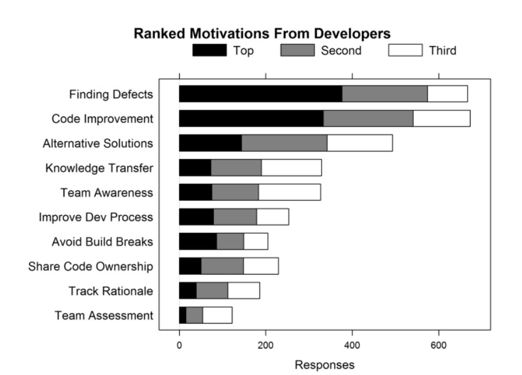

# Revisão de Código: Uma Breve Introdução {.unnumbered}

Artigo de autoria de **Aline Torres** e **Marco Tulio Valente**. Elaborado como parte da Monografia de Sistemas de Informação da primeira autora no DCC/UFMG.

## Introdução {.unnumbered}

Revisão de código é uma das práticas mais importantes para garantir a saúde a médio e longo prazo da base de código de um sistema. Ela é hoje adotada por várias empresas que desenvolvem software. Por exemplo, o Stack Overflow Survey de 2019 incluiu uma pergunta sobre o emprego da prática (veja figura). Dentre os mais de 70 mil desenvolvedores que responderam a essa pergunta, apenas 23% disseram que não usavam revisão de código ([link](https://insights.stackoverflow.com/survey/2019#development-practices)).

{width=85%}

A ideia de revisão de código é simples: todo código desenvolvido por um desenvolvedor tem que ser, em seguida, analisado por pelo menos um outro desenvolvedor, chamado de **revisor**. O revisor pode adicionar comentários no código sob revisão, procurando esclarecer dúvidas, sugerindo melhorias, indicando bugs, etc. 

Assim, estabelece-se um "diálogo" -- na forma de uma troca de comentários --- entre o **autor** do código e o seu revisor. Como resultado, o autor pode modificar sua implementação para atender a algum comentário do revisor que ele achou procedente. Ou então, ele pode replicar e justificar que o comentário não faz sentido... Espera-se que após esse "diálogo" o código seja aprovado pelo revisor e possa ser integrado no repositório do projeto.

## Pull Requests {.unnumbered}

Nesta seção, vamos apresentar um breve tutorial sobre como revisar código usando o recurso de **Pull Requests (PR)** do GitHub. Por meio desse recurso, desenvolvedores podem submeter código para ser integrado no repositório principal de um projeto. No entanto, antes da integração, o GitHub permite que outros desenvolvedores revisem esse código.

O exemplo a seguir usa a classe `Estacionamento` que já foi usada no Capítulo 5 do livro. Especificamente, vamos supor que uma autora criou um PR, no qual ela sugere adicionar tal classe no sistema. Após isso, tem início o processo de revisão, que você pode acompanhar também pela próxima figura.

* **Comentário 1**: o revisor comenta que alguns atributos da classe `Estacionamento` poderiam ser privados. E sugere implementar um método `estaciona` para mediar o acesso a eles.

* **Comentário 2:** a autora informa que concorda com a sugestão do revisor e, inclusive, já atualizou o seu código com a modificação sugerida.

* **Comentário 3:** o revisor aprova o PR. A mensagem LGTM significa *Looks Good to Me*. Então, o PR pode ser integrado no branch principal do projeto. Isso pode ser feito pela própria autora, caso ela tenha permissão de escrita nesse branch.

{width=85%}

## Motivações para Revisão de Código {.unnumbered}

Em 2013, Alberto Bacchelli e Christian Bird realizaram um estudo sobre revisão de código com 873 desenvolvedores, testadores e gerentes da Microsoft ([link](https://doi.org/10.1109/ICSE.2013.6606617)). A próxima figura ilustra as principais motivações para realização de revisão de código, na opinião dos participantes do estudo. 

{width=62%}

Conforme respondido por esses participantes, a principal motivação é encontrar bugs no código submetido. Porém, outros fatores também são importantes, como (1) melhorar o código, (2) propor soluções alternativas e (3) transferir conhecimento. Esse último benefício pode ocorrer nos dois sentidos, isto é, o autor pode aprender com os comentários do revisor e vice-versa. 

## Boas Práticas para Revisores {.unnumbered}
 
Nesta seção, vamos listar algumas recomendações para revisão de código. 

Para chegar até elas, partimos do artigo *How to Give Respectful and Constructive Code Review Feedback*, de autoria de Michaela Greiler ([link](https://www.michaelagreiler.com/respectful-constructive-code-review-feedback)). Em seguida, fizemos uma análise de mais de 120 PRs de projetos de código aberto, hospedados no GitHub, buscando por casos concretos de comentários que seguem as recomendações que coletamos inicialmente.  Ao todo, analisamos pelo menos 259 comentários para selecionar os exemplos que iremos mostrar a seguir.

### Recomendações Genéricas {.unnumbered}

Vamos começar com algumas recomendações genéricas:

1.  Os revisores sempre devem lembrar que o objetivo da revisão é **detectar problemas claros** no código submetido. Por exemplo, é natural que o revisor pudesse ter optado por resolver o mesmo problema de um modo diferente... Porém, a revisão não é para propor alternativas que não tenham vantagens claras e inequívocas. Ou seja, um revisor somente deve propor uma alternativa se ela for, de fato, bem melhor!

2. Na linha da recomendação anterior, **evite comentários subjetivos e relacionados a estilos pessoais**. Um exemplo são nomes de variáveis. A não ser que o nome de uma variável seja muito ruim, recomenda-se não iniciar um debate sobre ele.

3. Em suas revisões, **nunca use palavras ofensivas**, sarcásticas ou mesmo irônicas. Em vez disso, seja sempre educado e profissional.

4. Sempre **restrinja seus comentários ao código** que foi submetido e evite tratar de assuntos pessoais ou de outras questões.

### Recomendações Específicas {.unnumbered}

Seguem agora algumas recomendações mais específicas:

5. Nos seu comentários, **procure fazer perguntas e não julgamentos**. Segue um exemplo de pergunta real feita por um revisor de um dos projetos que estudamos: *Is this actually used? Or is it something necessary to make the template magic work?*

6. Se você tiver feito um comentário errado ou sem sentido, **reconheça o seu erro** e agradeça, como no seguinte exemplo: *Ah, I see the point. Thanks for your explanation.*

7. Sempre que possível, **use emojis**, pois eles deixam a linguagem coloquial e amigável. Veja um exemplo real: *run yarn task... It'll save time to everybody* 😄

8. Sempre que for interessante, **referencie a documentação** interna ou externa ao projeto. Isso ajuda a embasar seus comentários, como neste exemplo: *[a given feature] allows id as in [URL]*

9. Não deixe de **elogiar o código**, se achar que ele possui uma qualidade superior, como neste caso: *Thanks for the clear test instructions.*

10. Se necessário, **use imagens e screenshots** para explicar sua dúvida. Veja um exemplo na próxima figura. Por meio dela, o revisor quis deixar claro que o código submetido iria ter um comportamento errado quando um determinado filtro fosse definido como "All".

{width=57%}

11. Sempre que for razoável, **use o pronome "nós"**  ou a expressão "a gente", em vez de usar o pronome "você", pois assim você deixa claro que estão -- autor e revisor -- trabalhando juntos. Por exemplo, em vez de dizer, *será que você não poderia tornar esse atributo privado?*, você pode perguntar: *será que a gente não poderia tornar esse atributo privado?*

## Boas Práticas para Autores {.unnumbered}

Evidentemente, os autores também devem ser profissionais e educados em suas respostas. 

Outro ponto importante é que os autores devem submeter PRs pequenos, caso queiram obter uma resposta rápida e mais proveitosa dos revisores.
Por exemplo, os autores do livro *Software Engineering at Google*, recomendam que **um pull request deve ter no máximo 200 linhas de código**. 

## Automatizando o Processo {.unnumbered}

Antes de concluir, gostaríamos de comentar que diversos "problemas" tratados em uma revisão de código podem ser detectados de forma automática por meio de **ferramentas de análise estática**. Por exemplo, questões como convenções de nomes de identificadores (*camel case*, *snake case*, etc), leiaute de código e estilo de indentação (tab ou espaços, por exemplo) podem ser padronizadas por meio de **linters**. Com isso, evita-se que um revisor humano tenha que perder tempo com elas.

## Exercício {.unnumbered}

Seja o seguinte código, de uma classe `Stack`. Quais comentários você faria caso fosse responsável pela sua revisão? Sugestão: existem quatro questões sobre esse código que achamos que deveriam ser mencionadas em uma revisão.

~~~~ {#stack .java .numberLines }
import java.util.ArrayList;
import java.util.EmptyStackException;

public class Stack<T> {

  private ArrayList<T> elements = new ArrayList<T>();
  public int size = 0;

  public int size() {
    return size;
  }

  public boolean isEmpty() {
            return (size == 0);
  }

  public void empilha(T elem) {
    elements.add(elem);
    size++;
  }

  public T pop() throws EmptyStackException {
    if (isEmpty())
      throw new EmptyStackException();
    T elem = elements.get(size-1);
    size--;
    return elem;
  }
}
~~~~
