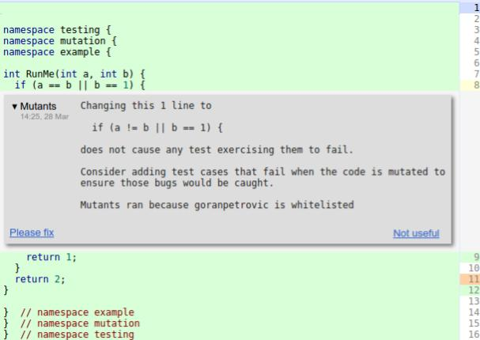
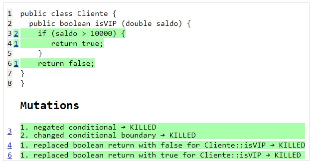

# Testes de Mutação: Uma Visão Prática

## Introdução

O conceito de teste de mutação é antigo, tendo sido proposto pela
primeira vez em 1978 
no seguinte [artigo](https://doi.org/10.1109/C-M.1978.218136). 
Para entender melhor o conceito, o principal 
ponto que deve ser lembrado é que um teste de mutação não tem como 
objetivo detectar bugs no código de produção, tal como ocorre, 
por exemplo, com testes de unidade, integração, end-to-end, 
snapshot, etc.

Em vez disso, testes de mutação são usados para avaliar a 
efetividade dos testes automatizados que já existem no sistema. 
Ou seja, o pressuposto é que você já tem diversos testes e quer 
saber se eles são efetivos, isto é, realmente capazes de detectar 
bugs e regressões.

Para isso, uma ferramenta de testes de mutação realiza pequenas 
modificações no código de produção, gerando uma versão
do código que é chamada de **mutante**. Por exemplo, mutantes 
podem ser gerados por meio das seguintes operações: 

* Remoção ou duplicação de algum comando ou expressão.
* Troca de operadores, por exemplo, troca de um operador de 
adição (+) por um de subtração (-). 
* Inserção um operador, por exemplo, `cond` vira `!cond`.
* Troca de alguma constante, por exemplo, `True` por `False`.

Como as mutações são realizadas de forma arbitrária, elas 
naturalmente representam bugs. E, então, os testes existentes 
devem falhar ao serem executados sobre elas. Se isso não 
acontecer, podemos concluir que esses testes não são "bons" 
o suficiente.

Testes de mutação é considerado tipo de teste caixa-branca,
pois o seu funcionamento requer conhecimento da estrutura 
interna do código das funções de um sistema. Conforme
afirmado, esse conhecimento é necessário para gerar
as mutações. 

A próxima figura -- retirada de um 
[post](https://testing.googleblog.com/2021/04/mutation-testing.html)
de um blog do Google --
ilustra um uso real de testes de mutação. A mensagem em fundo cinza 
informa que uma mutação foi realizada na expressão do comando `if`, 
trocando `a == b` por `a != b`. No entanto, como também informado 
na mensagem, essa mutação não implicou na falha de nenhum dos 
testes existentes.

{width=60%}

Ao se deparar com a mensagem acima, o desenvolvedor deve 
analisar a mutação realizada e inferir o comportamento do sistema 
que foi comprometido pela mesma. Em seguida, ele deve escrever 
um teste de unidade que exercite esse comportamento e que, portanto, 
falhe quando executado sobre o mutante mostrado. 

## Score de Mutações

Score de mutações é uma métrica muito usada com esse tipo 
de teste. Ela é assim definida:

> score de mutações = número de mutantes mortos / total de mutantes gerados

Diz-se que um mutante foi morto quando ele foi detectado
por algum teste existente. Portanto, idealmente, gostaríamos
que o score de mutações fosse sempre de 100%.

## Ferramentas para Testes de Mutação

Existem diversas ferramentas para realização de testes de mutação.
No caso de Java, uma das ferramentas mais populares é o 
[Pitest](https://pitest.org), a qual implementa diversas estratégias 
para reduzir o tempo de execução dos testes de mutação. 
Dentre elas, podemos citar as seguintes:

* Pitest realiza as mutações diretamente no código compilado. Ou seja,
não é preciso compilar um mutante para saber se ele sobrevive ou não aos
testes existentes.

* Para determinar se um mutante M é morto pelos testes, Pitest não roda 
todos os testes do programa, mas apenas aqueles que executam o código de M.

## Exemplo: JFreeChart

JFreeChart é uma biblioteca Java para construção de gráficos. A versão
1.0.19 do sistema possui 47 KLOC e 1320 testes.

O seguinte [artigo](https://arxiv.org/abs/1601.02351) analisa
o uso da ferramenta Pitest no JFreeChart. Conforme descrito no artigo,
quando executado sobre a versão mencionada do JFreeChart, o Pitest gera
256K mutantes em 109 minutos. O score de mutações é igual a 19%.

Assim, esse exemplo ilustra um dos principais problemas de testes de 
mutação, isto é, o seu elevado custo computacional, mesmo com todas
as otimizações implementadas pelo Pitest. Em um 
sistema relativamente pequeno (47 KLOC), foram necessárias quase que
duas horas para testar todos os mutantes gerados. Por outro lado, 
chegou-se a um score de mutação relativamente baixo (19%), o que
sugere que existe espaço para escrever novos testes para 
esse sistema.

## Mutantes Equivalentes

Em situações específicas, os operadores de mutação podem gerar
mutantes que representam um comportamento válido, ou seja, 
que não incluem nenhum bug. Esses mutantes são chamados 
de **mutantes equivalentes**.

Um exemplo simples é uma mutação em algum código morto,
isto é, que não é mais chamado por nenhuma parte do sistema.

O problema é que, por definição, não se consegue matar
mutantes equivalentes. Ou seja, como eles não mudam o 
comportamento esperado do programa, não é possível escrever um 
teste que falhe ao ser executado sobre o mutante. Nesses casos,
a melhor solução consiste em refatorar o código para 
eliminar a situação que causou a geração do mutante equivalente. 
No nosso exemplo, podemos deletar o código morto, 
pois ele não é mais necessário no sistema.

## Comentários Finais

Testes de mutação podem ser vistos como sendo os **testes dos testes**. 
Isto é, eles são úteis principalmente quando é muito importante 
ter testes com a máxima qualidade e confiabilidade.

Por outro, em muitos sistemas, os desenvolvedores já têm 
consciência de que os testes não são tão "bons". Muitas vezes, eles 
até conhecem as partes e funcionalidades de um sistema que 
precisam de uma melhor cobertura de testes. Logo, nesses casos, o 
investimento em testes de mutação pode não ser uma prioridade.

## Exercícios {.unnumbered}


1\. Seja a seguinte função:

```
def isConceitoA(nota):
    if (nota >= 90):
       return True
    return False
```

Seja ainda o seguinte teste:

```
def teste():
    assertTrue(isConceitoA(95))
    assertFalse(isConceitoA(85))
```

Então: (a) qual a cobertura de comandos desse teste? (b) gere um mutante 
para a função que não é "morto" pelo teste; (c) modifique o teste 
para que ele falhe com o mutante que você gerou.

2\. Seja a seguinte função que verifica se um cliente de um banco é VIP,
dependendo do seu saldo e tempo de relacionamento com o banco:

```
def isClienteVIP(saldo, tempo):
    if (saldo > 10000) or (tempo > 10):
       return True
    return False
```

Segue também o seguinte teste dessa função (que possui uma cobertura de 
comandos de 100%):

```
def teste():
    assertTrue(isClienteVIP(11000, 11))
    assertTrue(isClienteVIP(10000, 11))
    assertFalse(isClienteVIP(9000, 9))
```

Então, ao usar uma ferramenta de testes de mutação, foi gerado 
o seguinte mutante:

```
# mutante: primeira condição do if foi removida
def isClienteVIP(saldo, tempo):
    if (tempo > 10): 
       return True
    return False
```

Veja, no entanto, que o teste mostrado acima **não** é capaz de 
matar esse mutante. Isto é, ele **não** falha ao ser executado com 
o mutante.

Então, adicione mais um `assert` no teste de modo que ele agora
"mate" o mutante.

3. Seja a seguinte classe, agora em Java:

```
public class Cliente {
  public boolean isVIP (double saldo) {
    if (saldo > 10000) {
       return true;
    }  
    return false;
  }
}
```

E seja o seu seguinte teste de unidade:

```
public class Teste {
  @Test
  public void teste1() {
    Cliente cliente = new Cliente();
    assertTrue(cliente.isVIP(15000));
  }
}  
```

Por fim, seja a seguinte saída gerada pela ferramenta Pitest
quando executada no programa formado pela classe e teste
mostrados anteriormente:

{width=60%}

Conforme podemos observar, foram gerados quatro mutantes, sendo que
dois foram mortos (linhas com fundo verde), um sobreviveu (primeira linha
com fundo vermelho) e o último mutante não foi coberto pelo teste. 

Então, modifique o teste de unidade, acrescentando mais dois comandos 
`assert`, de forma que ele mate todos os quatro mutantes. 
Consequentemente, o novo relatório gerado pela ferramenta deverá
ser o seguinte:

{width=60%}

<!---
1\. Seja a seguinte função que verifica se um cliente é VIP, dado o 
seu saldo no banco:

```
def isClienteVIP(saldo):
    if (saldo > 10000):
       return True
    return False
```

Seja ainda o seguinte teste dessa função:

```
def teste():
    assertTrue(isClienteVIP(15000))
```

Então: (a) qual a cobertura de comandos desse teste? (b) gere 
um mutante para a função que não é "morto" pelo teste; (c) modifique 
o teste para que ele falhe com o mutante que você gerou.
--->

* * * 

```{=html}
<p>Voltar para a lista de <a href="./artigos.html">artigos</a>.</p>
```