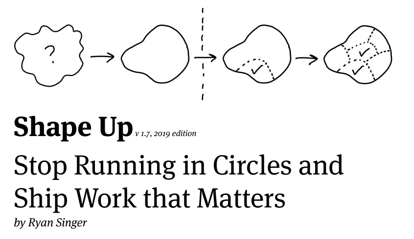
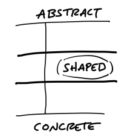

# ShapeUp: Uma possível alternativa a Scrum? {.unnumbered}

Shape Up é um novo método para desenvolvimento de software, que
está sendo proposto pela [Basecamp](https://basecamp.com/), 
a empresa por trás do
software de gerenciamento de projetos de mesmo nome.
O método é descrito em um [livro](https://basecamp.com/shapeup)
aberto, de autoria de Ryan Singer, que é um dos principais 
gerentes de produto da empresa.

{width=60%}

Para comentar sobre Shape Up, vamos usar diversas analogias com
outros métodos ágeis, principalmente com Scrum.

Um ciclo de desenvolvimento em Shape Up
é composto por três etapas, conforme descrito a seguir.

Primeiro, temos uma fase de projeto *up front*, chamada de **shape**.
Claro, esse projeto é mais simples do que em Waterfall (isto é,
não é um *big design up front*). Porém,
a ideia é que todo projeto de desenvolvimento de software
precisa de uma coordenação de mais alto nível, que defina
as features que serão implementadas, crie limites para as
mesmas e avalie os riscos e benefícios. Tudo isso é feito
nessa fase de *shape*. Como ela é central no método
-- e dá nome para ele -- iremos comentar mais sobre ela
daqui a pouco, em uma seção separada.

Depois da fase de *shape* começa um
sprint propriamente dito, que eles chamam de **ciclos**.
Porém, esses ciclos são mais longos do que os
sprints de Scrum, tendo uma duração de seis semanas.
Veja como o autor justifica a duração dos ciclos:

> We work in six-week cycles. Six weeks is long enough to build something meaningful start-to-finish and short enough that everyone can feel the deadline looming from the start, so they use the time wisely. The majority of our new  features are built and released in one six-week cycle. 

Finalizado um ciclo, segue um período de calmaria,
de duas semanas, que os autores chamam de **cool-down period**.
A ideia é que os desenvolvedores devem usar esse período para
respirar um pouco. E aproveitar para realizar outras tarefas,
como corrigir bugs, aplicar refactorings, estudar um nova
tecnologia, implementar uma prova de conceito, etc. O autor
justifica a necessidade desse período da seguinte forma:

> If we were to run six-week cycles back to back, there wouldn’t be any time to breathe and think
about what’s next. The end of a cycle is the worst time to meet and plan because everybody is
too busy finishing projects and making last-minute decisions in order to ship on time.
Therefore, after each six-week cycle, we schedule two weeks for cool-down . This is a period with
no scheduled work where we can breathe, meet as needed, and consider what to do next. 

Existem mais duas diferenças importantes para Scrum:

* Shape Up não inclui, pelo menos explicitamente, 
outros eventos de Scrum, como reuniões diárias, revisões
e retrospectivas.

* Os times são menores do que os times Scrum, sendo formados por um designer
de UI e um ou dois desenvolvedores.

## Shape  {.unnumbered}

Shape é a fase principal do método e que dá nome a ele. 

A ideia é proporcionar uma solução de meio termo, entre um planejamento detalhado
(como em Waterfall) e um planejamento mais vago e abstrato (como pode acontecer,
por exemplo, com Scrum). A próxima figura ilustra o nível de detalhe
que deve ser objeto da fase de shape.

O livro não detalha os responsáveis pela fase de shape, mas sugere que devem
ser desenvolvedores e gerentes de nível senior. Além disso, é importante mencionar
que a fase de shape pode acontecer em paralelo com os ciclos de 6 semanas e o
período de cool-down.deve

O resultado da fase de shape é um **pitch**, isto é, 
um documento simplificado que propõe uma nova feature para um sistema,
incluindo as seguintes informações:

* Descricão do problema que espera-se resolver com a nova feature.

* Quanto tempo pretende-se gastar com a implementação dessa feature. O autor
chama esse tempo de **apetite**. Veja então que uma feature pode demandar 
menos de 6 meses (um ciclo). Pode-se, por exemplo, ter features de dois meses.

* Uma descrição em alto nível da solução proposta. Como o autor é 
originalmente um designer, os exemplos de soluções mostrados no livro
são descrições (ou rascunhos) de mais alto nível de telas e interfaces.

* Limitações e esclarecimentos. Na verdade, o autor usa o termo **no go's**
para limitações que serão aceitas na solução a ser implementada. E o termo
**rabbit holes** para designar os potenciais impasses que podem ocorrer no 
momento da implementação (e então já propor soluções para eles na fase
de shape). O objetivo final é evitar que o time se preocupe 
e perca tempo com essas questões.

Por fim, gera-se um conjunto de pitches, que vão para o que o
autor chama de **bet table**. Ou seja, os pitches são distribuídos
para um grupo de tomadores de decisão, que escolhem e definem aqueles
que de fato serão implementados no próximo ciclo. Essa decisão é tomada
de forma assíncrona, via troca de mails e discussões em uma ferramenta
de gerência de projetos (no caso, Basecamp). E, por fim, em uma curta
reunião final e síncrona, que deve durar poucas horas. No caso da Basecamp,
opinam sobre os pitches as seguintes pessoas: CEO da empresa, CTO da
empresa, um desenvolvedor senior e um estrategista de produtos.

Terminada essa reunião, os pitches são distribuídos para os times. E
começa-se o ciclo de 6 semanas.

É interessante mencionar ainda que não existe um backlog de pitches.
Veja o que os autores dizem sobre esse fato:

> If we decide to bet on a pitch, it goes into the next cycle to build. If we don’t, we let it go. There’s
nothing we need to track or hold on to. What if the pitch was great, but the time just wasn’t right? Anyone who wants to advocate for it again simply tracks it independently—their own way—and then lobbies for it six weeks later. 

Ou seja, na verdade, parece o que não existe é um backlog local.
Mas cada shaper pode ter seu backlog local de pitches que ele pretende
propor e defender na próxima bet table.

## Conclusão {.unnumbered}

Resumindo, ShapeUp tem diferenças importantes para métodos como Scrum:

* Existe uma fase de planejamento e projeto (shape)

* Não existem eventos como reuniões diárias, revisões, retrospectivas

* Não existem artefatos como backlogs e quadros Scrum ou Kanbam

* Os times possuem um tamanho realmente mínimo (por exemplo, 1 designer e 1 desenvolvedor)

* Não existem papeis semelhantes àqueles de Scrum Master e Product Owner. Embora um
estrategista de produto faça parte da *bet table*.

* Os desenvolvedores não tem autonomia para definir os pitches (features) do próximo ciclo. Esses pitches
(features) são delegados para eles.

* No entanto, os times continuam bastante autônomos para decidir como o pitches serão implementados,
no intervalo de 6 semanas.

