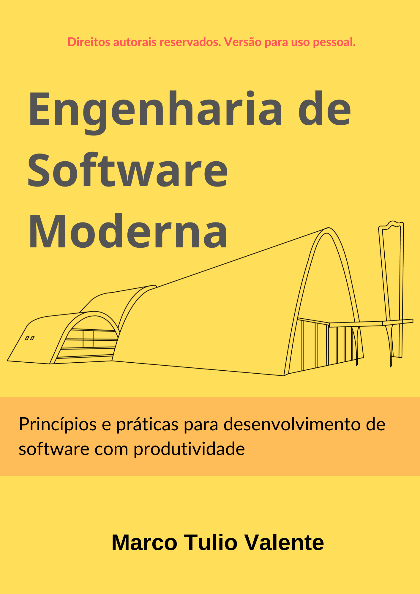

{width=100%}

# Prefácio

> A inutilidade dos prefácios é um lugar comum da história dos prefácios, portanto serei breve.
>
> -- <cite>Eduardo Giannetti</cite>

A ideia de escrever este livro surgiu no início de 2019, quando fui alocado para ministrar a disciplina Engenharia de Software, do Bacharelado em Ciência da Computação, da UFMG. Para preparar o curso, comecei com uma análise dos principais livros de Engenharia de Software. Para minha surpresa, percebi que eles tinham mudado pouco desde que cursei a disciplina na minha graduação: há mais de 25 anos!

Meu objetivo era escolher um livro que permitisse, no início de uma aula, dizer para os alunos: "hoje vamos estudar tal assunto, que corresponde a tal capítulo do livro texto". No final da aula, gostaria de sugerir aos alunos: "para fixar a matéria que acabamos de ver, sugiro que façam tais exercícios". No entanto, infelizmente, não encontrei esse livro... Em vez disso, tive que fazer uma extensa pesquisa e leitura de pelo menos 15 livros. 

Como resultado, preparei mais de 600 slides, que considero conter o principal material que deve ser tratado em uma disciplina de graduação em Engenharia de Software, especificamente em cursos que possuem uma única disciplina na área. Porém, estudar apenas por slides não proporciona a mesma experiência de aprendizado obtida com a leitura atenta de um texto completo e contextualizado.

Assim, surgiu a ideia de transformar os slides em livro, que pudesse desempenhar o papel do sonhado livro texto, já visando futuras ofertas da disciplina. E que fosse útil também para outros professores, que devem enfrentar problemas semelhantes ao meu, quando têm que ministrar um curso de Engenharia de Software. 

Gostaria, então, de destacar os seguintes pontos sobre o conteúdo e organização do livro:

* Ele foi escrito para ser um livro moderno, com ênfase em técnicas e princípios que são largamente usados na construção de software nos dias de hoje. 

* Por outro lado, o livro também cobre técnicas e princípios tradicionais, porém de forma rápida. O motivo é que achamos importante cobrir a história da área, mencionando o que deu certo e o que não deu. Achamos que essa visão é importante na formação e amadurecimento dos alunos.

* O livro inclui inúmeros exemplos e discussões de casos reais. Para isso, criei a seção "Mundo Real", onde os assuntos são ilustrados com exemplos recentes e reais, provenientes de grandes empresas de software e também de artigos científicos, buscando-se apresentar o que se faz de melhor tanto na indústria como na academia.

* O livro foi escrito em Português, pois o objetivo é contribuir, primeiro, com os cursos e alunos brasileiros. Porém, optamos por não traduzir alguns termos — como refactoring, branches, sprint, etc — pois achamos que eles são usados, também sem tradução, pelos desenvolvedores brasileiros no seu dia a dia.

* Apesar de tratar de temas modernos, a intenção foi escrever um livro duradouro. Por isso, temas e tecnologias que ainda não passaram pelo teste do tempo não são abordados (ou são abordados de forma rápida). Um exemplo são os últimos frameworks e arquiteturas para implementação de sistemas, que tendem a mudar rapidamente. Também não acoplamos o livro a nenhuma linguagem de programação. Por exemplo, todos os trechos de código são mostrados em uma sintaxe bastante neutra. 

* Ele não é um livro extenso, com diversos capítulos que, na prática, tratam de assuntos que não são importantes nos cursos atuais.

* Cada vez mais, engenheiros de software têm que escrever código. Hoje, há pouco espaço para dizer que eu não preciso programar, pois sou arquiteto ou analista. Por isso, nos capítulos de projeto, testes e refatoração procuramos seguir a recomendação de Linus Torvalds (criador do Linux): "falar é fácil, mas mostre-me o código". Assim, esses capítulos incluem dezenas de exemplos de código, que simulam problemas e soluções típicos de sistemas reais.

* Ao longo da escrita, procuramos praticar o que enfatizamos no livro, principalmente no que diz respeito à prevalência atual de métodos de desenvolvimento ágeis. Assim, o livro foi escrito seguindo princípios ágeis. Cada capítulo foi tratado com sendo um sprint; uma vez pronto, ele foi disponibilizado para uso, para receber críticas e sugestões. Como ocorre com software, acho muito arriscado, nos dias de hoje, passar anos escrevendo um manuscrito, trancado em minha sala, para só então torná-lo público. Outra prática ágil que se mostrou muito interessante foi deployment contínuo, isto é, toda atualização, em qualquer capítulo, era imediatamente propagada para a versão Web do livro.

## Público Alvo

O livro se destina a alunos de cursos de graduação. Ele foi escrito para ser adotado em cursos que possuem uma única disciplina de Engenharia de Software, com 60 horas. Porém, achamos também que ele pode ser usado — junto com outros livros — em cursos com duas ou mais disciplinas na área.

Além disso, ele pode ser adotado em cursos técnicos e tecnológicos. Na verdade, fizemos um esforço para usar uma linguagem bastante clara, próxima à linguagem coloquial, exatamente para não criar barreiras à adoção do livro.

Por fim, também escrevemos o livro pensando em profissionais da área, que estão em busca de aperfeiçoamento em temas e métodos modernos de Engenharia de Software. De forma nenhuma, este é um livro descolado do estado da prática em Engenharia de Software.

## Pré-requisitos

Espera-se que os leitores tenham domínio de conceitos básicos de programação e algoritmos e estruturas de dados. Além disso, recomendamos domínio de orientação a objetos. Idealmente, supondo um curso de graduação de 4 anos, os alunos devem estar na metade final do curso para que possam aproveitar os conceitos e métodos tratados no livro.

## Próximos Passos

Até o presente momento, temos 9 capítulos prontos, de um total previsto de 10 capítulos. Logo, estamos perto de terminar! Para conhecer esses capítulos, recomendamos consultar a última seção do Capítulo 1, onde apresentamos a estrutura do livro. 

Vamos sempre manter uma versão aberta do livro, em HTML, no endereço:

[https://engsoftmoderna.info](https://engsoftmoderna.info/)

Mas também pretendemos, em algum momento, ter uma versão em papel.

Marco Tulio Valente

Belo Horizonte, 11 de novembro de 2019.

## Sobre o Autor

Marco Tulio Valente é doutor em Ciência da Computação pela Universidade Federal de Minas Gerais, onde atualmente é Professor Associado do Departamento de Ciência da Computação. Seus interesses de pesquisa concentram-se em Engenharia de Software, especificamente nas áreas de Manutenção e Evolução de Software, Qualidade de Software e Mineração de Repositórios de Software. Ele é Bolsista de Produtividade Nível 1D do CNPq e bolsista do Programa Pesquisador Mineiro da FAPEMIG. É autor de mais de 100 artigos em periódicos e conferências internacionais, muitos deles em co-autoria com pesquisadores internacionais de renome. Orientou mais de 30 dissertações de mestrado e cerca de uma dezena de teses de doutorado. Desde 2010, coordena o Applied Software Engineering Research Group ([ASERG](http://aserg.labsoft.dcc.ufmg.br/)), do DCC/UFMG. É responsável também pelo 
[CSIndexbr](https://csindexbr.org/), sistema que oferece dados transparentes sobre a produção científica brasileira em Ciência da Computação.

{width=25%}
