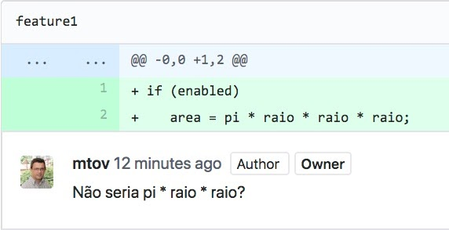

# Introdução

> *Our civilization runs on software.* -- Bjarne Stroustrup

Neste primeiro capítulo, vamos definir e contextualizar o que é
Engenharia de Software (Seção 1.1) e dar uma visão geral dos principais
assuntos estudados nesta área da Computação (Seção 1.2). O objetivo é
propiciar ao leitor uma visão horizontal da área de Engenharia de
Software, antes de nos aprofundarmos em temas específicos. Além disso,
sendo Engenharia de Software uma área bastante ampla, vamos caracterizar
os tipos de sistemas de software que podem se beneficiar das técnicas e
conceitos apresentados neste livro (Seção 1.3). O objetivo é, logo no
início, evitar falsas expectativas em relação ao conteúdo do trabalho.
Por fim, iremos apresentar a estrutura e os assuntos tratados nos
capítulos restantes do livro (Seção 1.4).

## Definições, Contexto e História

No mundo moderno, tudo é software. Hoje em dia, por exemplo, empresas de
qualquer tamanho dependem dos mais diversos sistemas de informação para
automatizar seus processos. Governos também interagem com os cidadãos por meio de
sistemas computacionais, por exemplo, para coletar impostos ou realizar
eleições. Empresas vendem, por meio de sistemas de comércio eletrônico,
uma gama imensa de produtos, diretamente para os consumidores. Software
está também embarcado em diferentes dispositivos e produtos de
engenharia, incluindo automóveis, aviões, satélites, robôs, etc. Por
fim, software está contribuindo para renovar indústrias e serviços
tradicionais, como telecomunicações, transporte em grandes centros
urbanos, hospedagem, lazer e publicidade.

Portanto, devido a sua relevância no nosso mundo, não é surpresa que
exista uma área da Computação destinada a investigar os desafios e
propor soluções que permitam desenvolver sistemas de software —
principalmente aqueles mais complexos e de maior tamanho — de forma
produtiva e com qualidade. Essa área é chamada de **Engenharia de
Software**.

Engenharia de Software trata da aplicação de abordagens sistemáticas,
disciplinadas e quantificáveis para desenvolver, operar, manter e
evoluir software. Ou seja, Engenharia de Software é a área da Computação
que se preocupa em propor e aplicar princípios de engenharia na
construção de software.

Historicamente, a área surgiu no final da década de 60 do século
passado. Nas duas décadas anteriores, os primeiros computadores modernos
foram projetados e começaram a ser usados principalmente para resolução
de problemas científicos. Ou seja, nessa época software não era uma
preocupação central, mas sim construir máquinas que pudessem executar
alguns poucos programas. Em resumo, computadores eram usados por poucos
e para resolver apenas problemas científicos.

No entanto, progressos contínuos nas tecnologias de construção de
hardware mudaram de forma rápida esse cenário. No final da década de 60,
computadores já eram mais populares, já estavam presentes em várias
universidades norte-americanas e europeias e já chegavam também em
algumas grandes empresas. Os cientistas da computação dessa época se
viram diante de um novo desafio: como os computadores estavam se
tornando mais populares, novas aplicações não apenas se tornavam
possíveis, mas começavam a ser demandadas pelos usuários dos grandes
computadores da época. Na verdade, os computadores eram grandes no
sentido físico e não em poder de processamento, se comparado com os
computadores atuais. Dentre essas novas aplicações, as principais eram
sistemas comerciais, como folha de pagamento, controle de clientes,
controle de estoques, etc.

\index{Conferência da OTAN}
**Conferência da OTAN**: Em outubro de 1968, um grupo de cerca de 50
renomados Cientistas da Computação se reuniu durante uma semana em
Garmisch, na Alemanha, em uma conferência patrocinada por um comitê
científico da OTAN, a organização militar que congrega os países do
Atlântico Norte (veja uma foto da reunião na próxima figura). O objetivo
da conferência era chamar a atenção para um "problema crucial do uso de
computadores, o chamado software". A conferência produziu um relatório,
com mais de 130 páginas,
que afirmava a necessidade de que software fosse construído com base em
princípios práticos e teóricos, tal como ocorre em ramos tradicionais e
bem estabelecidos da Engenharia. Para deixar essa proposta mais clara,
decidiu-se cunhar o termo Engenharia de Software. Por isso, a
Conferência da OTAN é considerada o marco histórico de criação da área
de Engenharia de Software.

{width=45%}

O comentário a seguir, de um dos participantes da Conferência da OTAN,
ilustra os desafios que esperavam a recém criada área de pesquisa:

> "O problema é que certas classes de sistemas estão colocando demandas sobre nós que estão além das nossas capacidades e das teorias e métodos de projeto que conhecemos no presente tempo. Em algumas aplicações não existe uma crise, como rotinas de ordenação e folhas de pagamento, por exemplo. Porém, estamos tendo dificuldades com grandes aplicações. Não podemos esperar que a produção de tais sistemas seja fácil."

Passado mais de meio século da Conferência da OTAN, os avanços obtidos
em técnicas e métodos para construção de software são notáveis. Hoje, já
se tem conhecimento de que software — na maioria das vezes — não
deve ser construído em fases estritamente sequenciais, como ocorre com
produtos tradicionais de engenharia, tais como Engenharia Civil,
Engenharia Mecânica, Engenharia Eletrônica, etc. Já existem também
padrões que podem ser usados por Engenheiros de Software em seus novos
sistemas, de forma que eles não precisem "reinventar a roda" toda vez
que enfrentarem um novo problema de projeto. Bibliotecas e frameworks para
os mais diversos fins estão largamente disponíveis, de forma que
desenvolvedores de software podem reusar código sem se preocupar com
detalhes inerentes a tarefas como implementar interfaces gráficas, criar
estruturas de dados, acessar bancos de dados, criptografar mensagens,
etc. Prosseguindo, as mais variadas técnicas de testes podem (e devem)
ser usadas para garantir que os sistemas em construção tenham qualidade
e que falhas não ocorram quando eles entrarem em produção e forem usados
por clientes reais. Sabe-se também que sistemas envelhecem, como outros
produtos de engenharia. Logo, software também precisa de manutenção, não
apenas corretiva, para corrigir bugs reportados por usuários, mas também
para garantir que os sistemas continuem fáceis de manter e entender,
mesmo com o passar dos anos.

### Não existe bala de prata {.unnumbered}

\index{Brooks, Frederick}
Como começamos a afirmar no parágrafo anterior, desenvolvimento de
software é diferente de qualquer outro produto de Engenharia,
principalmente quando se compara software com hardware. Frederick
Brooks, Prêmio Turing em Computação (1999) e um dos pioneiros da área de
Engenharia de Software, foi um dos primeiros a chamar a atenção para
esse fato. Em 1987, em um ensaio intitulado *Não Existe Bala de Prata:
Essência e Acidentes em Engenharia de Software*
([link](https://doi.org/10.1109/MC.1987.1663532)), ele
discorreu sobre as particularidades da área de Engenharia de Software.

\index{Dificuldades!Essenciais}
\index{Dificuldades!Acidentais}
Segundo Brooks, existem dois tipos de dificuldades em desenvolvimento de
software: **dificuldades essenciais** e **dificuldades acidentais**. As
essenciais são da natureza da área e dificilmente serão superadas por
qualquer nova tecnologia ou método que se invente.

Daí a menção à bala de prata no título do ensaio. Diz a lenda que uma
bala de prata é a única maneira de matar um lobisomem, desde que usada
em uma noite de lua cheia. Ou seja, por causa das dificuldades
essenciais, não podemos esperar soluções milagrosas em Engenharia de
Software, na forma de balas de prata. O interessante é que, mesmo
conhecendo o ensaio de Brooks, sempre surgem novas tecnologias que são
vendidas como se fossem balas de prata.

Segundo Brooks, as dificuldades essenciais são as seguintes:

* **Complexidade**: dentre as construções que o homem se propõe a
    realizar, software é uma das mais desafiadoras e mais complexas
    que existe. Na verdade, como dissemos antes, mesmo construções de
    engenharia tradicional, como um satélite, uma usina nuclear ou um
    foguete, são cada vez mais dependentes de software.

*  **Conformidade**: pela sua natureza software tem que se adaptar ao seu
    ambiente, que muda a todo momento no mundo moderno. Por exemplo,
    se as leis para recolhimento de impostos mudam, normalmente
    espera-se que os sistemas sejam rapidamente adaptados à nova
    legislação. Brooks comenta que isso não ocorre, por exemplo, na
    Física, pois as leis da natureza não mudam de acordo com os
    caprichos dos homens.

*  **Facilidade de mudanças**: que consiste na
    necessidade de evoluir sempre, incorporando novas funcionalidades.
    Na verdade, quanto mais bem sucedido for um sistema de software,
    mais demanda por mudanças ele recebe.

*  **Invisibilidade**: devido à sua natureza abstrata, é difícil
    visualizar o tamanho e consequentemente estimar o esforço de
    construir um sistema de software.

As dificuldades (2), (3) e (4) são específicas de sistemas de software,
isto é, elas não ocorrem em outros produtos de Engenharia, pelo menos na
mesma intensidade. Por exemplo, quando a legislação ambiental muda, os
fabricantes de automóveis têm anos para se conformar às novas leis.
Adicionalmente, carros não são alterados, pelo menos de forma essencial,
com novas funcionalidades, após serem vendidos. Por fim, um carro é um produto
físico, com peso, altura, largura, assentos,
forma geométrica, etc, o que facilita sua avaliação e precificação por
consumidores finais.

Ainda segundo Brooks, desenvolvimento de software enfrenta também
dificuldades acidentais. No entanto, elas estão associadas a problemas
tecnológicos, que os Engenheiros de Software podem resolver, se
devidamente treinados e caso tenham acesso às devidas tecnologias e
recursos. Como exemplo, podemos citar as seguintes dificuldades: um
compilador que produz mensagens de erro obscuras, uma IDE que possui
muitos bugs e frequentemente sofre crashes, um framework que não possui
documentação, uma aplicação Web com uma interface pouco intuitiva, etc.
Todas essas dificuldades dizem respeito à solução adotada e, portanto,
não são uma característica inerente dos sistemas mencionados.

\index{Linux}
\index{Google}
```{=latex}
\begin{esmbox}
```
**Mundo Real**: Para ilustrar a complexidade envolvida na
construção de sistemas de software reais, vamos dar alguns números sobre
o tamanho desses sistemas, em linhas de código. Por exemplo, o sistema
operacional Linux, em sua versão 4.1.3, de 2017, possui cerca de 25
milhões de linhas de código e contribuições de quase 1.700 engenheiros
([link](https://www.linuxfoundation.org/2017-linux-kernel-report-landing-page)).
Para mencionar um segundo exemplo, os sistemas do Google somavam 2
bilhões de linhas de código, distribuídas por 9 milhões de arquivos, em
janeiro de 2015 ([link](https://doi.org/10.1145/2854146)).
Nesta época, cerca de 40 mil solicitações de mudanças de código
(commits) eram realizadas, em média, por dia, pelos cerca de 25 mil
Engenheiros de Software empregados pelo Google nessa época.
```{=latex}
\end{esmbox}
```

## O que se Estuda em Engenharia de Software?

\index{SWEBOK}
Para responder a essa pergunta, vamos nos basear no *Guide to the
Software Engineering Body of Knowledge*, também conhecido pela sigla
SWEBOK ([link](http://www.swebok.org)). Trata-se de um
documento, organizado pela IEEE Computer Society (uma sociedade
científica internacional), com o apoio de diversos pesquisadores e de
profissionais da indústria. O objetivo do SWEBOK é precisamente
documentar o corpo de conhecimento que caracteriza a área que hoje
chamamos de Engenharia de Software.

O SWEBOK define 12 áreas de conhecimento em Engenharia de Software:

1.  Engenharia de Requisitos

2.  Projeto de Software

3.  Construção de Software

4.  Testes de Software

5.  Manutenção de Software

6.  Gerência de Configuração

7.  Gerência de Projetos

8.  Processos de Software

9.  Modelos de Software

10. Qualidade de Software

11. Prática Profissional

12. Aspectos Econômicos

Na verdade, o SWEBOK inclui mais três áreas de conhecimento: Fundamentos
de Computação, Fundamentos de Matemática e Fundamentos de Engenharia. No
entanto, sendo áreas de fronteira, elas não serão tratadas neste
capítulo.

No restante desta seção, vamos brevemente discutir e comentar sobre cada
uma das 12 áreas listadas acima. O nosso objetivo é propiciar ao leitor
um panorama do conhecimento que se adquiriu ao longo dos anos em
Engenharia de Software e, assim, informá-lo sobre *o que* se estuda
nessa área.

### Engenharia de Requisitos 

\index{Engenharia de Requisitos}
\index{Requisitos!Engenharia de Requisitos}
Os requisitos de um sistema definem *o que* ele deve fazer e *como* ele
deve operar. Assim, a Engenharia de Requisitos inclui o conjunto 
de atividades realizadas com o objetivo de definir, analisar, documentar 
e validar os requisitos de um sistema. Em uma primeira classificação, 
os requisitos podem ser **funcionais** ou **não-funcionais**.

\index{Requisitos!Funcionais}
Requisitos funcionais definem *o que* um sistema deve fazer; isto é,
quais funcionalidades ou serviços ele deve implementar.

\index{Requisitos!Não-Funcionais}
Já os requisitos não-funcionais definem *como* um sistema deve operar,
sob quais restrições e com qual qualidade de serviço. São exemplos de
requisitos não-funcionais: desempenho, disponibilidade, tolerância a
falhas, segurança, privacidade, interoperabilidade, capacidade,
manutenibilidade e usabilidade.

Por exemplo, suponha um sistema de *home-banking*. Neste caso, os
requisitos funcionais incluem informar o saldo da conta, informar o
extrato, realizar transferência entre contas, pagar um boleto bancário,
cancelar um cartão de débito, etc. Já os requisitos
não-funcionais, dentre outros, incluem:

* Desempenho: informar o saldo da conta em menos de 3 segundos;

* Disponibilidade: estar no ar 99% do tempo;

* Tolerância a falhas: continuar operando mesmo se um determinado centro de dados
    cair;

* Segurança: criptografar todos os dados trocados com as agências;

* Privacidade: não disponibilizar para terceiros dados de clientes;

* Interoperabilidade: integrar-se com os sistemas do Banco Central;

* Capacidade: ser capaz de armazenar dados de 1 milhão de clientes;

* Usabilidade: ter uma versão para deficientes visuais.

### Projeto de Software

\index{Projeto de Software}
Durante o projeto de um sistema de software, são definidas suas
principais unidades de código, porém apenas no nível de interfaces,
incluindo **interfaces providas** e **interfaces requeridas**.
Interfaces providas são aqueles serviços que uma unidade de código torna
público para uso pelo resto do sistema. Interfaces requeridas são
aquelas interfaces das quais uma unidade de código depende para
funcionar.

Portanto, durante o projeto de um sistema de software, não entramos em
detalhes de implementação de cada unidade de código, tais como detalhes
de implementação dos métodos de uma classe, caso o sistema seja
implementado em uma linguagem orientada a objetos.

Por exemplo, durante o projeto de um sistema de *home-banking*, pode-se
propor uma classe para representar contas bancárias, como a seguinte:


```
class ContaBancaria {                                                                          
   private Cliente cliente;                        
   private double saldo;                           
   public double getSaldo() { ... }               
   public String getNomeCliente() { ... }         
   public String getExtrato (Date inicio) { ... } 
   ...                                            
 }                                               
```


Primeiro, é importante mencionar que a implementação acima é bem
simples, pois o nosso objetivo é didático, isto é, diferenciar projeto
de software de sua implementação. Para atingir esse objetivo, o
importante é mencionar que `ContaBancaria` oferece uma interface para as
demais classes do sistema, na forma de três métodos públicos, que
constituem a interface provida pela classe. Por outro lado,
`ContaBancaria` também depende de uma outra classe, `Cliente`; logo, a
interface de `Cliente` é uma interface requerida por `ContaBancaria`. Muitas
vezes, interfaces requeridas são chamadas de dependências. Isto
é, `ContaBancaria` possui uma dependência para `Cliente`.

\index{Arquitetura de Software}
Quando o projeto é realizado em um nível mais alto e as unidades de
código possuem maior granularidade — são pacotes, por exemplo
— ele é classificado como um projeto arquitetural. Ou seja,
**arquitetura de software** trata da organização de um sistema em um
nível de abstração mais alto do que aquele que envolve classes ou
construções semelhantes.

### Construção de Software 

\index{Construção de Software}
Construção trata da implementação, isto é, codificação do sistema. Neste
momento, existem diversas decisões que precisam ser tomadas, como, por
exemplo: definir os algoritmos e estruturas de dados que serão usados,
definir os frameworks e bibliotecas de terceiros que serão usados;
definir técnicas para tratamento de exceções; definir padrões de nomes,
leiaute e documentação de código e, por último, mas não menos importante,
definir as ferramentas que serão usadas no desenvolvimento, incluindo
compiladores, ambientes integrados de desenvolvimento (IDEs),
depuradores, gerenciadores de bancos de dados, ferramentas para
construção de interfaces, etc.

### Testes de Software 

\index{Testes de Software}
\index{Dijkstra, Edsger W.}
Teste consiste na execução de um programa com um conjunto finito de
casos, com o objetivo de verificar se ele possui o comportamento
esperado. A seguinte frase, bastante famosa, de Edsger W. Dijkstra —
também prêmio Turing em Computação (1982) — sintetiza não apenas os
benefícios de testes, mas também suas limitações:

> "Testes de software mostram a presença de bugs, mas não a sua ausência."

Pelo menos três pontos podem ser comentados sobre testes, ainda neste
capítulo de Introdução.

Primeiro, existem diversos tipos de testes. Por exemplo, **testes de
unidade** (quando se testa uma pequena unidade do código, como uma
classe), **testes de integração** (quando se testa uma unidade de maior
granularidade, como um conjunto de classes), **testes de performance**
(quando se submete o sistema a uma carga de processamento, para
verificar seu desempenho), **testes de usabilidade** (quando o objetivo
é verificar a usabilidade da interface do sistema), etc.

Segundo, testes podem ser usados tanto para verificação como para
validação de sistemas. Verificação tem como o objetivo garantir que um
sistema atende à sua especificação. Já com validação, o objetivo é
garantir que um sistema atende às necessidades de seus clientes. A
diferença entre os conceitos só faz sentido porque pode ocorrer de a
especificação de um sistema não expressar as necessidades de
seus clientes. Por exemplo, essa diferença pode ser causada por um erro
na fase de levantamento de requisitos; isto é, os desenvolvedores não
entenderam os requisitos do sistema ou o cliente não foi capaz de
explicá-los precisamente.

Existem duas frases, muito usadas, que resumem as diferenças entre
verificação e validação:

*  **Verificação**: estamos implementando o sistema corretamente? Isto
    é, de acordo com seus requisitos.

*  **Validação**: estamos implementando o sistema correto? Isto é,
    aquele que os clientes ou o mercado está querendo.

Assim, quando se realiza um teste de um método, para verificar se ele
retorna o resultado especificado, estamos realizando uma atividade de
verificação. Por outro lado, quando realizamos um teste funcional e de
aceitação, ao lado do cliente, isto é, mostrando para ele os resultados
e funcionalidades do sistema, estamos realizando uma atividade de
validação.

\index{Defeitos}
\index{Bugs}
\index{Falhas}
Terceiro, é importante definir e distinguir três conceitos relacionados
a testes: **defeitos**, **bugs** e **falhas**. Para ilustrar a diferença
entre eles, suponha o seguinte código para calcular a área de um
círculo, dependendo de uma determinada condição:

```
 if (condicao)
    area = pi * raio * raio * raio; 
```

Esse código possui um defeito, pois a área de um círculo é "pi vezes
raio ao quadrado", e não ao cubo. Bug é um termo mais informal, usado
com objetivos às vezes diversos. Mas, o uso mais comum é como sinônimo
de defeito. Por fim, uma falha ocorre quando um código com defeito for
executado — por exemplo, a condição do `if` do programa acima for
verdadeira — e, com isso, levar o programa a apresentar um resultado
incorreto. Portanto, nem todo defeito ou bug ocasiona falhas, pois pode
ser que o código defeituoso nunca seja executado.

Resumindo: código defeituoso é aquele que não está de acordo com a sua
especificação. Se esse código for executado e de fato levar o programa a
apresentar um resultado incorreto, diz-se que ocorreu uma falha.

```{=latex}
\begin{esmbox}
```

**Aprofundamento:** Na literatura sobre testes, às vezes são
mencionados os termos **erro** e **falta (fault)**. Quando isso ocorre, o
significado é o mesmo daquele que adotamos para *defeito* neste livro.
Por exemplo, o *IEEE Standard Glossary of Software Engineering
Terminology*
([link](https://doi.org/10.1109/IEEESTD.1990.101064))
define que falta é um "passo, processo ou definição de dados incorretos
em um programa de computador; os termos erro e bug são \[também\] usados
para expressar esse significado". Resumindo, *defeito*, *erro*, *falta*
e *bug* são sinônimos.

```{=latex}
\end{esmbox}
```

\index{Ariane, Explosão do}
```{=latex}
\begin{esmbox}
```
**Mundo Real**: Existe uma lista enorme de falhas de software, com
consequências graves, tanto em termos financeiros como de vidas humanas.
Um dos exemplos mais famosos é a explosão do foguete francês Ariane 5,
lançado em 1996, de Kourou, na Guiana Francesa. Cerca de 30 segundos
após o lançamento, o foguete explodiu devido a um comportamento
inesperado de um dos sistemas de bordo, causando um prejuízo de cerca de
meio bilhão de dólares. Interessante, o defeito que causou a falha no
sistema de bordo do Ariane 5 foi bem específico, relativamente simples e
restrito a poucas linhas de código, implementadas na linguagem de
programação ADA, até hoje muito usada no desenvolvimento de software
militar e espacial. Essas linhas eram responsáveis pela conversão de um
número real, em ponto flutuante, com 64 bits, para um número inteiro,
com 16 bits. Durante os testes e, provavelmente, lançamentos anteriores
do foguete, essa conversão sempre foi bem sucedida: o número real sempre
"cabia" em um inteiro. Porém, na data da explosão, alguma situação
nunca testada previamente exigiu a conversão de um número maior do que o
maior inteiro que pode ser representado em 16 bits. Com isso, gerou-se
um resultado espúrio, que fez com que o sistema de controle do foguete
funcionasse de forma errática, causando a explosão.
```{=latex}
\end{esmbox}
```

### Manutenção e Evolução de Software 

\index{Manutenção de Software}

Assim como sistemas tradicionais de Engenharia, software também precisa
de manutenção. Neste livro, vamos usar a seguinte classificação para os
tipos de manutenção que podem ser realizadas em sistemas de software:
**corretiva**, **preventiva**, **adaptativa**, **refactoring** e
**evolutiva**.

\index{Manutenção de Software!Corretiva}
Manutenção corretiva tem como objetivo corrigir bugs reportados por
usuários ou outros desenvolvedores.

\index{Manutenção de Software!Preventiva}
Por sua vez, manutenção preventiva tem com objetivo corrigir bugs
latentes no código, que ainda não causaram falhas junto aos usuários do
sistema.

\index{Bug do Milênio}
```{=latex}
\begin{esmbox}
```
**Mundo Real**: Um exemplo de manutenção preventiva foram as
atividades de manutenção realizadas por diversas empresas antes da
virada do último milênio, de 1999 para 2000. Nessa época, diversos
sistemas armazenavam o ano de uma data com dois dígitos, isto é, as
datas tinham o formato DD-MM-AA. As empresas ficaram receosas de que, em
2000 e nos anos seguintes, algumas operações envolvendo datas
retornassem valores incorretos, pois uma subtração 00 - 99, por exemplo,
poderia dar um resultado inesperado. As empresas montaram então grupos
de trabalho para realizar manutenções em seus sistemas e converter todas
as datas para o formato DD-MM-AAAA. Como essas atividades foram
realizadas antes da virada do milênio, elas são um exemplo de manutenção
preventiva.
```{=latex}
\end{esmbox}
```

\index{Manutenção de Software!Adaptativa}
Manutenção adaptativa tem como objetivo adaptar um sistema a uma mudança
em seu ambiente, incluindo tecnologia, legislação, regras de integração
com outros sistemas ou demandas de novos clientes. Como exemplos de
manutenção adaptativa podemos citar:

* A migração de um sistema de Python 2.7 para Python 3.0.

* A customização de um sistema para atender a requisitos de um novo
    cliente — isto é, quando se instala um sistema em um cliente é
    comum ter que realizar algumas alterações, para atender a
    particularidades de seu negócio.

* A adaptação de um sistema para atender a uma mudança de legislação
    ou outra mudança contextual.

Refactorings são modificações realizadas em um software preservando seu
comportamento e visando exclusivamente a melhoria de seu código ou
projeto. São exemplos de refactorings operações como renomeação de um
método ou variável (para um nome mais intuitivo e fácil de lembrar),
divisão de um método longo em dois métodos menores (para facilitar o
entendimento) ou movimentação de um método para uma classe mais
apropriada.

\index{Manutenção de Software!Evolutiva}
Manutenção evolutiva é aquela realizada para incluir uma nova
funcionalidade ou introduzir aperfeiçoamentos importantes em
funcionalidades existentes. Sistemas de software podem ser usados por
décadas exatamente porque eles sofrem manutenções evolutivas, que
preservam o seu valor para os clientes. Por exemplo, diversos sistemas
bancários usados hoje em dia foram criados nas décadas de 70 e 80, em
linguagens como COBOL. No entanto, eles já sofreram diversas evoluções e
melhorias. Hoje, esses sistemas possuem interfaces Web e
para celulares, que se integram aos módulos principais, implementados há
dezenas de anos.

\index{Sistemas Legados}
**Sistemas legados** são sistemas antigos, baseados em linguagens,
sistemas operacionais e bancos de dados tecnologicamente ultrapassados.
Por esse motivo, a manutenção desses sistemas costuma ser mais custosa e
arriscada. Porém, é importante ressaltar que legado não significa
irrelevante, pois muitas vezes esses sistemas realizam operações
críticas para seus clientes.

```{=latex}
\begin{esmbox}
```
**Aprofundamento:** Na literatura, existem classificações alternativas
para os tipos de manutenção de software. Uma delas, proposta por Lientz
& Swanson, em 1978
([link](https://dl.acm.org/citation.cfm?id=601062)),
classifica manutenção nas seguintes categorias: (1) Corretiva,
exatamente como usado e definido neste livro; (2) Perfectiva, refere-se
à adição de novas funcionalidades; neste livro, optamos por chamá-la de
manutenção evolutiva; (3) Adaptativa, refere-se a mudanças no ambiente
operacional do software, como um novo hardware ou sistema operacional;
logo, não inclui, por exemplo, customizações para novos clientes, como
proposto neste livro; (4) Preventiva, refere-se a mudanças que visam
incrementar a manutenibilidade de um sistema; neste livro, optamos pelo
termo mais comum hoje em dia, que é refactoring, e que iremos estudar 
no Capítulo 9.
```{=latex}
\end{esmbox}
```

### Gerência de Configuração 

\index{Gerência de Configuração}
Atualmente, é inconcebível desenvolver um software sem um sistema de
controle de versões, como git. Esses sistemas armazenam todas as versões
de um software, não só do código fonte, mas também de documentação,
manuais, páginas web, relatórios, etc. Eles também permitem restaurar
uma determinada versão. Por exemplo, se foi realizada uma mudança no
código que introduziu um bug crítico, pode-se com relativa facilidade
recuperar e retornar para a versão antiga, anterior à introdução do bug.

\index{Versionamento Semântico}
No entanto, gerência de configuração é mais do que apenas usar um
sistema com o git. Ela inclui a definição de um conjunto de políticas
para gerenciar as diversas versões de um sistema. Por exemplo,
preocupa-se com o esquema usado para identificar as releases de um
software; isto é, as versões de um sistema que serão liberadas para seus
clientes finais. Um time de desenvolvedores pode definir que as releases
de uma determinada biblioteca que eles estão desenvolvendo serão
identificadas no formato *x*.*y*.*z*, onde *x*, *y* e *z* são inteiros.
Um incremento em *z* ocorre quando se lança uma nova release com apenas
correções de bugs (normalmente, chamada de *patch*); um incremento em
*y* ocorre quando se lança uma release da biblioteca com pequenas
funcionalidades (normalmente, chamada de versão *minor*); por fim, um
incremento em *x* ocorre quando se lança uma release com funcionalidades
muito diferentes daquelas da última release (normalmente,
chamada de versão *major*). Esse esquema de numeração de releases é
conhecido como **versionamento semântico**.

### Gerência de Projetos 

\index{Gerência de Projetos}
\index{Stakeholders}
Desenvolvimento de software requer o uso de práticas e atividades de
gerência de projetos, por exemplo, para negociação de contratos com
clientes (com definição de prazos, valores, cronogramas, etc), gerência
de recursos humanos (incluindo contratação, treinamento, políticas de
promoção, remuneração, etc), gerência de riscos, acompanhamento da
concorrência, marketing, finanças, etc. Em um projeto, normalmente
usa-se o termo **stakeholder** para designar todas as partes
interessadas no mesmo; ou seja, os stakeholders são aqueles que afetam
ou que são afetados pelo projeto, podendo ser pessoas físicas ou
organizações. Por exemplo, stakeholders comuns em projetos de software
incluem, obviamente, seus desenvolvedores e seus clientes; mas também,
gerentes da equipe de desenvolvimento, empresas subcontratadas,
fornecedores de qualquer natureza, talvez algum nível de governo, etc.

\index{Brooks, Frederick}
Existe uma frase muito conhecida, também de Frederick Brooks, que
captura uma peculiaridade de projetos de software. Segundo Brooks:

> "A inclusão de novos desenvolvedores em um projeto que está atrasado contribui para torná-lo ainda mais atrasado."

\index{Lei de Brooks}
\index{Gerência de Projetos!Lei de Brooks}
Essa frase ficou tão famosa, que ela é hoje conhecida como **Lei de
Brooks**. Basicamente, esse efeito acontece porque os novos
desenvolvedores terão primeiro que entender e compreender todo o
sistema, sua arquitetura e seu projeto (*design*), antes de começarem
a produzir código útil. Além disso, equipes maiores implicam em um maior
esforço de comunicação e coordenação para tomar e explicar decisões. Por
exemplo, se um time tem 3 desenvolvedores (d~1~, d~2~, d~3~), existem 3
canais de comunicação possíveis (d~1~-d~2~, d~1~-d~3~ e d~2~-d~3~); se
ele cresce para 4 desenvolvedores, o número de canais duplica, para 6
canais. Se ele cresce para 10 desenvolvedores, passam a existir 45
canais de comunicação. Por isso, modernamente, software é
desenvolvido em times pequenos, com uma dezena de engenheiros, se tanto.

**Tradução**: Em Português, a palavra *projeto* pode se referir tanto
a *design* como a *project*. Por exemplo, em uma subseção anterior
introduzimos questões de projeto de software, isto é, *software design*,
tratando de conceitos como interfaces, dependências, arquitetura, etc.
Na presente seção, acabamos de discutir questões de gerência de projetos
de software, isto é, *software project management*, tais como prazos,
contratos, Lei de Brooks, etc. No restante deste livro, iremos traduzir
apenas o uso mais comum em cada capítulo e manter o uso menos comum em
inglês. Por exemplo, no Capítulo 2 (Processos de Desenvolvimento),
usaremos projeto com tradução de *project*, pois é o uso mais comum
neste capítulo. Já no Capítulo 5 (Princípios de Projeto) e no Capítulo 6
(Padrões de Projeto), *design* será traduzido para projeto, pois é o uso
mais comum nesses capítulos, aparecendo inclusive no título dos mesmos.

```{=latex}
\begin{esmbox}
```

**Aprofundamento:** A Lei de Brooks foi proposta em um livro clássico
do autor sobre gerenciamento de projetos de software, chamado *The
Mythical Man-Month*, cuja primeira edição foi publicada em 1975
([link](https://dl.acm.org/citation.cfm?id=207583)). Nesse
livro, Brooks reporta as lições que aprendeu no início da sua carreira,
como gerente responsável pelos primeiros sistemas operacionais da IBM.
Em 1995, uma segunda edição do livro foi lançada, em comemoração aos
seus 20 anos. Essa edição incluiu um novo capítulo, com o artigo *No
Silver Bullet Essence and Accidents of Software Engineering*, publicado
originalmente em 1987 (e que já comentamos nesta Introdução). Em 1999,
Frederick Brooks ganhou o Prêmio Turing, considerado o Prêmio Nobel da
Computação.

```{=latex}
\end{esmbox}
```

### Processos de Desenvolvimento de Software 

\index{Processos de Software}
Um processo de desenvolvimento define quais atividades e etapas devem
ser seguidas para construir e entregar um sistema de software. Uma
analogia pode ser feita, por exemplo, com a construção de prédios, que
ocorre de acordo com algumas etapas: fundação, alvenaria, cobertura,
instalações hidráulicas, instalações elétricas, acabamentos, pintura,
etc.

Historicamente, existem dois grandes tipos de processos que podem ser
adotados na construção de sistemas de software:

*  **Processos Waterfall** (ou em cascata)

*  **Processos Ágeis** (ou incrementais ou iterativos).

\index{Waterfall}
Processos Waterfall foram os primeiros a serem propostos, ainda na
década de 70, quando a Engenharia de Software começava a ganhar
envergadura. De forma compreensível, eles foram inspirados nos processos
usados em engenharias tradicionais, os quais são largamente sequenciais,
como ilustrado no exemplo do prédio, usado no parágrafo inicial desta
seção. Processos Waterfall foram muito usados até a década de 1990 e
grande parte desse sucesso deve-se a uma padronização lançada pelo
Departamento de Defesa Norte-Americano, em 1985. Basicamente, eles
estabeleceram que todo software comprado ou contratado pelo Departamento
de Defesa deveria ser construído usando Waterfall.

Processos Waterfall — também chamados de **processos dirigidos por
planejamento** (*plan-driven*) — propõem que a construção de um
sistema deve ser feita em etapas sequenciais, como em uma cascata de
água, onde a água vai escorrendo de um nível para o outro. Essas etapas
são as seguintes: levantamento de requisitos, análise (ou projeto de
alto nível), projeto detalhado, codificação e testes. Finalizado esse
pipeline, o sistema é liberado para produção, isto é, para uso efetivo
pelos seus usuários, conforme ilustrado na próxima figura.

{width=87%}

\index{Métodos Ágeis}
\index{Manifesto Ágil}
No entanto, processos Waterfall, a partir do final da década de 90,
passaram a ser muito criticados, devido aos atrasos e problemas
recorrentes em projetos de software, que ocorriam com frequência nessa
época. O principal problema é que Waterfall pressupõe um levantamento
completo de requisitos, depois um projeto detalhado, depois uma
implementação completa, etc. Para só então validar o sistema com os
usuários, o que pode acontecer anos após o início do projeto. No
entanto, neste período de tempo, o mundo pode ter mudado, bem como as
necessidades dos clientes, que podem não mais precisar do sistema que
ajudaram a especificar anos antes. Assim, reunidos em uma cidade de
Utah, Estados Unidos, em fevereiro de 2001, um grupo de 17 Engenheiros
de Software propôs um modo alternativo para construção de software, que
eles chamaram de Ágil — nome do manifesto que eles produziram nesta
reunião ([link](https://agilemanifesto.org/)).
Contrastando com processos Waterfall, a ideia de processos ágeis é que
um sistema seja construído de forma incremental e iterativa. Pequenos
incrementos de funcionalidade são produzidos, em intervalos de cerca de
um mês e, logo em seguida, validados pelos usuários. Uma vez que o
incremento produzido esteja aprovado, o ciclo se repete.

Processos ágeis tiveram um profundo impacto na indústria de software.
Hoje, eles são usados pelas mais diferentes organizações que produzem
software, desde pequenas empresas até as grandes companhias da Internet.
Diversos métodos que concretizam os princípios ágeis foram propostos,
tais como **XP**, **Scrum**, **Kanban** e **Lean Development**. 

Esses métodos também ajudaram a disseminar diversas práticas de
desenvolvimento de software, como **testes automatizados**,
**test-driven development** (isto é, escrever os testes primeiro, antes
do próprio código) e **integração contínua** (*continuous integration*).
Integração contínua recomenda que desenvolvedores integrem o código que
produzem imediatamente, se possível todo dia. O objetivo é evitar que
desenvolvedores fiquem muito tempo trabalhando localmente, em sua
máquina, sem integrar o código que estão produzindo no repositório
principal do projeto. Quando o time de desenvolvimento é maior, isso
aumenta as chances de conflitos de integração, que ocorrem quando dois
desenvolvedores alteram em paralelo os mesmos trechos de código. O
primeiro desenvolvedor a integrar seu código será bem sucedido; enquanto
que o segundo desenvolvedor será informado de que o trecho já foi
modificado pelo primeiro.

### Modelos de Software 

\index{Modelos de Software}
Um modelo oferece uma representação em mais alto nível de um sistema do
que o seu código fonte. O objetivo é permitir que desenvolvedores possam
analisar propriedades e características essenciais de um sistema, de
modo mais fácil e rápido, sem ter que mergulhar nos detalhes do código.
Modelos podem ser criados antes do código, por exemplo, ainda na fase de
projeto. Nesse caso, eles são usados para apoiar **Engenharia Avante**
(*Forward Engineering*); isto é, primeiro cria-se um modelo para ter um
entendimento de mais alto nível de um sistema, antes de partir para a
implementação do código. Por outro lado, eles podem ser criados para
ajudar a entender uma base de código existente; nesse caso, eles são um
instrumento de **Engenharia Reversa** (*Reverse Engineering*). Em ambos
os casos, modelos são uma forma de documentar o código de um sistema.

\index{UML}
Frequentemente, modelos de software são baseados em notações gráficas.
Por exemplo, **UML** (*Unified Modelling Language*) é uma notação que
define mais de uma dezena de diagramas gráficos para representar
propriedades estruturais e comportamentais de um sistema. Na próxima
figura, mostra-se um diagrama UML — chamado Diagrama de Classes
— para o exemplo de código usado na seção sobre Projeto de Software.
Nesse diagrama, as caixas retangulares representam classes do sistema,
incluindo seus atributos e métodos. As setas são usadas para denotar
relacionamentos entre as classes. Existem editores para criar diagramas
UML, que podem ser usados, por exemplo, em um cenário de Engenharia
Avante.

{width=80%}


### Qualidade de Software 

\index{Qualidade de Software}
Qualidade é um objetivo recorrente em produtos de engenharia.
Fabricantes de automóveis, celulares, computadores, empresas de
construção civil, etc, todos almejam e dizem que possuem produtos de
qualidade. Esse contexto não é diferente quando o produto é
um software. Segundo uma classificação proposta por
Bertrand Meyer
([link](https://dl.acm.org/citation.cfm?id=261119)),
qualidade de software pode ser avaliada em duas dimensões: 
**qualidade externa** ou **qualidade interna**.

\index{Qualidade de Software!Externa}
Qualidade externa considera fatores que podem ser aferidos sem analisar
o código. Assim, a qualidade externa de um software pode
ser avaliada mesmo por usuários comuns, que não são
especialistas em Engenharia de Software. Como exemplo, temos os
seguintes fatores (ou atributos) de qualidade externa:

*  Correção: o software atende à sua especificação? Nas situações
    normais, ele funciona como esperado?

*  Robustez: o software continua funcionando mesmo quando ocorrem
    eventos anormais, como uma falha de comunicação ou de disco? Por
    exemplo, um software robusto não pode sofrer um *crash* (abortar)
    caso tais eventos anormais ocorram. Ele deve pelo menos avisar por
    qual motivo não está conseguindo funcionar conforme previsto.

*  Eficiência: o software faz bom uso de recursos computacionais? Ou
    ele precisa de um hardware extremamente poderoso e caro para
    funcionar?

*  Portabilidade: é possível portar esse software para outras
    plataformas e sistemas operacionais? Ele, por exemplo, possui
    versões para os principais sistemas operacionais, como Windows,
    Linux e Mac OS? Ou então, se for um app, ele possui versões para
    Android e iOS?

*  Facilidade de Uso: o software possui uma interface amigável,
    mensagens de erro claras, suporta mais de uma língua, etc? Pode
    ser também usado por pessoas com alguma deficiência, como visual
    ou auditiva?

*  Compatibilidade: o software é compatível com os principais formatos
    de dados de sua área? Por exemplo, se o software for uma planilha
    eletrônica, ele importa arquivos em formatos XLS e CSV?

\index{Qualidade de Software!Interna}
Por outro lado, qualidade interna considera propriedades e
características relacionadas com a implementação de um sistema.
Portanto, a qualidade interna de um sistema somente pode ser avaliada
por um especialista em Engenharia de Software e não por usuários leigos.
São exemplos de fatores (ou atributos) de qualidade interna:
modularidade, legibilidade do código, manutenibilidade e testabilidade.

Para garantir qualidade de software, diversas estratégias podem ser
usadas. Primeiro, **métricas** podem ser usadas para acompanhar o
desenvolvimento de um produto de software, incluindo métricas de código
fonte e métricas de processo. Um exemplo de métrica de código é o número
de linhas de um programa, que pode ser usado para dar uma ideia de seu
tamanho. Métricas de processo incluem, por exemplo, o número de defeitos
reportados em produção por usuários finais em um certo intervalo de
tempo.

\index{Revisão de Código}
Existem ainda práticas que podem ser adotadas para garantir a produção
de software com qualidade. Modernamente, por exemplo, diversas
organizações usam **revisões de código**, isto é, o código produzido por
um desenvolvedor somente entra em produção depois de ser revisado e
inspecionado por um outro desenvolvedor do time. O objetivo é detectar
*bugs* antecipadamente, antes de o sistema entrar em produção.
Além disso, revisões de código servem para garantir a qualidade interna
do código — isto é, sua manutenibilidade, legibilidade,
modularidade, etc — e para disseminar boas práticas de Engenharia
de Software entre os membros de um time de desenvolvimento.

A próxima figura mostra um exemplo de revisão de código, referente a um
exemplo que usamos na seção sobre Testes de Software. Assumindo que a
empresa que produziu esse código adotasse revisões de código, ele teria
que ser analisado por um outro desenvolvedor, chamado de revisor, antes
de entrar em produção. Esse revisor poderia perceber o bug e anotar o
código com uma dúvida, antes de aprová-lo. Em seguida, o responsável
pelo código poderia concordar que, de fato, existe um bug, corrigir o
código e submetê-lo de novo para revisão. Finalmente, ele seria aprovado
pelo revisor. Existem diversas ferramentas para apoiar processos de
revisão de código. No exemplo, usamos a ferramenta fornecida
pelo GitHub.


{width=60%}


### Prática Profissional 

\index{Prática Profissional}
Como afirmado na frase de Bjarne Stroustrup que abre este capítulo,
*nossa sociedade funciona a base de software*. Isso gera diversas
oportunidades para os profissionais da área, mas também implica em
responsabilidades e pontos de preocupação. Questões sobre a prática
profissional em Engenharia de Software iniciam-se no momento da
formação, em nível de graduação, envolvendo a definição de currículos de
referência e a necessidade de cursos específicos para a área, que
constituam alternativas aos cursos de Ciência da Computação, Sistemas de
Informação e Engenharia de Computação. Não menos importante, existem
questões sobre a formação em nível técnico e tecnológico,
anterior à formação universitária. Após a etapa de formação, existem
questões sobre a regulamentação da profissão, por exemplo.

\index{Etica Profissional}
Por fim, mas muito atual e relevante, existem questionamentos sobre o
papel e a **responsabilidade ética** dos profissionais formados em
Computação, em uma sociedade onde os relacionamentos humanos são cada
vez mais mediados por algoritmos e sistemas de software. Neste sentido,
as principais sociedades científicas da área possuem códigos que
procuram ajudar os profissionais de Computação — não necessariamente
apenas Engenheiros de Software — a exercer seu ofício de forma
ética. Como exemplos, temos o Código de Ética da ACM
([link](https://www.acm.org/code-of-ethics)) e da IEEE
Computer Society
([link](https://www.computer.org/education/code-of-ethics)).
Esse último é interessante porque é específico para a prática de
Engenharia de Software. Por exemplo, ele recomenda que:

> "Engenheiros de Software devem se comprometer em fazer da análise, especificação, projeto, desenvolvimento, teste e manutenção de software uma profissão benéfica e respeitada."

\index{Código de Ética}
No Brasil, existe o Código de Ética da Sociedade Brasileira de
Computação (SBC), que por ser sintético e bastante claro
resolvemos reproduzir a seguir:

> São deveres dos profissionais de Informática:
> 
> Art. 1^o^: Contribuir para o bem-estar social, promovendo, sempre que
> possível, a inclusão de todos setores da sociedade.
>
> Art. 2^o^: Exercer o trabalho profissional com responsabilidade,
> dedicação, honestidade e justiça, buscando sempre a melhor solução.
>
> Art. 3^o^: Esforçar-se para adquirir continuamente competência técnica e
> profissional, mantendo-se sempre atualizado com os avanços da profissão.

> Art. 4^o^: Atuar dentro dos limites de sua competência profissional e
> orientar-se por elevado espírito público.
>
> Art. 5^o^: Guardar sigilo profissional das informações a que tiver
> acesso em decorrência das atividades exercidas.
>
> Art. 6^o^: Conduzir as atividades profissionais sem discriminação, seja
> de raça, sexo, religião, nacionalidade, cor da pele, idade, estado civil
> ou qualquer outra condição humana.
>
> Art. 7^o^: Respeitar a legislação vigente, o interesse social e os
> direitos de terceiros.
>
> Art. 8^o^: Honrar compromissos, contratos, termos de responsabilidade,
> direitos de propriedade, copyrights e patentes.
> 
> Art. 9^o^: Pautar sua relação com os colegas de profissão nos princípios
> de consideração, respeito, apreço, solidariedade e da harmonia da
> classe.
> 
> Art. 10^o^: Não praticar atos que possam comprometer a honra, a
> dignidade e privacidade de qualquer pessoa.
> 
> Art. 11^o^: Nunca apropriar-se de trabalho intelectual, iniciativas ou
> soluções encontradas por outras pessoas.
> 
> Art. 12^o^: Zelar pelo cumprimento deste código.
> 
> -- Código de Ética da Sociedade Brasileira de Computação (SBC, 2013)
([link](http://www.sbc.org.br/institucional-3/codigo-de-etica))


```{=latex}
\begin{esmbox}
```
**Mundo Real**: O Stack Overflow realiza anualmente um survey com
usuários da plataforma de perguntas e respostas. Em 2018, esse survey
foi respondido por mais de 100 mil desenvolvedores, dos mais variados
países. Dentre as perguntas, um grupo se referia a questões éticas
([link](https://insights.stackoverflow.com/survey/2018#ethics)).
Uma delas perguntava se desenvolvedores têm a obrigação de considerar as
implicações éticas do código que produzem. Quase 80% dos respondentes
disseram que sim. Uma outra pergunta foi a seguinte: Quem, em última
análise, é responsável por um código que colabora para um comportamento
antiético? Nesse caso, 57.5% responderam que é a alta gerência da
organização ou empresa, enquanto que 23% disseram que é o próprio
desenvolvedor. Quando perguntados se concordariam em escrever um código
com dúvidas éticas, 58% responderam que não e 37% responderam que
dependeria do código requisitado.
```{=latex}
\end{esmbox}
```

### Aspectos Econômicos 

\index{Economia de Software}
Diversas decisões e questões econômicas se entrelaçam com o
desenvolvimento de sistemas. Por exemplo, uma startup de software deve
decidir qual o modelo de rentabilização pretende adotar, se baseado em
assinaturas ou em anúncios. Desenvolvedores de apps para celulares têm
que decidir sobre o preço que irão cobrar pela sua aplicação, o que,
dentre outras variáveis, requer conhecimento sobre o preço das apps
concorrentes. Por isso, não é surpresa que grandes companhias de
software atualmente empreguem economistas, para avaliarem os aspectos
econômicos dos sistemas que produzem.

Para discutir um caso mais concreto, em economia existe uma preocupação
frequente com os custos de oportunidade de uma decisão. Isto é, toda
decisão possui um custo de oportunidade, que são as oportunidades
preteridas quando se descartou uma das decisões alternativas; em outras
palavras, quando se descarta uma decisão Y em detrimento de uma decisão
X, os eventuais benefícios de Y passaram a ser oportunidades perdidas.
Por exemplo, suponha que o principal sistema de sua empresa tenha uma
lista de bugs B para ser corrigida. Existem benefícios em corrigir B?
Claro, isso vai deixar os clientes atuais mais satisfeitos; eles não vão
pensar em migrar para sistemas concorrentes, etc. Porém, existe também
um custo de oportunidade nessa decisão. Especificamente, em vez de
corrigir B, a empresa poderia investir em novas funcionalidades F, que
poderiam ajudar a ampliar a base de clientes. O que é melhor? Corrigir
os bugs ou implementar novas funcionalidades? No fundo, essa é uma
decisão econômica.

## Classificação de Sistemas de Software

\index{Sistemas ABC}
Atualmente, como estamos ressaltando nesta Introdução, software permeia
as mais distintas atividades humanas. Ou seja, temos software de todos
os tamanhos, em todas as atividades, com os mais diferentes requisitos
funcionais e não-funcionais, desenvolvidos por 1-2 desenvolvedores ou
por grandes corporações da Internet, etc. O risco é então achar que
existe um único modo de desenvolver software. Em outras palavras, que
todo software deve ser construído usando o mesmo processo de
desenvolvimento, os mesmos princípios de projeto, os mesmos mecanismos
de garantia de qualidade, etc.

\index{Meyer, Bertrand}
Uma classificação proposta por Bertrand Meyer
([link](https://bertrandmeyer.com/2013/03/25/the-abc-of-software-engineering/))
ajuda a distinguir e entender os diferentes sistemas de software que
podem ser construídos e os princípios de Engenharia de Software mais
recomendados para cada uma das categorias propostas. Segundo essa
classificação, existem três tipos principais de software:

*  **Sistemas A** (*Acute*)

*  **Sistemas B** (*Business*)

*  **Sistemas C** (Casuais)

Vamos discutir primeiro os Sistemas C e A (isto é, os sistemas em cada
um dos extremos da classificação) e depois os Sistemas B.

\index{Over-engineering}
\index{Sistemas Casuais}
Sistemas C (Casuais) não sofrem pressão para terem níveis altos de
qualidade. São sistemas que podem ter alguns bugs, os quais não vão
comprometer fundamentalmente o seu funcionamento. Como exemplo, podemos
citar um script feito para um trabalho acadêmico, um programa de
conversão de dados (que vai ser usado uma única vez, para converter os
dados para um novo banco de dados que está sendo comprado pela empresa),
um sistema para controlar os sócios do Diretório Acadêmico da
universidade, um sistema para gerenciar as salas disponíveis para
reuniões em uma empresa, etc. Por isso, Sistemas C não precisam ter
níveis altos de qualidade interna; por exemplo, podem ter parte do
código duplicado. Também não precisam ter desempenho ou uma boa
interface. Em geral, são desenvolvidos por 1-2 programadores; ou seja,
são sistemas pequenos e não críticos. Por tudo isso, eles não se
beneficiam tanto das práticas, técnicas e processos estudados neste
livro. Pelo contrário, no caso de Sistemas C, o maior risco é
**over-engineering***,* ou seja*,* o uso de recursos mais sofisticados
em um contexto que não demanda tanta preocupação. Como se diz
coloquialmente, Engenharia de Software nesse contexto equivale a "usar
uma bala de canhão para matar formigas".

\index{Sistemas de Missão Crítica}
No outro extremo, temos os Sistemas A (de *acute*, ou de missão
crítica). São sistemas onde qualquer falha pode causar um imenso
prejuízo, incluindo a perda de vidas humanas. São sistemas para
controlar um carro autônomo, uma usina nuclear, um avião, os
equipamentos de uma UTI, um trem de metrô, etc. O exemplo do sistema de
controle do foguete Ariane 5, usado na seção sobre Testes de Software, é
um exemplo de Sistema A. O desenvolvimento desses sistemas deve ser
feito de acordo com processos rígidos, incluindo rigorosa revisão de
código e certificação por organizações externas. É comum exigir
redundância não apenas em hardware, mas também no próprio software. Por
exemplo, o sistema roda de forma paralela em duas máquinas e uma decisão
somente é tomada caso ambas instâncias cheguem ao mesmo resultado. Por
fim, sistemas A muitas vezes são especificados em uma linguagem formal,
baseada em teoria de conjuntos ou lógica.

```{=latex}
\begin{aviso}
```

**Aviso:** Por tudo que foi afirmado no parágrafo anterior,
**sistemas A (isto é, de missão crítica) não serão tratados neste
livro**.

```{=latex}
\end{aviso}
```

Sobram os sistemas B (*Business*), que são exatamente aqueles que vão se
beneficiar dos conceitos estudados neste livro. Esses sistemas incluem
as mais variadas aplicações corporativas (financeiras, recursos humanos,
logística, vendas, contabilidade, etc), sistemas Web dos mais variados
tipos, desde sistemas com poucas páginas até grandes redes sociais ou
sistemas de busca. Outras aplicações incluem bibliotecas e frameworks de
software, aplicações de uso geral (como editores de texto, planilhas,
editores de imagens, etc) e sistemas de software básico (como
compiladores, gerenciadores de bancos de dados, IDEs, etc). Nesses
sistemas, as técnicas de Engenharia de Software estudadas neste livro
podem contribuir com dois benefícios principais: (1) elas podem tornar
mais produtivo o desenvolvimento de Sistemas B; (2) elas podem propiciar
a construção de Sistemas B com melhor qualidade, tanto interna (por
exemplo, sistemas mais fáceis de serem mantidos) como externa (por
exemplo, sistemas com menor quantidade de bugs em produção).

## Próximos Capítulos

Este livro possui **10 capítulos** e **um apêndice**:

**Capítulo 2: Processos**, com foco em processos ágeis de
desenvolvimento, especificamente XP, Scrum e Kanban. Tomamos a decisão
de focar em métodos ágeis porque eles são largamente usados hoje em dia
no desenvolvimento dos mais variados tipos de sistemas, dos mais
variados domínios e tamanhos. Tratamos também de processos tradicionais,
como Waterfall e o Processo Unificado, porém de forma resumida e,
também, para fazer o contraste com métodos ágeis.

**Capítulo 3: Requisitos**, que inicia com uma discussão sobre a
importância de requisitos e os principais tipos de requisitos. Então,
apresentamos duas técnicas para levantamento e validação de requisitos:
Histórias de Usuário (usadas com métodos ágeis) e Casos de Uso (uma
técnica tradicional, que é mais usada com métodos dirigidos por
planejamento e documentação). Por fim, apresentamos dois assuntos que,
apesar de importantes e atuais, não são ainda tratados nos livros
tradicionais: Produto Mínimo Viável (MVPs) e Testes A/B. Argumentamos
que esses dois conceitos não são importantes apenas em startups, mas
também em empresas que desenvolvem software para mercados mais estáveis.

**Capítulo 4: Modelos**, que tem foco no uso de UML para elaboração de
esboços (*sketches*) de software. Modernamente, concordamos que UML não
é mais usada para os fins que ela foi concebida na década de 90, ou
seja, para criação de modelos detalhados de software. Praticamente, não
existem mais casos de empresas que investem meses — ou anos — na
elaboração de diagramas gráficos antes de começar a implementar qualquer
linha de código. Porém, se não tratássemos de UML no livro ficaríamos
com a sensação de que "após o banho, jogamos o bebê fora, junto com a
água da bacia". Se por um lado não faz sentido estudar todos os
diagramas da UML em detalhes, por outro lado existem elementos
importantes em alguns desses diagramas. Além disso, desenvolvedores, com
frequência, elaboram pequenos esboços de software, por exemplo, para
comunicar e discutir ideias de design com outros desenvolvedores. Assim,
conhecimento básico de UML pode ser interessante para criar esses
esboços, inclusive para evitar a criação de uma nova linguagem de
modelagem.

**Capítulo 5: Princípios de Projeto**, que trata de dois temas que devem
ser do conhecimento de todo projetista de software. São eles: (1)
propriedades (ou considerações) importantes em projeto de software,
incluindo integridade conceitual, ocultamento de informação, coesão e
acoplamento; (2) princípios de projeto, os quais constituem
recomendações mais específicas para construção de bons projetos de
software, tais como responsabilidade única, prefira composição a
herança, aberto/fechado, Demeter, etc.

**Capítulo 6: Padrões de Projeto**, os quais constituem um catálogo de
soluções para problemas comuns de projeto de software. Neste capítulo,
vamos estudar os principais padrões de projeto definidos no livro
clássico sobre o tema. A discussão de cada padrão será dividida em três
partes: (1) um contexto, isto é, um sistema onde o padrão pode ser útil;
(2) um problema no projeto desse sistema; (3) uma solução para esse
problema por meio de padrões. Iremos também apresentar diversos exemplos de
código, para facilitar o entendimento e a discussão prática do uso de
cada padrão. O código de alguns exemplos mais complexos será
disponibilizado no GitHub.

**Capítulo 7: Arquitetura**, que inicia com uma apresentação e discussão
sobre Arquitetura de Software. O objetivo é deixar claro que arquitetura
deve ser vista como projeto em alto nível, envolvendo pacotes, camadas
ou serviços, em vez de classes individuais. Em seguida, discutimos cinco
padrões arquiteturais: arquitetura em camadas (incluindo 3-camadas),
arquitetura MVC (incluindo single-page applications), microsserviços,
arquiteturas orientadas por filas de mensagens e arquiteturas
publish/subscribe. Essas duas últimas são comuns na construção de
sistemas distribuídos fracamente acoplados. Por fim, apresentamos um
anti-padrão arquitetural, chamado *big ball of mud*, que é um termo
usado para designar sistemas sem organização arquitetural. Esses
sistemas poderiam até possuir uma arquitetura no seu início, mas depois
o projeto arquitetural deles foi sendo abandonado, transformando-os
em um "spaghetti" de dependências entre os seus módulos.

**Capítulo 8: Testes**, com ênfase em testes de unidade, usando
frameworks como o JUnit. O capítulo inclui dezenas de exemplos de testes
de unidade e também discute diversos aspectos desses testes. Por
exemplo, discutimos bons princípios para escrita de testes de unidade e
também test smells, isto é, padrões de testes que não são recomendados.
Em seguida, tratamos de testabilidade, isto é, discutimos a importância
de escrever código que possa ser facilmente testado. O capítulo inclui
uma seção inteira sobre mocks e stubs, os quais são objetos que
viabilizam o teste de unidade de código com dependências mais complexas,
como dependências para bancos de dados e outros sistemas externos.
Finalizada a discussão sobre testes de unidade, também discutimos, porém
de forma mais resumida, dois outros tipos de testes: testes de
integração e testes de sistema. Esses testes verificam propriedades de
unidades maiores de código, como as classes responsáveis por um
determinado serviço ou funcionalidade (testes de integração) ou mesmo
todas as classes de um sistema (testes de sistema). Para terminar,
incluímos uma discussão sobre outros testes, como testes caixa-preta (ou
testes funcionais), testes caixa-branca (ou testes estruturais), testes
de aceitação e também testes para verificar requisitos não-funcionais,
como desempenho, falhas e usabilidade.

**Capítulo 9: Refactoring**, cujo principal conteúdo é uma apresentação
dos principais refactorings que podem ser realizados para melhor a
qualidade interna de um sistema de software. A apresentação inclui
vários exemplos de código fonte, alguns deles de refactorings reais,
realizados em sistemas de código aberto. O objetivo é transmitir ao
leitor uma experiência prática de refatoração, que o ajude a desenvolver
o hábito de frequentemente alocar tempo para melhor a qualidade interna
do código que ele vai desenvolver. No capítulo, também apresentamos uma
lista de code smells, isto é, indicadores de que uma 
estrutura de código não está "cheirando bem" e que, portanto, poderia
ser objeto de uma refatoração.

**Capítulo 10: DevOps**, que é um movimento que tenta aproximar os times de desenvolvimento (Devs) e de operações (Ops) de uma empresa desenvolvedora de software. O time de operações é responsável por manter o software em funcionamento, sendo formado por administradores de rede, administradores de bancos de dados, técnicos de suporte, etc. Em uma cultura tradicional, esses dois times tendem a atuar de forma independente. Ou seja, o time de desenvolvimento desenvolve o sistema e depois "joga ele por cima da parede" (*throw it over the wall*) que separa o departamento de desenvolvimento do departamento de operações. Ou seja, os dois times não conversam nem no momento da "passagem de bastão" de uma área para outra. Para resolver esse problema, DevOps propõe uma interação constante entre as áreas Devs e Ops, desde os primeiros dias do desenvolvimento. O objetivo é acelerar a entrada em produção de um sistema. Além de uma introdução a DevOps, vamos estudar no Capítulo 9 algumas práticas essenciais quando uma empresa adota essa cultura, incluindo Controle de Versões, Integração Contínua e Deployment/Entrega Contínua.

**Apêndice A: Git**, que apresenta e mostra exemplos de uso dos principais comandos do sistema git. Atualmente, é inconcebível não usar controle de versões em qualquer sistema, mesmo naqueles mais simples. Por isso, fizemos questão de acrescentar esse apêndice no livro. Git é o sistema de controle de versões mais usado atualmente.

## Bibliografia {.unnumbered}

Pierre Bourque, Richard Fairley. Guide to the Software
Engineering Body of Knowledge, Version 3.0, IEEE Computer Society, 2014.

Armando Fox, David Patterson. Construindo Software como Serviço: Uma
Abordagem Ágil Usando Computação em Nuvem. Strawberry Canyon LLC. 1a
edição, 2014.

Frederick Brooks. O Mítico Homem-Mês. Ensaios Sobre Engenharia de
Software. Alta Books, 1a edição, 2018.

## Exercícios de Fixação {.unnumbered}

1\. Segundo Frederick Brooks, desenvolvimento de software enfrenta
dificuldades essenciais (para as quais não há bala de prata) e
acidentais (para as quais existe uma solução melhor). Dê um exemplo de
dificuldade acidental que já tenha experimentado ao desenvolver
programas, mesmo que pequenos. Sugestão: elas podem estar relacionadas a
ferramentas que tenha usado, como compiladores, IDEs, bancos de dados,
sistemas operacionais, etc.

2\. Diferencie requisitos funcionais de requisitos não-funcionais.

3\. Explique porque testes podem ser considerados tanto uma atividade de
verificação como de validação de software. Qual tipo de teste é mais
adequado se o objetivo for verificação? Qual tipo de teste é mais
adequado se o objetivo for validar um sistema de software?

4\. Por que testes não conseguem provar a *ausência* de bugs?

5\. Suponha um programa que tenha uma única entrada: um inteiro de 64
bits. Em um teste exaustivo, temos que testar esse programa com todos os
possíveis inteiros (logo, 2^64^). Se cada teste levar 1 nanossegundo
(10^-9^ segundos), quanto tempo levará esse teste exaustivo? 

6\. Se considerarmos o contexto histórico, por que foi natural que os
primeiros processos de desenvolvimento de software tivessem
características sequenciais e fossem baseados em planejamento e
documentação detalhados?

7\. Alguns estudos mostram que os custos com manutenção e evolução podem
alcançar 80% ou mais dos custos totais alocados a um sistema de
software, durante todo o seu ciclo de vida. Explique porque esse valor é
tão alto.

8\. Refactoring é uma transformação de código
que preserva comportamento. Qual o significado da expressão *preservar
comportamento*? Na prática, qual restrição ela impõe a uma operação de
refactoring?

9\. Dê exemplos de sistemas A (*Acute*, ou críticos) e B (*Business*, ou
comerciais) com os quais já tenha interagido.

10\. Dê exemplos de sistemas C (casuais) que você já tenha desenvolvido.

\index{Volkswagen, Escândalo}
11\. Em 2015, descobriu-se que o software instalado em mais de 11
milhões de carros da Volkswagen detectava quando eles estavam sendo
testados em um laboratório de certificação. Nessas situações, o carro
emitia poluentes dentro das normas legais. Fora do laboratório,
emitia-se mais poluentes, para melhorar o desempenho. Ou seja, o código
incluía uma estrutura de decisão como a seguinte
(meramente ilustrativa, para fins deste exercício):

```
if "Carro sendo testado em um laboratório"
   "Emita poluentes dentro das normas"
else 
   "Emita poluentes fora das normas"
```
O que você faria se seu chefe pedisse para escrever um *if* como o
acima? Para mais informações sobre esse episódio, consulte essa página da
[Wikipedia](https://en.wikipedia.org/wiki/Volkswagen_emissions_scandal).
