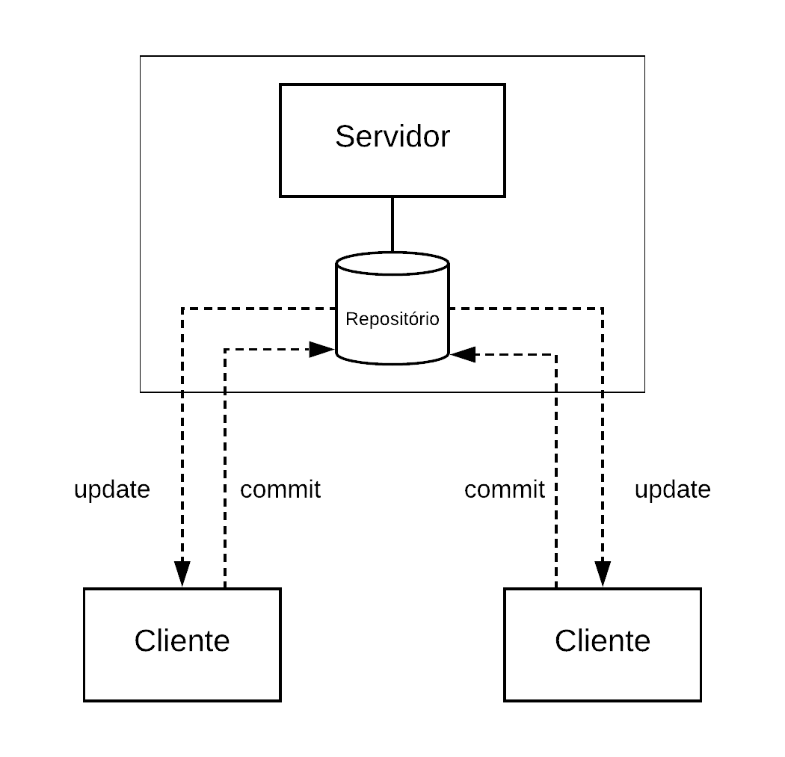
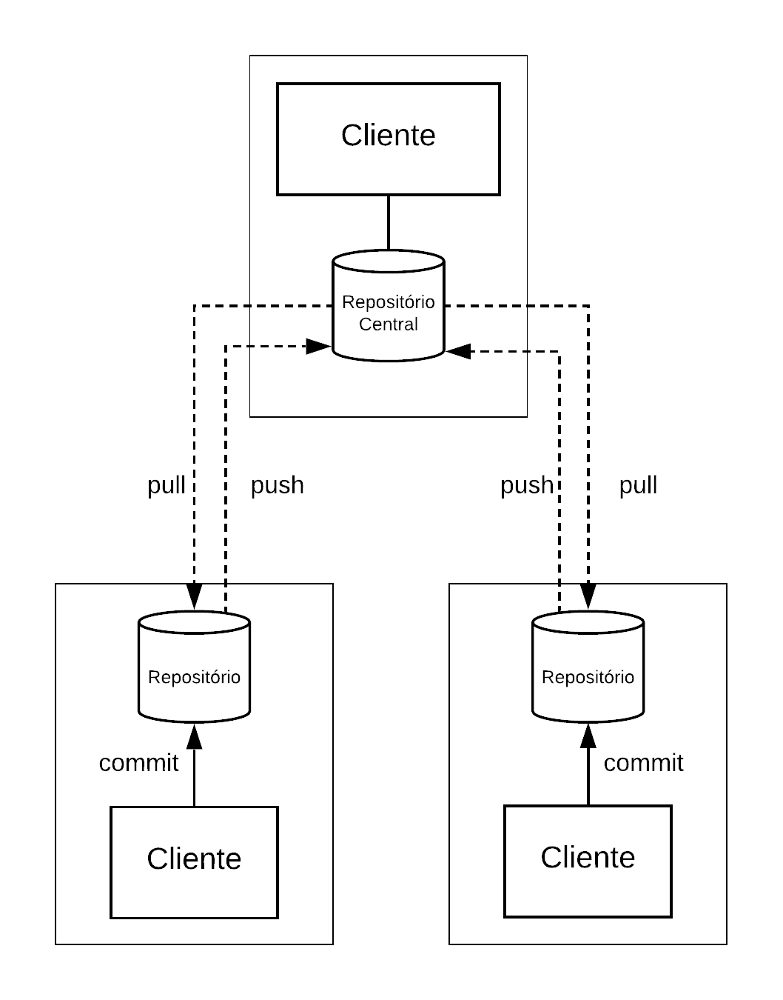

# Cap. 10 - DevOps (em andamento)

> *Imagine a world where product owners, development, QA, IT Operations, and Infosec work together, not only to help each other, but also to ensure that the overall organization succeeds. -- G. Kim, J. Humble, P. Debois, J. Willes*

## 10.1 Introdução

Até agora, neste livro, estudamos um conjunto de práticas para desenvolvimento de software com qualidade e agilidade. Por meio de métodos ágeis — como Scrum, XP ou Kanban —, vimos que o cliente deve participar desde o primeiro dia da construção de um sistema. Também estudamos práticas importantes para produção de software com qualidade, como testes de unidade e refactoring. Estudamos ainda princípios e padrões de projeto e também padrões arquiteturais.

Logo, após aplicar o que vimos, o sistema — ou um incremento dele, resultante de um sprint — está pronto para entrar em produção. Essa tarefa é conhecida pelos nomes de **implantação (deploy)** ou **entrega (release)** do sistema. Independentemente do nome, ela não é tão simples e rápida como pode parecer.

Historicamente, em organizações tradicionais, a área de Tecnologia da Informação costumava ser dividida em dois departamentos: 

* Departamento de Sistemas (ou Desenvolvimento), formado por desenvolvedores, programadores, analistas, arquitetos, etc.

* Departamento de  Suporte (ou Operações), no qual ficavam alocados os administradores de rede, administradores de bancos de dados, técnicos de suporte, etc.

Hoje em dia, é fácil imaginar os problemas causados por essa divisão. Na maioria das vezes, a área de suporte tomava conhecimento de um sistema na véspera da sua implantação. Consequentemente, a implantação poderia atrasar por meses, devido a uma variedade de problemas que não foram identificados. Dentre eles, podemos citar a falta de hardware para executar o novo sistema ou a nova funcionalidade, problemas de desempenho, incompatibilidades com o banco de dados de produção, vulnerabilidades de segurança, etc. No limite, esses problemas poderiam resultar no cancelamento da implantação e no abandono do sistema.

Resumindo, nesse modelo tradicional, existia um stakeholder importante — os administradores de sistemas ou *sysadmins* — que tomava conhecimento das características e requisitos não-funcionais de um novo software na véspera da implantação. Esse problema era agravado pelo fato de os sistemas serem grandes monolitos, cuja implantação gerava todo tipo de preocupação, como mencionado no final do parágrafo anterior.

Então, para facilitar a implantação e entrega de sistemas, foi proposto o conceito de **DevOps**. Por ser um termo recente, ele ainda não possui uma definição consolidada. Mas seus proponentes gostam de descrever DevOps como um movimento que visa unificar as culturas de desenvolvimento (Dev) e de operação (Ops), visando permitir a implantação mais rápida e ágil de um sistema. Esse objetivo está refletido na frase que abre esse capítulo, de autoria de Gene Kim, Jez Humble, Patrick Debois e John Willes, todos eles membros de um grupo de desenvolvedores que ajudou a difundir os princípios de DevOps. Segundo eles, DevOps implica na seguinte disrupção na cultura tradicional de implantação de sistemas ([link](https://dl.acm.org/doi/book/10.5555/3044729)):

> Em vez de iniciar as implantações à meia-noite de sexta-feira e passar todo o fim de semana trabalhando para concluí-las, as implantações ocorrem em qualquer dia útil, quando todos estão na empresa e sem que os clientes percebam — exceto quando encontram novas funcionalidades e correções de bugs. 

No entanto, DevOps não advoga a criação de um profissional novo, que fique responsável tanto pelo desenvolvimento como pela implantação de sistemas. Em vez disso, defende-se uma aproximação entre o  pessoal de desenvolvimento e o pessoal de operações e vice-versa, visando fazer com que a implantação de sistemas seja mais ágil e menos traumática. Tentando explicar com outras palavras, a ideia é evitar dois silos independentes: desenvolvedores e operadores. Em vez disso, defende-se que esses dois profissionais conversem desde os primeiros sprints de um projeto. Para o cliente final, o benefício deve ser a entrada em produção mais cedo do sistema que ele contratou.

Quando migra-se para uma cultura de DevOps, os times ágeis podem incluir um profissional de operações, que participe dos trabalhos do time em tempo parcial ou mesmo em tempo integral. Sempre em função da demanda, esse profissional pode também participar de mais de um time. A ideia é que ele antecipe problemas de desempenho, segurança, incompatibilidades com outros sistemas, etc. Ele pode também, enquanto o código está sendo implementado, começar a trabalhar nos scripts de instalação, administração e monitoramento do sistema em produção.

De forma não menos importante, DevOps advoga ainda a automatização de todos os passos necessários para colocar um sistema em produção e monitorar o seu correto funcionamento. Isso implica na adoção de práticas que já vimos neste livro, notadamente testes automatizados. Mas também implica no emprego de novas práticas e ferramentas, tais como Integração Contínua (*Continuous Integration*) e Entrega Contínua (*Continuous Deployment*), que iremos estudar neste capítulo.

Para finalizar, vamos discutir um conjunto de princípios para entrega de software, enunciados por Jez Humble e David Harley ([link](https://dl.acm.org/doi/book/10.5555/1869904)). Apesar de propostos antes da ideia de DevOps ganhar tração, eles são completamente alinhados com essa ideia. Alguns desses princípios são os seguintes:

* **Crie um processo repetível e confiável para entrega de software**. Esse princípio 
é o mais importante deles. A ideia é que a entrega de software não
pode ser um evento traumático, com passos manuais e sujeitos a surpresas. Em vez disso,
colocar um software em produção deve ser tão simples como apertar um botão.

* **Automatize tudo que for possível**. Na verdade, esse princípio é um pré-requisito indispensável para atender ao princípio anterior. Advoga-se que todos os passos para entrega de um software devem ser automáticos, incluindo seu *build*, a execução dos testes, a configuração e ativação dos servidores e da rede, a carga do banco de dados, etc. De novo, idealmente, queremos apertar um botão e, em seguida, ver o sistema em produção.

* **Mantenha tudo em um sistema de controle de versões**. "Tudo" no enunciado do princípio refere-se não apenas a todo o código fonte, mas também arquivos e scripts de adminstração
do sistema, documentação, páginas Web, arquivos de dados, etc. Consequentemente, deve ser simples restaurar e voltar o sistema para um estado anterior. Neste capítulo, iniciaremos
estudando alguns conceitos básicos de **controle de versões**, na Seção 10.2. Além disso, no Apêndice A apresentamos e ilustramos o uso dos principais comandos do sistema Git, que é o sistema de controle de versões mais usado atualmente.

* **Se um passo causa dor, execute-o com mais frequência e o quanto antes**. Esse princípio
não tem uma inspiração masoquista. Em vez disso, a ideia é antecipar os problemas, antes
que eles se acumulem e as soluções fiquem complicadas. O exemplo clássico é
o de **integração contínua**. Se um desenvolvedor passa muito tempo trabalhando de forma isolada, ele e o seu time podem depois ter uma grande dor de cabeça para integrar o código. Logo, como integração pode causar dor, a recomendação consiste em integrar código novo com mais frequência e o quanto antes, se possível, diariamente. Iremos estudar mais sobre integração contínua na Seção 10.3.

* **"Concluído" significa pronto para entrega**. Com frequência, desenvolvedores dizem que uma
nova história está pronta (*done*). Porém, ao serem questionados se ela pode entrar em produção, começam a surgir "pequenas" pendências, tais como: a implementação ainda não foi testada com dados reais, ela ainda não foi documentada, ela ainda não foi integrada com o sistema X, etc. Esse princípio defende então que "concluído", em projetos de sofwtare, deve ter uma semântica clara, isto é: 100% pronto para entrar em produção.

* **Todos são responsáveis pela entrega do software**. Esse último princípio alinha-se
perfeitamente com a cultura de DevOps que discutimos no início desta Introdução. Ou seja, não admite-se mais que os  times de desenvolvimento e operação trabalham em silos independentes e troquem informações apenas na véspera de uma implantação. 

## 10.2 Controle de Versões

Como mencionamos algumas vezes neste livro, software é desenvolvido em equipe. Por isso, precisamos de um servidor para armazenar o código fonte do sistema que está sendo implementado por um grupo de desenvolvedores. A existência desse servidor é fundamental para que esses desenvolvedores possam colaborar e para que os operadores saibam precisamente qual versão do sistema deve ser colocada em produção. Além disso, sempre é útil manter o histórico das versões mais importantes de cada arquivo. Isso permite, se necessário, realizar uma espécie de \"undo\" no tempo, isto é, recuperar o código de um arquivo como ele estava há anos atrás, por exemplo.

Um **sistema de controle de versões** (VCS, na sigla em inglês) oferece os dois serviços mencionados no parágrafo anterior. Primeiro, ele oferece um **repositório** para armazenar a versão mais recente do código fonte de um sistema, bem como de arquivos relacionados, como arquivos de documentação, configuração, páginas Web, manuais, etc. segundo lugar, ele permite que se recupere versões mais antigas de qualquer arquivo, caso isso seja necessário. Como enunciamos na Introdução, modernamente é inconcebível desenvolver qualquer sistema, mesmo que simples, sem um VCS.

Os primeiros sistemas de controle de versões surgiram no início da década de 70, como o sistema SCCS, desenvolvido para o sistema operacional Unix. Em seguida, surgiram outros sistemas, como o CVS, em meados da década de 80, e depois o sistema Subversion, também conhecido pela sigla svn, no início dos anos 2000. Todos são sistemas centralizados e baseados em uma arquitetura cliente/servidor (veja figura a seguir). Nessa arquitetura, existe um único servidor, que armazena o repositório e o sistema de controle de versões. Os clientes acessam esse servidor para obter a versão mais recente de um arquivo. Feito isso, eles podem modificar o arquivo, por exemplo, para corrigir um bug ou implementar uma nova funcionalidade. Por fim, eles atualizam o arquivo no servidor, realizando uma operação chamada **commit**, a qual torna o arquivo visível para os outros desenvolvedores.

{width=40%}

No início dos anos 2000, começaram a surgir **sistemas de controle de versões distribuídos** (DVCS). Dentre eles, podemos citar o sistema BitKeeper, cujo primeiro release é de 2000, e os sistemas Mercurial e git, ambos lançados em 2005. Em vez de uma arquitetura cliente/servidor, um DVCS adota uma arquitetura peer-to-peer. Na prática, isso significa que cada desenvolvedor possui em sua máquina um servidor completo de controle de versões, que pode se comunicar com os servidores de outras máquinas, como ilustrado na próxima figura.

{width=40%}

Apesar de todos os clientes serem funcionalmente equivalentes, na prática, quando se usa um DVCS, existe uma máquina principal, que armazena a versão de referência do código fonte. Na nossa figura, chamamos esse repositório de **repositório central**. Cada desenvolvedor pode trabalhar de forma independente e até mesmo offline em sua máquina cliente, realizando commits no seu repositório. De tempos em tempos, ele deve sincronizar esse repositório com o central, por meio de duas operações: **pull** e **push**. Um pull atualiza o repositório local com novos commits disponíveis no repositório central. Por sua vez, um push faz a operação contrária, isto é, envia para o repositório central os commits mais recentes realizados pelo desenvolvedor em seu repositório local.
Quando comparado com um VCS centralizado, um DVCS tem as seguintes
vantagens:

*   Pode-se trabalhar e gerenciar versões de forma offline, sem estar
    conectado a uma rede, pois os commits são realizados primeiro no
    repositório local.

*   Pode-se realizar commits com mais frequência, incluindo commits com
    implementações parciais, pois eles não vão chegar imediatamente
    até o repositório central.

*   Commits são executados em menos tempo, isto é, são operações mais
    rápidas e leves. O motivo é que eles são realizados no repositório
    local de cada máquina.

*   A sincronização não precisa ser sempre com o repositório central. Em
    vez disso, dois nodos podem também sincronizar os seus
    repositórios. Por exemplo, pode-se ter uma estrutura hierárquica
    dos repositórios. Nesses casos, os commits \"nascem\" nos
    repositórios que representam as folhas da hierarquia e vão subindo
    até chegar ao repositório central.

**Git** é um sistema de controle de versões distribuído cujo desenvolvimento foi liderado por Linus Torvalds, também responsável pela criação do sistema operacional Linux. Nos anos iniciais, o desenvolvimento do kernel do Linux usava um sistema de controle de versões comercial, chamado BitKeeper, que também possui uma arquitetura distribuída. No entanto, em 2005, a empresa proprietária do BitKeeper resolveu revogar as licenças gratuitas que eram usadas no desenvolvimento do Linux. Os desenvolvedores do sistema operacional, liderados por Torvalds, decidiram então iniciar a implementação de um DVCS próprio, ao qual deram o nome de Git. Assim como o Linux, o Git é um sistema de código aberto, que pode ser gratuitamente instalado em qualquer máquina. O Git é ainda um sistema de linha de comando. Porém, existem também algumas interfaces gráficas, produzidas por outras empresas, que permitem usar o sistema sem ter que digitar comandos.

**GitHub** é um serviço de hospedagem de código que usa o sistema git para prover controle de versões. O GitHub oferece repositórios públicos e gratuitos, para projetos de código aberto, e repositórios fechados e pagos, para uso por empresas. Assim, em vez de manter internamente um DVCS, uma empresa desenvolvedora de software pode alugar esse serviço do GitHub. Uma comparação pode ser feita com serviços de mail. Em vez de instalar um servidor de mail em uma máquina própria, uma empresa pode contratar esse serviço de terceiros, como do Google, via GMail. Apesar de o GitHub ser o mais popular, existem serviços semelhantes providos por outras empresas, como GitLab e BitBucket.

No Apêndice A, apresentamos e ilustramos os principais comandos do sistema Git. São explicados também os conceitos de forks e pull requests, os quais são específicos do GitHub.

## 10.3 Integração Contínua

### Servidores de Integração Contínua

## 10.4 Desenvolvimento no Trunk

### Feature Flags

## 10.5 Entrega Contínua

## 10.6 Infraestrutura como Código

## 10.7 Engenharia de Releases
