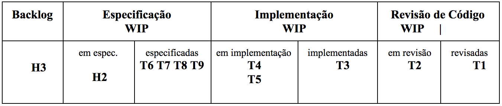
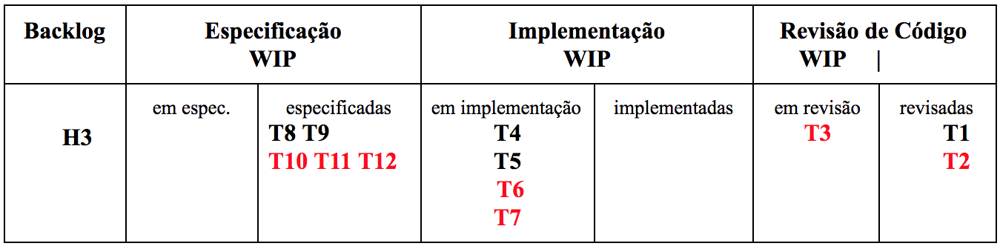
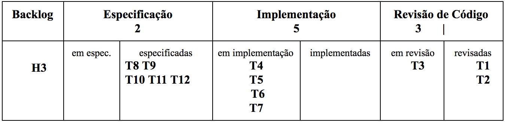
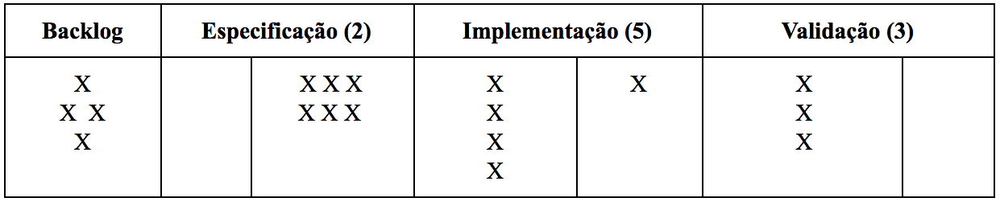

# Processos

> *In software development, perfect is a verb, not an adjective. There
is no perfect process. There is no perfect design. There are no perfect
stories. You can, however, perfect your process, your design, and your
stories.* -- Kent Beck

\index{Processos de Software}
Este capítulo inicia com uma apresentação sobre a importância de
processos de software (Seção 2.1). Em seguida, discutimos questões
gerais e preliminares sobre processos ágeis de desenvolvimento de
software (Seção 2.2), incluindo uma apresentação sobre o contexto
histórico que motivou o surgimento desse tipo de processo. As próximas
seções tratam de três métodos ágeis: Extreme Programming (Seção 2.3),
Scrum (Seção 2.4) e Kanban (Seção 2.5). Depois, temos uma seção dedicada
a discutir quando métodos ágeis não são recomendados (Seção 2.6). Por
fim, na Seção 2.7, discutimos alguns processos tradicionais,
principalmente o Processo Unificado.


## Importância de Processos

A produção de um carro em uma fábrica de automóveis segue um processo
bem definido. Sem estender muito a explicação, primeiro, as chapas de
aço são cortadas e prensadas, para ganhar a forma de portas, tetos e
capôs. Depois, o carro é pintado e instalam-se painel, bancos, cintos de
segurança e toda a fiação. Por fim, instala-se a parte mecânica,
incluindo motor, suspensão e freios.

Assim como carros, software também é produzido de acordo com um
**processo**, embora certamente menos mecânico e mais dependente de
esforço intelectual. Um processo de desenvolvimento de software define
um conjunto de passos, tarefas, eventos e práticas que devem ser
seguidos por desenvolvedores de software, na produção de um sistema.

\index{Torvalds, Linus}
\index{Knuth, Donald}
\index{TeX}
\index{Linux}
Alguns críticos de processos de software costumam fazer a seguinte
pergunta: por que eu preciso seguir um processo? E complementam,
perguntando também o seguinte: Qual processo Linus Torvalds usou na
implementação do sistema operacional Linux? Ou que Donald Knuth usou na
implementação do formatador de textos TeX?

Na verdade, a segunda parte da pergunta não faz muito sentido, pois
tanto o Linux (no seu início) e o TeX são projetos individuais,
liderados por um único desenvolvedor. Nesses casos, a adoção de um
processo é menos importante. Ou, dizendo de outra forma, o processo em
tais projetos é pessoal, composto pelos princípios, práticas e decisões
tomadas pelo seu único desenvolvedor; e que terão impacto apenas sobre
ele mesmo.

Porém, os sistemas de software atuais são por demais complexos para
serem desenvolvidos por uma única pessoa. Por isso, casos de sistemas
desenvolvidos por heróis serão cada vez mais raros. Na prática, os
sistemas modernos — e que nos interessam neste livro — são
desenvolvidos em **equipes**.

E essas equipes, para produzir software com qualidade e produtividade,
precisam de um ordenamento, mesmo que mínimo. Por isso, empresas dão
tanto valor a processos de software. Eles são o instrumento de que as
empresas dispõem para coordenar, motivar, organizar e avaliar o trabalho
de seus desenvolvedores, de forma a garantir que eles trabalhem com
produtividade e produzam sistemas alinhados com os objetivos da
organização. Sem um processo — mesmo que simplificado e leve, como
os processos ágeis que estudaremos neste capítulo — existe o risco
de que os times de desenvolvimento passem a trabalhar de forma
descoordenada, gerando produtos sem valor para o negócio da empresa. Por
fim, processos são importantes não apenas para a empresa, mas também
para os desenvolvedores, pois permitem que eles tomem consciência das
tarefas e resultados que se esperam deles. Sem um processo, os
desenvolvedores podem se sentir perdidos, trabalhando de forma errática
e sem alinhamento com os demais membros do time de desenvolvimento.

Neste capítulo, vamos estudar alguns processos de Software. Na verdade,
no Capítulo 1 já comentamos sobre Processos Waterfall e Ágeis. Na
próxima seção, vamos retomar essa discussão e, em seguida, descrever
alguns métodos de desenvolvimento de software.

## Manifesto Ágil

\index{Manifesto Ágil}
Os primeiros processos de desenvolvimento de software — do tipo Waterfall, propostos ainda na década de 70 — eram estritamente sequenciais, começando com uma fase de especificação de requisitos até chegar às fases finais de implementação, testes e manutenção do sistema.

Se considerarmos o contexto histórico, essa primeira visão de processo era natural, visto que projetos de Engenharia tradicional também são sequenciais e precedidos de um planejamento detalhado. Todas as fases também geram documentações detalhadas do produto que está sendo desenvolvido. Por isso, nada mais natural que a nascente Engenharia de Software se espelhasse nos processos de áreas mais tradicionais, como a Engenharia Eletrônica, Civil, Mecânica, Aeronáutica, etc.

No entanto, após cerca de uma década, começou-se a perceber que software
é diferente de outros produtos de Engenharia. Essa percepção foi ficando
clara devido aos problemas frequentes enfrentados por projetos de
software nas décadas de 70 a 90. Por exemplo, os cronogramas e
orçamentos desses projetos não eram obedecidos. Não raro, projetos
inteiros eram cancelados, após um ou mais anos de trabalho, sem entregar
um sistema funcional para os clientes.

\index{CHAOS Report}
Em 1994, um relatório produzido pela empresa de consultoria Standish
Group revelou informações mais detalhadas sobre os projetos de software
da época. Por exemplo, o relatório, que ficou conhecido pelo sugestivo
nome de CHAOS Report
([link](https://www.standishgroup.com/sample_research_files/chaos_report_1994.pdf)),
mostrou que mais de 55% dos projetos estourava os prazos planejados
entre 51% e 200%; pelo menos 12% estouraram os prazos acima de 200%,
conforme mostra o próximo gráfico:

{width=95%}

Os resultados em termos de custos não eram mais animadores: quase 40%
dos projetos ultrapassava o orçamento entre 51% e 200%, como mostra
o gráfico:

{width=95%}

Em 2001, um grupo de profissionais da indústria se reuniu na cidade de
Snowbird, no estado norte-americano de Utah, para discutir e propor uma
alternativa aos processos do tipo Waterfall que então predominavam.
Essencialmente, eles passaram a defender que software é diferente de
produtos tradicionais de Engenharia. Por isso, software também demanda
um processo de desenvolvimento diferente.

Por exemplo, os requisitos de um software mudam com frequência, mais do
que os requisitos de um computador (hardware), de um avião ou de uma
ponte. Além disso, os clientes frequentemente não têm uma ideia precisa
do que querem. Ou seja, corre-se o risco de projetar por anos um produto
que depois de pronto não será mais necessário, ou porque o mundo mudou
ou porque os planos e as necessidades dos clientes mudaram. Eles
diagnosticaram ainda problemas referentes aos documentos prescritos por
processos do tipo Waterfall, incluindo documentos de requisitos,
fluxogramas, diagramas, etc. Esses documentos eram detalhados, pesados e
extensos; assim, rapidamente se tornavam obsoletos, pois quando os
requisitos mudavam os desenvolvedores não propagavam as alterações para
a documentação, mas apenas para o código fonte.

Então eles decidiram lançar as bases para um novo conceito de processo
de software, as quais foram registradas em um documento que chamaram de
**Manifesto Ágil**. Por ser curto, iremos reproduzir o texto do
manifesto a seguir:

> Por meio desse trabalho, passamos a valorizar:
>
> **Indivíduos e interações**, mais do que processos e ferramentas
>
> **Software em funcionamento**, mais do que documentação abrangente
> 
> **Colaboração com o cliente**, mais do que negociação de contratos
> 
> **Resposta a mudanças**, mais do que seguir um plano.

\index{Métodos Ágeis}
A característica principal de processos ágeis é a adoção de **ciclos
curtos e iterativos de desenvolvimento**, por meio dos quais um sistema
é implementado de forma gradativa; começando por aquilo que é mais
urgente para o cliente. De início, implementa-se uma primeira versão do
sistema, com as funcionalidades que segundo o cliente são para
"ontem", isto é, possuem prioridade máxima. Em seguida, essa versão é
validada pelo cliente. Se ela for aprovada, um novo ciclo — ou
**iteração** — inicia-se, com mais algumas funcionalidades, também
priorizadas pelos clientes. Normalmente, esses ciclos são curtos, com
duração de um mês, talvez até um pouco menos. Assim, o sistema vai sendo
construído de forma incremental, sendo cada incremento devidamente
aprovado pelos clientes. O desenvolvimento termina quando o cliente
decide que todos os requisitos estão implementados.

\index{Waterfall}
As próximas figuras comparam desenvolvimento em Waterfall e Ágil.

{width=90%}


{width=90%}


No entanto, a figura anterior pode sugerir que, em desenvolvimento
ágil, cada iteração é um mini-waterfall, incluindo todas as fases de um
processo Waterfall. Isso não é verdadeiro; em geral, as iterações em
métodos ágeis não são um pipeline de tarefas, como em Waterfall (mais
sobre isso nas próximas seções). A figura também pode sugerir que ao
final de cada iteração tem-se que colocar um sistema em produção, para
uso pelos usuários finais. Isso também não é verdade. De fato, o
objetivo é entregar um sistema funcional, isto é, que realize tarefas
úteis. Porém, a decisão de colocá-lo em produção envolve outras
variáveis, como riscos para o negócio da empresa, disponibilidade de
servidores, campanhas de marketing, elaboração de manuais, treinamento
de usuários, etc.

Outras características de processos ágeis incluem:

*  **Menor ênfase em documentação**, ou seja, apenas o essencial deve ser documentado.

*  **Menor ênfase em planos detalhados**, pois muitas vezes nem o cliente, nem os Engenheiros de Software têm, no início de um projeto, uma ideia clara dos requisitos que devem ser implementados. Esse entendimento vai surgir ao longo do caminho, à medida que incrementos de produto sejam produzidos e validados. Em outras palavras, o importante em desenvolvimento ágil é conseguir avançar, mesmo em ambientes com informações imperfeitas, parciais e sujeitas a mudanças.

*  **Inexistência de uma fase dedicada a design** (*big design up front*). Em vez disso, o design também é incremental. Ele evolui à medida que o sistema vai nascendo, ao final de cada iteração.

*  **Desenvolvimento em times pequenos**, com cerca de uma dezena de desenvolvedores. Ou, em outras palavras, times que possam ser alimentados com duas pizzas, conforme popularizado pelo CEO da Amazon, Jeff Bezos.

*  Ênfase em novas práticas de desenvolvimento (pelo menos, para o início dos anos 2000), como **programação em pares**, **testes automatizados** e **integração contínua**.

Devido a essas características, processos ágeis são considerados
**processos leves**, com poucas prescrições e documentos.

No entanto, as características acima são genéricas e abrangentes; por isso alguns métodos foram propostos para ajudar desenvolvedores a adotar os princípios ágeis, de forma mais concreta. O interessante é que todos eles foram propostos, pelo menos na primeira versão, antes do encontro de Utah, em 2001, que lançou o Manifesto Ágil. 

Neste capítulo, vamos estudar três métodos ágeis:

*  **Extreme Programming (XP)**, proposto por Kent Beck, 
\index{Beck, Kent}
em um livro lançado em 1999 ([link](https://dl.acm.org/citation.cfm?id=318762)). Uma segunda edição do livro, incluindo uma grande revisão, foi lançada em 2004. Neste capítulo, vamos nos basear nessa edição mais recente.


*  **Scrum**, proposto por Jeffrey Sutherland e Ken Schwaber, 
\index{Sutherland, Jeffrey}
\index{Schwaber, Ken}
em um artigo publicado em 1995 ([link](https://dl.acm.org/citation.cfm?id=260274)).

*  **Kanban**, cujas origens remontam a um sistema de controle de produção que começou a ser usado nas fábricas da Toyota, 
\index{Toyota}
ainda na década de 50 ([link](https://hbr.org/1986/01/the-new-new-product-development-game)). Nos últimos 10 anos, Kanban tem sido gradativamente adaptado para uso no desenvolvimento de software.

```{=latex}
\begin{esmbox}
```
**Aprofundamento**: Neste livro, usamos os termos **processos** e **métodos**. Processo é o conjunto de passos, etapas e tarefas que se usa para construir um software. Toda organização usa um processo para desenvolver seus sistemas, o qual pode ser ágil ou waterfall, por exemplo. Ou, talvez, esse processo pode ser caótico. Porém, o ponto que queremos reforçar é que sempre existe um processo. Já método, no nosso contexto, define e especifica um determinado processo de desenvolvimento (a palavra método tem sua origem no grego, onde significa "caminho para se chegar a um objetivo"). Assim, XP, Scrum e Kanban são métodos ágeis ou, de modo mais extenso, são métodos que definem práticas, atividades, eventos e técnicas compatíveis com princípios ágeis de desenvolvimento de software. Aproveitando que estamos tratando de definições, frequentemente usa-se também o termo **metodologia** quando se fala de processos de software. Por exemplo**,** é comum ver referências a metodologias para desenvolvimento de software, metodologias ágeis, metodologia orientada a objetos, etc. A palavra metodologia, no sentido estrito, denota o "ramo da lógica que se ocupa dos métodos das diferentes ciências", segundo o Dicionário Houaiss. No entanto, a palavra também pode ser usada como sinônimo de método, segundo o mesmo dicionário. Apesar disso, neste livro evitamos usar o termo metodologia e tentamos empregar sempre o termo método.
```{=latex}
\end{esmbox}
```

```{=latex} 
\begin{aviso} 
```

**Aviso**: Todo método de desenvolvimento deve ser entendido como um conjunto de recomendações; cabe a uma organização analisar cada uma e decidir se ela faz sentido no seu contexto. Como resultado, a organização pode ainda decidir por adaptar essas recomendações para atender às suas necessidades. Logo, provavelmente, não existem duas organizações que seguem exatamente o mesmo processo de desenvolvimento, mesmo que elas digam que estão desenvolvendo usando Scrum, por exemplo.

```{=latex} 
\end{aviso} 
```

\index{Stack Overflow survey}
```{=latex} 
\begin{esmbox} 
```
**Mundo Real**: O sucesso e impacto de processos ágeis foi
impressionante. Hoje, a grande maioria das empresas que desenvolvem
software, independente de seu tamanho ou do foco de seu negócio, usam
princípios ágeis, em maior ou menor escala. Para citar alguns dados, em
2018, o Stack Overflow survey incluiu uma pergunta sobre o método de
desenvolvimento mais usado pelos respondentes
([link](https://insights.stackoverflow.com/survey/2018/#career-values)).
Essa pergunta recebeu 57 mil respostas de desenvolvedores profissionais e
a grande maioria deles mencionou métodos ou práticas ágeis,
incluindo aquelas que vamos estudar neste capítulo, como Scrum (63% das respostas),
Kanban (36%) e Extreme Programming (16%). Apenas 15% dos
participantes marcaram Waterfall como resposta.
```{=latex}
\end{esmbox}
```


## Extreme Programming

\index{Extreme Programming}
Segundo seu autor, XP é um método leve recomendado para desenvolver
software com requisitos vagos ou sujeitos a mudanças; isto é,
basicamente sistemas comerciais, na classificação que adotamos no
Capítulo 1. Sendo um método ágil, XP possui todas as características que
mencionamos na seção anterior, isto é: adota ciclos curtos e iterativos
de desenvolvimento, concede menos ênfase a documentação e planos
detalhados, propõe que o design de um sistema também seja definido de
forma incremental e sugere que as equipes de desenvolvimento sejam
pequenas.

Porém, XP não é um método prescritivo, que define um passo a passo
detalhado para construção de software. Em vez disso, XP é definido por
meio de um conjunto de **valores**, **princípios** e **práticas de
desenvolvimento**. Ou seja, XP é inicialmente definido de forma
abstrata, usando-se de valores e princípios que devem fazer parte da
cultura e dos hábitos de times de desenvolvimento de software. Depois,
esses valores e princípios são concretizados em uma lista de práticas de
desenvolvimento. Frequentemente, quando decidem adotar XP,
desenvolvedores e organizações concentram-se nas práticas. Porém, os
valores e princípios são componentes chaves do método, pois são eles que
dão sentido às práticas propostas em XP. Sendo mais claro, se uma
organização não está preparada para trabalhar no modelo mental de XP
— representado pelos seus valores e princípios — recomenda-se
também não adotar suas práticas.

Neste capítulo, vamos primeiro apresentar os valores e princípios de XP.
Veja uma lista deles a seguir:

* **Valores**: comunicação, simplicidade, feedback, coragem, respeito e qualidade de vida. 

* **Princípios**: humanidade, economicidade, benefícios mútuos, melhorias contínuas, falhas acontecem, baby steps e responsabilidade pessoal.

Em seguida, vamos descrever as práticas. Para facilitar a explicação
delas, resolvemos organizá-las em três grupos: práticas sobre o processo
de desenvolvimento, práticas de programação e práticas de gerenciamento
de projetos. Veja a seguir uma lista das práticas em cada grupo:

* **Práticas sobre o Processo de Desenvolvimento**: representante dos clientes, histórias dos usuários, iterações, releases, planejamento de releases, planejamento de iterações, planning poker, slack.

* **Práticas de Programação**: design incremental, programação pareada, desenvolvimento dirigido por testes (TDD), build automatizado, integração contínua.

* **Práticas de Gerenciamento de Projetos**: métricas, ambiente de trabalho, contratos com escopo aberto.

### Valores

\index{Extreme Programming!Valores}
XP defende que o desenvolvimento de projetos de software seja norteado
por três valores principais: comunicação, simplicidade e feedback. Na
verdade, argumenta-se que esses valores são universais, para convívio
humano. Ou seja, eles não servem apenas para guiar projetos de
desenvolvimento, mas a própria vida em sociedade. Uma boa
**comunicação** é importante em qualquer projeto, não apenas para
evitar, mas também para aprender com erros. O segundo valor de XP é
**simplicidade**, pois em todo sistema complexo e desafiador existem
sistemas ou subsistemas mais simples, que às vezes não são considerados.
Por último, existem riscos em todos os projetos de software: os
requisitos mudam, a tecnologia muda, a equipe de desenvolvimento muda, o
mundo muda, etc. Um valor que ajuda a controlar tais riscos é estar
aberto ao **feedback** dos stakeholders, a fim de que correções de rota
sejam implementadas o quanto antes. Em outras palavras, é difícil
desenvolver o sistema de software "certo" em uma primeira e única
tentativa. Frederick Brooks tem uma frase conhecida sobre esse fenômeno:

> "Planeje-se para jogar fora partes de seu sistema, pois você fará isso."

Por isso, feedback é um valor essencial para garantir que as partes ou
versões que serão descartadas sejam identificadas o quanto antes, de
forma a diminuir prejuízos e retrabalho. Além dos três valores
mencionados, XP também defende outros valores, como **coragem**,
**respeito** e **qualidade de vida**.

### Princípios

\index{Extreme Programming!Princípios}
Os valores que mencionamos são abstratos e universais. Por outro lado,
as práticas que vamos mencionar mais adiante são procedimentos concretos
e pragmáticos. Assim, para unir esses dois extremos, XP defende que
projetos de software devem seguir um conjunto de princípios. A imagem
que se apresenta é de um rio: de um lado estão os valores e de outro as
práticas. Os princípios — que descreveremos agora — fazem o
papel de uma ponte ligando esses dois lados. Alguns dos principais
princípios de XP são os seguintes:

**Humanidade** ("humanity", em inglês). Software é uma atividade
intensiva no uso de capital humano. O principal recurso de uma empresa
de software não são seus bens físicos — computadores, prédios,
móveis ou conexões de Internet, por exemplo — mas sim seus
colaboradores. Um termo que reflete bem esse princípio é *peopleware,* o
qual foi cunhado por Tom DeMarco, em um livro com o mesmo título
([link](https://dl.acm.org/citation.cfm?id=2505459)). A
ideia é que a gestão de pessoas — incluindo fatores como
expectativas, crescimento, motivação, transparência, responsabilidade,
etc — é um princípio chave para o sucesso de projetos de software.

**Economicidade** (*economics*, em inglês). Se por um lado, *peopleware*
é fundamental, por outro lado software é uma atividade cara, que demanda
a alocação de recursos financeiros consideráveis. Logo, tem-se que ter
consciência de que o outro lado, isto é, quem está pagando as contas do
projeto, espera resultados econômicos e financeiros. Por isso, na grande
maioria dos casos, software não pode ser desenvolvido apenas para
satisfazer a vaidade intelectual de seus desenvolvedores. Software não é
uma obra de arte, mas algo que tem que gerar resultados econômicos, como
defendido por esse princípio de XP.

**Benefícios Mútuos**. XP defende que as decisões tomadas em um projeto
de software têm que beneficiar múltiplos stakeholders. Por exemplo, o
contratante do software deve garantir um bom ambiente de trabalho
(peopleware); em contrapartida, a equipe deve entregar um sistema que
agregue valor ao seu negócio (economicidade). Mais um exemplo: ao
escrever testes um desenvolvedor se beneficia, pois eles ajudam a
detectar bugs no seu código; mas testes também ajudam outros
desenvolvedores, que futuramente terão mais segurança de que o seu
código não vai introduzir regressões — isto é, bugs — em código
que está funcionando. Um terceiro e último exemplo: refactoring é uma
atividade que torna o código mais limpo e fácil de entender, tanto para
quem o escreveu, como para quem futuramente terá que mantê-lo. A frase
"todo negócio tem que ser bom para os dois lados" resume bem esse
terceiro princípio de XP.

**Melhorias Contínuas** (no livro de XP, o nome original é
*improvements*): Como expressa a frase de Kent Beck que abre este
capítulo, nenhum processo de desenvolvimento de software é perfeito. Por
isso, é mais seguro trabalhar com um sistema que vai sendo continuamente
aprimorado, a cada iteração, com o feedback dos clientes e de todos os
membros do time. Pelo mesmo motivo, XP não recomenda investir um grande
montante de tempo em um design inicial e completo. Em vez disso, o
design do sistema também é incremental, melhorando a cada iteração. Por
fim, as próprias práticas de desenvolvimento podem ser aprimoradas; para
isso, o time deve reservar tempo para refletir sobre elas.

**Falhas Acontecem**. Desenvolvimento de software não é uma atividade
livre de riscos. Como discutido no Capítulo 1, software é uma das mais
complexas construções humanas. Logo, falhas são esperadas em projetos de
desenvolvimento de software. No contexto desse princípio, falhas incluem
bugs, funcionalidades que não se mostraram interessantes para os
usuários finais e requisitos não-funcionais que não estão sendo
plenamente atendidos, como desempenho, usabilidade, privacidade,
disponibilidade, etc. Evidentemente, XP não advoga que essas falhas
devem ser acobertadas. Porém, elas não devem ser usadas para punir
membros de um time. Pelo contrário, falhas fazem parte do jogo, se um
time pretende avançar, inovar e entregar software com rapidez.

\index{Baby Steps}
**Baby Steps**. É melhor um progresso seguro, testado e validado, mesmo
que pequeno, do que grandes implementações com riscos de serem
descartadas pelos usuários. O mesmo vale para testes (que são úteis
mesmo quando as unidades testadas são de menor granularidade),
integração de código (é melhor integrar diariamente, do que passar pelo
stress de fazer uma grande integração após semanas de trabalho) e
refatorações (que devem ocorrer em pequenos passos, quando é mais fácil
verificar que o comportamento do sistema está sendo preservado). Em
resumo, o importante é garantir melhorias contínuas, não importando que
sejam pequenas, desde que na direção correta. Essas pequenas melhorias
são melhores do que grandes revoluções, as quais costumam não apresentar
resultados positivos, pelo menos quando se trata de desenvolvimento de
software.

**Responsabilidade Pessoal** (que usamos como tradução para *accepted
responsibility*). De acordo com esse princípio, desenvolvedores devem
ter uma ideia clara de seu papel e responsabilidade na equipe. O motivo
é que responsabilidade não pode ser transferida, sem que a outra parte a
aceite. Por isso, XP defende que o engenheiro de software que implementa
uma *história* — termo que o método usa para requisitos — deve
ser também aquele que vai testá-la e mantê-la. 


\index{Chrysler}
```{=latex}
\begin{esmbox}
```
**Mundo Real**: Um dos primeiros sistemas a adotar XP foi um
sistema de folha de pagamentos da fabricante de automóveis Chrysler,
chamado Chrysler Comprehensive Compensation (C3)
([link](https://doi.org/10.1109/2.796139)). O projeto
desse sistema começou no início de 1995 e, como não apresentou
resultados concretos, ele foi reiniciado no ano seguinte, sob a
liderança de Kent Beck. Outro membro conhecido da comunidade ágil,
Martin Fowler, participou do projeto, como consultor. No desenvolvimento
do sistema C3, foram usadas e testadas diversas ideias do método que
poucos anos depois receberia o nome de XP.
```{=latex}
\end{esmbox}
```

### Práticas sobre o Processo de Desenvolvimento

\index{Extreme Programming!Práticas}
\index{Extreme Programming!Representante dos Clientes}
\index{Histórias de Usuários}
XP — como outros métodos ágeis — recomenda o envolvimento dos
clientes com o projeto. Ou seja, além de desenvolvedores, os times
incluem pelo menos um **representante dos clientes**, que deve entender
do domínio do sistema que será construído. Uma das funções desse
representante é escrever as **histórias de usuário** (*user stories*),
que é o nome que XP dá para os documentos que descrevem os requisitos do
sistema a ser implementado. No entanto, histórias são documentos
resumidos, com apenas duas ou três sentenças, com as quais o
representante dos clientes define o que ele deseja que o sistema faça,
usando sua própria linguagem.

Iremos aprofundar o estudo sobre histórias de usuários no Capítulo 3. Mas, por enquanto, gostaríamos de adiantar que as histórias são escritas em cartões de papel, normalmente a mão. Ou seja, em vez de documentos de requisitos detalhados, histórias são documentos simples, que focam nas funcionalidades do sistema, sempre na visão de seus usuários. 

Como exemplo, mostramos a seguir uma história de um sistema de perguntas e respostas — semelhante ao famoso Stack Overflow ([link](https://stackoverflow.com)) — que usaremos neste capítulo para explicar XP. Observe que a história tem um título (Postar Pergunta) e uma breve descrição, que não ocupa mais do que duas ou três sentenças. Costuma-se dizer que histórias são um lembrete para que depois esse requisito seja verbalmente detalhado pelo representante dos clientes.

--------------------------------------------------------------  
**Postar Pergunta**

*Um usuário, quando logado no sistema, deve ser capaz de postar perguntas. Como é um site sobre programação, as perguntas podem incluir blocos de código, os quais devem ser apresentados com um layout diferenciado.*
--------------------------------------------------------------  

Depois de escritas pelo representante dos clientes, as histórias
são estimadas pelos desenvolvedores. Ou seja, são os desenvolvedores que
definem, mesmo que preliminarmente, quanto tempo será necessário para
implementar as histórias escritas pelo representante dos clientes.
Frequentemente, a duração de uma história é estimada em **story
points**,
\index{Story Points}
\index{Histórias de Usuários!Story Points}
em vez de horas ou homens/hora. Nesses casos, usa-se uma
escala inteira para classificar histórias como possuindo um certo número
de story points. O objetivo é definir uma ordem relativa entre as
histórias. As histórias mais simples são estimadas como tendo tamanho
igual a 1 story point; histórias que são cerca de duas vezes mais
complexas do que as primeiras são estimadas como tendo 2 story points e
assim por diante. Muitas vezes, usa-se também uma sequência de Fibonacci
para definir a escala de possíveis story points, como em 1, 2, 3, 5, 8,
13 story points. Nesse caso, o objetivo é criar uma escala que torne as
tarefas progressivamente mais difíceis e, ao mesmo tempo, permita ao
time realizar comparações similares à seguinte: será que o esforço para
implementar essa tarefa que planejamos estimar com 8 story points é
equivalente ao esforço de implementar uma tarefa na escala anterior (5
story points) e mais uma tarefa na próxima escala inferior (3 pontos)?
Se isso for verdade, 8 story points é uma boa estimativa. Caso
contrário, o melhor é estimar a história com 5 story points.

\index{Planning Poker}
\index{Histórias de Usuários!Planning Poker}
```{=latex}
\begin{esmbox}
```
**Aprofundamento**: Uma técnica usada para estimar o tamanho de
histórias é conhecida como **Planning Poker**. Ela funciona assim: o
representante dos clientes seleciona uma história e a lê para os
desenvolvedores. Após a leitura, os desenvolvedores interagem com o
representante dos clientes para tirar possíveis dúvidas e conhecer
melhor a história. Feito isso, cada desenvolvedor faz sua estimativa
para o tamanho da história, de forma independente. Depois disso, eles ao
mesmo tempo levantam cartões com a estimativa que pensaram, em story
points. Esses cartões foram distribuídos antes e neles constam os
números 1, 2, 3, 5, etc. Se houver consenso, o tamanho da história está
estimado e passa-se para a próxima história. Senão, o time deve iniciar
uma discussão, para esclarecer a razão das diferentes estimativas. Por
exemplo, os desenvolvedores responsáveis pelas estimativas mais
discrepantes podem explicar o motivo da sua proposta. Feito isso,
realiza-se uma nova votação e o processo se repete, até que o consenso
seja alcançado.
```{=latex}
\end{esmbox}
```

\index{Extreme Programming!Releases}
A implementação das histórias ocorre em **iterações**, as quais têm uma
duração fixa e bem definida, variando de uma a três semanas, por
exemplo. As iterações, por sua vez, formam ciclos mais longos, chamados
de **releases**, de dois a três meses, por exemplo. A **velocidade** de
um time é o número de story points que ele consegue implementar em uma
iteração. Sugere-se que o representante dos clientes escreva histórias
que requeiram pelo menos uma release para serem implementadas. Ou seja,
em XP, o horizonte de planejamento é uma release, isto é, alguns meses.

**Aviso**: Em XP, a palavra release tem um sentido diferente daquele
que se usa em gerência de configuração. Em gerência de configuração, uma
release é uma versão de um sistema que será disponibilizada para seus
usuários finais. Como já mencionamos em um aviso anterior, não
necessariamente a versão do sistema ao final de uma release de XP
precisa entrar em produção.

Em resumo, para começar a usar XP precisamos de:

*  Definir a duração de uma iteração.

*  Definir o número de iterações de uma release.

*  Um conjunto de histórias, escritas pelo representante dos clientes.

*  Estimativas para cada história, feitas pelos desenvolvedores.

*  Definir a velocidade do time, isto é, o número de story points que
   ele consegue implementar por iteração.

Uma vez definidos os parâmetros e documentos acima, o representante do
cliente deve priorizar as histórias. Para isso, ele deve definir quais
histórias serão implementadas nas iterações da primeira release. Nesta
priorização, deve-se respeitar a velocidade do time de desenvolvimento.
Por exemplo, suponha que a velocidade de um time seja de 25 story points
por iteração. Nesse caso, o representante do cliente não pode alocar
histórias para uma iteração cujo somatório de story points ultrapasse
esse limite. A tarefa de alocar histórias a iterações e releases é
chamada de **planejamento de releases** (ou então *planning game*, que
foi o nome adotado na primeira edição do livro de XP).

Por exemplo, suponha o fórum de perguntas e respostas que mencionamos
antes. A próxima tabela resume o resultado de um possível planejamento
de releases. Nessa tabela, estamos assumindo que o representante dos
clientes escreveu 8 histórias, que cada release possui duas iterações e
que a velocidade do time é de 21 story points por iteração (veja que o
somatório dos story points de cada iteração é exatamente igual a 21).

  **História**                               **Story Points**   **Iteração**   **Release**
  ----------------------------------------- ------------------ -------------- -------------
  Cadastrar usuário                         8                  1              1
  Postar perguntas                          5                  1              1
  Postar respostas                          3                  1              1
  Tela de abertura                          5                  1              1
  Gamificar perguntas e respostas           5                  2              1
  Pesquisar perguntas e respostas           8                  2              1
  Adicionar tags em perguntas e respostas   5                  2              1
  Comentar perguntas e respostas            3                  2              1

A tabela anterior serve para reforçar dois pontos já mencionados: (1) as
histórias em XP representam funcionalidades do sistema que se pretende
construir; isto é, a implementação do sistema é dirigida por suas
funcionalidades; (2) os desenvolvedores não opinam sobre a ordem de
implementação das histórias; isso é decidido pelo representante dos
clientes, que deve ser alguém capacitado e com autoridade para definir o
que é mais urgente e importante para a empresa que está contratando o
desenvolvimento do sistema.

Uma vez realizado o planejamento de uma release, começam as iterações.
Antes de mais nada, o time de desenvolvimento deve se reunir para
realizar o **planejamento da iteração.** O objetivo desse planejamento é
decompor as histórias de uma iteração em tarefas, as quais devem
corresponder a atividades de programação que possam ser alocadas para um
dos desenvolvedores do time. Por exemplo, a seguinte lista mostra as
tarefas para a história "Postar Perguntas", que é a primeira história
que será implementada em nosso sistema de exemplo.

*   Projetar e testar a interface Web, incluindo layout, CSS templates,
    etc.

*   Instalar banco de dados, projetar e criar tabelas.

*   Implementar a camada de acesso a dados.

*   Instalar servidor e testar framework web.

*   Implementar camada de controle, com operações para cadastrar,
    remover e atualizar perguntas.

*   Implementar interface Web.

Como regra geral, as tarefas não devem ser complexas, devendo ser
possível concluí-las em alguns dias.

Resumindo, um projeto XP é organizado em:

*   releases, que são conjunto de iterações, com duração total de alguns
    meses.

*   iterações, que são conjuntos de tarefas, com duração total de
    algumas semanas.

*   tarefas, com duração de alguns dias.

Definidas as tarefas, o time deve decidir qual desenvolvedor será
responsável por cada uma. Feito isso, começa de fato a iteração, com a
implementação das tarefas.

Uma iteração termina quando todas a suas histórias estiverem
implementadas e validadas pelo representante dos clientes. Assim, ao fim
de uma iteração, as histórias devem ser mostradas para o representante
dos clientes, que deve concordar que elas, de fato, atendem ao que ele
especificou.

\index{Slacks}
XP defende ainda que os times, durante uma iteração, programem algumas
**folgas** (*slacks*), que são tarefas que podem ser adiadas, caso
necessário. Como exemplos, podemos citar o estudo de uma nova
tecnologia, a realização de um curso online, preparar uma documentação
ou manual ou mesmo desenvolver um projeto paralelo. Algumas empresas,
como o Google, por exemplo, são famosas por permitir que seus
desenvolvedores usem 20% de seu tempo para desenvolver um projeto
pessoal ([link](https://arxiv.org/abs/1702.01715)). No
caso de XP, folgas têm dois objetivos principais: (1) criar um "buffer
de segurança" em uma iteração, que possa ser usado caso alguma tarefa
demande mais tempo do que o previsto; (2) permitir que os
desenvolvedores respirem um pouco, pois o ritmo de trabalho em projetos
de desenvolvimento de software costuma ser intenso e desgastante. Logo,
os desenvolvedores precisam de um tempo para realizarem algumas tarefas
onde não exista uma cobrança imediata de resultados.

#### Perguntas Frequentes {.unnumbered}

Vamos agora responder algumas perguntas
sobre as práticas de XP que acabamos de explicar.

**Qual a duração ideal de uma iteração**? Difícil precisar, pois depende
das características do time, da empresa contratante, da complexidade do
sistema a ser desenvolvido, etc. Iterações curtas — por exemplo, de
uma semana — propiciam feedback mais rápido. Porém, requerem um
maior comprometimento dos clientes, pois toda semana um novo incremento
de produto deve ser validado. Além disso, requerem que as histórias
sejam mais simples. Por outro lado, iterações mais longas — por
exemplo, de um mês — permitem que o time planeje e conclua as
tarefas com mais tranquilidade. Porém, demora-se um pouco mais para
receber feedback dos clientes. Esse feedback pode ser importante quando
os requisitos são pouco claros. Por isso, uma escolha de compromisso
seria algo como 2 ou 3 semanas. Outra alternativa recomendada consiste
em experimentar, isto é, testar e avaliar diferentes durações, antes de
decidir.

**O que o representante dos clientes faz durante as iterações?** No
início de uma release, cabe ao representante dos clientes escrever as
histórias das iterações que farão parte dessa release. Depois, no final
de cada iteração, cabe a ele validar e aprovar a implementação das
histórias. Porém, durante as iterações, ele deve estar fisicamente
disponível para tirar dúvidas do time. Veja que uma história é um
documento muito resumido, logo é natural que surjam dúvidas durante a
sua implementação. Por isso, o representante dos clientes deve estar
sempre disponível para se reunir com os desenvolvedores, para tirar
dúvidas e explicar detalhes relativos à implementação de histórias.

**Como escolher o representante dos clientes?** Antes de mais nada, deve
ser alguém que conheça o domínio do sistema e que tenha autoridade para
priorizar histórias. Conforme detalhado a seguir, existem pelo menos
três perfis de representante dos clientes:

*   Suponha o desenvolvimento interno de um sistema, isto é, o departamento de sistemas da empresa X está desenvolvendo um sistema para um outro departamento Y, da mesma empresa. Nesse caso, o representante dos clientes deve ser um funcionário do departamento Y.

*   Suponha que o time de desenvolvimento foi contratado para desenvolver um sistema para a empresa X. Ou seja, trata-se de um desenvolvimento terceirizado. Nesse caso, o representante do cliente deve ser um funcionário da empresa X, com pleno domínio da área do sistema e que vai ser um dos seus principais usuários, quando ele ficar pronto.

*   Suponha que o time de desenvolvimento de uma empresa X foi designado para fazer um sistema para um público externo à empresa. Por exemplo, um sistema como aquele usado neste capítulo, similar ao Stack Overflow. Logo, os clientes do sistema não são funcionários de X, mas sim clientes externos. Nesse caso, o representante dos clientes deve ser alguém da área de marketing, vendas ou negócios da empresa X. Em última instância, pode ser o dono da empresa. Em qualquer caso, a sugestão é que seja uma pessoa próxima do problema e o mais distante possível da solução. Por isso mesmo, deve-se evitar que ele seja um desenvolvedor ou um gerente de projeto. O tipo de representante dos clientes que mencionamos neste item é, às vezes, chamado de um **user proxy**.

\index{Velocidade}
\index{Histórias de Usuários!Velocidade}
**Como definir a velocidade do time?** Não existe bala de prata para
essa questão. Essa definição depende da experiência do time e de seus
membros. Se eles já participaram de projetos semelhantes àquele que
estão iniciando, certamente essa deve ser uma questão menos difícil.
Caso contrário, tem-se que experimentar e ir calibrando a velocidade nas
iterações seguintes.

**Histórias podem incluir tarefas de instalação de infra-estrutura de
software?** Não, histórias são especificadas pelo representante dos
clientes, que é um profissional leigo em Engenharia de Software.
Portanto, ele não costuma ter conhecimento de infra-estrutura de
software. No entanto, uma história pode dar origem a uma tarefa como
"instalar e testar o banco de dados". Resumindo, histórias estão
associadas a requisitos funcionais; para implementá-las criam-se
tarefas, que podem estar associadas a requisitos funcionais,
não-funcionais ou tarefas técnicas, como instalação de bancos de dados,
servidores, frameworks, etc.

**A história X depende da história Y, mas o representante dos clientes
priorizou Y antes de X. O que devo fazer?** Por exemplo, suponha que no
sistema de exemplo o representante dos clientes tenha alocado a história
"Postar Pergunta" para a iteração 2 e a história "Postar Resposta"
para a iteração 1. A pergunta então é a seguinte: o time deve respeitar
essa alocação? Sim, pois a regra é clara: o representante dos clientes é
a autoridade final quando se trata de definir a ordem de implementação
das histórias. Logo, pode-se perguntar em seguida: como que vamos postar
respostas, sem ter as perguntas? Para isso, basta implementar algumas
perguntas "fixas", que não possam ser modificadas pelos usuários. Na
iteração 1, quando o cliente abrir o sistema, essas perguntas vão
aparecer por default, talvez com um layout bem simples, e então o
cliente vai poder usar o sistema apenas para responder essas perguntas
fixas.

**Quando um projeto XP termina?** Quando o representante dos clientes
decide que as histórias já implementadas são suficientes e que não há
mais nada de relevante que deva ser implementado.

### Práticas de Programação

O nome Extreme Programming foi escolhido porque XP propõe um conjunto de
práticas de programação inovadoras, principalmente para a época na qual
foram propostas, no final da década de 90. Na verdade, XP é um método
que dá grande importância à tarefa de programação e produção de código.
Essa importância tem que ser entendida no contexto da época, onde havia
uma diferença entre analistas e programadores. Analistas eram
encarregados de elaborar o projeto em alto nível de um sistema,
definindo seus principais componentes, classes e interfaces. Para isso,
recomendava-se o uso de uma linguagem de modelagem gráfica, como UML,
que veremos no Capítulo 4 deste livro. Concluída a fase
de análise e projeto, começava a fase de codificação, que ficava a cargo
dos programadores. Assim, na prática, existia uma hierarquia nesses
papéis, sendo o papel de analista o de maior prestígio. Métodos ágeis
— e, particularmente, XP — acabaram com essa hierarquia e
passaram a defender a produção de código com funcionalidades, logo nas
primeiras semanas de um projeto.

Mas XP não apenas acabou com a grande fase de projeto e análise, logo no
início dos projetos. O método também propôs um novo conjunto de práticas
de programação, incluindo programação em pares, testes automatizados,
desenvolvimento dirigido por testes (TDD), builds automatizados,
integração contínua, etc. A maioria dessas práticas passou a ser
largamente adotada pela indústria de software e hoje são praticamente
obrigatórias na maioria dos projetos — mesmo naqueles que não usam
um método ágil. 

Nessa seção, vamos estudar as práticas de programação de XP.

\index{Design Incremental}
\index{Big Design Upfront}
**Design Incremental**. Como afirmado nos parágrafos anteriores, em XP
não há uma fase de design e análise detalhados, conhecida como *Big
Design Up Front* (BDUF), a qual é uma das principais fases de processos
do tipo Waterfall. A ideia é que o time deve reservar tempo para definir
o design do sistema que está sendo desenvolvido. Porém, isso deve ser
uma atividade contínua e incremental, em vez de estar concentrada no
início do projeto, antes de qualquer codificação. No caso, simplicidade
é o valor de XP que norteia essa opção por um design também incremental.
Argumenta-se que quando o design é confinado no início do projeto,
correm-se diversos riscos, pois os requisitos ainda não estão totalmente
claros para o time, e nem mesmo para o representante dos clientes. Por
exemplo, pode-se supervalorizar alguns requisitos, que mais tarde irão
se revelar menos importantes; de forma inversa, pode-se subvalorizar
outros requisitos, que depois, com o decorrer da implementação, irão
assumir um maior protagonismo. Isso sem falar que novos requisitos podem
surgir ao longo do projeto, tornando o design inicial desatualizado.

Por isso, XP defende que o momento ideal para pensar em *design* é
quando ele se revelar importante. Frequentemente, duas frases são usadas
para motivar e justificar essa prática: "faça a coisa mais simples que
possa funcionar" (*do the simplest thing that
could possibly work*) e "você não vai precisar disso" (*you aren't going 
to need it*), essa última conhecida pela sigla YAGNI.

Duas observações são importantes para melhor entender a proposta de
design incremental. Primeiro, times experientes costumam ter uma boa
aproximação do design logo na primeira iteração. Por exemplo, eles já
sabem que se trata de um sistema com interface Web, com uma camada de
lógica não trivial, mas também não tão complexa, e depois com uma camada
de persistência e um banco de dados, certamente relacional. Ou seja,
apenas a sentença anterior já define muito do design que deve ser
adotado. Como uma segunda observação, nada impede que na primeira
iteração o time crie uma tarefa técnica para discutir e refinar o design
que vão começar a adotar no sistema.

Por fim, design incremental somente é possível caso seja adotado em
conjunto com as demais práticas de XP, principalmente **refactoring**.
XP defende que refactoring deve ser continuamente aplicado para melhorar
a qualidade do design. Por isso, toda oportunidade de refatoração,
visando facilitar o entendimento e a evolução do código, não pode ser
deixada para depois.

\index{Programação em Pares}
**Programação em Pares**. Junto com design incremental, programação em
pares é uma das práticas mais polêmicas de XP. Apesar de polêmica, a
ideia é simples: toda tarefa de codificação — incluindo
implementação de uma nova história, de um teste, ou a correção de um bug
— deve ser realizada por dois desenvolvedores trabalhando juntos,
compartilhando o mesmo teclado e monitor.
Um dos desenvolvedores é o **líder** (ou *driver*) da sessão, ficando
com o teclado e o mouse. Ao segundo desenvolvedor cabe a função de
revisor e questionador, no bom sentido, do trabalho do líder. Às vezes,
esse segundo desenvolvedor é chamado de **navegador**. A inspiração vem
dos ralis automobilísticos, onde os pilotos são acompanhados de um
navegador.

Com programação em pares espera-se melhorar a qualidade do código e do
design, pois "duas cabeças pensam melhor do que uma." Além disso,
programação em pares contribui para disseminar o conhecimento sobre o
código, que não fica nas mãos e na cabeça de apenas um desenvolvedor.
Por exemplo, não é raro encontrar sistemas nos quais um determinado
desenvolvedor tem dificuldade para sair de férias, pois apenas ele
conhece uma parte crítica do código. Como uma terceira vantagem,
programação por pares pode ser usada para treinar desenvolvedores menos
experientes em tecnologias de desenvolvimento, algoritmos e estruturas
de dados, padrões e princípios de design, escrita de testes, técnicas de
depuração, etc.

Por outro lado, existem também custos econômicos derivados da adoção de
programação em pares, já que dois programadores estão sendo alocados
para realizar uma tarefa que, a princípio, poderia ser realizada por
apenas um. Além disso, muitos desenvolvedores não se sentem confortáveis
com a prática. Para eles é desconfortável — do ponto de vista
emocional e cognitivo — discutir cada linha de código e cada decisão
de implementação com um colega. Para aliviar esse desconforto, XP propõe
que os pares sejam trocados a cada sessão. Elas podem durar, por
exemplo, 50 minutos, seguidos de uma pausa de 10 minutos para descanso.
Na próxima sessão, os pares e papéis (líder vs revisor) são trocados.
Assim, se em uma sessão você atuou como revisor do programador X, na
sessão seguinte você passará a ser o líder, mas tendo outro
desenvolvedor Y como revisor.

\index{Microsoft Research}
```{=latex}
\begin{esmbox}
```
**Mundo Real**: Em 2008, dois pesquisadores da Microsoft Research,
Andrew Begel e Nachiappan Nagappan, realizaram um survey com 106
desenvolvedores da empresa, para capturar a percepção deles sobre
programação em pares
([link](https://doi.org/10.1145/1414004.1414026)). Quase
65% dos desenvolvedores responderam positivamente a uma primeira
pergunta sobre se programação em pares estaria funcionando bem para eles
("*pair programming is working well for me*"). Quando perguntados
sobre os benefícios de programação em pares, as respostas foram as
seguintes: redução no número de bugs (62%), produção de código de melhor
qualidade (45%), disseminação de conhecimento sobre o código (40%) e
oportunidade de aprendizado com os pares (40%). Por outro lado, os
custos da prática foram apontados como sendo seu principal problema
(75%). Sobre as características do par ideal, a resposta mais comum foi
complementaridade de habilidades (38%). Ou seja, desenvolvedores
preferem parear com uma pessoa que o ajude a superar seus pontos fracos.
```{=latex}
\end{esmbox}
```

\index{Revisão de Código}
Mais recentemente, diversas empresas passaram a adotar a prática de
**revisão de código**. A ideia é que todo código produzido por um
desenvolvedor tem que ser revisado e comentado por um outro
desenvolvedor, porém de forma *offline* e assíncrona. Ou seja, nesses
casos, o revisor não estará fisicamente ao lado do líder. 


\index{Propriedade Coletiva do Código}
**Propriedade Coletiva do Código**. A ideia é que qualquer desenvolvedor
— ou par de desenvolvedores trabalhando junto — pode modificar
qualquer parte do código, seja para implementar uma nova feature, para
corrigir um bug ou para aplicar um refactoring. Por exemplo, se você
descobriu um bug em algum ponto do código, vá em frente e corrija-o.
Para isso, você não precisa de autorização de quem implementou esse
código ou de quem realizou a última manutenção nele.

\index{Testes de Software}
**Testes Automatizados**. Essa é uma das práticas de XP que alcançou
maior sucesso. A ideia é que testes manuais — um ser humano
executando o programa, fornecendo entradas e checando as saídas
produzidas — é um procedimento custoso e que não pode ser
reproduzido a todo momento. Logo, XP propõe a implementação de programas
— chamados de testes — para executar pequenas unidades de um
sistema, como métodos, e verificar se as saídas produzidas são aquelas
esperadas. Essa prática prosperou porque, mais ou menos na mesma época
de sua proposição, foram desenvolvidos os primeiros frameworks de testes
de unidade — como o JUnit, cuja primeira versão, implementada por
Kent Beck e Erich Gamma, é de 1997. No momento, não iremos estender a
discussão sobre testes automatizados porque temos um capítulo
exclusivo para isso no livro (Capítulo 8).

\index{Desenvolvimento Dirigido por Testes (TDD)}
\index{Test Driven Design (TDD)}
**Desenvolvimento Dirigido por Testes (TDD).** Essa é outra prática de
programação inovadora proposta por XP. A ideia é simples: se em XP todo
método deve possuir testes, por que não escrevê-los primeiro? Isto é,
implementa-se o teste de um método e, só então, o seu código. TDD, que
também é conhecido como *test-first programming*, possui duas motivações
principais: (1) evitar que a escrita de testes seja sempre deixada para
amanhã, pois eles são a primeira coisa que se deve implementar; (2) ao
escrever um teste, o desenvolvedor se coloca no papel de cliente do
método testado, isto é, ele primeiro pensa na sua interface, em como os
clientes devem usá-lo, para então pensar na implementação. Com isso,
incentiva-se a criação de métodos mais amigáveis, do ponto de vista da
interface provida para os clientes. Não iremos alongar a explicação
sobre TDD, pois dedicaremos uma seção inteira para essa prática no
capítulo de Testes.

\index{Build Automatizado}
**Build Automatizado**. Build é o nome que se dá para a geração de uma
versão de um sistema que seja executável e que possa ser colocada em
produção. Logo, inclui não apenas a compilação do código, mas a execução
de outras ferramentas como linkeditores e empacotadores de código em
arquivos WAR, JAR, etc. No caso de XP, a execução dos testes é outra
etapa fundamental do processo de build. Para automatizar esse processo,
são usadas ferramentas, como o sistema Make, que faz parte das
distribuições do sistema operacional Unix desde a década de 1970. Mais
recentemente, surgiram outras ferramentas de build, como Ant, Maven,
Gradle, Rake, MSBuild, etc. Primeiro, XP defende que o processo de build
seja automatizado, sem nenhuma intervenção dos desenvolvedores. O
objetivo é liberá-los das tarefas de rodar scripts, informar parâmetros
de linhas de comando, configurar ferramentas, etc. Assim, eles podem
focar apenas na implementação de histórias. Segundo, XP defende que o
processo de build seja o mais rápido possível, para que os
desenvolvedores recebam rapidamente feedback sobre possíveis problemas,
como um erro de compilação. Na segunda versão do livro de XP,
recomenda-se um limite de 10 minutos para a conclusão de um build. No
entanto, dependendo do tamanho do sistema e de sua linguagem de
programação, pode ser difícil atender a esse limite. Por isso, o mais
importante é focar na regra geral: sempre procurar automatizar e
reduzir o tempo de build.

\index{Integração Contínua}
**Integração Contínua**. Sistemas de software são desenvolvidos com o
apoio de sistemas de controle de versões (VCS, ou *Version Control
System*), que armazenam o código fonte do sistema e de arquivos
relacionados, como arquivos de configuração, documentação, etc. Hoje o
sistema de controle de versão mais usado é o git, por exemplo. Quando se
usa um VCS, desenvolvedores tem que primeiro baixar (*pull*) o código
fonte para sua máquina local, antes de começar a trabalhar em uma
tarefa. Feito isso, eles devem subir o código modificado (*push*). Esse
último passo é chamado de **integração** da modificação no código
principal, armazenado no VCS. Porém, entre um *pull* e um *push*, outro
desenvolvedor pode ter modificado o mesmo trecho de código e realizado a
sua integração. Nesse caso, quando o primeiro desenvolvedor tentar subir
com seu código, o sistema de controle de versão irá impedir a
integração, dizendo que existe um **conflito**.

Conflitos são ruins, porque eles devem ser resolvidos manualmente. Se um
desenvolvedor A modificou a inicialização de uma variável *x* com o
valor 10; e outro desenvolvedor B, trabalhando em paralelo com A,
gostaria de inicializar *x* com 20, isso representa um conflito. Para
resolvê-lo, A e B devem sentar e discutir qual o melhor valor para
inicializar *x*. No entanto, esse é um cenário simples. Conflitos podem
ser mais complexos, envolver grandes trechos de código e mais do que
dois desenvolvedores. Por isso, a resolução de conflitos de integração
costuma demandar um grande esforço, resultando no que se chama
de **integration hell**.

Por outro lado, evitar completamente conflitos é impossível. Por
exemplo, não é possível conciliar automaticamente os interesses de dois
desenvolvedores quando um deles precisa inicializar *x* com 10 e outro
com 20. Porém, pode-se pelo menos tentar diminuir o número e o tamanho
dos conflitos. Para conseguir isso, a ideia de XP é simples:
desenvolvedores devem integrar seu código sempre, se possível todos os
dias. Essa prática é chamada de **integração contínua**. O objetivo é
evitar que desenvolvedores passem muito tempo trabalhando localmente, em
suas tarefas, sem integrar o código. E, com isso, pelo menos diminuir as
chances e o tamanho dos conflitos.

Para garantir a qualidade do código que está sendo integrado com
frequência quase diária, costuma-se usar também um **serviço de
integração contínua**. Antes de realizar qualquer integração, esse
serviço faz o build do código e executa os testes. O objetivo é garantir
que o código não possui erros de compilação e que ele passa em todos os
testes. Existem diversos serviços de integração contínua, como Jenkins,
TravisCI, CircleCI, etc. Por exemplo, quando se desenvolve um sistema
usando o GitHub, pode-se ativar esses serviços na forma de plugins. Se o
repositório GitHub for público, normalmente o serviço de integração
contínua é gratuito; se for privado, deve-se pagar uma assinatura.

Iremos estudar mais sobre Integração Contínua no capítulo sobre DevOps.

```{=latex}
\begin{esmbox}
```
**Mundo Real**: Em 2010, Laurie Williams, professora da
Universidade da Carolina do Norte, nos EUA, pediu que 326
desenvolvedores respondessem a um questionário sobre a experiência deles
com métodos ágeis
([link](https://doi.org/10.1145/2133806.2133823)). Em uma
das questões, pedia-se aos participantes para ranquear a importância de
práticas ágeis, usando uma escala de 1 a 5, onde o score 5 deveria ser
dado apenas para práticas essenciais em desenvolvimento ágil. Três
práticas ficaram empatadas em primeiro lugar, com score médio 4.5 e
desvio padrão de 0.8. São elas: integração contínua, iterações curtas
(menos de 30 dias) e definição de critérios para tarefas concluídas
(*done criteria*). Por outro lado, dentre as práticas nas últimas
posições podemos citar planning poker (score médio 3.1) e programação em
pares (score médio 3.3).
```{=latex}
\end{esmbox}
```

### Práticas de Gerenciamento de Projetos

\index{Ambiente de Trabalho}
\index{Extreme Programming!Ambiente de Trabalho}
**Ambiente de Trabalho**. XP defende que o projeto seja desenvolvido com
um time pequeno, com menos de 10 desenvolvedores, por exemplo. Todos
eles devem estar dedicados ao projeto. Isto é, deve-se evitar times
fracionados, nos quais alguns desenvolvedores trabalham apenas alguns
dias da semana no projeto e os outros dias em um outro projeto, por
exemplo.

Além disso, XP defende que todos os desenvolvedores trabalhem em uma
mesma sala, para facilitar comunicação e feedback. Também propõe que o
espaço de trabalho seja informativo, isto é, que sejam, por exemplo,
fixados cartazes nas paredes, com as histórias da iteração, incluindo
seu estado: histórias pendentes, histórias em andamento e histórias
concluídas. A ideia é permitir que o time possa visualizar e sentir o
trabalho que está sendo realizado.

Outra preocupação de XP é garantir jornadas de trabalho sustentáveis.
Empresas de desenvolvimento de software são conhecidas por exigirem
longas jornadas de trabalho, com diversas horas extras e trabalho nos
finais de semana. XP defende explicitamente que essa prática não é
sustentável e que as jornadas de trabalho devem ser sempre próximas de
40 horas, mesmo na véspera de entregas. O interessante é que XP é um
método proposto por desenvolvedores, com grande experiência em projetos
reais de desenvolvimento de software. Logo, eles já devem ter sentido na
própria pele os efeitos nocivos de longas jornadas de trabalho. Dentre
outros problemas, elas podem causar danos à saúde física e mental dos
desenvolvedores, assim como incentivar a rotatividade do time, cujos
membros vão estar sempre pensando em um novo emprego.

\index{Contratos com Escopo Aberto}
\index{Extreme Programming!Contratos com Escopo Aberto}
**Contratos com Escopo Aberto**. Quando uma empresa terceiriza o
desenvolvimento, existem duas possibilidades de contrato: com escopo
fechado ou com escopo aberto. Em contratos com escopo fechado, a empresa
contratante define, mesmo que de forma mínima, os requisitos do sistema
e a empresa contratada define um preço e um prazo de entrega. XP advoga
que esses contratos são arriscados, pois os requisitos mudam e nem mesmo
o cliente sabe antecipadamente o que ele quer que o sistema faça, de
modo preciso. Assim, contratos com escopo fixo podem fazer com que a
contratada entregue um sistema com problemas de qualidade e mesmo com
alguns requisitos implementados de modo parcial ou com bugs, apenas para
não ter que pagar possíveis multas. Por outro lado, quando o escopo é
aberto, o pagamento ocorre por hora trabalhada. Por exemplo, combina-se
que a contratada vai alocar um time com um certo número de
desenvolvedores para trabalhar integralmente no projeto, usando as
práticas de XP. Combina-se também um preço para a hora de cada
desenvolvedor. O cliente define as histórias e faz a validação delas ao
final de cada iteração. O contrato pode ser rescindido ou renovado após
um certo número de meses, o que dá ao cliente a liberdade de mudar de
empresa caso não esteja satisfeito com a qualidade do serviço prestado.
Como usual em XP, o objetivo é abrir um fluxo de comunicação e feedback
entre contratada e contratante, em vez de forçar a primeira a entregar
um produto com problemas conhecidos, apenas para cumprir um contrato. Na
verdade, contratos com escopo aberto são mais compatíveis com os
princípios do Manifesto Ágil, que explicitamente valoriza "colaboração
com o cliente, mais que negociação de contratos".

\index{Extreme Programming!Métricas de Processo}
**Métricas de Processo**. Para que gerentes e executivos possam
acompanhar um projeto XP recomenda-se o uso de duas métricas principais:
número de bugs em produção (que deve ser idealmente da ordem de poucos
bugs por ano) e intervalo de tempo entre o início do desenvolvimento e o
momento em que o projeto começar a gerar os seus primeiros resultados
financeiros (que também deve ser pequeno, da ordem de um ano, por
exemplo).


## Scrum

\index{Scrum}
\index{Sutherland, Jeffrey}
\index{Schwaber, Ken}
Scrum é um método ágil, iterativo e incremental para gerenciamento de
projetos. Foi proposto por Jeffrey Sutherland e Ken Schwaber, em um
artigo publicado pela primeira vez em 1995
([link](https://doi.org/10.1007/978-1-4471-0947-1_11)).
Dentre os métodos ágeis, Scrum é o mais conhecido e usado.
Provavelmente, parte do sucesso do método seja explicada pela existência
de uma indústria associada à sua adoção, a qual inclui a produção de
livros, diversos cursos, consultorias e certificações.

Uma pergunta que vamos responder logo no início desta seção diz respeito
às diferenças entre Scrum e XP. Existem diversas pequenas diferenças,
mas a principal delas é a seguinte:

* XP é um método ágil voltado exclusivamente para projetos de
     desenvolvimento de software. Para isso, XP inclui um conjunto de
     práticas de programação, como testes de unidade, programação em
     pares, integração contínua e design incremental, que foram
     estudadas na seção anterior.

*   Scrum é um método ágil para gerenciamento de projetos, que não
     necessariamente precisam ser projetos de desenvolvimento de
     software. Por exemplo, a escrita deste livro — como
     comentaremos daqui a pouco — é um projeto que está sendo
     realizado usando conceitos de Scrum. Tendo um foco mais amplo que
     XP, Scrum não propõe nenhuma prática de programação.

Dentre os métodos ágeis, Scrum é também aquele que é melhor definido.
Essa definição inclui um conjunto preciso de **papéis**, **artefatos** e
**eventos**, que são listados a seguir. No resto
desta seção, vamos explicar cada um deles.

* **Papéis**: Dono do Produto, Scrum Master, Desenvolvedor.

* **Artefatos**: Backlog do Produto, Backlog do Sprint, Quadro Scrum, Gráfico de Burndown.

* **Eventos**: Planejamento do Sprint, Sprint, Reuniões Diárias, Revisão do Sprint, Retrospectiva.


### Papéis 

\index{Scrum!Papéis}
Times Scrum são formados por um Dono de Produto (*Product
Owner*), um Scrum Master e de três a nove desenvolvedores.

\index{Dono do Produto}
\index{Product Owner}
\index{Scrum!Dono do Produto}
\index{Scrum!Product Owner}

O **Dono do Produto** tem exatamente o mesmo papel do Representante dos
Clientes em XP, por isso não vamos explicar de novo a sua função em
detalhes. Mas ele, como o próprio nome indica, deve possuir a visão do
produto que será construído, sendo responsável também por maximizar o
retorno do investimento feito no projeto. Como em XP, cabe ao Dono
do Produto escrever as histórias dos usuários e, por isso, ele deve estar
sempre disponível para tirar dúvidas do time.

\index{Scrum Master}
\index{Scrum!Scrum Master}
O **Scrum Master** é um papel característico e único de Scrum. Trata-se
do especialista em Scrum do time, sendo responsável por garantir que as
regras do método estão sendo seguidas. Para isso, ele deve continuamente
treinar e explicar os princípios de Scrum para os demais membros do
time. Ele também deve desempenhar funções de um facilitador dos
trabalhos e removedor de impedimentos. Por exemplo, suponha que um time
esteja enfrentando problemas com um dos servidores de bancos de dados,
cujos discos estão apresentando problemas todos os dias. Cabe ao Scrum
Master intervir junto aos níveis adequados da empresa para garantir que
esse problema de hardware não atrapalhe o avanço do time. Por outro
lado, ele não é um gerente de projeto tradicional. Por exemplo, ele não
é o líder do time, pois todos em um time Scrum tem o mesmo nível
hierárquico.

Costuma-se dizer que times Scrum são **cross-funcionais**, isto é, eles
devem incluir — além do Dono do Produto e do Scrum Master —
todos os especialistas necessários para desenvolver o produto, de forma
a não depender de membros externos. No caso de projetos de software,
isso inclui desenvolvedores *front-end,* desenvolvedores *back-end,*
especialistas em bancos de dados, projetistas de interfaces, etc. Cabe a
esses especialistas tomar todas as decisões técnicas do projeto,
incluindo definição da linguagem de programação, arquitetura e
frameworks que serão usados no desenvolvimento. Cabe a eles também
estimar o tamanho das histórias definidas pelo Dono do Produto, usando
uma unidade como story points, de modo semelhante ao que vimos em XP.

### Principais Artefatos e Eventos 

Em Scrum, os dois artefatos
principais são o Backlog do Produto e o Backlog do Sprint e os
principais eventos são sprints e o planejamento de sprints, conforme
descreveremos a seguir.


*   O **Backlog do Produto** 
     \index{Backlog!Produto}
     \index{Scrum!Backlog do Produto}
     é uma lista de histórias, ordenada por
     prioridades. Assim como em XP, as histórias são escritas e
     priorizadas pelo Dono do Produto e constituem uma descrição
     resumida das funcionalidades que devem ser implementadas no
     projeto. É importante mencionar ainda que o Backlog do Produto é
     um artefato dinâmico, isto é, ele deve ser continuamente
     atualizado, de forma a refletir mudanças nos requisitos e na visão
     do produto. Por exemplo, à medida que o desenvolvimento avança,
     ideias de novas funcionalidades podem surgir, enquanto outras
     podem perder importância. Todas essas atualizações devem ser
     realizadas pelo Dono do Produto. Na verdade, é o fato de ser o
     dono do Backlog do Produto que faz o Dono do Produto receber esse
     nome.

*   **Sprint** é o 
     \index{Sprint}
     \index{Scrum!Sprint}
     nome dado por Scrum para uma iteração. Ou seja, como
     todo método ágil, Scrum é um método iterativo, no qual o
     desenvolvimento é dividido em sprints, de até um mês. Ao final de
     um sprint, deve-se entregar um produto com valor tangível para o
     cliente. O resultado de um sprint é chamado de um
     produto potencialmente pronto para entrar em produção
     (*potentially shippable product*). Lembre que o adjetivo "potencial"
     não torna a entrada em produção obrigatória, conforme discutido na
     Seção 2.2.

*   O **Planejamento do Sprint** 
     \index{Planejamento do Sprint}
     \index{Scrum!Planejamento do Sprint}
     é uma reunião na qual todo o time se
     reúne para decidir as histórias que serão implementadas no sprint
     que vai se iniciar. Portanto, ele é o evento que marca o início de
     um sprint. Essa reunião é dividida em duas partes. A primeira é
     comandada pelo Dono do Produto. Ele propõe histórias para o sprint
     e o restante do time decide se tem **velocidade** para
     implementá-las. A segunda parte é comandada pelos desenvolvedores.
     Nela, eles quebram as histórias em tarefas e estimam a duração
     delas. No entanto, o Dono do Produto deve continuar presente nessa
     parte final, para tirar dúvidas sobre as histórias selecionadas
     para o sprint. Por exemplo, pode-se decidir cancelar uma história,
     pois ela se revelou mais complexa ao ser quebrada em tarefas.

*   O **Backlog do Sprint** é 
     \index{Backlog!Sprint}
     \index{Scrum!Backlog do Sprint}
     o artefato gerado ao final do
     Planejamento do Sprint. Ele é uma lista com as tarefas do sprint,
     bem como inclui a duração das mesmas. Como o Backlog do Produto, o
     Backlog do Sprint também é dinâmico. Por exemplo, tarefas podem se
     mostrar desnecessárias e outras podem surgir, ao longo do sprint.
     Pode-se também alterar a estimativa de horas previstas para uma
     tarefa. Porém, o que não pode ser alterado é o **objetivo do
     sprint** (*sprint goal*), isto é, a lista de histórias que o dono
     do produto selecionou para o sprint e que o time de
     desenvolvimento se comprometeu a implementar na duração do mesmo.
     Assim, Scrum é um método adaptável a mudanças, mas desde que elas
     ocorram entre sprints. Ou seja, no time-box de um sprint, a equipe
     de desenvolvimento deve ter tranquilidade e segurança para
     trabalhar com uma lista fechada de histórias.

Terminada a reunião de planejamento, tem início o sprint. Ou seja, o
time começa a trabalhar na implementação das tarefas do backlog. Além de
cross-funcionais, os times Scrum são **auto-organizáveis**, isto é, eles
têm autonomia para decidir como e por quem as histórias serão
implementadas.

\index{Quadro Scrum}
\index{Scrum Board}
\index{Scrum!Quadro Scrum}
\index{Scrum!Scrum Board}

Ao lado do Backlog do Sprint, costuma-se anexar um quadro com tarefas *a
fazer*, *em andamento* e *finalizadas*. Esse quadro — também chamado
de **Quadro** **Scrum** (*Scrum Board*) — pode ser fixado nas
paredes do ambiente de trabalho, permitindo que o time tenha diariamente
uma sensação visual sobre o andamento do sprint. Veja um exemplo na
próxima figura.

{width=60%}

\index{Scrum!Critérios de Conclusão}

Uma decisão importante em projetos Scrum envolve os critérios para
considerar uma história ou tarefa como concluídas (*done*). Esses
critérios devem ser combinados com o time e ser do conhecimento de todos
os seus membros. Por exemplo, em um projeto de desenvolvimento de
software, para que uma história seja marcada como concluída pode-se
exigir a implementação de testes de unidade, que devem estar todos
passando, bem como a revisão do código por um outro membro do time. Além
disso, o código deve ter sido integrado com sucesso no repositório do
projeto. O objetivo desses critérios é evitar que os membros — de
forma apressada e valendo-se de código de baixa qualidade — consigam
mover suas tarefas para a coluna concluído.

\index{Gráfico de Burndown}
\index{Scrum!Gráfico de Burndown}

Um outro artefato comum em Scrum é o **Gráfico de Burndown**. A cada dia
do sprint, esse gráfico mostra quantas horas são necessárias para se
implementar as tarefas que ainda não estão concluídas. Isto é, no dia X
do sprint ele informa que restam tarefas a implementar que somam Y
horas. Logo, a curva de um gráfico de burndown deve ser declinante,
atingindo o valor zero ao final do sprint, caso ele seja bem sucedido.
Mostra-se a seguir um exemplo, assumindo-se um sprint com duração de 15 dias.

{width=85%}

### Outros Eventos

Vamos agora descrever mais três eventos
Scrum, especificamente Reuniões Diárias, Revisão do Sprint e
Retrospectiva.

\index{Reunião Diária}
\index{Daily Scrum}
\index{Scrum!Reunião Diária}
\index{Scrum!Daily Scrum}

Scrum propõe que sejam realizadas **Reuniões Diárias,** de cerca de 15
minutos, das quais devem participar todos os membros do time. Essas
reuniões para serem rápidas devem ocorrer com os membros em pé, daí
serem também conhecidas como **reuniões em pé** (*standup meetings,* ou
ainda *daily scrum*). Nelas, cada membro do time deve responder a três
perguntas: (1) o que ele fez no dia anterior; (2) o que ele pretende
fazer no dia corrente; (3) e se ele está enfrentando algum problema mais
sério, isto é, um impedimento, na sua tarefa. Essas reuniões têm como
objetivo melhorar a comunicação entre os membros do time, fazendo com
que eles compartilhem e socializem o andamento do projeto. Por exemplo,
dois desenvolvedores podem tomar ciência, durante a reunião diária, que
eles vão começar a modificar o mesmo trecho de código. Portanto,
seria recomendável que eles se reunissem, separadamente do resto do
time, para discutir essas modificações. E, com isso,
minimizar as chances de possíveis conflitos de integração.

\index{Revisão do Sprint}
\index{Scrum!Revisão}

A **Revisão do Sprint** *(Sprint Review*) é uma reunião para mostrar os
resultados de um sprint. Dela devem participar todos os membros do time
e idealmente outros stakeholders, convidados pelo Dono do Produto, que
estejam envolvidos com o resultado do sprint. Durante essa reunião o
time demonstra, ao vivo, o produto para os clientes. Como resultado,
todas as histórias do sprint podem ser aprovadas pelo Dono do Produto.
Por outro lado, caso ele detecte problema em alguma história, ela deve
voltar para o Backlog do Produto, para ser retrabalhada em um próximo
sprint. O mesmo deve ocorrer com as histórias que o time não conseguiu
concluir durante o sprint.

\index{Retrospectiva do Sprint}
\index{Scrum!Retrospectiva}

A **Retrospectiva** é a última atividade de um sprint. Trata-se de uma
reunião do time Scrum, com o objetivo de refletir sobre o sprint que
está terminando e, se possível, identificar pontos de melhorias no
processo, nas pessoas, nos relacionamentos e nas ferramentas usadas.
Apenas para dar um exemplo, como resultado de uma retrospectiva, o time
pode acordar sobre a importância de todos estarem presentes,
pontualmente, nas reuniões diárias, pois nos últimos sprints alguns
membros estão se atrasando. Veja, portanto, que uma retrospectiva não é
uma reunião para "lavar a roupa suja" e para membros ficarem
discutindo entre si. Se for necessário, isso deve ser feito em
particular, em outras reuniões ou com a presença de gerentes da
organização. Depois da retrospectiva, o ciclo se repete, com um novo
sprint.

\index{Time-box}
\index{Scrum!Time-box}

Uma característica marcante de todos os eventos Scrum é terem uma
duração bem definida, que é chamada de **time-box** da atividade. Por
isso, esse termo aparece sempre em documentos Scrum. Por exemplo, veja
essa frase do Scrum Guide oficial: "o coração do método Scrum é um
sprint, que tem um time-box de um mês ou menos e durante o qual um
produto "done", usável e que potencialmente pode ser colocado em
produção é criado"
([link](https://www.scrum.org/resources/scrum-guide)). O
objetivo da fixação de *time boxes* é criar um fluxo contínuo de
trabalho, bem como fomentar o compromisso da equipe com o sucesso do
sprint e evitar a perda de foco. 

A próxima tabela mostra o time-box dos
eventos Scrum. No caso de eventos com um time-box máximo (exemplo: planejamento do sprint),
o valor recomendado refere-se a um sprint de um mês. Se o sprint for menor, o time-box
sugerido deve ser também menor.


  **Evento**               **Time-box**
  ------------------------ -------------------
  Planejamento do Sprint   máximo de 8 horas
  Sprint                   menos de 1 mês
  Reunião Diária           15 minutos
  Revisão do Sprint        máximo de 4 horas
  Retrospectiva            máximo de 3 horas

### Exemplo: Escrita de um Livro

Este livro está sendo escrito usando artefatos e
eventos de Scrum. Claro que apenas alguns, pois o livro tem um único
autor que, em certa medida, desempenha todos os papéis previstos por
Scrum. Logo no início do projeto, os capítulos do livro foram
planejados, constituindo assim o Backlog do Produto. A escrita de cada
capítulo é considerada como sendo um sprint. Na reunião de Planejamento
do Sprint, define-se a divisão do capítulo em seções, que são
equivalentes às tarefas. Então começa-se a escrita de cada capítulo,
isto é, tem início um sprint. Via de regra, os sprints são planejados
para ter uma duração de três meses. Para ficar mais claro, mostra-se a
seguir o backlog do sprint atual, bem como o estado de cada tarefa,
exatamente no momento em que se está escrevendo este parágrafo:

+-----------------+----------------+----------------+----------------+
| **História**    | **A fazer**    | **Em           | **Concluídas** |
|                 |                | andamento**    |                |
+=================+================+================+================+
| Cap. 2 -        | Kanban         | Scrum          | Introdução     |
| Processos de    |                |                |                |
| Desenvolvimento | Quando não     |                | Manifesto Ágil |
|                 | usar Métodos   |                |                |
|                 | Ágeis          |                | XP             |
|                 |                |                |                |
|                 | Outros         |                |                |
|                 | Processos      |                |                |
|                 |                |                |                |
|                 | Exercícios     |                |                |
+-----------------+----------------+----------------+----------------+

Decidiu-se adotar um método ágil para escrita do livro para minimizar os
riscos de desenvolver um produto que não atenda às necessidades de
nossos clientes, que, nesta primeira versão, são estudantes e
professores brasileiros de disciplinas de Engenharia de Software,
principalmente em nível de graduação. Assim, ao final de cada sprint, um
capítulo é lançado e divulgado publicamente, de forma a receber
feedback. Com isso, evita-se uma solução Waterfall, onde o livro seria
escrito por cerca de dois anos, sem receber qualquer feedback.

Para finalizar, vamos comentar sobre o critério para conclusão de um
capítulo, ou seja, para definir que um capítulo está finalizado
(*done*). Esse critério requer a leitura e revisão completa do capítulo,
pelo autor do livro. Concluída essa revisão, o capítulo é divulgado
preliminarmente para os membros do Grupo de Pesquisa em Engenharia de
Software Aplicada, do DCC/UFMG.


### Perguntas Frequentes

Antes de concluir a seção, vamos responder
algumas perguntas sobre Scrum:

**O que significa a palavra Scrum**? O nome não é uma sigla, mas uma
referência à "reunião" de jogadores realizada em uma partida de rugby
para decidir quem vai ficar com a bola, após uma infração involuntária.

\index{Squad}
**O que é um squad**? Esse termo é um sinônimo para
time ágil ou time Scrum. O nome foi popularizado pela Spotify. Assim
como times Scrum, squads são pequenos, cross-funcionais e
auto-organizáveis. É comum ainda usar o nome tribo para
denotar um conjunto de squads.

**O Dono do Produto pode ser um comitê**? Em outras palavras, pode
existir mais de um Dono de Produto em um time Scrum? A resposta é não.
Apenas um membro do time exerce essa função. O objetivo é evitar
decisões por comitê, que tendem a gerar produtos lotados de funcionalidades,
mas que foram implementadas apenas para atender a determinados membros do
comitê. Porém, nada impede que o Dono do Produto faça a ponte entre o
time e outros usuários com amplo domínio da área do produto que está
sendo construído. Na verdade, essa é uma tarefa esperada de Donos de
Produto, pois às vezes existem requisitos que são do domínio de apenas
alguns colaboradores da organização. Cabe então ao Dono do Produto
intermediar as conversas entre os desenvolvedores e tais
usuários.

\index{Scrum!Scrum Master}
**O Scrum Master deve exercer seu papel em tempo integral**? Idealmente,
sim. Porém, em times maduros, que conhecem e praticam Scrum há bastante
tempo, às vezes não é necessário ter um Scrum Master em tempo integral.
Nesses casos, existem duas possibilidades: (1) permitir que o Scrum
Master desempenhe esse papel em mais de um time Scrum; (2) alocar a
responsabilidade de Scrum Master a um dos membros do time. No entanto,
caso a segunda alternativa seja adotada, o Scrum Master não deve ser
também o Dono do Produto. A razão é que uma das responsabilidades do
Scrum Master é exatamente acompanhar e auxiliar o Dono do Produto em
suas tarefas de escrever e priorizar histórias do usuário.

**O Scrum Master precisa ter um diploma de nível superior em um curso da
área de Computação?** Não, pois sua função envolve remover impedimentos
e assegurar que o time esteja seguindo os princípios de Scrum. Portanto,
ele não é um resolvedor de problemas técnicos, tais como bugs, uso
correto de frameworks, implementação de funcionalidades, etc. Por outro
lado, isso não impede que um desenvolvedor técnico, com um curso
superior na área de Computação, assuma as funções de Scrum Master, como
vimos na resposta anterior. Existem também certificações para Scrum
Master, as quais podem ser requeridas por empresas que decidem adotar
Scrum.

**Além de histórias, quais outros itens podem fazer parte do Backlog do
Produto**? Também podem ser cadastrados no Backlog do Produto itens como
bugs — principalmente aqueles mais complexos e que demandam dias
para serem resolvidos — e também melhorias em histórias já
implementadas.

**Existem gerentes quando se usa Scrum**? A resposta é sim! De fato,
times Scrum são autônomos para implementar as histórias priorizadas pelo
Dono do Produto. Porém, um projeto demanda diversas outras decisões que
devem ser tomadas em um nível gerencial. Dentre elas, podemos citar as
seguintes:

* Contratar e alocar membros para os times Scrum; ou seja, os
     desenvolvedores não tem autonomia para escolher em quais times
     eles vão trabalhar. Essa é uma decisão de mais alto nível e,
     portanto, tomada por gerentes.

* Decidir os objetivos e responsabilidades de cada time, incluindo o
     sistema — ou parte de um sistema — que o time irá
     desenvolver usando Scrum. Por exemplo, um time não decide, por
     conta própria, que a organização precisa de um novo sistema de
     contabilidade e então começa a desenvolvê-lo. Essa é uma decisão
     estratégica, que cabe aos gerentes e
     executivos da organização.

* Gerenciar e administrar questões de recursos humanos, incluindo
     contratações de novos funcionários, desligamentos de funcionários,
     promoções, transferências, treinamentos, etc.

* Avaliar se os resultados produzidos pelos times Scrum estão, de
     fato, gerando benefícios e valor para a organização.


## Kanban
\index{Kanban}
\index{Toyota}
A palavra japonesa *kanban* significa "cartão visual" ou "cartão de
sinalização". Desde a década de 50, o nome também é usado para denotar
o processo de produção *just-in-time* usado em fábricas japonesas,
principalmente naquelas da Toyota, onde ele foi usado pela primeira vez.
O processo também é conhecido como Sistema de Produção da Toyota (TPS)
ou, mais recentemente, por manufatura *lean*. Em uma linha de montagem,
os cartões são usados para controlar o fluxo de produção.

\index{Microsoft}
No caso de desenvolvimento de software, Kanban foi usado pela primeira
vez na Microsoft, em 2004, como parte de um esforço liderado por David
Anderson, então um funcionário da empresa
([link](https://isbnsearch.org/isbn/0984521402)). Segundo
Anderson, "Kanban é um método que ajuda times de desenvolvimento a
trabalhar em ritmo sustentável, eliminando desperdício, entregando valor
com frequência e fomentando uma cultura de melhorias contínuas".

Para começar a explicar Kanban, vamos usar uma comparação com Scrum.
Primeiro, Kanban é mais simples do que Scrum, pois não usa nenhum dos
eventos de Scrum, incluindo sprints. Também, não existe nenhum dos
papéis (Dono do Produto, Scrum Master, etc.), pelo menos da forma rígida
preconizada por Scrum. Por fim, não existe nenhum dos artefatos Scrum,
com uma única e central exceção: o quadro de tarefas, que é chamado de
**Quadro** **Kanban** (*Kanban Board*), e que inclui também o Backlog do
Produto.

O Quadro Kanban é dividido em colunas, da seguinte forma:

* A primeira coluna é o backlog do produto. Como em Scrum, usuários
     escrevem as histórias, que vão para o Backlog.

* As demais colunas são os passos que devem ser seguidos para
     transformar uma história do usuário em uma funcionalidade
     executável. Por exemplo, pode-se ter colunas como Especificação,
     Implementação e Revisão de Código. A ideia, portanto, é que as
     histórias sejam processadas passo a passo, da esquerda para a
     direita, como em uma linha de montagem. Além disso, cada coluna é
     dividida em duas sub-colunas: "em execução" e "concluídas".
     Por exemplo, a coluna implementação tem duas sub-colunas: tarefas
     em implementação e tarefas implementadas. As tarefas concluídas em
     um passo estão aguardando serem puxadas, por um membro do time,
     para o próximo passo. Por isso, Kanban é chamado de um sistema
     *pull*.

Mostra-se abaixo um exemplo de Quadro Kanban. Observe que existe uma
história no backlog (H3), além de uma história (H2) que já foi puxada
por algum membro do time para o passo de especificação. Existem ainda
quatro tarefas (T6 a T9) que foram especificadas a partir de uma
história anterior. Continuando, existem duas tarefas em implementação
(T4 e T5) e existe uma tarefa implementada e aguardando ser puxada para
revisão de código (T3). No último passo, existe uma tarefa em revisão
(T2) e uma tarefa cujo processamento está concluído (T1). Por enquanto,
não se preocupe com a sigla WIP que aparece em todos os passos, exceto
no backlog. Vamos explicá-la em breve. Além disso, representamos as
histórias e tarefas pelas letras H e T, respectivamente. Porém, em um
quadro real, ambas são cartões auto-adesivos com uma pequena descrição.
O Quadro Kanban pode ser assim montado em uma das paredes do ambiente de
trabalho do time.

{width=80%}

Agora, mostraremos uma evolução do projeto. Isto é, alguns dias depois,
o Quadro Kanban passou para o seguinte estado (as tarefas que avançaram
no quadro estão em vermelho).

{width=80%}

Veja que a história H2 desapareceu, pois foi quebrada em três tarefas
(T10, T11 e T12). O objetivo da fase de especificação é exatamente
transformar uma história em uma lista de tarefas. Continuando, T6 e T7
— que antes estavam esperando — entraram em implementação. Já T3
entrou na fase de revisão de código. Por fim, a revisão de T2 terminou.
Veja ainda que, neste momento, não existe nenhuma tarefa implementada e
aguardando ser puxada para revisão.

Como em outros métodos ágeis, times Kanban são auto-organizáveis. Isso
significa que eles têm autonomia para definir qual tarefa vai ser puxada
para o próximo passo. Eles também são cross-funcionais, isto é, devem
incluir membros capazes de realizar todos os passos do Quadro Kanban.

Por fim, resta explicar o conceito de **Limites WIP** (*Work in
Progress*). Via de regra, métodos de gerenciamento de projetos têm como
objetivo garantir um ritmo sustentável de trabalho. Para isso, deve-se
evitar duas situações extremas: (1) o time ficar ocioso boa parte do
tempo, sem tarefa para realizar; ou (2) o time ficar sobrecarregado de
trabalho e, por isso, não conseguir produzir software de qualidade. Para
evitar a segunda situação — sobrecarga de trabalho — Kanban
propõe um limite máximo de tarefas que podem estar em cada um dos passos
de um Quadro Kanban. Esse limite é conhecido pelo nome Limite WIP, isto
é, trata-se do limite máximo de cartões presentes em cada passo,
contando aqueles na primeira coluna (em andamento) e aqueles na segunda
coluna (concluídos) do passo. A exceção é o último passo, onde o WIP
aplica-se apenas à primeira sub-coluna, já que não faz sentido aplicar
um limite ao número de tarefas concluídas pelo time.

A seguir, reproduzimos o último Quadro Kanban, mas com os limites WIP.
Eles são os números que aparecem abaixo do nome de cada passo, na
primeira linha do quadro. Ou seja, nesse Quadro Kanban, admite-se um
máximo de 2 histórias em especificação; 5 tarefas em implementação; e 3
tarefas em revisão. Vamos deixar para explicar o limite WIP do passo
Especificação por último. Mas podemos ver que existem 4 tarefas em
implementação (T4, T5, T6 e T7). Portanto, abaixo do WIP desse passo,
que é igual a 5 tarefas. Em Revisão de Código, o limite é de 3 tarefas e
também está sendo respeitado, pois existe apenas uma tarefa em revisão
(T3). Veja que para fins de verificar o limite WIP contam-se as tarefas
em andamento (1a sub-coluna de cada passo) e concluídas (2a sub-coluna
de cada passo), com exceção do último passo, no qual consideram-se
apenas as tarefas da primeira sub-coluna (T3, no exemplo).

{width=80%}

Agora vamos explicar o WIP do passo Especificação. Para verificar o WIP
desse passo, deve-se somar as histórias em especificação (zero no quadro
anterior) e as histórias que já foram especificadas. No caso, temos duas
histórias especificadas. Ou seja, T8 e T9 são tarefas que resultaram da
especificação de uma mesma história. E as tarefas T10, T11 e T12 são
resultado da especificação de uma segunda história. Portanto, para fins
do cálculo de WIP, temos duas histórias no passo, o que está dentro do
seu limite, que também é 2. Para facilitar a visualização, costuma-se
representar as tarefas resultantes da especificação de uma mesma
história em uma única linha. Seguindo esse padrão, para calcular o WIP
do passo Especificação, deve-se somar as histórias da primeira subcoluna
(zero, no nosso exemplo) com o número de linhas na segunda coluna
(duas).

Ainda no quadro anterior, e considerando os limites WIP, tem-se que:

* A história H3, que está no backlog, não pode ser puxada para o passo
     Especificação, pois o WIP desse passo está no limite.

* Uma das tarefas já especificadas (T8 a T12) pode ser puxada para
     implementação, pois o WIP desse passo está em 4, enquanto o limite
     é 5.

* Uma ou mais tarefas em implementação (T4 a T7) podem ser
     finalizadas, o que não altera o WIP do passo.

* A revisão de T3 pode ser finalizada.

Apenas reforçando, o objetivo dos limites WIP é evitar que os times
Kanban fiquem sobrecarregados de trabalho. Quando um desenvolvedor tem
muitas tarefas para realizar — porque os limites WIP não estão sendo
respeitados — a tendência é que ele não consiga concluir nenhuma
dessas tarefas com qualidade. Como usual em qualquer atividade humana,
quando assumimos muitos compromissos, a qualidade de nossas entregas cai
muito. Kanban reconhece esse problema e, para que ele não ocorra, cria
uma "trava" automática para impedir que os times aceitem trabalhos
além da sua capacidade de entrega. Essas "travas", que são os limites
WIP, servem para uso interno do time e, mais importante ainda, para uso
externo. Ou seja, elas são o instrumento de que um time dispõe para
recusar trabalho extra que está sendo "empurrado" de cima para baixo
por gerentes da organização, por exemplo.

### Calculando os Limites WIP

\index{Limites WIP}
\index{Working in Progress (WIP)}
\index{Kanban!Limites WIP}
\index{Kanban!Working in Progress (WIP)}
\index{Brechner, Eric}
Resta-nos agora explicar como os limites WIP são definidos. Existe mais
de uma alternativa, mas vamos adotar uma adaptação de um algoritmo
proposto por Eric Brechner — um engenheiro da Microsoft
— em seu livro sobre o uso de Kanban no desenvolvimento de software
([link](https://dl.acm.org/citation.cfm?id=2774938)). O
algoritmo é descrito a seguir.

Primeiro, temos que estimar quanto tempo em média uma tarefa vai ficar em cada passo do Quadro Kanban. Esse tempo é chamado de **lead time (LT)**. No nosso exemplo, vamos supor os seguintes valores:

 * LT(especificação) = 5 dias

 * LT(implementação) = 12 dias

 * LT(revisão) = 6 dias

Veja que essa estimativa considera uma tarefa média, pois sabemos que vão existir tarefas mais complexas e mais simples. Veja ainda que o *lead time* inclui o tempo em fila, isto é, o tempo que a tarefa vai ficar na 2a sub-coluna dos passos do Quadro Kanban aguardando ser puxada para o passo seguinte.

Em seguida, deve-se estimar o **throughput (TP)** do passo com maior *lead time* do Quadro Kanban, isto é, o número de tarefas produzidas por dia nesse passo. No nosso exemplo, e na maioria dos projetos de desenvolvimento de software, esse passo é a Implementação. Assim, suponha que o time seja capaz de sustentar a implementação de 8 tarefas por mês. O **throughput** desse passo é então: 8 / 21 = 0.38 tarefas/dia. Veja que consideramos que um mês tem 21 dias úteis.

Por fim, o WIP de cada passo é assim definido:

 **WIP(passo) = TP * LT(passo)**.

onde throughput refere-se ao throughput do passo mais lento, conforme
calculado no item anterior.

Logo, teremos os seguintes resultados:

* WIP(especificação) = 0.38 * 5 = 1.9

* WIP(implementação) = 0.38 * 12 = 4.57

* WIP(revisão) = 0.38 * 6 = 2.29

Arredondando para cima, os resultados finais ficam assim:

* WIP(especificação) = 2

* WIP(implementação) = 5

* WIP(revisão) = 3

No algoritmo proposto por Eric Brechner, sugere-se ainda adicionar uma
margem de erro de 50% nos WIPs calculados, para acomodar variações no
tamanho das tarefas, tarefas bloqueadas devido a fatores externos, etc.
No entanto, como nosso exemplo é ilustrativo, não vamos ajustar os WIPs
que foram calculados acima.

Conforme afirmado, limites WIPs são o recurso oferecido por Kanban para
garantir um ritmo de trabalho sustentável e a entrega de sistemas de
software com qualidade. O papel desses limites é contribuir para que os
desenvolvedores não fiquem sobrecarregados de tarefas e,
consequentemente, propensos a baixar a qualidade de seu trabalho. Na
verdade, todo método de desenvolvimento de software tende a oferecer
esse tipo de recurso. Por exemplo, em Scrum existe o conceito de sprints
com time-boxes definidos, cujo objetivo é evitar que times aceitem
trabalhar em histórias que ultrapassam a sua velocidade de entrega.
Adicionalmente, uma vez iniciado, o objetivo de um sprint não pode ser
alterado, de forma a blindar o time de mudanças diárias de prioridade.
No caso de métodos Waterfall, o recurso para garantir um fluxo de
trabalho sustentável e de qualidade é a existência de uma fase detalhada
de especificação de requisitos. Com essa fase, a intenção era oferecer
aos desenvolvedores uma ideia clara do sistema que eles deveriam
implementar.

### Lei de Little

\index{Lei de Little}
\index{Kanban!Lei de Little}

O procedimento para cálculo de WIPs explicado
anteriormente é uma aplicação direta da **Lei de Little**, um dos
resultados mais importantes da Teoria de Filas
([link](https://isbnsearch.org/isbn/0471503363)). A Lei de
Little diz que o número de itens em um sistema de filas é igual à taxa
de chegada desses itens multiplicado pelo tempo que cada item fica no
sistema. Traduzindo para o nosso contexto, o sistema é um passo de um
processo Kanban e os itens são tarefas. Assim, temos também que:

* WIP: número de tarefas em um dado passo de um processo Kanban.

* Throughput (TP): 
  \index{Throughput}
  taxa de chegada dessas tarefas nesse passo.

* Lead Time (LT): 
  \index{Lead Time} 
  tempo que cada tarefa fica nesse passo.

Ou seja, de acordo com a Lei de Little: **WIP = TP * LT**. Visualmente,
podemos representar a Lei de Little da seguinte forma:

{width=60%}


### Perguntas Frequentes 

Antes de concluir, vamos responder algumas
perguntas sobre Kanban:

**Quais são os papéis que existem em Kanban**? Ao contrário de Scrum,
Kanban não define uma lista fixa de papéis. Cabe ao time e à organização
definir os papéis que existirão no processo de desenvolvimento, tais
como Dono do Produto, Testadores, etc.

**Como as histórias dos usuários são priorizadas**? Kanban é um método
de desenvolvimento mais leve que Scrum e mesmo que XP. Um dos motivos é
que ele não define critérios de priorização de histórias. Como
respondido na pergunta anterior, não se define, por exemplo, que o time
tem que possuir um Dono do Produto, responsável por essa priorização.
Veja que essa é uma possibilidade, isto é, pode existir um Dono do
Produto em times Kanban. Mas outras soluções também são possíveis, como
priorização externa, por um gerente de produto.

**Times Kanban podem realizar eventos típicos de Scrum, como reuniões
diárias, revisões e retrospectivas**? Sim, apesar de Kanban não
prescrever a realização desses eventos. Porém, também não há um veto
explícito aos mesmos. Cabe ao time decidir quais eventos são
importantes, quando eles devem ser realizados, com que duração, etc.

**Em vez de um Quadro Kanban físico, com adesivos em uma parede ou em um
quadro branco, pode-se usar um software para gerenciamento de
projetos?** Kanban não proíbe o uso de software de gerenciamento de
projetos. Porém, recomenda-se o uso de um quadro físico, pois um dos
princípios mais importantes de Kanban é a visualização do trabalho pelo
time, de forma que seus membros possam a qualquer momento tomar
conhecimento do trabalho em andamento e de possíveis problemas e
gargalos que estejam ocorrendo. Em alguns casos, chega-se a recomendar a
adoção de ambas soluções: um quadro físico, mas com um backup em um
software de gerenciamento de projetos, que possa ser acessado pelos
gerentes e executivos da organização.


## Quando não Usar Métodos Ágeis?

\index{Métodos Ágeis}
Apesar de métodos ágeis — como aqueles estudados nas seções
anteriores — terem alcançado um sucesso inquestionável, é bom
lembrar que não existe bala de prata em Engenharia de Software, conforme
comentamos no Capítulo 1. Assim, neste capítulo vamos discutir cenários
e domínios nos quais práticas ágeis podem não ser adequadas.

No entanto, a pergunta que abre essa seção não admite uma resposta
simples, como, por exemplo, sistemas das áreas X, Y e Z não devem usar
métodos ágeis; e os demais devem usar. Em outras palavras, sistemas de
qualquer área podem se beneficiar de pelo menos algumas das práticas
propostas por métodos ágeis. Por outro lado, existem práticas que não
são recomendadas para determinados tipos de sistemas, organizações e
contextos. Assim, vamos responder a pergunta proposta em uma
granularidade mais fina. Isto é, vamos comentar 
a seguir sobre quando **não** usar
determinadas práticas de desenvolvimento ágil. 

 * **Design Incremental**. Esse tipo de design faz sentido quando o time tem uma primeira visão do design do sistema. Se o time não tem essa visão, ou o domínio do sistema é novo e complexo, ou o custo de mudanças futuras é muito alto, recomenda-se adotar uma fase de design e análise inicial, antes de partir para iterações que requeiram implementações de funcionalidades.

 * **Histórias do Usuário**. Histórias são um método leve para especificação de requisitos, que depois são clarificados com o envolvimento cotidiano de um representante dos clientes no projeto. Porém, em certos casos, pode ser importante ter uma especificação detalhada de requisitos no início do projeto, principalmente se ele for um projeto de uma área totalmente nova para o time de desenvolvedores.

 * **Envolvimento do Cliente**. Se os requisitos do sistema são estáveis e de pleno conhecimento do time de desenvolvedores, não faz sentido ter um Representante dos Clientes ou Dono do Produto integrado ao time. Por exemplo, esse papel não é importante no desenvolvimento de um compilador para uma linguagem conhecida, com uma gramática e semântica consolidadas.

 * **Documentação Leve e Simplificada**. Em certos domínios, documentações detalhadas de requisitos e de projeto são mandatórias. Por exemplo, sistemas cujas falhas podem causar a morte de seres humanos, como aqueles das áreas médicas e de transporte, costumam demandar certificação por uma entidade externa, que pode exigir uma documentação detalhada, além do código fonte.

 * **Times Auto-organizáveis**. Times ágeis são autônomos e empoderados para trabalhar sem interferências durante o time-box de uma iteração. Consequentemente, eles não precisam prestar contas diárias para os gerentes e executivos da organização. No entanto, essa característica pode ser incompatível com os valores e cultura de certas organizações, principalmente aquelas com uma tradição de níveis hierárquicos e de controle rígidos.

 * **Contratos com Escopo Aberto**. Em contratos com escopo aberto, a remuneração é por hora trabalhada. Assim, a empresa que assina o contrato não tem — no momento da assinatura — uma ideia precisa de quais funcionalidades serão implementadas e nem do prazo e custo do sistema. Algumas organizações podem não se sentir seguras para assinar esse tipo de contrato, principalmente quando elas não têm uma experiência prévia com desenvolvimento ágil ou referências confiáveis sobre a empresa contratada.

Para concluir, é importante mencionar que duas práticas ágeis são
atualmente adotadas na grande maioria de projetos de software:

* Times pequenos, pois o esforço de sincronização cresce muito quando os times são compostos por dezenas de membros.

* Iterações (ou sprints), mesmo que com duração maior do que aquela típica de métodos ágeis. Por exemplo, iterações com duração de dois ou três meses, em vez de iterações com menos de 30 dias. Na verdade, entre o surgimento de Waterfall e de métodos ágeis, alguns métodos iterativos foram propostos, isto é, métodos com pontos de validação ao longo do desenvolvimento. Na próxima seção, iremos estudar dois desses métodos.

## Outros Métodos Iterativos

A transição entre Waterfall — dominante nas décadas de 70 e 80 —
e métodos ágeis — que começaram a surgir na década de 90, mas que só
ganharam popularidade no final dos anos 2000 — foi gradativa. Como
em métodos ágeis, esses métodos surgidos nesse período de transição
possuem o conceito de iterações. Ou seja, eles não são estritamente
sequenciais, como em Waterfall. Porém, as iterações têm duração maior do
que aquela usual em desenvolvimento ágil. Em vez de poucas semanas, elas
duram alguns meses. Por outro lado, eles preservam características
relevantes de Waterfall, como ênfase em documentação e em uma fase
inicial de levantamento de requisitos e depois de design.

\index{Modelo em Espiral}
\index{Boehm, Barry}
Um exemplo de proposta de processo surgida nesta época é o **Modelo em
Espiral**, proposto por Barry Boehm, em 1986
([link](https://doi.org/10.1145/12944.12948)). Nesse
modelo, um sistema é desenvolvido na forma de uma espiral de iterações.
Cada iteração, ou "volta completa" na espiral, inclui quatro etapas
(veja também a próxima figura):

* Definição de objetivos e restrições, tais como custos, cronogramas,
     etc.

*  Avaliação de alternativas e análise de riscos. Por exemplo, pode-se
     chegar à conclusão de que é mais interessante comprar um sistema
     pronto, do que desenvolver o sistema internamente.

*  Desenvolvimento e testes, por exemplo, usando Waterfall. Ao final
     dessa etapa, deve-se gerar um protótipo que possa ser demonstrado
     aos usuários do sistema.

*  Planejamento da próxima iteração ou então tomar a decisão de parar,
     pois o que já foi construído é suficiente para atender às
     necessidades da organização.


{width=55%}

Assim, o Modelo em Espiral produz, a cada iteração, versões mais
completas de um sistema, começando da versão gerada no centro da
espiral. Porém, cada iteração, somando-se as quatro fases, pode levar de
6 a 24 meses. Portanto, mais do que em XP e Scrum. Uma outra
característica importante é a existência de uma fase explícita de
análise de riscos, da qual devem resultar medidas concretas para mitigar
os riscos identificados no projeto.


\index{Processo Unificado (UP)}
\index{Rational Software}
\index{IBM}
\index{Rational Unified Process (RUP)}
O **Processo Unificado (UP)**, proposto no final da década de 90, é
outro exemplo de método iterativo de desenvolvimento. UP foi proposto
por profissionais ligados a uma empresa de consultoria e de ferramentas
de apoio ao desenvolvimento de software chamada Rational, que em 2003
seria comprada pela IBM. Por isso, o método é também chamado de
**Rational Unified Process (RUP)**.

Devido a suas origens, UP é vinculado a duas tecnologias específicas:

* UP é baseado na linguagem de modelagem UML. Todos os seus resultados são documentados e representados usando-se diagramas gráficos de UML. No Capítulo 4, iremos estudar UML com mais calma. Por enquanto, vamos ressaltar que a proposta era ter uma linguagem de modelagem "unificada" (UML) e também um processo "unificado" (UP), ambos propostos pelo mesmo grupo de profissionais.

* UP é associado a ferramentas de apoio ao projeto e análise de software, conhecidas como **ferramentas CASE** (*Computer-Aided Software Engineering*). 
\index{CASE (Computer-Aided Software Engineering)}
O nome é uma analogia com ferramentas CAD (*Computer Aided-Design*), usadas em projetos de Engenharia Civil, Engenharia Mecânica, Arquitetura, etc. A ideia era que o projeto e análise de um sistema deveriam ser integralmente baseados em diagramas UML. Mas esses diagramas não seriam desenhados em papel e sim usando-se ferramentas computacionais (veja um exemplo na figura da próxima página). A Rational, além de propor o método UP, também desenvolvia e vendia licenças de uso de ferramentas CASE.


{width=85%}


UP propõe que o desenvolvimento seja decomposto nas
seguintes fases:

* **Inception** 
  \index{Inception}
  (às vezes, traduzida como iniciação ou concepção): que inclui análise de viabilidade,
  definição de orçamentos, análise de riscos e definição de escopo do sistema. Ao final 
  dessa fase, o caso de negócio (*business case*) do sistema deve estar bem claro. Pode-se 
  inclusive decidir que não vale a pena desenvolver o sistema, mas sim comprar um sistema
  pronto.
 
*  **Elaboração**: que incluiu especificação de requisitos (via casos de uso de UML), 
   definição da arquitetura do sistema, bem como de um plano para o seu desenvolvimento. Ao
   final dessa fase, todos os riscos identificados na fase anterior devem estar devidamente 
   controlados e mitigados.

*  **Construção**: na qual se realiza o projeto de mais baixo nível, implementação e testes 
   do sistema. Ao final dessa fase, deve ser disponibilizado um sistema funcional, incluindo
   documentação e manuais, que possam ser validados pelos usuários.

*  **Transição**: na qual ocorre a disponibilização do sistema para produção, incluindo a 
   definição de todas as rotinas de implantação, como políticas de backup, migração de dados 
   de sistemas legados, treinamento da equipe de operação, etc.

Assim como no Modelo Espiral, pode-se repetir várias vezes o processo;
ou seja, o desenvolvimento é incremental, com novas funcionalidades
sendo entregues a cada iteração. Adicionalmente, pode-se repetir cada um
das fases. Por exemplo, construção — em uma dada iteração — pode
ser dividida em duas sub-fases, cada uma construindo uma parte do
produto. A próxima figura ilustra o modelo de iterações de UP.

{width=70%}

UP define também um conjunto de disciplinas de engenharia que incluem
por exemplo: modelagem de negócios, definição de requisitos, análise e
design, implementação, testes e implantação. Essas disciplinas — ou
fluxos de trabalho — podem ocorrer em qualquer fase. Porém,
espera-se que algumas disciplinas sejam mais intensas em determinadas
fases, como mostra a próxima figura. No projeto ilustrado, tarefas de
modelagem de negócio estão concentradas nas fases iniciais do projeto
(inception e elaboração) e quase não ocorrem nas fases seguintes. Por
outro lado, implementação está concentrada na fase de Construção.

, licença: domínio público).](figs/cap2/rup2.png){width=80%}

## Bibliografia {.unnumbered}

Kent Beck, Cynthia Andres. Extreme Programming Explained: Embrace
Change. Addison-Wesley, 2nd edition, 2004.

Kent Beck. Embracing Change with Extreme Programming. IEEE Computer,
vol. 32, issue 10, p. 70-77, 1999.

Kent Beck, Martin Fowler. Planning Extreme Programming. Addison-Wesley, 2000.

Ken Schwaber, Jeff Sutherland. The Scrum Guide, 2017.

Kenneth Rubin. Essential Scrum: A Practical Guide to the Most Popular
Agile Process. Addison-Wesley, 2012

Eric Brechner. Agile Project Management with Kanban. Microsoft Press, 2015.

David Anderson. Kanban. Blue Hole Press, 2013.

Ian Sommerville. Engenharia de Software. Pearson, 10a edição, 2019.

Hans van Vliet. Software Engineering: Principles and Practice. 3rd
edition. Wiley, 2008.

Armando Fox, David Patterson. Construindo Software como Serviço: Uma
Abordagem Ágil Usando Computação em Nuvem. Strawberry Canyon LLC. 1a
edição, 2014.


## Exercícios de Fixação {.unnumbered}

1\.  Como XP preconiza que devem ser os contratos de desenvolvimento de
     software?

2\.  Quais as diferenças entre XP e Scrum?

3\.  Times Scrum são ditos cross-funcionais e auto-organizáveis. Por quê?
     Defina esses termos.

4\.  Qual a diferença entre as histórias do "topo" e do "fundo" do
     Backlog do Produto, em Scrum?

5\.  O que são e para que servem story points?

6\.  Em Scrum, qual a diferença entre uma sprint review e uma
     retrospectiva?

7\.  Um sprint pode ser cancelado? Se sim, por quem e por qual motivo?
     Para responder a essa questão, consulte antes o Scrum Guide
     ([link](https://www.scrum.org/resources/scrum-guide)),
     que é o guia que documenta a versão oficial de Scrum.

8\.  Procure pensar em um sistema de uma área da qual tenha algum
     conhecimento. (a) Escreva então uma história para esse sistema
     (veja que histórias são especificações resumidas de
     funcionalidades, com 2-3 sentenças). (b) Em seguida, quebre a
     história que definiu em algumas tarefas (de forma semelhante ao
     que fizemos no sistema similar ao Stack Overflow, usado como
     exemplo na seção sobre XP). (c) Existem dependências entre essas
     tarefas? Ou elas podem ser implementadas em qualquer ordem?

9\.  Suponha dois times, A e B, atuando em projetos diferentes,
     contratados por empresas distintas, sem conexões entre eles.
     Porém, ambos os times adotam sprints de 15 dias e ambos possuem 5
     desenvolvedores. Nos seus projetos, o time A considera que sua
     velocidade é de 24 pontos. Já o time B assume uma velocidade de 16
     pontos. Pode-se afirmar que A é 50% mais produtivo que B?
     Justifique sua resposta.

10\. Quais são as principais diferenças entre Scrum e Kanban?

11\. Quais são as diferenças entre um Quadro Scrum e um Quadro Kanban?

12\. Qual o erro existe no seguinte Quadro Kanban?

{width=80%}

13\. Suponha o seguinte quadro Kanban. Neste momento, o time não consegue
     trabalhar na especificação de novas histórias, pois o WIP do passo
     Especificação está sendo totalmente preenchido por itens esperando
     movimentação para o passo seguinte (Implementação). O que seria
     mais recomendado neste momento: (a) desrespeitar o WIP e já puxar
     uma nova história do Backlog para Especificação; ou (b) ajudar o
     time nas três tarefas em Validação, de forma a desbloquear o fluxo
     do processo.

{width=80%}

14\. Por que se recomenda que os limites WIP calculados usando a Lei de
     Little sejam incrementados, por exemplo em 50%, de forma a admitir
     uma margem de erro? Em outros palavras, quais eventos podem
     originar esses erros na estimativa dos WIPs?

15\. Descreva os principais recursos oferecidos por Waterfall, Scrum e
     Kanban para controlar riscos e garantir um fluxo de trabalho
     sustentável e que propicie o desenvolvimento de software com
     qualidade.

16\. Seja um processo Kanban, dividido em quatro passos. A tabela a seguir
     informa o *lead time* de cada um deles e o throughout do passo C,
     que é o passo mais lento. Com base nesses valores, calcule o WIP
     de cada passo (última coluna da tabela).


 **Passo**      **Lead Time** (médio, dias)      **Throughput** (tarefas/dia)      **WIP**
-----------    -----------------------------   -------------------------------   ----------
    A                4                           -
    B                3                           -
    C               10                           0.5
    D                5                           -

17\. Seja o seguinte gráfico, que mostra — para um determinado
     sistema — como os custos de mudanças variam conforme a fase do
     desenvolvimento em que elas são realizadas. (a) Qual método de
     desenvolvimento você recomendaria para esse sistema? Justifique
     sua resposta. (b) Sistemas de quais domínios podem ter uma curva
     de custos de mudanças semelhante a essa?

{width=45%}

18\. O artigo "*Development and Deployment at Facebook*"
     ([link](https://research.fb.com/publications/development-and-deployment-at-facebook/))
     apresenta os métodos e práticas de desenvolvimento de software
     \index{Facebook}
     usados no Facebook. Na sua primeira seção (páginas 2-3; figura 2),
     os autores fazem uma distinção entre alguns métodos de
     desenvolvimento, baseando-se na frequência com que versões de um
     sistema são liberadas para uso quando se adota cada um deles.
     Complete a seguinte tabela informando a frequência de releases
     mencionada no artigo para alguns métodos e políticas de liberação
     de software.

  **Método**            **Frequência de novas releases**
  ----------            --------------------------------
  Waterfall                                           
  Evolucionário                    
  Ágil                                                
  Facebook                            
  Deployment Contínuo                                 

19\. Por que métodos como o Processo Unificado (UP) e Espiral não são
     considerados ágeis? E qual a diferença deles para o Modelo
     Waterfall?
