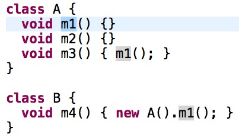
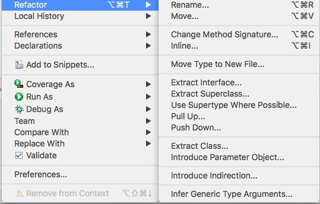
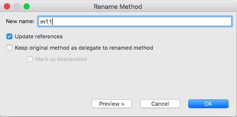
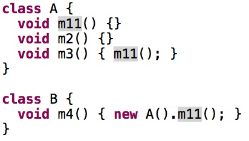
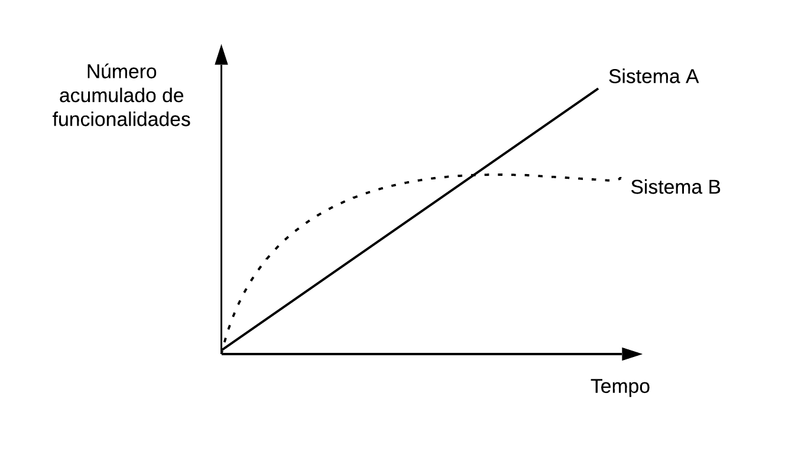

# Refactoring

> *I\'m not a great programmer; I\'m just a good programmer with great habits.* -- Kent Beck

Este capítulo inicia com uma introdução a refactorings, os quais são
modificações realizadas em um programa para facilitar o seu entendimento
e futura evolução. Na Seção 9.2, apresentamos uma série de operações de
refactoring, incluindo exemplos de código, alguns deles de refactorings
reais, realizados em sistemas de código aberto. Em seguida, na Seção
9.3, discutimos alguns aspectos sobre a prática de refactoring,
incluindo a importância de uma boa suíte de testes de unidade. A Seção
9.4 apresenta os recursos oferecidos por IDEs para realização
automatizada de refactorings. Para finalizar, a Seção 9.5 descreve uma
lista de code smells, isto é, indicadores de que uma determinada
estrutura de código não está "cheirando bem" e que, portanto, poderia
ser objeto de uma refatoração.

## Introdução
\index{Refactoring}

No capítulo anterior, vimos que software precisa ser testado, como
qualquer produto de engenharia. A mesma recomendação vale para
atividades de manutenção. Isto é, software também precisa de manutenção.
Na verdade, na Introdução deste livro, já comentamos que existem
diversos tipos de manutenção que podem ser realizadas em sistemas de
software. Quando um bug é detectado, temos que realizar uma **manutenção
corretiva**. Quando os usuários ou o dono do produto solicitam uma nova
funcionalidade, temos que realizar uma **manutenção evolutiva**. Quando
uma regra de negócio ou alguma tecnologia usada pelo sistema muda, temos
que reservar tempo para uma **manutenção** **adaptativa**.

\index{Leis de Lehman}
\index{Leis da Evolução de Software}
\index{Lehman, Meir}
Além disso, sistemas de software também envelhecem, como ocorre com os
seres vivos. Ainda no início da década de 1970, Meir Lehman — então
trabalhando na IBM — começou a observar e analisar esse fenômeno e,
como resultado, enunciou um conjunto de leis empíricas sobre
envelhecimento, qualidade interna e evolução de sistemas de software,
que ficaram conhecidas **Leis da Evolução de Software** ou simplesmente
**Leis de Lehman**. As duas primeiras leis enunciadas por Lehman foram
as seguintes:

-   Um sistema de software deve ser continuamente mantido para se
    adaptar ao seu ambiente. Esse processo deve continuar até o ponto
    em que se torna mais vantajoso substituí-lo por um sistema
    completamente novo.

-   À medida que um sistema sofre manutenções, sua complexidade interna
    aumenta e a qualidade de sua estrutura deteriora-se, a não ser que
    um trabalho seja realizado para estabilizar ou evitar tal
    fenômeno.

A primeira lei justifica a necessidade de manutenções adaptativas e
também evolutivas em sistemas de software. Ela também menciona que
sistemas podem "morrer", isto é, pode chegar a um ponto em que vale
mais a pena descontinuar o desenvolvimento de um sistema e substituí-lo
por um novo. Já a segunda Lei de Lehman afirma que manutenções tornam o
código e a estrutura interna de um sistema mais complexos e difíceis de
manter no futuro. Em outras palavras, existe uma deterioração natural da
qualidade interna de um sistema, à medida que ele passa por manutenções
e evoluções. No entanto, a segunda lei faz uma ressalva: um certo
trabalho pode ser realizado para estabilizar ou mesmo evitar esse
declínio natural da qualidade interna de sistemas de software.
Modernamente, esse trabalho é chamado de **refactoring**.

\index{Refactoring!Definição}
Refactorings são transformações de código que melhoram a
manutenibilidade de um sistema, mas sem afetar o seu funcionamento. Para
explicar essa definição, vamos dividi-la em três partes. Primeiro,
quando a definição menciona "transformações de código", ela está se
referindo a modificações no código, como dividir uma função em duas,
renomear uma variável, mover uma função para outra classe, extrair uma
interface de uma classe, etc. Em seguida, a definição menciona o
objetivo de tais transformações: "melhorar a manutenibilidade" do
sistema, isto é, melhorar sua modularidade, melhorar seu projeto ou
arquitetura, melhorar sua testabilidade, tornar o código mais legível,
mais fácil de entender e modificar, etc. Por fim, coloca-se uma
restrição: não adianta melhorar a manutenibilidade do sistema e
prejudicar o seu funcionamento. Ou seja, refactoring deve entregar o
sistema funcionando exatamente como antes das transformações. Uma outra
maneira de dizer isso é afirmando que refactorings devem preservar o
comportamento ou a semântica do sistema.

\index{Opdyke, William}
No entanto, nas décadas de 70 e 80, quando as Leis de Lehman foram
formuladas, o termo refactoring ainda não era usado. Um dos primeiros
usos do termo em Engenharia de Software ocorreu em 1992, em uma tese de
doutorado defendida por William Opdyke, na Universidade de Illinois, EUA
([link](https://dl.acm.org/citation.cfm?id=169783)). Em
seguida, em 1999, refactoring — já com esse nome — foi incluído
entre as práticas de programação preconizadas por Extreme Programming.
Na primeira edição do livro de XP, recomenda-se que desenvolvedores
devem realizar refactorings com o objetivo de "reestruturar seus
sistemas, sem mudar o comportamento deles e sim para remover duplicação
de código, melhorar a comunicação com outros desenvolvedores,
simplificar o código ou torná-lo mais flexível".

\index{Fowler, Martin}
Em 2000, Martin Fowler lançou a primeira edição de um livro dedicado
exclusivamente a refactoring, que alcançou grande sucesso e contribuiu
para popularizar essa prática de programação. Um dos motivos desse
sucesso foi o fato de o livro incluir um catálogo com dezenas de
refactorings. De uma forma que lembra um catálogo de padrões de projeto
(tal como estudamos no Capítulo 6), a apresentação dos refactorings
começa dando um nome para eles, o que contribuiu para criar um
vocabulário sobre refactoring. No livro, Fowler também apresenta a
mecânica de funcionamento de cada refactoring, inclui exemplos de código
e discute os benefícios e desvantagens dos refactorings.

\index{Beck, Kent}
Em seu livro, Fowler cita também a frase de Kent Beck que abre esse
capítulo e que ressalta a importância de seguir "bons hábitos de
programação", os quais são fundamentais para preservar a saúde de um
sistema, garantindo que ele continuará evoluindo por anos. Portanto,
desenvolvedores não devem realizar apenas manutenções corretivas,
adaptativas e evolutivas. É importante cuidar também da manutenibilidade
do sistema, por meio da realização frequente de refactorings.

```{=latex}
\begin{aviso}
```
**Tradução**: Decidimos não traduzir refactoring quando usado como
substantivo. O motivo é que achamos que o substantivo em inglês já faz
parte do vocabulário dos desenvolvedores de software brasileiros. Porém,
quando usada como verbo (*to refactor*), traduzimos para refatorar.
```{=latex}
\end{aviso}
```

```{=latex}
\begin{aviso}
```
**Aviso:** O termo refactoring tornou-se comum em desenvolvimento de
software. Por isso, às vezes ele é usado para indicar a melhoria de
outros requisitos não-funcionais, que não estão relacionados com
manutenibilidade. Por exemplo, frequentemente, ouvimos desenvolvedores
mencionar que vão refatorar o código para melhorar seu desempenho, para
introduzir concorrência, para melhorar a usabilidade de sua interface,
etc. No entanto, neste livro, vamos usar o termo restrito à sua
definição original, isto é, apenas para denotar modificações de código
que melhoram a sua manutenibilidade.
```{=latex}
\end{aviso}
```

## Catálogo de Refactorings

Nesta seção, vamos apresentar os principais refactorings do catálogo de Fowler. Assim como adotado nesse catálogo, vamos comentar sobre os seguintes tópicos na apresentação de cada refactoring: nome, motivação, mecânica de aplicação e exemplos de uso. Além disso, vamos usar alguns exemplos de refactorings reais, realizados por desenvolvedores de sistemas de código aberto disponíveis no GitHub.

### Extração de Método
\index{Refactoring!Extração de Método}

Extração de Método é um dos principais refactorings, tendo como objetivo
extrair um trecho de código de um método `f` e levá-lo para um novo método
`g`. Então, o método `f` passa a incluir uma chamada de `g`. O próximo código
ilustra o funcionamento desse refactoring. Primeiro, o código antes do refactoring:

```
void f () {
  ... // A
  ... // B 
  ... // C
}
```

E agora o código após a extração do método `g`:

\newpage

```
void g() {  // método extraído
  ... // B
}

void f () {
  ...  // A
  g(); // chama método extraído
  ...  // C
}

```

\index{Duplicação de Código}
Existem também variações na mecânica de funcionamento de uma extração de
método. Por exemplo, pode-se extrair de uma vez vários métodos `g1`, `g2`,
..., `gn` de um método `f`. Pode-se também extrair o mesmo código `g` de
vários métodos `f1`, `f2`, ..., `fn`. Nesse caso, a extração é usada para
eliminar **duplicação de código**, pois o código de `g` estava aparecendo
no corpo de diversos métodos.

Para realizar uma Extração de Método pode ser necessário passar
parâmetros para o método extraído. Isso ocorre, por exemplo, se o método
precisar acessar variáveis locais do método original. O método extraído
pode ter ainda que retornar algumas dessas variáveis, caso elas sejam
usados depois pelo método original. Por fim, se existirem variáveis
locais que somente são usadas no método extraído, deve-se extrair também
a declaração delas do método original. Ou seja, elas não serão mais
necessárias no método original.

Extração de Método é conhecido como o "canivete suíço" dos
refactorings, pois ele é um dos refactorings com mais aplicações. Por
exemplo, Extração de Método pode ser usado para quebrar um método grande
em métodos menores. Cada um desses métodos tem uma função específica,
que deve ficar clara em seu nome. Assim, fica mais fácil entender o
método original, pois ele passará a conter apenas uma sequência de
chamadas dos métodos extraídos. Vamos mostrar um exemplo a seguir.
Outras aplicações de Extração de Método são discutidas em uma seção
"Mundo Real", após o exemplo.

**Exemplo:** A seguir, mostramos um exemplo real de Extração de Método,
realizada em um sistema Android. Esse sistema possui um método `onCreate`,
que usa comandos SQL para criar as tabelas do banco de dados que ele
manipula. O código dessa primeira versão de `onCreate` — após algumas
edições, simplificações e remoções de comentários — é mostrado a
seguir. O código fonte original possui mais de 200 linhas.

\newpage

```
void onCreate(SQLiteDatabase database) {// antes da extração
  // cria tabela 1
  database.execSQL("CREATE TABLE " +
            CELL_SIGNAL_TABLE + " (" + COLUMN_ID +
            " INTEGER PRIMARY KEY AUTOINCREMENT, " + ...
  database.execSQL("CREATE INDEX cellID_index ON " + ...);
  database.execSQL("CREATE INDEX cellID_timestamp ON " +...);

  // cria tabela 2
  String SMS_DATABASE_CREATE = "CREATE TABLE " + 
            SILENT_SMS_TABLE + " (" + COLUMN_ID +
            " INTEGER PRIMARY KEY AUTOINCREMENT, " + ...
  database.execSQL(SMS_DATABASE_CREATE);
  String ZeroSMS = "INSERT INTO " + SILENT_SMS_TABLE + 
            " (Address,Display,Class,ServiceCtr,Message) " +
            "VALUES ('"+ ...
  database.execSQL(ZeroSMS);

  // cria tabela 3
  String LOC_DATABASE_CREATE = "CREATE TABLE " +      
            LOCATION_TABLE + " (" + COLUMN_ID +
            " INTEGER PRIMARY KEY AUTOINCREMENT, " + ...
  database.execSQL(LOC_DATABASE_CREATE);
  // mais 200 linhas, criando outras tabelas
}

```

Para simplificar o entendimento desse método, um dos desenvolvedores do
IntelliJ resolveu realizar sete Extrações de Método. Cada método
extraído ficou responsável pela criação de uma das tabelas. Apenas
olhando para o nome de tais métodos, pode-se ter uma ideia das tabelas
que eles criam. Após as extrações, o método `onCreate` chama os métodos
extraídos, como mostrado a seguir. O tamanho do método caiu de mais de
200 linhas de código para apenas sete linhas. Observe também que os
métodos extraídos têm como um parâmetro que representa o banco de dados
no qual as tabelas serão criadas.

```
public void onCreate(SQLiteDatabase database) { 
  createCellSignalTable(database);
  createSilentSmsTable(database);
  createLocationTable(database);
  createCellTable(database);
  createOpenCellIDTable(database);
  createDefaultMCCTable(database);
  createEventLogTable(database);
 }
```

### Motivações para Extração de Métodos

Em 2016, junto com Danilo Silva e com o Prof. Nikolaos Tsantalis (da
Universidade Concordia, em Montreal, no Canadá), realizamos um estudo
com desenvolvedores de sistemas GitHub para descobrir suas reais
motivações para realização de refactorings
([link](https://arxiv.org/abs/1607.02459)). No estudo,
revelamos 11 motivações distintas para Extrações de Métodos, conforme
mostrado na tabela a seguir. 

----------------------------------------------------------------------------
**Motivações para Extração de Métodos**                     **Ocorrências**
---------------------------------------------------------  -----------------  
Extração de um método para ser reusado em outras partes      43               
do código                                                      

Introduzir uma assinatura alternativa para um                25               
método existente                                                      

Dividir um método em partes menores para melhorar            21               
o seu entendimento                                                    

Remover duplicação de código                                 15               

Extração de um método para facilitar a                       14               
implementação de uma nova funcionalidade ou                     
a correção de um bug                                  

Extração de um método que terá um nome melhor ou              6                
menos parâmetros. O método original é depreciado                     
e delega as suas chamadas para o método extraído                     

Permitir o teste do método extraído, isto é,                  6                
melhorar testabilidade                                               

Permitir que subclasses sobrescrevam o método que             4                
foi extraído                                                         

Permitir a implementação de um método recursivo               2                

Introduzir um método fábrica, isto é, as chamadas             1                  
de new são movidas para o novo método                                          

Implementar operações assíncronas, isto é, o                  1                
método é extraído para ser executado em uma                                    
thread independente                              
----------------------------------------------------------------------------

Analisando essa tabela, podemos ver que a
principal motivação é extrair um código para permitir o seu reúso. Ou
seja, o desenvolvedor precisa de um determinado código e descobre que
ele já está implementado, mas dentro de um método `f`. Então, ele extrai
esse código para um método `g`. Com isso, ele pode agora reusar `g` —
isto é, chamar `g` — no código no qual está trabalhando. Veja como um
dos desenvolvedores relatou sua motivação para extrair um
método:

> "Esses refactorings foram realizados para garantir reusabilidade. Eu precisava usar o mesmo código em um novo método. E eu sempre tento reusar código, porque quando começa a ter muita redundância no código ele se torna mais difícil de ser mantido no futuro, visto que quando alguma coisa muda em código duplicado, essa mudança tem que ser replicada em todas as cópias."

Como pode ser conferido na tabela anterior, a segunda motivação mais
frequente consiste em introduzir uma assinatura alternativa para um
método. Um exemplo hipotético é mostrado a seguir, envolvendo um método
que faz o logging de uma string em um arquivo. 

Primeiro vamos mostrar o código original:

```
void log(String msg) {
  // salva msg em arquivo
}
```

O desenvolvedor decidiu então prover uma versão alternativa desse método com um parâmetro
booleano, que indica se a string também deve ser mostrada na console. Veja o código após a extração desse segundo método `log`:

```
void log(String msg, boolean console) {
  if (console)
     System.out.println(msg);
  // salva msg em um arquivo
}

void log(String msg) {
  log(msg, false);
}
```

O leitor deve observar que, tecnicamente, a transformação mostrada no
exemplo anterior é uma Extração de Método. Primeiro, todo o código de
`log(String)` foi extraído para `log(String,boolean)`, que é um novo método.
Em seguida, pequenos ajustes foram realizados no código extraído.
Especificamente, foi adicionado um comando `if`. Tais ajustes são comuns e
não descaracterizam a transformação como uma Extração de
Método.

### Inline de Método
\index{Refactoring!Inline de Método}

Esse refactoring funciona no sentido contrário a uma extração de método.
Suponha um método pequeno, com uma ou duas linhas de código, e que seja
chamado poucas vezes. O benefício proporcionado por esse método — em
termos de reúso e incremento de legibilidade do código — é pequeno.
Portanto, ele pode ser removido do sistema e seu corpo incorporado nos
pontos de chamada. No entanto, é importante ressaltar que Inline de
Métodos é uma operação mais rara e menos importante do que Extração.

**Exemplo:** A seguir, mostramos um exemplo de Inline de Método,
realizado no sistema IntelliJ, uma IDE para Java. Primeiro, segue o
código antes do inline. Podemos ver que o método `writeContentToFile` tem
uma única linha de código e é chamado apenas uma vez, pelo método `write`.

```
private void writeContentToFile(final byte[] revision) {
  getVirtualFile().setBinaryContent(revision);
}
 
private void write(byte[] revision) {
  VirtualFile virtualFile = getVirtualFile();
  ...
  if (document == null) {
       writeContentToFile(revision); // única chamada      
  }
   ...
 }

```

Os desenvolvedores do IntelliJ decidiram então remover
`writeContentToFile` e expandir o seu corpo no único ponto de chamada. O
código após o refactoring é mostrado a seguir.

```
private void write(byte[] revision) {
  VirtualFile virtualFile = getVirtualFile();
  ...
  if (document == null) {
     virtualFile.setBinaryContent(revision);  // após inline
  }
  ...
}

```

### Movimentação de Método
\index{Refactoring!Movimentação de Método}

Não é raro encontrar um método implementado na classe errada. Ou seja,
apesar de implementado em uma classe A, um método `f` pode usar mais
serviços de uma classe B. Por exemplo, ele pode ter mais dependências
para elementos de B do que de sua classe A. Nesses casos, deve-se
avaliar a possibilidade de mover f para a classe B. Esse refactoring
pode melhorar a coesão da classe A, diminuir o acoplamento entre A e B
e, em última instância, tornar ambas as classes mais fáceis de serem
entendidas e modificadas.

Pelas suas características, Movimentação de Métodos é um dos
refactorings com maior potencial para melhorar a modularização de um
sistema. Como sua atuação não está restrita a uma única classe,
Movimentação de Métodos pode ter um impacto positivo na arquitetura do
sistema, garantindo que os métodos estejam nas
classes apropriadas, tanto do ponto de vista funcional como
arquitetural.

**Exemplo:** O sistema IntelliJ possui um pacote para execução de testes
de unidade, via IDE. Esse pacote, por sua vez, possui uma
classe com métodos de uso geral, chamada `PlatformTestUtil`. Conforme
mostra o código a seguir, essa classe tinha um método chamado
`averageAmongMedians`, que calcula a média das medianas de uma parte de um
vetor de inteiros. No entanto, esse método não possui relação com a
execução de testes de unidade. Por exemplo, ele não usa métodos e
atributos de `PlatformTestUtil`. Ou seja, ele é independente do resto da
classe.

```
class PlatformTestUtil {
  ...
  public static long averageAmongMedians(long[] time, 
  	                                     int part) {
    int n = time.length;
    Arrays.sort(time);
    long total = 0;
    for (int i= n/2-n/part/2; i< n/2+n/part/2; i++) {
      total += time[i];
    }
    int middlePartLength = n/part;
    return middlePartLength == 0 ? 0:total/middlePartLength;
  }
  ...
}
```

Pelos motivos expostos no parágrafo anterior, um dos desenvolvedores do
IntelliJ decidiu mover `averageAmongMedians` para uma classe chamada
`ArrayUtil`, que tem como objetivo disponibilizar funções utilitárias para
manipulação de vetores. Logo, trata-se de uma classe mais relacionada
com a funcionalidade provida por `averageAmongMedians`.

Após a movimentação para a nova classe, as chamadas de
`averageAmongMedians` tiveram que ser atualizadas, como mostrado na figura
a seguir. 

{width=100%}

No entanto, como o leitor pode observar nesse diff, isso não
foi difícil, pois `averageAmongMedians` é um método estático. Logo, apenas
o nome de sua classe teve que ser atualizado em cada ponto de chamada.

Em outros casos, no entanto, pode não ser tão simples atualizar as chamadas de
um método após ele ser movido para uma nova classe. Isso acontece quando
nos pontos de chamada não existem referências para objetos da nova
classe do método. Uma solução consiste então em deixar uma implementação
simples do método na classe de origem. Essa implementação apenas delega
as chamadas para a nova classe do método. Por isso, nenhum
cliente precisará ser alterado. Um exemplo é mostrado a seguir. Primeiro, o código original:

```
class A {
  B b = new B();
  void f { ... }
}

class B { ... }

class Cliente {
  A a = new A();
  void g() {
    a.f(); 
    ...
  }
}
```

E agora o código após a refatoração:

```
class A {
  B b = new B();
  void f {
    b.f(); // apenas delega chamada para B
  }
}

class B {    // f foi movido de A para B
   void f { ... }
}

class Cliente {
  A a = new A();
  void g() { 
    a.f();    // não precisa mudar
    ...
  }
}
```

Observe que o método `f` foi movido da
classe `A` para a classe `B`. Porém, em `A` ficou uma versão do método que
apenas repassa (ou delega) a chamada para `B`. Por isso, o código da classe `Cliente` 
não precisou ser alterado.

\index{Refactoring!Pull Up Method}

Quando ocorre em uma mesma hierarquia de classes, Movimentação de Métodos ganha nomes especiais. Por exemplo, quando o refactoring move um método de subclasses para uma superclasse, ele é chamado de **Pull Up Method**. Para ilustrar, suponha um mesmo método `f` implementado em duas subclasses `B1` e `B2`. Para evitar **duplicação de código**, pode-se então "subir" com ambas implementações para a superclasse `A`, como mostra o diagrama de classes da próxima página.

{width=82%}

\index{Refactoring!Push Down Method}

Por outro lado, quando um método é movido para baixo na hierarquia de
classes, isto é, de uma superclasse para uma subclasse, dizemos que foi
realizado um **Push Down Method**. Por exemplo, apesar de implementado
na superclasse `A`, um método `f` pode ser do interesse de uma única
subclasse, digamos que `B1`. Logo, podemos "descer" com sua
implementação para `B1`, como mostrado no diagrama de classes da próxima página.

{width=82%}

Para concluir, operações de refactoring podem ser feitas em sequência.
Por exemplo, suponha a seguinte classe `A` com um método `f`: 

\newpage
```
class A {
  B b = new B();

  void f(){
    S1;
    S2;
  }

}

class B { ... }
```

Primeiro, vamos extrair um método `g` com o comando `S2` de `f`: 

```
class A {
  B b = new B();

  void g() { // novo método extraído de f()
    S2;
  }

  void f(){
    S1;
    g();
  }
}

class B { ... }
```

Na sequência, vamos mover `g` para uma classe `B`, como ilustrado a seguir:

```
class A {
  B b = new B();

  void f(){
    S1;
    b.g();
  }
}

class B {

  void g() { // movido de A para B
    S2;
  }

}
```

### Extração de Classes
\index{Refactoring!Extração de Classes}

Esse refactoring é recomendado quando um sistema possui uma classe A com
muitas responsabilidades e atributos. Alguns desses atributos são
relacionados e poderiam ter vida própria. Logo, eles podem ser extraídos
para uma nova classe B. Em seguida, declaramos em A um atributo do tipo
B.

**Exemplo:** Seja a classe `Pessoa` mostrada a seguir. Além de outros
atributos, que foram omitidos do exemplo, ela armazena dados do telefone
fixo e celular da pessoa em questão, incluindo código de área e número.

```
class Pessoa {
  String codigoArea;
  String fone;
  String codigoAreaCelular;
  String celular;
  ...
}
```

Assim, podemos extrair de `Pessoa` uma nova classe, chamada `Fone`, dedicada
a armazenar informações sobre telefones, conforme mostrado a seguir.
Após o refactoring, `Pessoa` passou a ter dois atributos do novo tipo,
destinados a armazenar o telefone fixo e o telefone celular de uma
pessoa.

```
class Fone { // classe extraída
  String codigoArea;
  String numero; 
}

class Pessoa {
  Fone foneFixo;
  Fone foneCelular
  ...
}
```

Um refactoring similar a **Extração de Classes** é chamado de **Extração
de Interfaces**. Por exemplo, suponha que uma biblioteca de estruturas
de dados implemente as classes `LinkedList` e `ArrayList`. Dessas duas
classes podemos extrair uma interface `List`, com os métodos comuns a
elas. Assim, os clientes de tais classes podem começar a praticar o
princípio de projeto "Prefira Interfaces a Classes Concretas", que
estudamos no Capítulo 5.

### Renomeação
\index{Refactoring!Renomeação}

Existe uma frase provocativa, atribuída a Phil Karlton, que afirma que
"existem apenas duas coisas difíceis em Ciência da Computação:
invalidação de cache e dar nomes às coisas." Como dar nomes é difícil,
frequentemente temos que renomear um elemento de código, seja ele uma
variável, função, método, parâmetro, atributo, classe, etc. Isso pode
ocorrer porque o nome dado ao elemento não foi uma boa escolha. Um outro
motivo é que a responsabilidade desse elemento pode ter mudado com o
tempo e assim seu nome ficou desatualizado. Em ambos os casos,
recomenda-se realizar um dos refactorings mais populares que existe:
**renomeação**. Isto é, dar um nome mais adequado e significativo para o
elemento de código.

Quando esse refactoring é aplicado, a parte mais complexa não é renomear
o elemento, mas atualizar os pontos do código em que ele é referenciado.
Por exemplo, se um método `f` é renomeado para `g`, todas as chamadas de `f`
devem ser atualizadas. Na verdade, se `f` for muito usado, pode ser
interessante extraí-lo para um novo método, com o novo nome, e
manter o nome antigo, mas depreciado. 

Para mostrar um exemplo, suponha o seguinte método `f`:

```
void f () {
  // A
}
```

Segue agora o código após o refactoring. Veja que extraímos um método
`g`, com o código antigo de `f`, que foi então depreciado.

```
void g() {    // novo nome do método
  // A
}

@deprecated
void f() {    // mantêm nome antigo
  g();        // mas delega chamada para novo nome
}
```

Depreciação é um mecanismo oferecido por linguagens de programação para
indicar que um elemento de código está desatualizado e, portanto,
desencorajar seu uso. Quando o compilador descobre que um trecho de
código está usando um elemento depreciado, ele emite um *warning*. No
exemplo anterior, o método `f` não foi simplesmente renomeado para `g`. Em
vez disso, primeiro criou-se um método `g` com o código original de `f`. Em
seguida, `f` foi depreciado e seu código modificado para apenas chamar `g`.

A estratégia baseada em depreciação torna a renomeação mais segura, pois
ela não obriga a atualização de uma só vez de todas as chamadas de `f`,
que podem ser muitas e espalhadas em diversos programas. Ou seja, ela dá
tempo para que os clientes se adaptem à mudança e passem a usar o novo
nome. Na verdade, refactorings — mesmo os mais simples, como uma
renomeação — devem ser realizado em pequenos passos, ou em **baby
steps**, para ter certeza que eles não vão prejudicar o correto
funcionamento de um sistema.

### Outros Refactorings

Os refactorings apresentados anteriormente têm maior potencial para
melhorar o projeto de um sistema, pois eles envolvem operações com um
escopo global, como Movimentação de Métodos ou Extração de Classes.
Porém, existem refactorings com escopo local, que melhoram, por
exemplo, a implementação interna de um único método. Vamos a seguir
descrever resumidamente alguns desses refactorings.

\index{Refactoring!Extração de Variáveis}
**Extração de Variáveis** é usado para simplificar expressões e
torná-las mais fáceis de ler e entender. Seja o seguinte código 
de exemplo:

```
x1 = (-b + sqrt(b*b-4*a*c)) / (2*a);
```

Esse código pode ser refatorado para:

```
delta = b*b-4*a*c; // variável extraída
x1 = (-b + sqrt(delta)) / (2*a);

```

Veja que uma variável `delta` foi criada e inicializada com uma parte de uma expressão maior. Com isso, o código da expressão, após a refatoração, ficou menor e mais fácil de entender.

\index{Refactoring!Remoção de Flags}
**Remoção de Flags** é um refactoring que sugere usar comandos como
`break` ou `return`, em vez de variáveis de controle, também chamadas de
flags. Seja o seguinte código de exemplo:

```
boolean search(int x, int[]a) {
   boolean achou = false;
   i = 0;
   while (i < a.length) && (!achou) {
     if (a[i] == x);
        achou = true;
     i++;
   }
   return achou;
}
```
Esse código pode ser refatorado da seguinte forma:

```
boolean search(int x, int[]a) {
  for (i = 0; i < a.length; i++)
    if (a[i] == x)
       return true;
  return false;
}
```

Observe que a função após a refatoração ficou menor e com
uma lógica mais clara, graças ao uso de um comando `return` para retornar
imediatamente assim que um determinado valor tenha sido encontrado em um
vetor.

\index{Refactoring!Substituição de Condicional por Polimorfismo}
Existe também refactorings que tratam da simplificação de comandos
condicionais. Um deles é chamado de **Substituição de Condicional por
Polimorfismo**. Para entendê-lo, suponha um comando `switch` que retorna o
valor da bolsa de pesquisa de um aluno, dependendo do seu tipo:

```
switch (aluno.type) {
   case "graduacao": 
      bolsa = 500;
      break;
   case "mestrado": 
      bolsa = 1500;
      break;
   case "doutorado": 
      bolsa = 2500;
      break;
}
```

Em uma linguagem orientada a objetos, esse comando pode ser refatorado
para apenas uma linha de código:

`bolsa = aluno.getBolsa();`

Na versão refatorada, o atributo `type` de Aluno não é mais necessário e,
portanto, pode ser removido. Além disso, temos que implementar nas
subclasses de `Aluno` — por exemplo, `AlunoGraduacao`, `AlunoMestrado` e
`AlunoDoutorado` — um método `getBolsa()`. Por fim, na superclasse `Aluno`
esse método deve ser abstrato, isto é, ter apenas uma assinatura, sem corpo.

\index{Refactoring!Remoção de Código Morto}
**Remoção de Código Morto** recomenda deletar métodos, classes,
variáveis, atributos, etc que não estão sendo mais usados. Por exemplo,
no caso de um método, pode não existir mais chamadas para ele. No caso
de uma classe, ela pode não ser mais instanciada ou herdada por outras
classes. No caso de um atributo, ele pode não ser usado no corpo da
classe, nem em subclasses ou em outras classes. Pode parecer que Remoção
de Código Morto é um refactoring raro, mas em grandes sistemas,
desenvolvidos ao longo de anos por programadores diferentes, costuma
existir uma quantidade considerável de código que não é mais chamado.

## Prática de Refactoring

Tendo apresentado diversos refactorings na seção anterior, vamos agora
discutir como a prática de refactoring pode ser adotada em projetos reais de
desenvolvimento de software.

Primeiro, a realização bem sucedida de refactorings depende da
existência de bons testes, principalmente testes de unidade. Ou seja,
sem testes fica arriscado realizar mudanças em um sistema, ainda mais
quando elas não agregam novas funcionalidades ou corrigem bugs, como é o
caso de refactorings. John Ousterhout tem o seguinte comentário sobre a
importância de testes durante atividades de refactoring
([link](https://dl.acm.org/citation.cfm?id=3288797)):

\index{Ousterhout, John}

> "Testes, particularmente testes de unidade, desempenham um papel
importante no projeto de software porque eles facilitam a realização
de refactorings. Sem uma suíte de testes, torna-se arriscado realizar
mudanças estruturais em um sistema. Como não há uma maneira fácil de
encontrar bugs, é mais provável que eles fiquem escondidos até que o
código entre em produção, quando é mais caro detectá-los e
corrigi-los. Como resultado, desenvolvedores tendem a evitar
refatorações em sistemas sem boas suítes de teste. Em vez disso, eles
reduzem as modificações no código àquelas necessárias para implementar
novas funcionalidades ou corrigir bugs. Isso implica que a
complexidade vai se acumulando e erros de projeto não são corrigidos."

Uma segunda questão importante diz respeito ao momento em que o código
deve ser refatorado. Existem dois modos principais de realizar
refactorings: de forma oportunista ou de forma estratégica.

\index{Refactoring!Oportunistas}
**Refactorings oportunistas** são realizados no meio de uma tarefa de
programação, quando se descobre que um trecho de código não está bem
implementado e que, portanto, pode ser melhorado. Isso pode acontecer
quando se está corrigindo um bug ou implementando uma nova
funcionalidade. Por exemplo, no meio dessas tarefas, pode-se perceber
que o nome de um método não está claro, que um método está muito grande
e difícil de entender, que um comando condicional está muito complexo,
que um determinado código não é mais usado, etc. Assim, se o
desenvolvedor descobrir problemas na implementação de um trecho de
código, ele deve refatorá-lo imediatamente. Tentando explicar de um modo
mais claro, suponha que um desenvolvedor trabalhe por uma hora na
implementação de uma nova funcionalidade. É compreensível e desejável
que parte desse tempo — talvez 20% ou mais — seja investido em
refactorings. Kent Beck tem uma frase interessante sobre refactorings
oportunistas:

\index{Beck, Kent}

> "Para cada mudança que você tiver que realizar em um sistema, primeiro torne essa mudança fácil (aviso: isso pode ser difícil), então realize a mudança facilmente."

A ideia de fundo dessa recomendação é que um desenvolvedor pode estar
enfrentando dificuldades para implementar uma mudança exatamente porque
o código não está preparado para acomodá-la. Assim, primeiro ele deve
dar um "passo atrás", isto é, refatorar o código de forma oportunista,
para tornar a mudança em questão "fácil". Feito isso, ele terá aberto
caminho para dar dois passos a frente e implementar a mudança que ficou
sob sua responsabilidade.

\index{Refactoring!Planejados}
\index{Fowler, Martin}
Na maior parte das vezes, os refactorings são oportunistas. No entanto,
é possível ter também **refactorings planejados**. Normalmente, eles são
mudanças mais profundas, demoradas e complexas, que não valem a pena
encaixar no meio de uma outra tarefa de desenvolvimento. Em vez disso,
eles devem ser realizados em sessões planejadas e dedicadas. Por
exemplo, esses refactorings podem envolver a quebra de um pacote em dois
ou mais subpacotes, o que pode exigir atualizações em diversas partes de
um sistema. Como um segundo exemplo, pode ser que o time de
desenvolvimento negligenciou a prática de refactorings por muito tempo.
Então, como existem muitos refactorings pendentes, é melhor planejá-los
para um período de tempo específico. No entanto, como afirma Fowler
"tais episódios de refactorings planejados devem ser raros. A maior
parte do esforço de refactoring deve ser do tipo normal e
oportunista."

## Refactorings Automatizados
\index{Refactoring!Automatizados}

Diversas IDEs oferecem suporte para automatizar a realização de
refactorings, da seguinte forma: o usuário seleciona o trecho de código
que pretende refatorar e a operação de refactoring que deseja realizar.
Então, a IDE realiza essa operação automaticamente. Para deixar o
conceito mais claro, as próximas figuras ilustram um renomeação
automática de método via uma IDE. Primeiro, o usuário marca o nome do
método `m1`, como mostra a figura:

{width="37%"}

Em seguida, ele escolhe as opções de `Refactor` e `Rename` da sua IDE: 

{width="50%"}

Então a IDE pergunta o novo nome que ele pretende dar ao método (acompanhe na figura a seguir). Nessa mesma caixa de diálogo, o desenvolvedor informa que deseja atualizar as referências para esse método, para que elas usem o novo nome. 

{width="50%"}

Feito isso, a IDE realiza o refactoring automaticamente:

{width="37%"}

Primeiro, o nome do método na classe `A` foi renomeado para `m11`. Além disso, as chamadas
feitas em `m3` e `m4` foram atualizadas para usar o novo nome.

Apesar de chamado de refactoring automatizado, o exemplo que mostramos
deixa claro que cabe ao usuário indicar o trecho de código que deseja
refatorar e o refactoring que deseja realizar. Ele também deve dar
informações sobre esse refactoring. Por exemplo, o novo nome do
identificador, no caso de uma renomeação. A partir daí é que o
refactoring torna-se automatizado.

\index{Refactoring!Pré-condições}
Antes de aplicar o refactoring, a IDE verifica se as suas
**pré-condições** são verdadeiras, isto é, se a execução do refactoring
— conforme requisitado pelo usuário — não vai causar um erro de
compilação ou então mudar o comportamento do programa. No exemplo
anterior, se o usuário pedir para renomear `m1` para `m2`, a IDE vai
informar que esse refactoring não pode ser realizado, pois a classe já
tem um método chamado `m2`. 


### Verificação de Pré-condições de Refactorings

A verificação das pré-condições de refactorings
não é uma tarefa trivial. Para ilustrar a complexidade dessa tarefa,
vamos reusar um pequeno programa em Java, proposto por
Friedrich Steimann and Andreas Thies
([link](https://doi.org/10.1007/978-3-642-03013-0_19)).
Conforme mostrado a seguir, esse programa inclui duas classes, `A` e `B`,
implementadas em arquivos distintos, mas pertencentes a um mesmo pacote
`P1`. Assim, a chamada de `m("abc")` no primeiro arquivo irá resultar
na execução do método `m(String)` da classe `B`.

```
// arquivo A.java
package P1;

public class A {
  void n() { 
    new B().m("abc"); // executa m(String) de B
  }
}

```

```
// arquivo B.java
package P1;

public class B {
  public void m(Object o) {...}
  void m(String s) {...}
}

```

No entanto, suponha que a classe `B` seja movida para um novo pacote; por
exemplo, para um pacote `P2`:

```
// arquivo B.java
package P2;   // novo pacote de B

public class B {
  public void m(Object o) {...}
  void m(String s) {...}
} 
```

Apesar de parecer inofensiva, essa Movimentação de Classe muda o
comportamento do programa. Na nova versão, a chamada de `m("abc")`
resulta na execução de `m(Object)` e não mais de `m(String)`. O motivo é que
a classe `B` não está mais no mesmo pacote da classe `A`. Por isso,
`m(String)` deixou de ser visível para `A`, pois ele não é um método
público. Para leitores que não conhecem Java, um método público de
uma classe pública, como `m(Object)`, pode ser chamado em qualquer parte
do código. Mas métodos sem modificador de visibilidade, como `m(String)`,
somente podem ser chamados por código do mesmo pacote.

Em resumo, o exemplo de Movimentação de Classes que apresentamos não é
um refactoring, pois ele não preserva o comportamento do programa. Se
realizado com o apoio de uma IDE, caberia a ela detectar tal fato e
avisar ao usuário que o refactoring não poderá ser realizado, pois ele
muda o comportamento do programa.

## Code Smells
\index{Code Smells}
\index{Bad Smells}

Code Smells — também conhecidos como **bad smells** — são
indicadores de código de baixa qualidade, isto é, código difícil de
manter, entender, modificar ou testar. Em resumo, código que não está
"cheirando bem" e que portanto talvez possa ser refatorado. No
entanto, nessa definição, o termo "indicadores" significa que não
devemos considerar que todo code smell deve ser imediatamente
refatorado. Essa decisão depende de outros fatores, como a importância
do trecho de código e a frequência com que ele precisará ser mantido.
Feita essa ressalva, vamos apresentar, no restante desta seção, alguns
dos principais code smells.

### Código Duplicado
\index{Code Smells!Código Duplicado}
\index{Código Duplicado}

Duplicação de código é o principal code smell e aquele com o maior
potencial para prejudicar a evolução de um sistema. Código duplicado
aumenta o esforço de manutenção, pois alterações têm que ser replicadas
em mais de uma parte do código. Consequentemente, corre-se o risco de
alterar uma parte e esquecer de uma outra. Código duplicado também torna
a base de código mais complexa, pois dados e comandos que poderiam estar
modularizados em métodos ou classes ficam espalhados pelo sistema.

Para eliminar duplicação de código, pode-se usar os seguintes
refactorings: Extração de Método (recomendado quando o código duplicado
está dentro de dois ou mais métodos), Extração de Classe (recomendado
quando o código duplicado refere-se a atributos e métodos que aparecem
em mais de uma classe) e Pull Up Method (recomendado quando o código
duplicado é um método presente em duas ou mais subclasses).

\index{Code Smells!Clones de Código}
\index{Clones de Código}
\index{Clones de Código!Classificação}
Trechos de código que possuem código idêntico são chamados de
**clones**. No entanto, diferentes critérios podem ser usados para
definir quando dois trechos de código A e B são, de fato, idênticos.
Esses critérios dão origem a quatro tipos de clones, conforme descrito a
seguir:

-   Clone do Tipo 1: quando A e B têm o mesmo código, com diferenças
    apenas em comentários e espaços.

-   Clone do Tipo 2: quando A e B são clones do Tipo 1, porém as
    variáveis usadas em A e B podem ter nomes diferentes.

-   Clone do Tipo 3: quando A e B são clones do Tipo 2, porém com
    pequenas mudanças em comandos.

-   Clone do Tipo 4: quando A e B são semanticamente equivalentes, mas
    suas implementações são baseadas em algoritmos diferentes.

**Exemplo**: Para ilustrar esses tipos de clones, vamos usar a seguinte função:

```
int fatorial(int n) {
  fat = 1;
  for (i = 1; i <= n; i++)
    fat = fat * i;
  return fat;
}
```

A seguir, mostramos quatro clones dessa função. 

- Clone Tipo 1: insere um comentário e remove espaços entre os operadores.

```
int fatorial(int n) {
  fat=1;
  for (i=1; i<=n; i++) 
    fat=fat*i;
  return fat; // retorna fatorial
}

```

- Clone Tipo 2: renomeia algumas variáveis.

```
int fatorial(int n) {
  f = 1;
  for (j = 1; j <= n; j++) 
    f = f * j;
  return f; 
}
```

- Clone Tipo 3: insere um comando simples, para imprimir o valor do fatorial.

```
int fatorial(int n) {
  fat = 1;
  for (j = 1; j <= n; j++)
    fat = fat * j;
  System.out.println(fat); // novo comando
  return fat;
}
```

- Clone Tipo 4: implementa uma versão recursiva da função.

```
int fatorial(int n) {
  if (n == 0)
     return 1;
  else return n*fatorial(n-1);
}
```

 Em todos esses casos, não precisaríamos ter duas ou mais funções `fatorial` no sistema. Apenas uma delas poderia ficar no código e a outra seria removida.

```{=latex}
\begin{esmbox}
```
**Mundo Real**: Em 2013, Auki Yamashita e Leon Moonen, dois
pesquisadores de um laboratório de pesquisa na Noruega, publicaram os
resultados de um estudo exploratório sobre code smells envolvendo 85
desenvolvedores de software
([link](https://doi.org/10.1109/WCRE.2013.6671299)).
Quando esses desenvolvedores foram questionados sobre os code smells com
os quais eles tinham mais preocupação, a resposta mais comum foi Código
Duplicado, com quase 20 pontos na escala usada pelos pesquisadores para
ordenar as respostas. Em segundo lugar, com metade dos pontos, ficou
Métodos Longos, que é o code smell que estudaremos a seguir.
```{=latex}
\end{esmbox}
```

### Métodos Longos
\index{Code Smells!Métodos Longos}

Em qualquer sistema, métodos devem ser pequenos, com nomes
auto-explicativos e poucas linhas de código. **Métodos Longos** são
considerados um code smell, pois eles tornam o código mais difícil de
entender e manter. Quando nos deparamos com um método longo, devemos
considerar a possibilidade de usar uma Extração de Método para quebrá-lo
em métodos menores. No entanto, não existe um limite máximo de linhas de
código que possa ser usado arbitrariamente para classificar métodos
longos, pois isso depende da linguagem de programação, da relevância do
método, do domínio do sistema, etc. Porém, modernamente, existe uma
tendência em escrever métodos pequenos, com menos de 20 linhas de
código, por exemplo.

### Classes Grandes
\index{Code Smells!Classes Grandes}

Assim como métodos, classes não devem assumir muitas responsabilidades e
prover serviços que não são coesos. Por isso, **Classes Grandes**
(*Large Class*) é considerado um code smell, pois, assim como métodos
longos, elas tornam o código mais difícil de entender e manter.
Normalmente, é mais difícil também reusar essas classes em outro pacote
ou sistema. Classes grandes são caracterizadas por um grande número de
atributos, com baixa coesão entre eles. A solução para esse smell
consiste em usar Extração de Classe para extrair uma classe menor A\' a
partir de uma classe grande A. Em seguida, a classe A passa a ter um
atributo do tipo para A\'.

\index{Code Smells!God Class}
\index{Code Smells!Blob}
\index{Blob}
```{=latex}
\begin{esmbox}
```
**Aprofundamento**: Quando uma classe cresce tanto que ela passa a
monopolizar grande parte da "inteligência" de um sistema, ela é
chamada de **God Class** — ou então de **Blob**. Classes com nomes
muito genéricos, como `Manager`, `System` ou `Subsystem` podem representar
instâncias desse smell.
```{=latex}
\end{esmbox}
```

### Feature Envy
\index{Code Smells!Feature Envy}
\index{Feature Envy}

Esse smell designa um método que parece "invejar" os dados e métodos
de uma outra classe. Dizendo de outro modo, ele acessa mais atributos e
métodos de uma classe B do que de sua atual classe A. Portanto, deve-se
analisar a possibilidade de usar Movimentação de Método para migrá-lo
para a classe "invejada".

O método `fireAreaInvalidated2`, mostrado no código a seguir, é um exemplo
de Feature Envy. Podemos observar que ele realiza três chamadas de
métodos, mas todas têm como alvo um mesmo objeto `abt` do tipo
`AbstractTool`. Por outro lado, ele não acessa nenhum atributo ou chama
qualquer método da sua classe atual. Logo, deve-se analisar a
conveniência de mover esse método para `AbstractTool`.

```
public class DrawingEditorProxy 
             extends AbstractBean implements DrawingEditor {
  ...
  void fireAreaInvalidated2 (AbstractTool abt , Double r ){
    Point p1 = abt.getView().drawingToView (...);
    Point p2 = abt.getView().drawingToView (...);
    Rectangle r=new Rectangle(p1.x,p1.y,p2.x-p1.x p2.y-p1.y);
    abt.fireAreaInvalidated (r);
  }
  ...
}
```


### Métodos com Muitos Parâmetros
\index{Code Smells!Métodos com Muitos Parâmetros}

Além de pequenos, métodos, na medida do possível, devem ter poucos
parâmetros. Isto é, **Métodos com Muitos Parâmetros** é um smell, que
pode ser eliminado de duas formas principais. Primeiro, deve-se
verificar se um dos parâmetros pode ser obtido diretamente pelo método
chamado, como mostrado a seguir:

```
p2 = p1.f();
g(p1, p2);
```

Nesse caso, `p2` é desnecessário, pois ele pode ser obtido logo no início
de `g`, da seguinte forma:

```
void g(p1) {
  p2 = p1.f(); ...
}

```


Uma outra possibilidade é criar um tipo que agrupe alguns dos parâmetros
de um método. Por exemplo, suponha o seguinte método:

```
void f(Date inicio, Date fim) {
  ...
}
```

Pode-se criar uma classe `DateRange` para representar uma faixa de datas. O código refatorado ficaria assim:

\newpage

```
class DateRange {
   Date inicio;
   Date fim;
}

void f(DateRange range} {
  ...
}
```


### Variáveis Globais
\index{Code Smells!Variáveis Globais}
\index{Variáveis Globais}

Conforme estudamos no capítulo sobre princípios de projeto, variáveis
globais devem ser evitadas, pois elas dão origem a um tipo de
**acoplamento ruim**. Por isso, elas também constituem um code smell. O
principal motivo é que variáveis globais dificultam o entendimento de um
módulo de forma independente dos demais módulos de um sistema. Para entender
melhor, suponha a seguinte função:

```
void f(...) {
  // computa um determinado valor x
  return x + g; // onde g é uma variável global
}
```

Apenas analisando e estudando esse código, você consegue dizer o valor
que `f` retorna? A resposta é negativa, pois não basta entender o código
que precede o comando `return` da função. Precisamos conhecer também o
valor de `g`. Porém, como `g` é uma variável global, seu valor pode ser
alterado em qualquer parte do programa. Tal situação pode facilmente
introduzir bugs nessa função, pois agora uma única linha de código
distante e não relacionada com `f` pode influir no seu resultado. Para
isso, basta que essa linha altere o valor de `g`. Antes de concluir, em
linguagens como Java, atributos estáticos de classes funcionam
exatamente como variáveis globais. Logo, eles também representam um code
smell.

### Obsessão por Tipos Primitivos
\index{Code Smells!Obsessão por Tipos Primitivos}

Este code smell ocorre quando tipos primitivos (isto é, `int`, `float`,
`String`, etc) são usados no lugar de classes. Por exemplo, suponha que
precisamos declarar uma variável para armazenar o CEP de um endereço. Na
pressa para usar rapidamente a variável, podemos declará-la como sendo
do tipo `String`, em vez de criar uma classe dedicada — por exemplo,
CEP — para esse fim. A principal vantagem é que uma classe pode
oferecer métodos para manipular os valores que a variável vai armazenar.
Por exemplo, a construtora da classe pode verificar se o CEP informado é
válido antes de inicializar o objeto. Dessa forma, a classe assume essa
responsabilidade e, consequentemente, evita que ela seja uma preocupação
de seus clientes. Em resumo, não devemos ficar "obcecados" com tipos
primitivos. Em vez disso, devemos analisar a possibilidade de criar
classes que encapsulem valores primitivos e que ofereçam operações para
manipulá-los. No próximo code smell, iremos complementar essa
recomendação e sugerir que tais objetos, sempre que possível, devem ser
também imutáveis.

### Objetos Mutáveis
\index{Code Smells!Objetos Mutáveis}

Na segunda versão de seu livro, Fowler considera que **Objetos
Mutáveis** são um code smell. Um objeto mutável é aquele cujo estado
pode ser modificado. Por outro lado, um objeto imutável, uma vez criado,
não pode mais ser alterado. Para viabilizar a criação de objetos
imutáveis, classes devem declarar todos os seus atributos como privados
e final (um atributo final somente pode ser usado para leitura). A
classe também deve ser declarada final, para proibir a criação de
subclasses. Se precisarmos alterar um objeto imutável, a única
alternativa consiste em criar uma nova instância do objeto com o estado
desejado.

Por exemplo, objetos do tipo `String` em Java são imutáveis, como ilustra
o seguinte programa.

```
class Main {
  public static void main(String[] args) {
    String s1 = "Hello World";
    String s2 = s1.toUpperCase();
    System.out.println(s1);
    System.out.println(s2);
  }
}
```

Esse programa vai imprimir "Hello World" e depois "HELLO WORLD". O
motivo é que o método `toUpperCase` não altera a string `s1`, mas apenas
retorna uma cópia dela com as letras em maiúsculo.

Sempre que possível devemos criar objetos imutáveis, pois eles podem ser
compartilhados de forma livre e segura com outras funções. Por exemplo,
em Java, você pode passar uma string como parâmetro de uma função e ter
certeza de que essa função não vai mudar o seu conteúdo. Isso não
ocorreria se strings fossem mutáveis, pois sempre haveria o risco de a
função chamada alterar a string recebida como parâmetro. Como uma
segunda vantagem, objetos imutáveis são por construção thread-safe, isto
é, não é necessário sincronizar o acesso de threads aos seus métodos. O
motivo é também simples: os problemas clássicos de sistemas
concorrentes, como condições de corrida, ocorrem apenas quando múltiplas
threads alteram o estado de um objeto. Se esse estado for imutável, tais
problemas ficam automaticamente eliminados.

No entanto, precisamos entender esse code smell no contexto da linguagem
de programação usada em um sistema. Por exemplo, em linguagens
funcionais, objetos são imutáveis por definição, ou seja, esse code
smell nunca vai ocorrer. Por outro lado, em linguagens imperativas, é
normal ter um certo número de objetos mutáveis. Ou seja, nessas
linguagens, o que temos que fazer é minimizar o número de tais objetos,
sem, no entanto, imaginar que vamos eliminá-los por completo. Por
exemplo, devemos considerar a possibilidade de tornar imutáveis objetos
simples e pequenos, como aqueles das classes `CEP`, `Moeda`, `Endereco`, `Data`,
`Hora`, `Fone`, `Cor`, `Email`, etc. Para ilustrar, mostramos a seguir a
implementação de uma classe `Data` imutável:

```
final public class Data { // final: não pode ter subclasses
  final private int dia; // final: inicializado uma única vez
  final private int mes;
  final private int ano;
   
  private void check(int dia, int mes, int ano) 
               throws InvalidDateException {
     // verifica se data válida
     // se não for, lança InvalidDateException
  } 
   
  public Data(int dia, int mes, int ano) 
         throws InvalidDateException {
    check(dia, mes, ano);
    this.dia = dia;
    this.mes = mes;
    this.ano = ano;
  }
   
  // outros métodos
}

```

### Classes de Dados
\index{Code Smells!Classes de Dados}

Tais classes possuem apenas atributos e nenhum método. No máximo, elas possuem getters e setters. Porém, como recorrente com code smells, não devemos considerar que **Classes de Dados** são sempre um erro de projeto. Em vez disso, o importante é analisar o código e verificar a possibilidade de mover comportamento para essas classes. Isto é, criar métodos nessas classes, para realizar operações que já estão sendo realizadas, mas de forma espalhada em outras classes.

### Comentários
\index{Code Smells!Comentários}
\index{Comentários}

Pode soar estranho ver comentários incluídos em uma lista de code
smells. Por exemplo, em cursos de Introdução a Programação, os alunos
são incentivados a comentar todo o código produzido, com o objetivo de
ensinar a importância de documentação de código. No livro *Elements of
Programming Style*, Brian Kerninghan — um dos criadores das
primeiras versões do sistema operacional Unix e da linguagem de
programação C — e P. J. Plauger, dão uma recomendação que ajuda, de
forma certeira, a esclarecer essa dúvida. Eles recomendam o seguinte:

> "Não comente código ruim, reescreva-o".

A ideia é que comentários não devem ser usados para explicar código ruim. Em vez disso, deve-se refatorar o código e, com isso, melhorar sua qualidade e legibilidade. Feito isso, existe uma boa chance de que o comentário não seja mais necessário. Um exemplo são métodos longos como aquele do programa a seguir.

```
void f() {
  // task1
  ... 
  // task2
  ... 
  // taskn
  ...
}
```

Se usarmos Extração de Método para extrair o código comentado, teremos o código a seguir de melhor qualidade:

```
void task1 { ... }
void task2 { ... }
void taskn { ... }

void f { 
  task1();
  task2();
  ...
  taskn();
}
```

Observe que, no método `f`, após a refatoração, comentários não são mais necessários, pois os nomes dos métodos chamados já revelam muito do que eles fazem.


\index{Débito Técnico}
```{=latex}
\begin{esmbox}
```
**Aprofundamento**: 
**Débito técnico** é um termo cunhado por Ward Cunningham, em 1992, para designar
os problemas técnicos que podem dificultar a manutenção
e evolução de um sistema. Dentre outros, esses problemas incluem falta de testes,
problemas arquiteturais (por exemplo, sistemas mais parecidos com uma *big ball of mud*),
sistemas com um número grande de code smells ou sem qualquer documentação.
A intenção de Cunningham foi criar um termo que pudesse ser compreendido
por gerentes e pessoas sem conhecimento de princípios e práticas de Engenharia
de Software. Assim, ele optou pelo termo débito para reforçar que esses problemas, 
caso não sejam resolvidos, em algum momento vão requerer o pagamento
de juros. Tais juros vão se manifestar na forma de sistemas inflexíveis e difíceis de manter,
nos quais a correção de bugs e a implementação de novas funcionalidades 
leva cada vez mais tempo e mostra-se mais arriscada.

Para ilustrar melhor o conceito, suponha que 
existe um débito técnico em um determinado módulo M de um
sistema. Suponha ainda que a adição de uma nova funcionalidade F1 em M vai
requerer um esforço de 3 dias. Porém, se não houvesse o débito
técnico, F1 poderia ser implementada em apenas 2 dias. Essa diferença de um dia constitui
os juros cobrados pela existência do débito técnico em M. Uma
alternativa seria então pagar o principal do débito, isto é, remover
completamente o débito técnico de M. Mas isso pode levar, por exemplo,
4 dias. Ou seja, se considerarmos que vamos estender o módulo
com apenas F1, ainda não há vantagem. Porém, suponha que nos próximos
meses vamos ter que implementar mais funcionalidades em M, tais como F2, F3, F4,
etc. Nesse caso, a eliminação do principal do débito técnico pode
compensar.

```{=latex}
\end{esmbox}
```


## Bibliografia {.unnumbered}

Martin Fowler. Improving the Design of Existing Code, 
Addison-Wesley, 2000.

Martin Fowler. Improving the Design of Existing Code, 
Addison-Wesley, 2018.

Danilo Silva, Nikolaos Tsantalis, Marco Tulio Valente. Why We Refactor?
Confessions of GitHub Contributors. Foundations of Soft. Engineering, 2016.


## Exercícios de Fixação {.unnumbered}


1\. Marque a alternativa FALSA:

\(a\) refactorings melhoram o projeto de um sistema de software.

\(b\) refactorings tornam o código de um sistema mais fácil de ser
entendido.

\(c\) refactorings facilitam a localização e a correção de bugs futuros.

\(d\) refactorings aceleram a implementação de novas funcionalidades.

\(e\) refactorings melhoram o desempenho de um sistema, em termos de
tempo de execução.

2\. O gráfico a seguir mostra o total acumulado de novas funcionalidades
implementadas em dois sistemas (A e B), de domínios semelhantes,
desenvolvidos por times semelhantes, usando as mesmas tecnologias. Em
qual dos dois sistemas você acha que refactorings foram realizados de
forma sistemática? Justifique a sua resposta.

{width=70%}

3\. Descreva as diferenças entre refactorings oportunistas e
refactorings planejados. Qual dessas formas de refactoring deve ser mais
comum?

4\. Escreva o nome de refactorings A e B que se
executados em sequência não produzem impacto no código de um sistema. Ou
seja, o refactoring B reverte as transformações realizadas pelo
refactoring A.
 
5\. Nos exemplos a seguir, extraia o código comentado com a palavra
"extrair" para um método `g`.

(a)

```
class A {
  void f() {
    int x = 10
    x++;      
    print x;   // extrair
  }
}
```

(b)

```
class A {
  void f() {
    int x = 10
    x++;     // extrair
    print x; // extrair
  }
}
```

(c)

```
class A {
  void f() {
    int x = 10
    x++;     // extrair
    print x; // extrair
    int y = x+1;
    ...
  }
}
```

(d)

```
class A {
  void f() {
    int x = 10
    int y;     // extrair
    y = h()*2; // extrair
    print y;   // extrair
    int z = y+1;
    ...
  }
}
```

6\. A seguinte função calcula o n-ésimo termo da sequência de Fibonacci.
O primeiro termo dessa sequência é 0; o segundo termo é 1; e a partir
daí o n-ésimo termo é a soma dos dois termos anteriores.


```
int fib(int n) {
   if (n == 1)
      return 0;
   if (n == 2)
      return 1;
   return fib(n-1) + fib(n-2);
}
```

Descreva clones dos Tipos 1, 2, 3 e 4 para essa função. Não precisa
implementar o código do clone, mas seja bem preciso na sua resposta ao
indicar as diferenças entre cada clone e o código acima.

7\. Seja o seguinte trecho de código de uma classe `Moeda`, que vai
armazenar um determinado valor em reais.

```
class Moeda {
  ...
  private double valor = 0.0;
  void add(Moeda m) {
    this.valor = this.valor + m.getValor();
  } 
  ...
}
```

\(a\) Descreva porque objetos da classe `Moeda` são mutáveis.

\(b\) Reimplemente esse trecho da classe `Moeda` de forma a assegurar que
os seus objetos sejam imutáveis (como vimos no capítulo, objetos
mutáveis tendem a ser um code smell, principalmente no caso de objetos
pequenos e simples, como provavelmente é o caso de objetos da classe em
questão).

8\. Como discutido no final da Seção 9.5, comentários que são usados
para explicar "código ruim" são considerados um code smell. Nessas
situações, o ideal é tornar o código mais claro e, então, remover os
comentários. A seguir, mostramos mais um caso de comentário que pode ser
deletado. Explique porque esses comentários são desnecessários.

```
// classe Aluno
class Aluno {
   
   // matrícula do aluno
   int matricula;
   
   // data de nascimento do aluno
   Date dataNascimento;
   
   // endereço do aluno
   Endereco endereco;
   
   // construtor default da classe Aluno
   Aluno() {
     ...
   } 
   ...  
}
```

9\. Use uma IDE, como o Eclipse ou IntelliJ para Java, para realizar um
refactoring simples, em um de seus programas. Por exemplo, realize uma
renomeação de método. Quais as vantagens de se realizar refactorings com
o suporte de IDEs?

10\. Use uma IDE para testar o exemplo de Movimentação de Classe
discutido na Seção 9.4.1, isto é, o exemplo
com classes `A` e `B` e pacotes `P1` e `P2`. Se realizar a Movimentação de
Classe discutida nesse exemplo via IDE, ocorrerá algum erro? Se sim,
descreva o erro detectado pela IDE.
