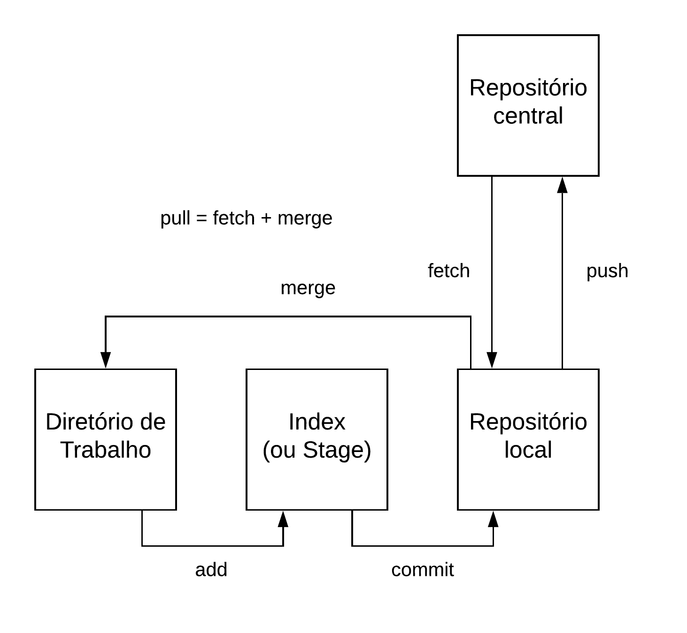
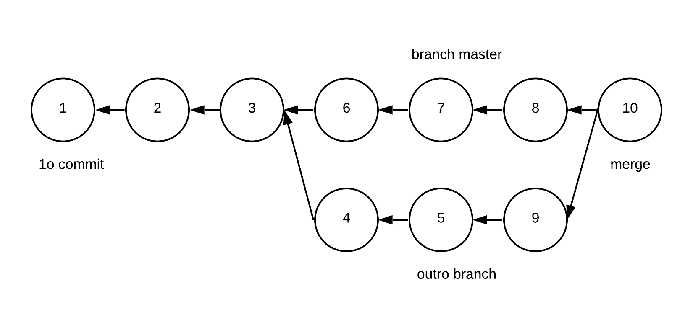
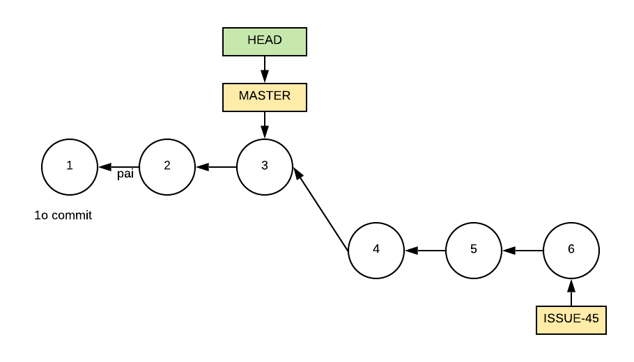
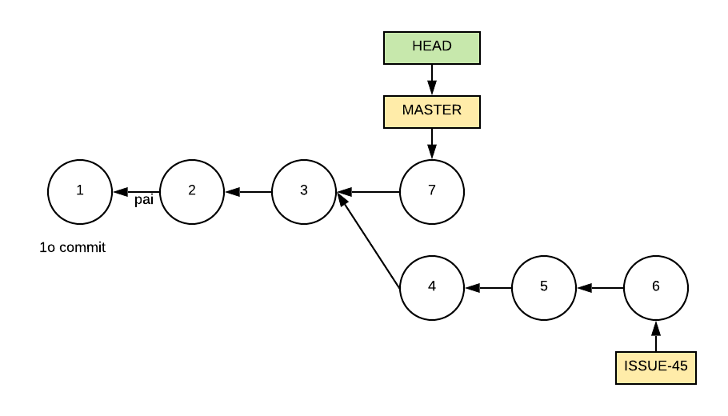
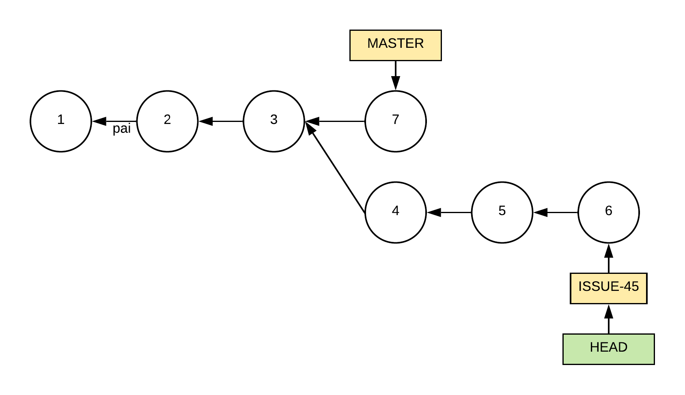

# Apêndice A - Git 

> *The best way to learn git is probably to first only do very basic things and not even look at some of the things you can do until you are familiar and confident about the basics. -- Linus Torvalds*

Neste apêndice, apresentamos e discutimos exemplos de uso do sistema Git, que é o sistema de controle de versões mais usado atualmente. Inspirados pela frase acima, de Linus Torvalds, criador do Git, vamos focar nos conceitos e comandos básicos desse sistema. Como sugere a frase, é importante dominar esses comandos antes de se aventurar no uso de comandos mais avançados. Caso o leitor não tenha conhecimento dos objetivos e vantagens proporcionados por um sistema de controle de versões, recomendamos primeiro a leitura da seção "Controle de Versões", do Capítulo 10 deste livro.

## A.1 Init & Clone

Para começar a usar o git para gerenciar as versões de um sistema
devemos executar um dos seguintes comandos: **init** ou **clone**. O
comando init cria um repositório vazio. O segundo comando — clone
— primeiro chama init para criar um repositório vazio. Em seguida,
ele copia para esse repositório todos os commits de um repositório
remoto, passado como parâmetro. Seja, por exemplo, o seguinte comando:

```
git clone https://github.com/NOME-USER/NOME-REPO
```

Esse comando clona para o diretório corrente um repositório armazenado
remotamente no GitHub. Portanto, devemos usar clone quando vamos
trabalhar em um projeto que já está em andamento e que já possui commits
em um repositório central. No exemplo, esse repositório é
disponibilizado pelo GitHub.

## A.2 Commit

Commits são usados para criar snapshots (ou fotografias) dos arquivos de
um sistema. Uma vez tiradas essas fotografias, elas são armazenadas no
sistema de controle de versões, de forma compactada e otimizada, para
não ocupar muito espaço em disco. Posteriormente, pode-se recuperar
qualquer uma das fotografias, para, por exemplo, restaurar uma
implementação antiga de um arquivo.

Recomenda-se que desenvolvedores realizem commits periodicamente, sempre
que tiverem efetuado uma mudança importante no código. Em DVCSs, como o
git, os commits são primeiro armazenados no repositório local do
desenvolvedor. Por isso, o custo de um commit é pequeno e, portanto,
desenvolvedores podem realizar diversos commits ao longo de um dia de
trabalho. Na verdade, o que não é recomendável é a realização de commits
grandes, com modificações importantes em diversos arquivos. Também não
recomenda-se que um commit inclua modificações relativas a mais de uma
tarefa de manutenção. Por exemplo, não é recomendável corrigir dois bugs
em um mesmo commit. Em vez disso, cada bug deve ser corrigido em um
commit separado. Assim, facilita-se uma futura análise do código, caso,
por exemplo, um cliente volte a reclamar que seu bug não foi corrigido.

Commits também possuem metadados, incluindo data, hora, autor e uma
mensagem, que descreve a modificação realizada pelo commit. A próxima
figura mostra uma página do GitHub que exibe os metadados principais de
um commit do repositório google/guava. Pode-se observar que o commit
refere-se a um refactoring, o que fica claro no seu título. Em seguida,
o refactoring é explicado em detalhes na mensagem do commit. Na última
linha da figura, podemos ver o nome do autor do commit e a informação de
que ele foi realizado há 13 dias.

{width=95%}

Na última linha da figura também podemos observar que todo commit possui
um identificador único, no caso:

`1c757483665f0ba8fed31a2af7e31643a4590256`

Esse identificador possui 20 bytes, normalmente representados em
hexadecimal. Esses bytes correspondem a uma verificação de consistência
(*check sum*) do conteúdo do commit, conforme computado por uma função
hash SHA-1.

## A.3 Add 

Na máquina local, o sistema git manipula três áreas distintas:

*   Um **diretório de trabalho**, onde devemos salvar os arquivos que
    pretendemos versionar. Às vezes, essa área é chamada também de
    árvore de trabalho (*working tree*).

*   O **repositório** propriamente dito, que armazena o histórico de
    commits.

*   Uma área intermediária, chamada de **index** ou **stage**, que
    armazena temporariamente os arquivos que se pretende versionar.
    Tais arquivos são ditos rastreáveis (**tracked)**.

Dentre essas três áreas, o desenvolvedor acessa apenas o diretório de
trabalho, que funciona como um diretório comum do sistema operacional.
As duas outras áreas são internas ao git e manipuladas exclusivamente
por ele. Como qualquer diretório, o diretório de trabalho pode conter
diversos arquivos. Porém, apenas aqueles adicionados ao index, por meio
de um comando **add**, serão gerenciados pelo git.

Além de armazenar a lista de arquivos versionados, o index também
armazena o conteúdo deles. Por isso, antes de fazer um commit devemos
executar um add, para salvar o conteúdo do arquivo no index. Feito isso,
podemos usar um commit para salvar no repositório local a versão
adicionada ao index. Esse fluxo é ilustrado na próxima figura.

{width=45%}

**Exemplo**: Suponha o seguinte arquivo simples, mas suficiente para
explicar os comandos add e commit.

```
// arq1 
x = 10; 
```

Após criar esse arquivo, o desenvolvedor executou o seguinte comando:

`git add arq1`

Esse comando adiciona o arquivo arq1 no index (ou stage). Porém, logo em
seguida, o desenvolvedor modificou de novo o arquivo:

```
// arq1
x = 20; // novo valor de x
```

Feito isso, ele executou:

`git commit -m "Alterando o valor de x"`

A opção `-m` informa a mensagem que descreve o commit. Porém, o ponto que
queremos ressaltar com esse exemplo é o seguinte: como o usuário não
executou um novo add após mudar o valor de `x` para 20, a versão mais
recente do arquivo não será salva pelo commit. Em vez disso, a versão de
arq1 que será versionada é aquela onde `x` tem o valor 10, pois ela é a
versão que consta do index.

Para evitar o problema descrito nesse exemplo, é comum usar um commit da
seguinte forma:

`git commit -a -m "Alterando valor de x"`

A opção `-a` indica que antes de executar o commit queremos adicionar no
index todos os arquivos rastreados (*tracked*) que tenham sido
modificados desde o último commit. Portanto, a opção `-a` não elimina a
necessidade de usar add. O uso desse comando continua sendo necessário,
pelo menos uma vez, para indicar ao git que desejamos tornar um
determinado arquivo rastreável.

Da mesma forma que existe um add, também existe uma operação para
remover um arquivo de um repositório git. Um exemplo é dado a seguir:

```
git rm arq1.txt
git commit -m "Removendo arq1.txt"
```

Além de remover do repositório git local, o comando rm também remove
o arquivo do diretório de trabalho.

## A.4 Push & Pull

O comando **push** copia os commits mais recentes do repositório local
para o repositório remoto. Portanto, ele é uma operação mais lenta, pois
envolve comunicação pela rede. Um push deve ser usado quando o
desenvolvedor deseja tornar uma modificação visível para os demais
desenvolvedores. Para atualizar seu repositório local, os outros
desenvolvedores do time devem executar um comando **pull**. Esse comando
realiza duas operações principais:

*   Primeiro, um pull copia os commits mais recentes do repositório
    central para o repositório local do desenvolvedor. Essa operação
    inicial é chamada de **fetch**.

*   Em seguida, o comando pull atualiza os arquivos do diretório de
    trabalho. Essa operação é chamada de **merge**.

A próxima figura ilustra o funcionamento dos comandos push e pull.

{width=50%}

**Exemplo**: Suponha que no repositório git central de um projeto exista
o seguinte arquivo:

```
void f() {
  ... 
}
```

Suponha que dois desenvolvedores, chamados Bob e Alice, realizaram um
pull e, portanto, copiaram esse arquivo para o repositório local e para
o diretório de trabalho de suas máquinas. A sintaxe desse comando é a
seguinte:

`git pull`

No mesmo dia, Bob implementou uma segunda função `g` no arquivo, que ficou
assim:

```
void f() // função antiga {
  ... 
}

void g() // implementada por Bob {
  ... 
}
```

Em seguida, Bob realizou um add, um commit e um push. Esse último
comando tem a seguinte sintaxe:

`git push origin master`

O parâmetro `origin` é um valor default, usado pelo git, para indicar o
repositório remoto, por exemplo, o repositório GitHub. Já o parâmetro
`master` indica o branch principal. Iremos estudar mais sobre branches
daqui a pouco.

Após executar o comando push acima, a nova versão do arquivo estará
salva também no repositório remoto. Alguns dias depois, Alice decidiu
que precisa alterar esse mesmo arquivo. Como ela ficou um tempo sem
trabalhar no sistema, o recomendado é que ela execute primeiro um pull,
para atualizar seu repositório local e seu diretório de trabalho com as
mudanças ocorridas nesse período, como aquela realizada por Bob. Assim,
após esse comando pull, o arquivo em questão será atualizado na máquina
da Alice, para incluir a função `g` implementada por Bob.


## A.5 Conflitos de Merge

Conflitos de merge acontecem quando dois desenvolvedores alteram o mesmo
trecho de código ao mesmo tempo. Para entender melhor essa situação,
nada melhor do que usar um exemplo.

**Exemplo**: Suponha que Bob implementou o seguinte programa:

```
main() {
  print("Helo, world!");
}
```
Concluída a implementação, Bob realizou um add, seguido de um commit e
um push.

Em seguida, Alice realizou um pull e obteve a versão do arquivo
implementada por Bob. Então, Alice resolveu traduzir a mensagem do
programa para Português:

```
main() {
  print("Olá, mundo!");
}
```

Enquanto Alice fazia a tradução, Bob percebeu que escreveu Hello de
forma errada, com apenas uma letra l. Porém, Alice foi mais rápida e
realizou a trinca de comandos add, commit e push.

Bob, após corrigir o erro de ortografia, salvou o arquivo e também
executou um add, seguido de um commit. Por fim, ele executou push, mas o
comando falhou com a seguinte mensagem de erro:

`Updates were rejected because the remote contains work that you do not have locally. This is usually caused by another repository pushing to the same ref. You may want to first integrate the remote changes (e.g., \'git pull \...\') before pushing again.`

A mensagem é bem clara: Bob não pode executar um push, pois o
repositório remoto possui conteúdo novo, no caso, gerado por Alice.
Antes de executar um push, Bob precisa executar um pull. Porém, ao fazer
isso, ele recebe uma nova mensagem de erro:

`CONFLICT (content): Merge conflict in arq2
Automatic merge failed; fix conflicts and then commit the result.`

Essa nova mensagem é também clara: existe um conflito de merge no
arquivo `arq2`. Ao editar esse arquivo, Bob vai perceber que ele foi
modificado pelo git, para destacar as linhas que geraram o conflito:

```
main() {                                                
 <<<<<<< HEAD                                     
 print("Hello, world!");                               
 =======                                                 
 print("Olá, mundo!");                                 
 >>>>>>> f25bce8fea85a625b891c890a8eca003b723f21b 
 }                                                       
```

As linhas inseridas pelo git devem ser entendidas da seguinte forma:

* Entre `<<<<<<< HEAD` e `=======` temos o código modificado por Bob,
isto é, pelo desenvolvedor que não conseguiu dar um push e teve que
dar um pull. `HEAD` designa que o código foi modificado no
último commit realizado por Bob.  

* Entre  `=======` e `>>>>>>> f25bce8 ...` temos o código modificado
 por Alice, isto é, pela desenvolvedora que executou com sucesso seu push.
`f225bce8...` é o ID do commit no qual Alice modificou essa parte do código.       


Cabe então a Bob resolver o conflito, o que é sempre uma tarefa manual.
Para isso, ele tem que escolher o trecho de código que vai prevalecer
— o seu código ou o da Alice — e editar o arquivo de acordo com
tal escolha, para remover os delimitadores inseridos pelo git. Vamos
supor que Bob decida que o código de Alice é o certo, pois agora o
sistema está usando mensagens em Português. Logo, ele deve editar o
arquivo, de forma que fique assim:

```
main() {                
  print("Olá, mundo!");                      
}                       
```

Veja que Bob removeu os delimitadores inseridos pelo git (`<<<<<<< 
HEAD` , `=======` e `>>>>>>> f25bce8...`). E também o comando `print`
com a mensagem em inglês. Após deixar o código da forma correta, Bob
deve executar novamente os comandos add, commit e push, que agora serão
bem sucedidos.

Nesse exemplo, mostramos um conflito simples, que ficou restrito a única
linha de um único arquivo. No entanto, um pull pode dar origem a
conflitos mais complexos. Por exemplo, um mesmo arquivo pode apresentar
vários conflitos. E também podemos ter conflitos em mais de um arquivo.

## A.6 Branches

O git organiza o diretório de trabalho em \"diretórios virtuais\",
chamados de **branches**. Até agora, não precisamos comentar sobre
branches porque todo repositório possui um branch default, chamado de
**master**, criado pelo comando init. Se não nos preocuparmos com
branches, todo o desenvolvimento ocorrerá no master. Porém, em alguns
casos, é interessante criar outros branches para melhor organizar o
desenvolvimento. Para descrever o conceito de branches, vamos de novo
usar um exemplo.

**Exemplo**: Suponha que Bob é responsável por manter uma determinada
funcionalidade de um sistema. Para simplificar, vamos assumir que essa
funcionalidade é implementada em uma única função `f`. Bob teve a ideia de
mudar completamente a implementação de `f`, de forma que ela passe a usar
algoritmos e estruturas de dados mais eficientes. Para isso, Bob vai
precisar de algumas semanas. No entanto, apesar de estar otimista, Bob
não tem certeza de que a nova implementação vai proporcionar os ganhos
que ele imagina. Por fim, mas não menos importante, durante a
implementação do novo código, Bob pode precisar do código original de `f`,
para, por exemplo, corrigir bugs reportados pelos usuários.

Esse é um cenário interessante para Bob criar um branch para implementar
e testar — de forma isolada — essa nova versão de `f`. Para isso,
ele deve usar o comando:

`git branch f-novo`

Esse comando cria um novo branch, chamado `f-novo`, supondo que esse
branch ainda não existe.

Para mudar do branch corrente para um novo branch, deve-se usar `git
checkout [nome-branch]`. Para descobrir qual o nome do branch corrente,
basta usar `git branch`. Na verdade, esse comando lista todos os branches
e indica qual deles é o corrente.

Branches podem ser entendidos como \"sub-diretórios virtuais\" do
diretório de trabalho. A principal diferença é que branches são
gerenciados pelo git e não pelo sistema operacional. Por isso, optamos
por chamá-los de virtuais. Explorando mais essa comparação, podemos
pensar que o comando `git branch [nome]` equivale ao comando `mkdir
[nome]`, com a diferença que o git não apenas cria um branch mas copia
para ele todos os arquivos do branch pai. Por outro lado, diretórios são
criados vazios pelo sistema operacional. Já o comando `git checkout
[nome]` lembra o comando `cd [nome]`. E `git status` lembra um misto de
comandos `ls` e `pwd`. Também para reforçar essa comparação, existem certos
comandos que permitem adicionar ao prompt do sistema operacional não
apenas o nome do diretório corrente mas também o nome do branch
corrente. Assim, o prompt pode ser exibido como
`c:\projetos\sistema1\master>`.

Por outro lado, existe também uma diferença importante entre branches e
diretórios. Um desenvolvedor somente pode alterar o branch corrente de A
para B se as modificações que ele fez em A estiverem salvas. Isto é, se
ele tiver realizado antes um add e commit. Caso ele tenha esquecido de
chamar esses comandos, um comando git checkout B irá falhar com a
seguinte mensagem de erro:

`Your local changes to the following files would be overwritten by checkout:
\[list of files\]                                                    
Please commit your changes or stash them before you switch branches.`


Voltando ao exemplo, após Bob ter criado o seu branch, ele deve proceder
do seguinte modo. Quando ele quiser trabalhar na nova implementação de
`f`, ele deve primeiro mudar o branch corrente para `f-novo`. Por outro
lado, quando ele precisar modificar o código original de `f` — aquele
que está em produção — ele deve se certificar de que o branch
corrente é o `master`. Independentemente do branch em que estiver, Bob
deve continuar usando add e commit para salvar o estado do seu trabalho.

Bob vai continuar nesse fluxo, alternando entre os branches `f-novo` e
`master`, até que a nova implementação de `f` esteja concluída. Quando isso
acontecer, Bob vai precisar copiar o novo código de `f` para o código
original. No entanto, como está usando branches, ele não precisa
realizar essa operação de forma manual. O git oferece uma operação,
chamada **merge**, que realiza exatamente essa cópia. A sintaxe é a
seguinte:

`git merge f-novo`

Esse comando deve ser chamado no branch que irá receber as modificações
realizadas em `f-novo`. No nosso caso, no branch master.

Como o leitor já deve estar pensando, um merge pode gerar conflitos,
chamados também de **conflitos de integração**. No caso específico de
merge de branches, esses conflitos vão ocorrer quando tanto o branch que
está recebendo as modificações (`master`, no nosso exemplo) como o branch
que está sendo integrado (`f-novo`, no exemplo) tiverem alterado os mesmos
trechos de código. Conforme discutido na Seção A.6, o git irá delimitar
os trechos com conflitos e caberá ao desenvolvedor que chamou o merge
resolvê-los. Isto é, escolher o trecho de código que deve prevalecer.

Por fim, após realizar o merge, Bob pode remover o branch `f-novo`, caso
não seja importante manter o histórico dos commits realizados para
implementar a nova versão de `f`. Para deletar `f-novo`, ele deve executar o
seguinte comando no branch master:

`git branch -d f-novo`

📚**Aprofundamento**: Commits podem possuir zero, um ou mais pais (ou
antecessores). Como ilustra a próxima figura, o primeiro commit de um
repositório não possui pai. Já um commit de merge possui dois ou mais
pais, que representam os branches que foram unidos. Os demais commits
possuem exatamente um pai.

{width=50%}

Um branch nada mais é do que uma variável interna do git que contém o
identificador do último commit realizado no branch. Existe ainda uma
variável chamada `HEAD`, que aponta para a variável do branch atual. Ou
seja, `HEAD` contém o nome da variável que contém o identificador do
último commit do branch atual. Um exemplo é mostrado a seguir:

{width=60%}

Nesse exemplo, podemos ver que existem dois branches, representados
pelas variáveis `MASTER` e `ISSUE-45`. Cada uma delas aponta para o último
commit de seu respectivo branch. A variável `HEAD`
aponta para a variável `MASTER`. Isso significa que o branch atual é o
`MASTER`. Se realizarmos um commit, a configuração mudará para:

{width=60%}

O novo commit tem identificador 7. Ele foi realizado no `MASTER`, já que
HEAD apontava para a variável desse branch. O pai do novo commit pai é o
antigo `HEAD`, no caso o commit 3. A variável `MASTER` avançou e passou a
apontar para o novo commit. Isso significa que, se não mudarmos de
branch, o pai do próximo commit será o commit 7.

Porém, se mudarmos para o branch `ISSUE-45`, a configuração passará a ser
a seguinte:

{width=60%}

A única mudança é que a variável `HEAD` passou a apontar para a variável
do novo branch, isto é, para a variável `ISSUE-45`. Isso é suficiente para
fazer com que o próximo commit seja realizado nesse branch, isto é, que
ela tenha o commit 6 como pai.

## A.7 Branches Remotos

Até esse momento, trabalhamos com branches localmente, isto é, os
branches que discutimos existem apenas no repositório local. No entanto,
é possível realizar o push de um branch local para um repositório
remoto. Para ilustrar esse recurso, vamos usar um exemplo semelhante ao
da seção anterior.

**Exemplo:** Suponha que Bob criou um branch, chamado g-novo, para
implementar uma nova funcionalidade. Ele realizou alguns commits nesse
branch e agora gostaria de compartilhá-lo com Alice, para que ela
implemente parte da nova funcionalidade. Para isso, Bob deve usar o
seguinte push:

`git push -u origin g-novo`

Esse comando realiza o push do branch corrente (`g-novo`) para o
repositório remoto, chamado pelo git de `origin`. O repositório remoto
pode, por exemplo, ser um repositório do GitHub. O parâmetro `-u` indica
que, no futuro, vamos querer sincronizar os dois repositórios por meio
de um pull (a letra do parâmetro vem da palavra *upstream*). Essa
sintaxe vale apenas para o primeiro push de um branch remoto. Nos
comandos seguintes, pode-se omitir o `-u`, isto é, usar apenas `git push
origin g-novo`.

No repositório remoto, será criado um branch `g-novo`. Para trabalhar
nesse branch, Alice deve primeiro criá-lo na sua máquina local, mas
associado ao branch remoto, por meio dos seguintes comandos, que devem
ser executados no master:

`git pull`

`git checkout -t origin/g-novo`

O primeiro comando é necessário para tornar o branch remoto visível na
máquina local. Já o segundo comando cria um branch local, chamado
`g-novo`, que Alice vai usar para rastrear mudanças no branch remoto
`origin/g-novo`, conforme indica o parâmetro `-t`, que vem da palavra
*tracking*. Em seguida, Alice pode realizar commits nesse branch. Por
fim, quando estiver pronta para publicar suas mudanças, ela deve
executar um push, com a sintaxe normal, isto é, sem o parâmetro `-u`.

Agora, Bob pode realizar um pull, concluir que a implementação da nova
funcionalidade está finalizada e, portanto, pode ser integrada no
master, por meio de um merge. Bob pode também deletar os branches local
e remoto, usando o seguinte par de comandos:

`git branch -d g-novo`

`git push origin \--delete g-novo`

E Alice também pode deletar seu branch local, chamando apenas:

`git branch -d g-novo`


## A.8 Pull Requests

Pull Pull requests é um mecanismo que viabiliza que um branch seja
revisado e discutido antes de ser integrado no branch principal. Quando
se usa pull requests, um desenvolvedor sempre implementa novas
funcionalidades em um branch separado. Concluída a implementação, ele
não integra imediatamente o novo código no branch principal. Antes que
isso ocorra, ele abre uma solicitação para que seu branch seja revisado
e aprovado por um segundo desenvolvedor. Essa solicitação para revisão e
integração de código é chamada de pull request. Trata-se de um mecanismo
mais comum no GitHub, mas que possui equivalente em outros sistemas 
de controle de versões.

Modernamente, o processo de revisão e integração do código de um pull
request ocorre via interface Web, provida, por exemplo, pelo GitHub.
Porém, se essa interface não existisse, o revisor teria que começar o
seu trabalho realizando um pull do branch para sua máquina local. Daí
então a origem do nome, isto é, pull request é uma solicitação
(*request*) para que um segundo desenvolvedor revise e integre um
determinado branch. Para atender a essa solicitação, ele deve começar
realizando um pull do branch.

A seguir, vamos detalhar o processo de submissão e revisão de pull
requests por meio de um exemplo.

**Exemplo**: Suponha que Bob e Alice são membros de uma organização que
mantém um repositório chamado awesome-git, com uma lista de links
interessantes sobre git. Os links ficam armazenados no arquivo README.md
desse repositório, isto é, na sua página principal, cujo endereço é
github.com/aserg-ufmg/awesome-git. Qualquer membro da organização pode
sugerir a adição de links nessa página. Mas veja que estamos usando a
palavra sugerir. Isto é, eles não podem fazer um push diretamente no
branch master. Em vez disso, a sugestão de link precisa ser revisada e
aprovada por um outro membro do time.

Bob resolveu então sugerir a adição, nessa página, de um link para o presente
apêndice do livro Engenharia de Software Moderna. Para isso, ele
primeiro clonou o repositório e criou um um branch, chamado `livro-esm`,
por meio dos seguintes comandos:

`git clone https://github.com/aserg-ufmg/awesome-git.git`                    
`git checkout livro-esm`
                                    
Em seguida, Bob editou o arquivo README.md, adicionando a URL do 
apêndice. Por fim, ele realizou um add, um commit e fez um push 
do branch para o GitHub:

`git add README.md`                
`git commit -m "Livro ESM"`      
`git push -u origin livro-esm`

Na verdade, esses passos não são novidade em relação ao  que vimos na
seção anterior. No entanto, as diferenças começam  agora. Primeiro, Bob deve ir
na página do GitHub e selecionar o branch `livro-esm`. Feito isso, o GitHub
mostrará um botão para criação de pull requests. Bob deve clicar nesse botão e
descrever o seu pull request, como mostra a próxima figura.

{width=65%}

Um pull request é uma solicitação para que um outro desenvolvedor revise
e, se for o caso, realize o merge de um branch que você criou.
Consequentemente, pull requests são um recurso para que uma organização
passe a adotar **revisões de código**. Ou seja, desenvolvedores não
integram diretamente o seu código no master do repositório remoto. Em
vez disso, eles solicitam, via pull requests, que outros desenvolvedores
revisem primeiro esse código e então façam o merge.

Na página do GitHub para criação de pull requests, Bob pode informar que
deseja que seu código seja revisado pela Alice. Ela será então
notificada que existe um pull request esperando sua revisão. Também via
interface do GitHub, Alice pode revisar os commits do pull request
criado por Bob, inclusive por meio de um um diff entre o código novo e o
código antigo. Se for o caso, Alice pode trocar mensagens com Bob, para
esclarecer dúvidas sobre o novo código. Mais ainda, ela pode solicitar
mudanças no código. Nesse caso, Bob deve providenciar as mudanças e
realizar um novo add, commit e push. Então, os novos commit serão
automaticamente anexados ao pull request, para que Alice possa conferir
se o seu pedido foi atendido. Estando a modificação aprovada, Alice pode
integrar o código no master, bastando para isso clicar em um dos botões
da página de revisão de pull requests.

## A.9 Squash

Squash é um comando que permite unir diversos commits em um único
commit. É uma operação recomendada, por exemplo, antes de submeter pull
requests.

**Exemplo**: No exemplo anterior, suponha que o pull request criado por
Bob tivesse cinco commits. Mais especificamente, ele está sugerindo o
acréscimo de cinco novos links no repositório awesome-git, os quais
foram coletados por ele ao longo de algumas semanas. Após a descoberta
de cada link, Bob executou um commit na sua máquina local. E deixou para
realizar o pull request apenas após acumular cinco commits.

Para facilitar a revisão de seu pull request por parte de Alice, Bob
pretende unir esses cinco commits em um único commit. Assim, em vez de
analisar cinco commits, Alice vai ter que analisar apenas um. Porém, a
modificação submetida será exatamente a mesma, isto é, ela consiste na
inclusão de cinco novos links na página. Porém, em vez de a solicitação
estar distribuída em cinco commits (cada commit, adicionando um único
link), ela estará concentrada em apenas um commit (adicionando cinco
links).

Para realizar um squash, Bob deve chamar:

`git rebase -i HEAD\~5`

O número 5 significa que pretende-se unir os cinco últimos commits do
branch atual. Um editor de textos será aberto com uma lista contendo o
ID e a descrição de cada um, como mostrado a seguir:

```
pick 16b5fcc Inclusão do link 1
pick c964dea Inclusão do link 2
pick 06cf8ee Inclusão do link 3
pick 396b4a3 Inclusão do link 4
pick 9be7fdb Inclusão do link 5
```

Bob deve então usar o próprio editor para substituir a palavra pick por
squash, exceto aquela da primeira linha. O arquivo ficará então assim
(com os squash adicionados em negrito):

```
pick 16b5fcc Inclusão do link 1
squash c964dea Inclusão do link 2
squash 06cf8ee Inclusão do link 3
squash 396b4a3 Inclusão do link 4
squash 9be7fdb Inclusão do link 5
```

Bob deve então salvar o arquivo. Automaticamente, um novo editor será
aberto, para ele informar a mensagem do novo commit — isto é, do
commit que junta os cinco commits listados. Uma vez informada a
mensagem, Bob deve salvar o arquivo e, então, o squash estará
finalizado.

A.10 Forks
==========

Fork é o mecanismo que o GitHub oferece para clonar repositórios
remotos, isto é, repositórios armazenados pelo próprio GitHub. Um fork é
realizado via interface do GitHub. Na página de qualquer repositório,
existe um botão para realizar essa operação. Se fizermos um fork do
repositório torvalds/linux será criado uma cópia desse repositório na
nossa conta do GitHub, chamado, por exemplo, mtov/linux.

Como fazemos sempre neste apêndice, vamos usar um exemplo para explicar
essa operação.

**Exemplo**: Suponha o repositório github.com/aserg-ufmg/awesome-git,
usado no exemplo sobre pull requests. Suponha ainda uma terceira
desenvolvedora, chamada Carol. Porém, como Carol não é membro da
organização ASERG/UFMG, ela não tem permissão para realizar push nesse
repositório, como fez Bob no exemplo anterior. Apesar disso, Carol acha
que na lista atual falta um link importante e interessante, cuja
inclusão ela gostaria de sugerir. Mas relembrando: Carol não pode seguir
os mesmos passos usados por Bob no exemplo anterior, pois ela não tem
permissão para dar push no repositório em questão.

Para resolver esse problema, Carol deve começar criando um fork do
repositório. Para isso, basta clicar no botão fork, que existe na página
de qualquer repositório no GitHub. Assim, Carol terá na sua conta do
GitHub um novo repositório, cujo endereço será o seguinte:
github.com/carol/awesome-git. Ela poderá clonar esse repositório para
sua máquina local, criar um branch, adicionar o link que deseja na lista
de links e realizar add, commit e push. Essa última operação será
realizada no repositório resultante do fork. Por último, Carol deve ir
na página do seu fork no GitHub e solicitar a criação de um pull
request. Como o repositório é um fork, ela terá agora uma opção extra:
destinar o pull request para o repositório original. Assim, caberá aos
desenvolvedores do repositório original, como Bob e Alice, revisar e, se
for o caso, aceitar o pull request.

Portanto, fork é um mecanismo que, quando combinado com pull requests,
viabiliza que um projeto de código aberto receba contribuições de outros
desenvolvedores. Explicando um pouco melhor, um projeto de código aberto
pode receber contribuições — mais especificamente, commits — não
apenas de seu time de desenvolvedores (Bob e Alice, no nosso exemplo),
mas de um outro desenvolvedor com conta no GitHub (como é o caso de
Carol).

## Bibliografia

* Scott Chacon; Ben Straub. Pro Git. 2a edição, Apress, 2014.

* Rachel M. Carmena. How to teach Git. Blog post
[(link)](https://rachelcarmena.github.io/2018/12/12/how-to-teach-git.html).

## Exercício

Neste apêndice, mostramos diversos exemplos. Tente reproduzir cada um
deles. Nos exemplos que envolvem repositórios remotos, a sugestão é usar
um repositório do GitHub. Nos exemplos que envolvem dois usuários (Alice
e Bob, por exemplo), a sugestão é criar dois diretórios locais e usá-los
para reproduzir os comandos de cada usuário.
