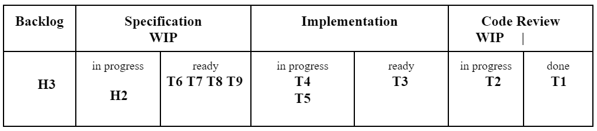
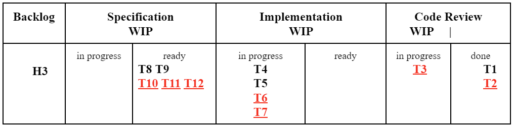
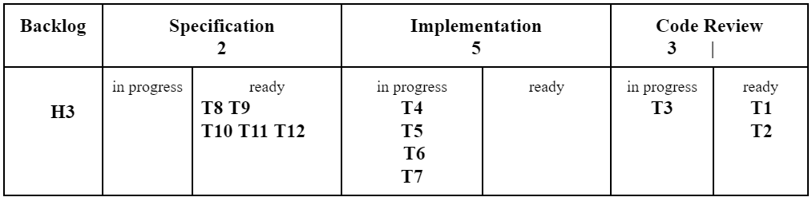

# Processes

> *In software development, perfect is a verb, not an adjective. 
There is no perfect process. There is no perfect design. There 
are no perfect stories. You can, however, perfect your 
process, your design, and your stories.* -- Kent Beck

\index{Software Process}
This chapter starts with a discussion on the importance of
software process (Section 2.1). Next, we discuss general and 
foundational aspects of agile processes 
(Section 2.2), including a discussion into the historical context 
that motivated the emergence of these processes. The next sections 
focus on three agile methods: Extreme Programming (Section 2.3), 
Scrum (Section 2.4), and Kanban (Section 2.5). Following that, 
we comment on scenarios where agile methods might not be the
most recommended processes (Section 2.6). Lastly, in Section 2.7, 
we briefly present some traditional processes, such as the 
Unified Process.

## Importance of Processes

The production of a car in an automobile factory follows a 
well-defined process. In simple terms, sheets 
of steel are initially cut and pressed to shape doors, roofs, 
and hoods. Next, the car is painted and components like the 
dashboard, seats, seat belts, and wiring are installed. 
Finally, the mechanical parts, including the engine, 
suspension, and brakes, are fitted.

Analogously, software production should follow a **process**, 
although less mechanized and more dependent on intellectual 
endeavor. A software development process defines a series 
of steps, tasks, events, and practices that developers must 
observe while developing a software system.

\index{Torvalds, Linus}
\index{Knuth, Donald}
\index{TeX}
\index{Linux}
There are some who critique software processes and question 
their need, often asking: "Why must I follow a process?" 
or "What process did Linus Torvalds or Donald Knuth 
used when implementing the Linux operating system or the 
TeX text formatter?" 

In reality, the second question above do not apply to 
our context as both Linux (in its initial versions) and TeX 
were individual projects led by a single developer. In such 
scenarios, following a process is less important. Stated in
better terms, the process followed in those projects was a
personal one, reflecting the principles, practices, and 
experience of a single developer.

However, contemporary software systems are too complex to be 
developed by a single developer. Thus, systems implemented by 
solitary heroes are increasingly rare nowadays. In practice, 
modern systems---the focus of this book---are developed 
by **teams**.

However, these teams require at least a minimal set of rules to produce 
quality software efficiently. That's why software companies invest 
so much in software processes. They serve as tools for
companies to coordinate, motivate, organize, and evaluate 
their developers, ensuring at the same time productivity 
and alignment with the organization's goals. Without a 
process---even a light and simplified one, such as the 
agile methods we will study in this chapter---there is a 
risk that teams will work in a uncoordinated way, 
creating products with no business value. Finally, processes 
not only benefit the company, but they also serve developers by 
clarifying expected tasks and outcomes, thus reducing misalignment 
among team members.

In this chapter, we explore various software processes. 
In fact, in Chapter 1, we already presented a first introduction
to Waterfall and Agile methods. In the following sections, we will 
continue this discussion and present three well-known Agile methods.

## Agile Manifesto

\index{Agile Manifesto}
The earliest software development process---as the Waterfall
process, proposed in the 1970s---followed a sequential approach. 
Usually, projects began with a requirement specification phase 
and ended with the implementation, testing, deployment, and 
maintenance phases.

Given the historical context, this strictly sequential approach 
was understandable. Indeed, traditional engineering projects are  
developed sequentially and are based on detailed and upfront
planning. Therefore, it's not a surprise that the emerging 
Software Engineering field mirrored the processes of 
longer-established domains like Electronics, Civil, Mechanical, 
and Aeronautical Engineering, among others.

However, by the 80s, the industry began to recognize that 
software is different from other engineering products. The 
recurrent problems faced by software projects at this time 
reinforced this conclusion. For instance, such projects 
routinely overshot schedules and budgets. Some were even 
abandoned after years of effort without delivering a functioning 
system to customers.

\index{CHAOS Report}
The CHAOS Report published in 1994 by the Standish Group 
consulting firm provided more details about the state of 
software projects at the time. This report
([link](https://www.standishgroup.com/sample_research_files/chaos_report_1994.pdf))
revealed that over 55% of projects surpassed their  
deadlines by 51% to 200%; and at least 12% exceeded the 
deadlines by more than 200%, as shown in the next figure.

{width=90%}

In terms of costs, almost 40% of the studied projects overshot 
their budgets by 51% to 200%, as indicated in the following 
figure:

{width=90%}

Therefore, in 2001, some industry professionals gathered in 
Snowbird, Utah, to discuss and propose an alternative to the 
prevailing Waterfall-based processes. They argued that, being 
different from traditional engineering products, software requires 
a distinct development process.

For instance, software requirements change more frequently 
than those of a computer, airplane, or bridge. Moreover, 
customers often lack a clear understanding of their needs. 
As a result, there is always a risk of designing a product that will 
be obsolete by the time it's finished due to changing circumstances 
or customer needs. The professionals that met at Utah also 
identified issues with the document-centric approach advocated
by Waterfall. At the time, requirements documents were detailed, 
heavy, and dense, which contributes to making them obsolete 
very quickly as developers would not update the documentation 
to reflect requirement changes.

In response, the group proposed a new type of software process, 
which was described in a document they named the **Agile 
Manifesto**. The manifesto reads:

> Through this work, we have come to value:
>
> **Individuals and interactions** over processes and tools
>
> **Working software** over comprehensive documentation
>
> **Customer collaboration** over contract negotiation
>
> **Responding to change** over following a plan.

\index{Agile Methods}
Agile processes are characterized by short and iterative 
development cycles. Systems are built incrementally, starting 
with the most relevant features, according to customers. Initially, 
a first version of the system is created, which implements only 
high-priority functionalities. This version is then validated 
by the customer. If approved, a new cycle---also callled **iteration** 
or **sprint**---begins, adding a few more features.  Typically, 
these cycles are short, having two weeks, for example. This 
allows the systems to be incrementally built, with each feature 
increment receiving explicit approval by the customer. The 
development ends when all the customer's requests have been 
implemented.

\index{Waterfall}
The following figures present a comparison between Waterfall and 
Agile methods:

{width=90%}

{width=90%}

However, the previous figures may suggest that in agile development, 
each iteration replicates a mini-Waterfall process, encompassing 
all the Waterfall phases. This isn't accurate; generally, iterations 
in agile methods aren't a series of tasks like in Waterfall (more 
details in the following sections). The figure may also suggest 
that a system must be put into production at the end of each 
iteration. This is also incorrect. Indeed, the objective is to 
deliver a functional system that performs useful tasks. However, 
the decision to launch the software involves other variables such 
as business risks, hardware resources availability, marketing 
campaigns, user training, etc.

Other agile process characteristics include:

*  Minimal emphasis on documentation: Only vital information should 
be documented.

* Less emphasis on detailed plans: At the start of a project, often 
neither the customer nor the developers have a clear understanding 
of all requirements that should be implemented. Such understanding 
gradually unfolds as sprints are finished and validated. In other 
words, the essence of agile development is to advance even when 
we have incomplete, partial, and changing requirements.

* No dedicated design phase, i.e., no Big Design Up Fron (BDUF): 
The design of the software system is also incremental, evolving 
on each iteration.

*  Small teams: Teams typically comprise about a dozen 
developers or, as Amazon CEO Jeff Bezos phrased it, "teams that 
can be fed with two pizzas". We also like to say that the size of 
agile teams varies between the size of a basketball team 
(5 members) to the one of a soccer team (11 members).

*  Emphasis on novel programming practices (as in the early 2000s), 
such as pair programming, automated testing, refactoring, and 
continuous integration.

Due to such characteristics, agile processes are considered 
**light processes**, having few prescriptions and documents.

However, the characteristics we presented above are still generic 
and broad. Thus, to make agile principles more concrete and 
actionable, several methods were proposed and defined. Interestingly, 
they were all initially proposed before the 2001 Agile Manifesto's 
meeting. Particularly, in this chapter, we will study three 
agile methods:

*  Extreme Programming (XP): Kent Beck proposed this method in 
a 1999 book ([link](https://dl.acm.org/citation.cfm?id=318762)). 
A second and heavily revised edition was also released in 2004.

*  Scrum: This agile method was introduced by Jeffrey Sutherland
 and Ken Schwaber in a 1995 article 
 ([link](https://dl.acm.org/citation.cfm?id=260274)).

*  Kanban: This method originated from a production control 
system implemented in Toyota's factories in the 1950s 
([link](https://hbr.org/1986/01/the-new-new-product-development-game)). 
Over the past years, Kanban has been gradually adapted for 
software development.

It's also important to understand that all development methods 
are essentially a set of recommendations. Every organization should 
analyze each one and decide if it's suitable for their particular 
context. Consequently, organizations might need to adapt any
existing method to their needs. For this reason, it's rare to see two 
organizations that follow exactly the same development process. 
For instance, even if they say they're using Scrum.

```{=latex}
\begin{esmbox}
```
**In-Depth**: The terms process and methods are often used
interchangeably. However, there are also subtle differences between
them. In our context, a process is a set of steps, events, and tasks 
used to construct software. Every organization employs a process 
to develop its systems, which can be Agile, Waterfall, or even 
a "chaotic" one. However, a process always exists. On the other hand, 
a method specifies a particular process (the term 
originates from Greek, meaning "the means to achieve a 
goal"). Therefore, XP, Scrum, and Kanban are agile methods or, 
put another way, they define practices, activities, events, 
and techniques compatible with agile principles. 
```{=latex} 
\end{esmbox} 
```

\index{Stack Overflow survey}
```{=latex} 
\begin{esmbox} 
```
**Real World Insight**: The widespread success and impact of agile 
methods are noteworthy. At present, an overwhelming majority of 
organizations, irrespective of their size or business domain, 
follow agile principles to varying degrees. Here's an interesting 
statistic: in 2018, the Stack Overflow survey included a question 
about the most used development methods
([link](https://insights.stackoverflow.com/survey/2018/#career-values)).
Over 57 thousand professional developers responded, and a majority 
identified with agile methods or practices. This includes 
methodologies we will study in this chapter---such as Scrum 
(63% responses), Kanban (36%), and Extreme Programming (16%). 
Only 15% of participants answered Waterfall as their development 
method.
```{=latex}
\end{esmbox}
```

## Extreme Programming

\index{Extreme Programming}
Extreme Programming (XP) is a lightweight method for developing 
software with ever-changing or unclear requirements, such as the 
Type B systems (Business), according to the classification described 
in Chapter 1. As any agile method, XP embodies characteristics like 
short iterative development cycles, less emphasis on comprehensive 
documentation, incremental design, and development in small teams. 

In other words, XP is not a prescriptive method that proposes a 
step-by-step plan for software construction. Instead, 
XP is defined by a set of **values**, **principles**, and **practices**. 
The values and principles are important to shape the culture of 
software development teams. Then, they are materialized into a list 
of development practices. Often, when deciding to adopt XP, 
developers and organizations tend to focus on the practices. However, 
the values and principles are key components of the method, as 
they give meaning to the practices proposed by XP. To be clear, 
if an organization is unprepared to embrace the XP mindset---as 
represented by its values and principles---it should not invest 
time in adopting the practices.

In this chapter, we will first present the values and principles 
defended by XP. Here is a list of them:

* **Values**: Communication, simplicity, feedback, courage, 
respect, and quality of life. 

* **Principles**: Humanity, economics, mutual benefits, 
continuous improvements, acknowledging failures, baby steps, 
and personal responsibility.

Next, we'll explain the practices, which we organize into 
three groups: process practices, programming practices, and 
project management practices. Here is a list of the practices 
within each group:

* **Process Practices**: Customer representative, user stories, 
iterations, releases, release planning, iteration planning, 
planning poker, and slacks.

* **Programming Practices**: Incremental design, pair programming, 
test-driven development (TDD), automated builds, continuous integration.

* **Project Management Practices**: Metrics, working environment, 
open-scope contracts.

### Values

\index{Extreme Programming!Values}
XP advocates that software projects should be guided by three main 
values: communication, simplicity, and feedback. Indeed,  
these values are important in any human collaboration effort. 
Good **communication** is important not only to avoid mistakes but also 
to learn from them. The second XP value is **simplicity**, as in every 
complex and challenging software system there is a simpler system 
that is sometimes overlooked. Lastly, continuous **feedback** from 
stakeholders counterbalances risks like changing requirements and 
technologies. 

In fact, it is difficult to develop the "right" software system 
at the first attempt. Frederick Brooks has a well-known recommendation 
regarding this problem:

> *Plan to throw away parts of your system, because you will.*

Thus, feedback is an essential value to ensure that the software 
parts that are going to be discarded are identified as early as 
possible, to reduce waste and rework. Besides, XP also defends 
other values such as **courage**, **respect**, and **quality of life**.

### Principles

\index{Extreme Programming!Principles}
While XP's values are abstract, its practices are concrete and 
pragmatic. To bridge this gap between values and practices, XP encourages 
following a set of principles. Picture it as a river with the values 
on one side and the practices on the other. Principles act as a bridge 
between both sides. The main XP principles are:

**Humanity**. Software is a activity that depends on human capital. 
The principal resource of software companies are not physical 
assets---computers, buildings, chairs, or Internet connections, 
for example---but their developers. A term that nicely reflects the
importance of  this principle is *peopleware*, which was coined by 
Tom DeMarco in a book with the same title 
([link](https://dl.acm.org/citation.cfm?id=2505459)). 
The idea is that managing people---including factors such as 
expectations, growth, motivation, and responsibilities---is essential 
for the success of software projects.
 
**Economics**: Software development requires substantial 
financial investment. Hence, it's not merely an intellectual pursuit; 
it must deliver economic results, particularly in the case of
Type B (Business) systems, according to the classification we
studied in Chapter 1. 

**Mutual Benefits**: XP advocates that decisions taken in a 
software project should benefit multiple stakeholders. For example, 
a software company should ensure a good work environment; in return, 
the team should deliver a software that adds value to its business. 
Another example: by writing tests a developer benefits, as tests 
help to detect bugs in her code. But tests also help other developers, 
who will be more confident that their code does not introduce 
regressions, i.e., bugs in previously working code. A third and last 
example: refactoring makes code cleaner and easier to understand, 
both for the developer who wrote it and for a developer who in the 
future will have to maintain it.

**Continuous Improvements**: As expressed in the quote by Kent 
Beck opening this chapter, no software development process is 
perfect. Therefore, what we should aim is a process that is 
under continuous improvement, at each iteration, with feedback from 
clients and team members. For the same reason, XP does not recommend 
investing a large amount of time in an initial and complete design. 
Instead, the software's design is also incremental, improving at 
each iteration. Finally, the programming practices themselves 
can be improved; for this, the team should set aside time to 
discuss and reflect on them.

**Failures Happen**: Software development is not a risk-free 
endeavor. As discussed in Chapter 1, software is one of the most 
complex human constructions. Thus, failures are expected in software
projects, including major bugs, features that did not attracted users, 
and issues with non-functional requirements, such as performance, 
usability, privacy, availability, etc. Evidently, XP does not advocate 
covering up these failures. However, they should not be used to punish 
team members. On the contrary, failures are part of the game if a team 
aims to deliver software that solves problems at the right time.

**Baby Steps**: A secure, tested, and validated progress, albeit 
small, is better than large software increments with risks of being 
discarded by the users. The same applies to tests (which are useful 
even when the units under test are small, such as individual methods), 
code integration (it's better to integrate daily, than to go through 
the stress of a major integration after weeks of work) and 
refactorings (which should occur in small steps intercalated with
running the tests). In summary, it's important to focus on continuous 
improvements, no matter how small, as long as they're in the right 
direction. Indeed, in software engineering, "baby steps" are usually 
better than major changes, which tend to be risky and may not lead 
to positive outcomes.

**Personal Responsibility** (or accepted responsibility): According 
to this principle, developers should have a clear idea of their role 
and responsibility in the team. The reason is that responsibility 
cannot be transferred without the other party accepting it. For a 
similar reason, XP advocates that the developer who implements 
a *user story*---i.e., a small feature increment---should also be also 
the one who will test and maintain it.

\index{Chrysler}
```{=latex}
\begin{esmbox}
```
**Real World Insight**: One of the first systems to adopt XP was a 
payroll system for the car manufacturer Chrysler, called Chrysler 
Comprehensive Compensation (C3) system 
([link](https://doi.org/10.1109/2.796139)). 
The project began in early 1995 and, as it failed to 
deliver concrete results, it was restarted the following year 
under the leadership of Kent Beck. Another well-known member of 
the agile community, Martin Fowler, participated in the project 
as a consultant. While building the C3 system, many facets of the 
soon-to-be-named XP method were defined and experimented with.
```{=latex}
\end{esmbox}
```

### Process Practices

\index{Extreme Programming!Practices}
\index{Extreme Programming!Customer Representative}
\index{User Stories}

Just like other agile methodologies, XP recommends direct client 
involvement in the project, not limiting the team members to 
developers only. When using XP, teams should include one 
**customer representative** who is an expert on the domain of the 
system under development. This representative should propose and 
write the **user stories**, which are XP's version of requirement 
specification documents. However, user stories are rather short and 
lightweight documents, comprising two to three sentences, in which 
the customer representative describes the features the system 
should implement.

We'll examine user stories more closely in Chapter 3. For now, we 
should note that they are usually written on cards, by hand or using
project management tools. As we mentioned, they are simple 
documents focusing on the key features of the system from a user 
perspective, as opposed to complex requirement documents, which are 
used for example with Waterfall-based approaches. 

Here's an example of user story for a Question & Answer (Q&A) forum 
app---similar to Stack Overflow---which we'll use to present XP in 
this chapter.

--------------------------------------------------------------  
**Post Question**

*A logged-in user should be able to post questions. Since 
it's a programming forum, questions may incorporate code blocks, 
which must be presented in a differentiated layout.*
--------------------------------------------------------------  

Note that the story has a title (Post Question) and a brief description 
in two sentences. These stories serve as reminders for 
subsequent detailed verbal specifications by the customer 
representative. In other words, developers can at any time consult 
the customer representative to clarify issues about user stories.

After creation by the customer representative, developers should
estimate the effort required for implementing the stories. This 
estimation is often performed in **story points**, instead of 
hours or man-days. An integer scale is used in these cases
to label stories as having a certain number of story points. 
The simplest stories are marked as having one story point. If a 
story is twice as complex, it is marked with two story points, 
and so on. Indeed, story points are commonly defined by a 
Fibonacci sequence, such as 1, 2, 3, 5, 8, 13. The goal is to 
use a scale that makes the stories progressively harder and also 
allows the team to make comparisons similar to the following
one: in terms of effort, is a task that has 8 story points 
equivalent to a task with 5 story points plus a task with 3 
points (i.e., the two previous marks in the scale)? If yes, 
8 story points is a good estimate. If not, it is better to estimate 
the story with 5 story points.

\index{Planning Poker}
\index{User Stories!Planning Poker}
```{=latex}
\begin{esmbox}
```
**In-Depth**: A technique for estimating story points is 
called **Planning Poker**. Here's how it works: the customer 
representative selects a story, reads it to the developers, who 
can discuss it with the representative to clarify any doubts. 
After that, each developer independently estimates the story's 
size in story points, and then everyone simultaneously reveals 
their estimates using previously distributed cards with numbers 
1, 2, 3, 5, etc. If there is consensus, the team moves to the next 
story. If not, there is a discussion and further voting until 
common ground is found.
```{=latex}
\end{esmbox}
```

\index{Extreme Programming!Releases}
The user stories are implemented in **iterations**---which 
have a fixed duration, usually ranging between one to three weeks. 
These iterations are also organized in longer cycles, referred to 
as **releases**, typically lasting two to three months. 
A team's **velocity** is the number of story points it can 
implement within an iteration. The customer representative should 
propose and create stories that take at least one release to implement. 
Hence, in XP, the planning horizon is one release, which may span a 
few months.

**Note**: The term release in XP differs from its usage in 
configuration management where it refers to a version of a 
system that is available for usage. However, the version produced 
at the end of a release in XP does not necessarily need to go 
into production.

To summarize, to initiate the use of XP, an organization should:

*   Define the duration of an iteration.
*   Define the number of iterations in a release.
*   Set a list of stories, as proposed the customer representative.
*   Get estimates for each story from the developers.
*   Define the team's velocity, that is, the number of story points that
   it can implement per iteration

Upon defining the above aspects, the customer representative must 
prioritize the stories. To do this, the representative must select the stories 
to be implemented in each iteration of the first release. In this
prioritization, the team's velocity should be taken into account.
For example, assume that a team has a velocity of 25 story points
per iteration. In this case, the customer representative cannot allocate
stories to an iteration whose combined story points exceed this limit.
The process of assigning stories to iterations and releases is 
known as **release planning** or planning game, which is the term 
used in the first edition of the XP book.

For example, consider the Q&A forum we used earlier. The next table 
summarizes the outcome of a possible release planning. In this example, 
we are assuming that the customer representative wrote 8 stories, 
that each release has two iterations, and that the team's velocity 
is 21 story points per iteration (note that the sum of the story 
points of each iteration is exactly 21).

 **Story**                                  **Story Points**   **Iteration**  **Release**
 ----------------------------------------- ------------------ -------------- -------------
 Register user                              8                  1              1
 Post questions                             5                  1              1
 Post answers                               3                  1              1
 Opening screen                             5                  1              1
 Gamify questions/answers                   5                  2              1
 Search questions/answers                   8                  2              1
 Add tags                                   5                  2              1
 Comment on questions/answers               3                  2              1


The table emphasizes two points: (1) the stories in XP represent 
the main features of the intended system; (2) developers have 
no control on the order of story implementation; this is decided by 
the customer representative, who must be someone capable and 
with authority to define the most urgent and important features for 
the organization contracting the development.

After the release planning, the iterations start.
At the beginning of each iteration, the development team must meet 
to conduct an **iteration planning**. The purpose of this planning is
to decompose the stories of an iteration into tasks that can be 
assigned to one of the team's developers. For example, the *Post questions* 
story can be decomposed into the following tasks:

*   Design and test the web interface, including layout, CSS templates, etc.
*   Install the database server, as well as design and create the database tables.
*   Implement the data access layer.
*   Install and test the web server framework.
*   Implement the control layer, with endpoints to register, remove, and update questions.
*   Implement the Web interface.

Generally, tasks should not be complex and should be completed in a few days.

So, an XP project encompasses:

*   Releases, which are groups of iterations spanning a few months
*   Iterations, which are groups of stories and respective tasks, lasting a few weeks
*   Tasks, which take a few days to complete

Once the tasks are created, the team should also decide who is 
responsible for each one. With that, the iteration begins with 
task implementation.

An iteration concludes when all its stories have been implemented 
and validated by the customer representative. Therefore, at an 
iteration's end, the stories should be demonstrated to the customer 
representative, who must check and confirm their implementations.

\index{Slacks}
XP also proposes that teams should program **slack** tasks, 
or tasks that can be postponed, during an iteration. Examples include 
studying a new technology, taking an online course, improving 
documentation, or even developing a side project. 
In fact, companies like Google are renowned for allowing developers 
to use 20% of their time for personal projects 
([link](https://arxiv.org/abs/1702.01715)). In XP, slack tasks 
have two primary objectives: (1) create a buffer that can be used should 
a task require more time than estimated and (2) allow developers some 
downtime from the demanding and intense project pace.


#### Frequently Asked Questions {.unnumbered}

Now let's answer some questions about the XP practices we have 
just studied.

**How long should an iteration be?** There isn't a definitive answer as 
numerous factors such as team characteristics, system domain, and 
requirements all play a part. Short iterations---typically a week 
long---offer quick feedback. However, they also require more client 
involvement as new software increments need weekly validation. 
Moreover, stories must be simple and straightforward to fit in a
1-week iteration. Conversely, longer iterations---like a month---grant 
the team more time to plan and execute tasks with less pressure. The 
trade-off here is delays in receiving client feedback, which is 
particularly relevant when the requirements are unclear. As a result, 
a 2-3 week time box tends to provide a balance between rapid feedback 
and less pressure on the team. Another useful recommendation is 
to experiment, meaning testing and evaluating different durations 
before settling on one.

**What role does the customer representative play during iterations?**
At the beginning of a release, the customer representative drafts 
the stories to be included in that release. They then validate 
and approve the implementation of these stories at the end of each 
iteration. The representative also needs to be readily available 
during iterations to address questions the team may have. Given 
that user stories contain only a few sentences, these questions 
might naturally arise. 

**How do we select the customer representative?**
The most important criteria are that the person has a solid 
understanding of the system's domain and authority to 
prioritize user stories. There are at least three potential 
scenarios for customer representatives:

* Consider a team developing a system for a department within 
their own company. In this scenario, the customer representative 
might be an employee from that client department.

* Consider a team developing a system for a different company. 
Here, the customer representative should ideally be an employee 
from that client company who has knowledge of the software 
domain.

* Consider a team creating a product for any client. 
The customer representative in this case should be someone from 
the marketing, sales or business sectors. Meaning, they should be 
closely aligned with the problem but distant from the solution. 
For this reason, it's preferable not having a developer in this 
role. This type of representative is often called a **user proxy**.

\index{Velocity}
\index{User Stories!Velocity}
**How to define the team's velocity?** There is no silver bullet for
this issue. This definition depends on the team's experience. If the team
members have already participated in projects similar to the one they 
are starting, this is a less difficult question. Otherwise, the team 
will need to test and calibrate their velocity throughout successive 
iterations.

**Can stories refer to software engineering activities?** No, as the 
customer representative---who is a non-software engineering expert---is 
the one responsible for defining the stories. However, a story could 
trigger the necessity for a task like "install and test the database". 
In essence, stories refer to functional requirements. On the other 
hand, the tasks created for implementing these stories might 
relate to functional requirements, non-functional requirements 
or technical tasks such as database or framework installation.

**What if story X is prioritized before Y, despite depending on Y?** 
For instance, the customer representative has allocated the story 
"Post Question" to iteration 2 and "Post Answer" to iteration 1. 
Although it seems contradictory, the team should respect this order as 
the final decision always lies with the customer representative. 
But then the dilemma might be "how can we post responses without 
having the questions?" To resolve this problem, placeholder questions 
that can't be edited by users can be used. In iteration 1, these 
questions will appear by default and users will be able to respond to them.

**When does an XP project conclude?** The project ends when the customer 
representative decides the already implemented stories to be adequate 
and that there are no more relevant stories to be implemented.


### Programming Practices

The name Extreme Programming was chosen due to the novel programming 
practices the method proposed at the end of the 90’s. 
The essence of XP revolves around its emphasis on many programming 
practices and on the production of running code since the first
weeks of a project. The importance of this fact can be better understood 
within the context of the 90's where distinct roles for analysts and 
programmers were the norm. Analysts at that time were responsible for 
designing the high-level system, defining its main components, classes, 
and interfaces using graphical modeling languages, like UML, 
which we will discuss in Chapter 4. Only upon completion of the analysis 
and design phases, the coding phase would start under the responsibility
of programmers. This setup inherently created a hierarchy, with 
analysts often being regarded as the more prestigious roles. However, 
with the introduction of agile methodologies---particularly XP---this 
hierarchy was dismantled, since XP advocates for starting coding  
at a project's outset.

Simultaneously, to counteract the risk of low-quality code production, 
XP introduced a novel set of programming practices. These practices 
included pair programming, automated testing, test-driven 
development (TDD), automated builds, and continuous integration, 
among others. Most of these practices have been widely accepted 
within the software industry, and are extensively used nowadays even 
by projects not entirely adhering to agile principles.

Let's now look at XP's programming practices. 

\index{Incremental Design}
\index{Big Design Upfront}
**Incremental Design.** XP projects do not have a traditional design phase, 
known as *Big Design Up Front* (BDUF). Instead, XP promotes the idea 
of making design a continuous and incremental activity. This approach 
aims to address issues that arise when an entire design activity
is confined to the beginning of a project. This is a stage where the 
project's requirements tend to be unclear both to the team and to the 
clients, leading to overestimating or underestimating their value. 
Moreover, new requirements may come up as the project progresses, 
making the initially intended design obsolete.

For this reason, XP contends that the best time to contemplate the 
design is when it becomes crucial. Two key phrases often used to 
encourage and justify this practice are: *Do the simplest thing that 
could possibly work* and *you aren't going to need it*, the latter 
known by the acronym YAGNI.

For a better understanding of the incremental design approach proposed
by XP, two points need to be highlighted. Firstly, proficient teams 
often already have a design in mind before the first iteration. This 
might include knowing that the system will have a web interface, a
set of backend components for implementing complex business logic and 
also components for accessing a relational database. These 
decisions, by themselves, cover and solve major system's design
concerns. Secondly, at any iteration, the team can also allocate a 
technical task to discuss and refine the system's design.

Finally, it's crucial to note that the concept of incremental design 
is viable only when used in conjunction with other XP practices, 
especially **refactoring**. XP insists on the importance of refactoring 
to enhance the design's quality. Hence, every opportunity to refactor 
should put be in practice without delay.

\index{Pair Programming}
**Pair Programming**. Accompanied by incremental design, pair programming 
stands out as one of the most controversial practices proposed by Extreme 
Programming. The concept is straightforward: every coding task, whether 
it's implementing a user story, implementing a testing, or fixing a bug, 
should be conducted by two developers working together, using the same 
keyboard and monitor. One developer takes on the role of **driver**, 
controlling the keyboard and mouse, while the other acts as a **navigator** 
or reviewer. The navigator monitors the driver's code, providing feedback 
and direction, similar to a car rally team.

Pair programming aims to enhance code quality and internal design, 
guided by the principle that "two heads are better than one." It also 
aids in spreading code knowledge within a team, preventing knowledge silos 
where only one developer understands a specific part of the code. 
The practice also provides a valuable training tool for less 
experienced developers, offering exposure to various programming 
technologies, algorithms, data structures, design patterns, 
and principles, testing and debugging techniques, etc.

However, employing two developers per task has economic implications, 
as usually commented by pair programming critics. Also, for
some developers it is emotionally and cognitively uncomfortable to 
discuss each line of code and each implementation decision with 
a colleague. To mitigate this, XP recommends to rotate pairs 
at every session. These sessions are typically 50 minutes long, followed 
by a 10-minute break. In the following session, both pairs and roles 
(driver vs. navigator) switch.

\index{Microsoft Research}
```{=latex}
\begin{esmbox}
```
**Real World Insight:** In 2008, Microsoft Research's Andrew Begel 
and Nachiappan Nagappan surveyed 106 company developers about their 
experiences with pair programming 
([link](https://doi.org/10.1145/1414004.1414026)). 
Approximately 65% of the respondents found pair programming beneficial. 
When asked about the advantages, reduced bugs (62%), better code 
quality (45%), knowledge spread (40%), and peer learning opportunities 
(40%) received most votes. However, 75% regarded the associated cost 
as a significant disadvantage. Lastly, the majority (38%) preferred 
pairing with a colleague having complementary skills to compensate 
for their weaknesses.
```{=latex}
\end{esmbox}
```

\index{Code Review}
In recent times, many software companies embraced the practice of 
**code review**. In this case, another developer checks a developer's 
code asynchronously, avoiding the need for two developers working
at the same time on the same code.

\index{Collective Code Ownership}
**Collective Code Ownership**. According to this practice, any developer 
or pair of developers can modify any part of the code---to implement 
a new feature, fix a bug, or perform a refactoring---without 
needing approval from the original code developer or whoever last 
maintained it.

\index{Software Testing}
**Automated Testing**. This is one of the programming practices advocated
by XP that reached the greatest success. The rationale is that manual 
testing---when a tester runs the program, provides inputs and checks the 
outputs---is a costly procedure that cannot be reproduced at every moment. 
Therefore, XP proposes the implementation of programs---called 
automated tests---that call units of a system code, such as methods, 
and verify if the results are the ones expected.  Automated testing's 
advent coincided with the development of the first unit testing frameworks, 
including JUnit (developed by Kent Beck and Erich Gamma in 1997), which 
was very important to promote the practice. We reserve a detailed discussion 
about automated tests for Chapter 8.

\index{Test-Driven Development (TDD)}
\index{Test Driven Design (TDD)}
**Test-Driven Development (TDD).** TDD is another innovative programming 
practice proposed by XP where every method should first have a test 
before its actual implementation begins. This practice serves two main 
purposes: (1) it ensures that developers do not forget to write tests 
because they are implemented first, and (2) by writing a test first, 
developers put themselves in the method's user's shoes. For example, they 
have to consider the method's interface and how it should be called 
before approaching the actual implementation. This encourages the creation 
of more user-friendly methods. We will discuss TDD in more detail 
in Chapter 8.

\index{Automated Build}
**Automated Build**. This practice refers to the automated generation 
of an executable system version ready for production. Several tools 
can be used for this process, such as the Make system, a part of Unix 
distributions since the 1970s, or newer tools like Ant, Maven, 
Gradle, Rake, MSBuild, etc. XP promotes two key concepts about 
the build process. First, to avoid manual intervention from developers, 
it should be fully automated. Second, the build process should 
be as quick as possible to provide developers with prompt feedback 
about possible problems, such as compilation errors or failing tests.

\index{Continuous Integration}
**Continuous Integration**. As we discussed in Chapter 1, version control 
systems (VCS) such as Git are widely used nowadays. A VCS stores the 
source code and related files, including configuration files, images, and 
documentation. To work on a task, developers *pull* the source code to 
their local machines, make modifications, and then *push* the updated 
code back to the VCS. This upload and merge step is referred to 
as **integration**.

However, integration is subjected to conflicts when multiple developers 
change the same lines of code. In such cases, the VCS prevents integration.
For example, if Developer A assigns a value of 10 to a variable *x*, 
whilst Developer B, working independently, assigns *x* a value of 20, 
a conflict is created. To resolve this conflict, A and B must agree 
on the correct value for *x*. This is a simple example, but conflicts 
often involve larger sections of code and more developers, making them 
time-consuming and challenging to resolve and leading to situations 
known as **integration hell**.

To minimize integration conflicts, XP encourages developers to integrate 
their code frequently---daily, if possible---under a practice known 
as **continuous integration**. The aim is to reduce the number of conflicts 
and the time developers spend on resolving them.

To check the quality of the code that is integrated, we should also 
configure a **continuous integration service**. Before carrying out any 
integration, this service builds the code and executes the tests. The 
aim is to ensure that the new code does not have compilation errors and 
that it passes all the tests. Examples of these services include 
GitHub Actions, Jenkins, TravisCI, CircleCI, and more. In Chapter 10, 
we will delve deeper into Continuous Integration.

```{=latex}
\begin{esmbox}
```
**Real World**: In 2010, Laurie Williams, a professor at the University 
of North Carolina in the USA, surveyed 326 developers about their 
experiences with agile methodologies 
([link](https://doi.org/10.1145/2133806.2133823)). 
Participants ranked the importance of various agile practices on a 
scale of 1 to 5, with five denoting essential practices. Three practices 
tied for first place with an average score of 4.5 and a standard deviation 
of 0.8: continuous integration, short iterations (less than 30 days), 
and definition of done criteria (i.e., the criteria used to consider the 
implementation of user stories finished). Conversely, planning poker 
and pair programming were ranked lower, with average scores of 3.1 and 3.3, 
respectively.
```{=latex}
\end{esmbox}
```

### Project Management Practices

\index{Workspace}
\index{Extreme Programming!Working environment}
**Working Environment**. XP advocates for the development of software 
by small, dedicated teams, ideally composed of fewer than 10 developers. 
It also discourages scenarios where team members split their time between 
multiple projects during the week.

Furthermore, XP emphasizes the importance of maintaining sustainable 
work schedules. It's a known fact that software companies often 
demand long working hours, extensive overtime, and weekend commitments. 
However, XP contests this practice, arguing instead for sustainable work 
schedules, with around 40 hours per week, even before important deliveries. 
Notably, XP was proposed by seasoned professionals with experience in 
managing real-world software projects, and thus, they have firsthand 
experience on the effects of prolonged working hours. Long hours can be 
detrimental to developers' physical and mental health and can also lead 
to high team turnover, with developers frequently contemplating 
changing jobs.

\index{Open Scope Contracts}
\index{Extreme Programming!Open Scope Contracts}
**Open Scope Contracts**. Two types of contracts are possible when outsourcing 
development: open scope and closed scope contracts. Closed scope contracts 
requires the hiring company to provide a specification of the requirements, 
even minimally. Based on that, the outsourced company establishes a cost 
and a delivery date. XP questions these contracts due to the volatile nature 
of software requirements and the client's inability to precisely define 
them in advance. Consequently, the outsourced company may deliver a 
system with several quality issues, including bugs, solely to avoid 
potential fines. 

Conversely, open scope contracts are based on a pay-per-hour model. For 
instance, an agreement might prescribe the allocation of a full-time 
development team from the outsourced company, which will work in accordance 
with XP practices. The client defines the stories and validate their 
implementation at the end of each iteration. These contracts also provide 
the flexibility for termination or renewal every few months, enabling 
clients to switch companies should they find the quality unsatisfactory. 
As usual in XP, the objective is to cultivate communication and feedback 
streams between client and outsourced companies, rather than compelling 
the latter to deliver a low-quality product just to fulfill the contract. 
In summary, open scope contracts align better with the Agile Manifesto, 
which recommends "customer collaboration over contract negotiation".

\index{Extreme Programming!Process Metrics}
**Process Metrics**. To efficiently track an XP project, managers and 
executives are encouraged to use two key metrics: number of bug detected 
in production (ideally a few per year) and time interval between 
project start and the project yielding its first financial returns 
(ideally within one year).

## Scrum

\index{Scrum}
\index{Sutherland, Jeffrey}
\index{Schwaber, Ken}
Scrum is an agile, iterative, and incremental method for project 
management. It was first proposed by Jeffrey Sutherland and Ken 
Schwaber in an article in 1995 
([link](https://doi.org/10.1007/978-1-4471-0947-1_11)). 
Among various agile methos, Scrum is probably the most popular and 
broadly applied. Its widespread acceptance can be partly explained by 
the proliferation of related books, educational courses, professional 
consultancies, and certifications.

We begin this section by addressing an often-asked question: How do 
Scrum and XP differ? There are a number of minor variations, but 
the key difference lies in their purpose:

* XP is an agile method specifically designed for software development 
projects. For this reason, it introduces a set of programming practices, 
such as unit testing, pair programming, continuous integration, and 
incremental design, which we have explored in the previous section.

* Scrum, however, is an agile method that isn't confined to software 
projects. For example, the creation of this book, as we will explain 
shortly, was based on Scrum concepts. Having a broader scope than 
XP, Scrum doesn't specify any programming practices.

Moreover, among the agile methods, Scrum stands out as the most well-structured, 
including a well-defined set of **roles**, **artifacts**, and **events**, 
which are listed below. In the rest of this section, we will explain each 
of them.

* **Roles**: Product Owner, Scrum Master, Developer.

* **Artifacts**: Product Backlog, Sprint Backlog, Scrum Board, Burndown Chart.

* **Events**: Sprint Planning, Sprint, Daily Meetings, Sprint Review, Retrospective.

### Roles

\index{Scrum!Roles}
A Scrum team is composed of a Product Owner, a Scrum Master, and 
between three to nine developers.

\index{Product Owner}
\index{Scrum!Product Owner}
The **Product Owner** is equivalent to the customer representative in XP. 
Their role requires having a clear vision for the product being developed, 
in order to maximize the return on investment for the project. 
Their responsibilities also include writing user stories, and hence, 
they should always be available to address the team's questions.

\index{Scrum Master}
\index{Scrum!Scrum Master}
The **Scrum Master** is a role unique to Scrum. They are the team's 
Scrum expert and their responsibility involves ensuring adherence 
to the Scrum methodology. They should continuously train and educate the 
team members on Scrum principles and work as a facilitator to remove 
obstacles. For instance, if a team encounters issues with a faulty 
database server, it is the Scrum Master's role to ensure this issue is 
resolved promptly to avoid hindering the team's progress. However, 
it's crucial to note that a Scrum Master is not a traditional 
project manager---they do not lead the team, as Scrum teams operate on a non-hierarchical basis.

Scrum teams are often described as **cross-functional** or 
multidisciplinary, implying they should have all necessary specialists 
for developing the product, thus avoiding dependencies on external 
team members. In software projects, this includes specialists such 
as front-end developers, back-end developers, database specialists, 
and UI designers. These experts are responsible for the technical 
decisions during the project, including defining the programming 
language, architecture, and frameworks to be used in the implementation. 
They are also responsible for estimating the size of the stories proposed 
by the Product Owner, using units such as story points, similar to 
what we studied in XP.

### Artifacts and Events 

Scrum defines two key artifacts known as the Product Backlog 
and the Sprint Backlog. The key events include sprints and 
sprint planning, which we will detail below.  

* The **Product Backlog** 
  \index{Backlog!Product}
  \index{Scrum!Product Backlog}
  is composed of a prioritized list of user stories (along with other 
  relevant work items). Much like XP, the Product Owner is responsible 
  for proposing these stories, which are just short descriptions of the 
  features the system should have. It's also worth noting that the Product 
  Backlog is not static. It constantly requires updates to capture 
  changes to requirements and the overall product vision. For instance, 
  as the project advances, new feature ideas may come up while 
  some may no longer hold relevance. These changes are under the responsibility 
  of the Product Owner---a role which has this title precisely for 
  maintaining the Product Backlog.

* **Sprint**
  \index{Sprint}
  \index{Scrum!Sprint}
  refers to an iteration in Scrum. Like all agile methods, Scrum employs 
  an iterative approach, organizing the development into sprints, each one lasting 
  up to a month. Every sprint should yield a product increment that has tangible 
  value for the customer, called a potentially shippable product. The 
  term "potential" indicates that transitioning the product to 
  production is not mandatory, as we previously elaborated in Section 2.2.

* **Sprint Planning**
  \index{Sprint Planning}
  \index{Scrum!Sprint Planning}
  is a preparatory meeting that serves as the launchpad for every 
  sprint. In this meeting, the team decides the stories to be 
  incorporated in the forthcoming sprint. This meeting comprises two main 
  parts. Initially, the Product Owner suggests stories for the upcoming 
  sprint, while the remaining team members evaluate whether they have 
  enough **velocity** (or capacity) to implement them. In the second part, 
  driven by the developers, the selected stories are decomposed into 
  tasks and their execution times are estimated. The Product Owner 
  should be present in both parts of the sprint planning 
  to answer questions about the selected stories. In some 
  circumstances, the team may decide to cancel a story,
  as it proved to be more complex when broken down into tasks.
 
* The **Sprint Backlog** 
  \index{Backlog!Sprint}
  \index{Scrum!Sprint Backlog} is an artifact generated at the 
  conclusion of the Sprint Planning. It is a list of 
  tasks for the sprint, each with its respective duration. Like 
  the Product Backlog, the Sprint Backlog is also a dynamic entity. 
  Tasks may be declared unnecessary or new ones may be created 
  throughout the sprint, and the estimated effort for 
  each task can also be adjusted if needed. However, the 
  **sprint goal**---the stories selected by the Product Owner 
  for the sprint, which the development team has committed 
  to implement---should not change. Thus, while Scrum is 
  adaptable to changes, they should occur between sprints. 
  During a sprint, the development team should have the 
  stability and assurance to work on a fixed list of stories.

When the sprint planning concludes, the sprint begins, meaning 
the team starts working on the tasks in the 
sprint backlog. At this point, it's also worth mentioning that 
Scrum teams are not only cross-functional but also **self-organizing**, 
i.e., they have the autonomy to decide how and who will implement 
the stories.

\index{Scrum Board}
\index{Scrum!Scrum Board}

In addition to the sprint backlog, teams can use a board 
with columns denoting individual story stages, e.g., *to do*, 
*doing*, *testing*, *done*, etc. This board, known as a **Scrum Board**, 
provides a visual aid to track the daily progress of the sprint. 
Refer to the next figure for an example.

{width=60%}

\index{Scrum!Definition of Done}

Defining the criteria for marking a story or task as *done* 
is crucial in Scrum projects. The team should reach a consensus 
on these criteria, and every member should follow it. For instance,
the team can define that a story is only considered completed 
if it has unit tests that are all passing. 
A code review by another team member could also be required. 
Ultimately, the code should be successfully merged into the project 
repository. This criteria deter team members from prematurely 
moving their tasks to the done column using substandard code.

\index{Burndown Chart}
\index{Scrum!Burndown Chart}

The **Burndown Chart** is another familiar artifact in Scrum. 
It displays the number of work hours for completing the unfinished 
tasks at each day of the sprint. In other words, on day *x*, 
it shows that the unfinished sprint tasks amount to *y* hours of 
work. Ideally, the burndown chart exhibits a continuous decline, 
hitting zero by the end of the sprint (assuming success). Next, we
show a burndown chart for a sprint that spans 15 days.

{width=85%}

### Additional Scrum Events

We will now explore three further Scrum events: the Daily Stand-up, 
Sprint Review, and Retrospective.

\index{Daily Stand-up}
\index{Scrum!Daily Stand-up}

Scrum recommends conducting **Daily Stand-up** meetings, which typically 
last approximately 15 minutes and should involve all team members. As the 
name suggests, these meetings are usually held with participants standing, 
giving rise to alternative names such as **standup meetings** or 
**daily scrum**. During these meetings, each team member should respond to 
three key questions: (1) What tasks were completed the previous day? (2) What 
tasks are planned for the current day? (3) Are any significant obstacles 
hindering their progress? The intention of these meetings is to enhance
communication and information sharing among team members, providing a 
platform for keeping each member updated on the project's progress. 
For example, during the daily stand-up, two developers may discover 
they are about to work on the same code section. In this scenario, 
it would be beneficial to arrange a separate meeting 
to discuss their planned changes, thereby reducing potential 
conflicts when integrating their modifications.

\index{Sprint Review}
\index{Scrum!Sprint Review}

The **Sprint Review** serves to showcase the results of a sprint. 
All members of the team should participate, including 
additional stakeholders involved with the sprint's outcome. 
At this meeting, the team demonstrates the finished product 
to the clients. Ideally, the Product Owner will approve all 
sprint stories. However, if any issues arise with a story, 
it's moved back to the Product Backlog to be reworked in a 
future sprint. Similarly, stories the team was not able to
finish in the sprint should also be returned to the Product 
Backlog.

\index{Sprint Retrospective}
\index{Scrum!Retrospective}

The **Retrospective** is the concluding event of a sprint. This meeting 
is held to reflect on the completed sprint and to identify possible 
improvements related to the process, team interrelationships, and employed 
practices and tools. For instance, as a result of the retrospective, 
the team might recommend the need for punctuality and consistent 
attendance at daily stand-up meetings, particularly if lateness has 
previously been an issue. It's also important to note that the aim of 
a retrospective is not to trigger complaints or having heated discussions 
among team members. Instead, more critical points should be addressed 
separately, either in other meetings or under the supervision of 
managers. Once the retrospective is completed, the cycle begins 
again with the following sprint.

\index{Time-box}
\index{Scrum!Time-box}
A significant aspect of Scrum events is their fixed duration, 
also known as the **time-box** of the event. That's why 
this term frequently appears in Scrum literature. For instance, 
consider a quote from the official Scrum Guide (2017 version): 
"The heart of Scrum is a sprint, a time-box of one month or less during 
which a *Done*, useable, and potentially releasable product increment 
is created" ([link](https://www.scrum.org/resources/scrum-guide)). 
The objective of defining time-boxes is to maintain a steady workflow, 
encourage team commitment to the sprint's success, and avoid diversion 
from the sprint goal.

Next, we show a table with the time-boxes associated with Scrum 
events. When events have a maximum time-box (like sprint planning), 
the maximum value applies to a one-month sprint. Thus, in the case of 
shorter sprints, the respective time-box should be adjusted 
accordingly.

 **Event**                **Time-box**
 ------------------------ -------------------
 Sprint Planning          maximum of 8 hours
 Sprint                   less than 1 month
 Daily Stand-up           15 minutes
 Sprint Review            maximum of 4 hours
 Retrospective            maximum of 3 hours

### Example: Writing a Book using Scrum

This book was written using various elements from Scrum. 
For example, at the book's inception, we planned the chapters,
thus establishing a Product Backlog. After that, each chapter was 
written within a sprint. During the Sprint Planning meetings, we 
partitioned each chapter into sections, thus treating these
sections as tasks. Subsequently, the writing for each chapter 
began, marking the start of a sprint. Generally, the sprints were 
scheduled to last two months. Below we can see the backlog of the 
current sprint, whose goal is to write Chapter 2. We can also 
see the status of each task/section.

+-----------------+----------------+-----------------+----------------+
| **Story**       | **To Do**      | **In**          | **Done**       |
|                 |                | **Progress**    |                |
+=================+================+=================+================+
| Chapter  2 -    | Kanban         | Scrum           | Introduction   |
| Processes       |                |                 |                |
|                 | When not use   |                 | Agile Manifesto|
|                 |                |                 |                |
|                 | Other Methods  |                 | XP             |
|                 |                |                 |                |
|                 | Exercises      |                 |                |
+-----------------+----------------+-----------------+----------------+

We decided for an agile approach when writing this book to minimize 
risks associated with developing a product that doesn't meet the 
needs of our primary audience---students and professors of Software 
Engineering courses, mainly at the undergraduate level. As such, at 
the end of each sprint, a chapter was shared and announced publicly, 
with the aim of receiving feedback. Thus, our objective was to avoid a 
Waterfall approach, which would involve writing the book over 
years without receiving any input. 

To conclude, let's examine the criteria we used to consider a chapter 
as *done*. It involves the author of the book thoroughly reading and 
reviewing the chapter. Once this in-depth review was completed, the 
chapter was tentatively released to the members of the 
Applied Software Engineering Research Group at DCC/UFMG (Brazil)
for a second round of review and feedback.

### Frequently Asked Questions

Before we conclude this section, here are answers to common 
questions about Scrum:

**What does Scrum mean?** Scrum is not an acronym but a term borrowed 
from rugby, where it refers to the "meeting" on the field where 
teams compete for possession of the ball after an accidental infringement.

\index{Squad}
**What is a squad?** A squad is another term for an agile or Scrum 
team. The term was popularized by Spotify. Similar to Scrum teams, 
squads are small, cross-functional, and self-organizing units. 
The term tribe is also commonly used to designate a group of squads.

**Can the Product Owner role be assigned to a committee?** Or in simpler 
terms, can we have more than one Product Owner in a Scrum team? 
The answer is no. This role must be assigned to a single 
individual to avoid committee-based decision-making, which often 
leads to products overloaded with features, implemented mainly to 
satisfy specific committee members. However, the Product Owner can and 
should act as a link between the team and other experts 
in the product being developed. Indeed, this facilitation is expected 
as some requirements might be specific to the domain 
knowledge of certain individuals within the organization. 

\index{Scrum!Scrum Master}
**Is the Scrum Master a full-time role?** 
Ideally, a Scrum Master should be committed on a full-time basis. 
However, for mature teams who have a vast experience with Scrum, 
a full-time Scrum Master might not be needed. In such 
scenarios, two alternatives can be considered: (1) Allow the 
Scrum Master to operate in multiple teams, or (2) Delegate the 
Scrum Master role to a team member. If the latter approach is 
used, the chosen member should not simultaneously act as 
the Product Owner. This is because one of the key responsibilities 
of a Scrum Master is to support the PO in writing 
and prioritizing the user stories.

**Does a Scrum Master need a degree in Computer Science?** 
No, a Computer Science degree is not a prerequisite as 
a Scrum Master's role primarily involves removing obstacles and 
making sure the team follows the Scrum principles. Thus,
they are not expected to resolve technical issues like debugging, 
using frameworks correctly, implementing features etc. On the
other hand, some companies that adopt Scrum may require Scrum 
Master certifications.

**What other items, besides stories, can be included in the 
Product Backlog?** In fact, the Product Backlog is not limited to 
user stories---it can also comprise other work items like bug fixes 
(particularly complex ones) and major refactoring efforts,
for example.

**Do Scrum organizations have managers?** Yes! While Scrum teams 
have autonomy to implement the stories defined by the Product Owner, 
additional decisions typically associated with managerial level 
are required in a project. Examples include:

* Team composition: Managers are responsible for allocating developers
to teams, as developers usually don't have the authority to select 
their teams.

* Definition of goals and responsibilities: Managers designate priorities 
and goals for each team, which includes the systems they will be working on. 
For example, a team doesn't decide by itself that a new accounting system 
is needed and then start its development. Such strategic decisions are 
the responsibility of the organizations' managers and executives.

* Human resources management: Managers also handle human resource tasks, 
such as recruiting new employees, dismissals, promotions, transfers, 
and training initiatives.

* Performance evaluation: Managers are also tasked with assessing whether 
the Scrum teams are providing value to the organization.


## Kanban

\index{Kanban}
\index{Toyota}
The Japanese term *kanban* translates to "visual card". Since the 
1950s, the term is also associated with the just-in-time 
production process of Japanese factories, particularly in 
Toyota where it was initially implemented. This process is also 
recognized as the Toyota Production System (TPS) or, in more 
contemporary terms, *lean manufacturing*. 

\index{Microsoft}
In the context of software development, Kanban was first 
introduced at Microsoft in 2004, by David Anderson
([source](https://isbnsearch.org/isbn/0984521402)). Anderson 
describes Kanban as a method that "promotes sustainable work pace 
for development teams by eliminating waste, delivering 
consistent value, and fostering a culture of continuous 
improvement."

To better understand Kanban, let's compare it to Scrum. Primarily, 
Kanban is more simple than Scrum because it does not have events like 
sprints. Furthermore, strictly speaking, Kanban does not define 
particular roles like Product Owner or Scrum Master. Lastly, 
unlike Scrum, Kanban doesn't include several artifacts, with the 
exception of one main artifact: the task board. In Kanban, this 
is referred to as the **Kanban Board**, which also includes 
the product backlog.

The Kanban Board is organized into specific columns as described below:

* The first column represents the product backlog, closely mirroring 
the same artifact in Scrum. User stories are proposed and subsequently added 
to this backlog.

* The next columns represent the steps required to transition 
a user story into a functioning feature. These columns typically 
have labels such as Specification, Implementation, and Code Review. 
The stories in the backlog are processed sequentially, mirroring the 
workflow of an assembly line, progressing from 
left to right. Furthermore, each column is sectioned into two 
subcolumns labeled *in progress* and *ready* For instance, 
the Implementation column contains two subcolumns: 
tasks undergoing implementation and tasks that have been 
implemented. Completed tasks from one step await to be 
pulled into the next step by a team member. This is why Kanban 
is commonly referred to as a *pull* system.

Let's look at the structure of a Kanban Board using an example.

{width=90%}

In this board, we can see stories and tasks at various 
stages. In the backlog, we have one story labeled H3. Another 
story, labeled as H2, has been picked up by a team member 
and is under Specification. Four tasks from a previous 
story, labeled as T6 to T9, have already been specified.
Next, there are two tasks, T4 and T5, which are being implemented. 
Task T3 has been implemented and is now awaiting Code Review.
Lastly, Task T2 is currently under review, while T1 has been 
fully implemented and is now considered done. You may also have 
noticed the acronym WIP appearing at all stages, with the 
exception of the backlog. Don't worry about this for now; 
we will explain it shortly. It's also important to note that, 
in this example, we used the letters H and T to represent 
stories and tasks, respectively. However, in real 
board setups, tasks and stories are represented as cards 
that possibly carry a brief description of each.

Days later, the Kanban Board evolved into the following state 
(tasks that moved forward are distinguished by being 
underlined and colored red).

{width=90%}

It should be noted that H2 is no longer visible as it 
was decomposed into three tasks (T10, T11, and T12). This 
decomposition is exactly what occurs during the specification 
phase, whose objective is to convert a story into 
an actionable task list. Furthermore, T6 and T7---which were 
previously on hold---are now under Implementation. 
Simultaneously, T3 has transitioned into the Code Review phase. 
Finally, the review of T2 has been completed. It's also important 
to note that currently there are no tasks waiting 
for entering in the review stage.

Similar to other agile methodologies, Kanban teams are self-organizing. 
This implies they have the autonomy to decide which task they 
will work on. Also, they are cross-functional---meaning 
the team is composed of members who have the skillset to perform 
all the tasks in the Kanban Board.

\index{WIP Limits}
\index{Work in Progress (WIP)}
\index{Kanban!WIP Limits}
\index{Kanban!Work in Progress (WIP)}

We will now discuss the concept of **WIP Limits** (short for *Work in 
Progress*). Project management methods typically strive to 
maintain a sustainable work flow. To achieve this, two scenarios 
need to be avoided: 

1. Teams having no tasks to work on and consequently staying idle most 
of the time.
2. Teams being overwhelmed with an excess of tasks, thus negatively 
affecting the quality of the software produced.

In order to circumvent the second scenario, Kanban proposes setting 
maximum task limits for each step on a board. This cap is referred 
to as the WIP Limit, which represents the maximum number of 
tasks---or cards---that can be present in each step, including the 
tasks in progress (first sub-column) and those that are ready (second 
sub-column). The exception is the final step, where the WIP limit
applies only to the first sub-column as it is meaningless to limit 
the number of complemented tasks.

Next, we show a Kanban Board that incorporates these WIP limits. We 
can see the limits below each step's name. Our board allows a maximum 
of 2 stories in Specification, 5 tasks in Implementation, and 3 tasks 
in Code Review. The reason for the particular WIP limit in  
Specification will be elaborated later. For now, note that 
4 tasks are under Implementation, thus remaining 
below the step's WIP limit of 5. Similarly, in Code Review the limit 
also is followed as only one task is under review. Remember 
that to comply with the WIP limit, tasks from both sub-columns--- in 
progress and ready tasks---are taken into account, except for the final 
step where only tasks from the first sub-column count (T3, in this case).

{width=90%}

Let's now explain the concept of Work in Progress 
for the Specification step. To compute the WIP for this step, we need 
to sum up the stories in Specification (which was zero in our previous 
example) with the stories that have already been specified. 
For instance, in the example, we've specified two stories, 
i.e., tasks T8 and T9 are products of the same story's specification, 
while tasks T10, T11, and T12 resulted from the specification of 
another story. Therefore, in this step for the means of WIP computation, 
we have two stories, which is under the limit 
of 2. To ease visualization, we display the tasks 
emerging from the same story specification on a single line. Hence, 
to compute the WIP of the Specification step, we should add up 
the stories in the first sub-column (zero in our case) to the number 
of lines in the second sub-column (two in this case).

Also about the previous board we have:

* Story H3, in the Backlog, can't be moved into the Specification
 because this step's WIP has reached its maximum limit.

* One of the tasks in the ready subcolumn of Specifications 
(T8 to T12) can be moved to Implementation as the WIP for 
this step is currently 4, but having a limit of 5.

* One or more tasks in Implementation(T4 to T7) can be moved to ready, 
which doesn't affect that step's WIP.

* Reviewing of T3 can be finalized.

An important point to note here is that WIP limits are in place to 
avoid overloading the team with tasks. When a team is burdened 
with numerous tasks---that bypass the WIP limits---the probability of 
producing low quality software increases. Kanban understands 
this drawback and implements an automatic "lock" to prevent teams 
from accepting tasks beyond their delivery capacity. These locks, 
which are the WIP limits, have internal as well as 
external usage. For example, they serve as an instrument for the 
team to decline extra tasks that are being forcefully assigned from 
the top management.

### Determining WIP Limits

\index{Brechner, Eric}
\index{Kanban!WIP Calculation}
In this section, we will explain the steps involved in defining 
Work in Progress (WIP) limits. While several methods exist, we will 
adapt an algorithm  proposed by Eric Brechner, 
a Microsoft engineer. This algorithm is detailed in his book on 
using Kanban in software development 
([link](https://dl.acm.org/citation.cfm?id=2774938)). 
Next, we outline the algorithm's steps.

Initially, we need to estimate the average time it takes to complete 
a task in each step of the Kanban board, known as the **lead time (LT)**
of the step. For our example, we assume these values:

* LT(specification) = 5 days
* LT(implementation) = 12 days
* LT(review) = 6 days

These estimated times reflect an average task's duration, taking 
into account that there will be more complex and simpler tasks. 
Note that the *lead time* includes the queue time, i.e., the task's 
waiting time in the "ready" subcolumns of the Kanban board 
before progressing to the next step.

After that, we should estimate the **throughput (TP)** of the step 
with the longest lead time. In our example (which also holds for most 
software development projects), this step is Implementation. If the team can
implement eight tasks per month, this 
step's **throughput** is: 8 / 21 = 0.38 tasks/day 
(we've assumed a month has 21 workdays).

Finally, each step's WIP is calculated as:

**WIP(step) = TP * LT(step)**

Here, TP refers to the throughput of the slowest step, as calculated 
in the previous step. So, using this formula, we derive:

* WIP(specification) = 0.38 * 5 = 1.9
* WIP(implementation) = 0.38 * 12 = 4.57
* WIP(review) = 0.38 * 6 = 2.29

And after rounding, we get:

* WIP(specification) = 2
* WIP(implementation) = 5
* WIP(review) = 3

Eric Brechner also suggests to add a 50% margin 
of error to the calculated WIPs to allow for variations in task 
size and tasks blocked due to external factors. However, we 
won't apply this adjustment in our example, as it is purely 
illustrative.

Finally, it's important to note that the purpose of WIP limits, 
as proposed by Kanban, is to maintain a sustainable work pace and 
therefore to deliver quality software. These limits prevent developers 
from becoming overburdened with tasks, which would 
reduce their work quality. Virtually all development methods offer 
such instruments. For instance, Scrum uses sprints with a fixed
time-box to avoid overcommitting and to limit the workload 
based on the team's velocity. Once started, the sprint's 
goals can't be changed to shield the team from  priority shifts. 
For Waterfall methods, the strategies to ensure a sustainable 
workflow with quality outcomes involve a comprehensive 
phase of requirement specifications. This phase aims to provide 
developers with a clear understanding of the system they will implement.

### Little's Law

\index{Little's Law}
\index{Kanban!Little's Law}

The procedure we used for calculating WIP limits is an application 
of **Little's Law**, a prominent result from Queue Theory 
([link](https://isbnsearch.org/isbn/0471503363)). 
Little's Law states that the number of items in a queue system is the 
product of the arrival rate of these items and the time each item spends 
within the system. 

When applied to our context, where the items we referred to are tasks, 
the law can be broken down as follows:

* WIP: number of tasks in a particular step of the Kanban board.

* Throughput (TP): 
  \index{Throughput}
  rate at which tasks arrive at this step.

* Lead Time (LT): 
  \index{Lead Time} 
  time each task spends at this step.

Thus, according to Little's Law, **WIP = TP * LT**. Below, we also visually 
represent Little's Law for a clearer understanding.

{width=60%}

### Frequently Asked Questions

Before we conclude, let's answer some common questions related to Kanban:

**What roles exist in Kanban?** In contrast to Scrum, Kanban doesn't 
prescribe a rigid set of roles. The responsibility rests on the team 
and the organization to determine the necessary roles, such as a 
Product Owner, testers, and so on.

**How are user stories prioritized?** Kanban's approach is lightweight 
compared to Scrum and even XP. One reason is the absence of explicitly 
defined criteria for prioritizing user stories. As mentioned in the 
previous answer, the existence of a Product Owner---responsible 
for prioritization---isn't mandatory. Thus, alternative solutions 
like external prioritization by a  manager can also be used.

**Can Kanban teams conduct typical Scrum events, like daily meetings, 
reviews, and retrospectives?** Yes, they can. While Kanban does not 
prescribe these events, it doesn't explicitly prevent them either. 
The decision regarding which events are essential, their timing, 
duration, etc., is left to the team.


## When Not to Use Agile Methods?

\index{Agile Methods}
Although agile methods are very popular nowadays, it's important to remember 
that there's no one-size-fits-all solution in Software Engineering. As such, 
this section examines scenarios and domains where agile practices may 
not be the most suitable choice.

However, the question posed in this section doesn't allow for simple answers 
such as 'systems from areas X, Y, and Z should avoid agile methods, while 
the rest should use them'. In reality, systems from all areas could 
benefit from at least some agile practices. On the other hand,
some practices might not be advisable for specific types of systems, 
organizations, and environments. Therefore, we will answer the proposed 
question at a finer granularity. That is, we will comment on 
when **not** to use certain agile practices.

 * Incremental Design. This approach is effective when the team has 
 an initial understanding of the system's design. However, if such 
 vision is absent, or the domain of the system is new and complex, 
 or if future changes have high costs, it may be better to conduct 
 an initial design phase prior to starting the implementation of
 features.

 * User Stories. As a light-weight method for specifying requirements, 
 stories are typically clarified with daily customer participation in 
 the sprints. However, certain projects may require a detailed 
 requirements specification at the beginning, particularly if they 
 originate from unfamiliar domains for the developers.

 * Customer Involvement. If the requirements are stable 
 and thoroughly understood by the developers, constant involvement 
 of a Customer Representative or Product Owner may be unnecessary. For 
 instance, in the development of a compiler for a language with 
 well-established grammar and semantics, this role is not relevant.

 * Lightweight Documentation. For specific domains, detailed requirements 
 and comprehensive documentation are crucial. For example, systems where 
 failures can result in human fatalities---such as in the medical 
 and transportation sectors---often require certification from 
 an external entity. This entity may require extensive documentation 
 in addition to the source code.

 * Self-organizing Teams. Agile teams have autonomy to work without 
 interference during a sprint. For example, they do not need to report 
 daily to the organization's managers and executives. Nonetheless, this procedure 
 can conflict with the values and culture of some organizations, 
 particularly those with a hierarchical structure and rigid control.

 * Open Scope Contracts. With open scope contracts, remuneration 
 is defined by the hour. Therefore, mainly in the first weeks of months, 
 the contracting company does not have a clear understanding of the features to be implemented or the time and cost of the project. Certain organizations 
 might be reluctant to sign such types of contracts, particularly if they 
 lack prior experience with agile development or do not trust the contracted company.

To conclude, it's important to mention that two agile practices have become 
prevalent in a majority of software projects:

 * Small teams, because communication and coordination challenges 
 increase significantly for large teams.
 
 * Iterations (or sprints), even they are longer than typical agile 
 sprints. For instance, iterations lasting two or three months, as opposed 
 to the usual sprint length of less than 30 days. Interestingly, even before 
 the rise of agile methods, some iterative methods were suggested, i.e., 
 methods with validation points throughout the development. We 
 will explore two of these methods in the next section.

## Other Iterative Methods

The shift from the Waterfall model---highly prevalent during the 70s 
and 80s---to Agile approaches, which only gained traction in the final 
years of the 2000s, was a gradual process. For example, 
some methods proposed during this transition also incorporated the 
concept of iterations, although having a longer duration than those typically 
seen nowadays in Agile. Rather than lasting a few weeks, these iteration 
could extend over months. Furthermore, these transition methods retained 
many elements from Waterfall, like the focus on documentation and an initial 
requirements specification phase followed by a design phase.

\index{Spiral Model}
\index{Boehm, Barry}
One such method formulated during this transition period is 
the **Spiral Model**, proposed by Barry Boehm, in 1986 
([link](https://doi.org/10.1145/12944.12948)). 
In the Spiral Model, a system is developed through a spiral of iterations. 
Each iteration, which includes a "complete round" of the spiral, comprises 
four stages, as elaborated next (see also the following figure):

1. Defining objectives and constraints, including costs, schedules, 
and so on.
2. Evaluating alternatives and conducting risk analysis. For instance, 
considering whether it is more cost-effective to purchase a system instead 
of developing it in-house.
3. Development and testing, potentially utilizing the Waterfall model. 
By the end of this stage, a prototype should be produced for demonstration 
to users.
4. Planning for the next iteration or deciding to conclude the project 
if the current implementation already attends the organization's needs.

{width=75%}

The Spiral Model generates a more comprehensive version of a 
system after each iteration. Despite this, each iteration, encapsulating 
all four phases, can take anywhere from 6 to 24 months---which is 
significantly longer than in XP and Scrum. Another interesting feature 
of this model is the risk analysis phase, where concrete steps 
to mitigate project risks are considered.  

\index{Unified Process (UP)}
\index{Rational Software}
\index{IBM}
\index{Rational Unified Process (RUP)}
The **Unified Process (UP)**, proposed in the late 90s, is another
example of an iterative method. Proposed by professionals 
affiliated with Rational, a software consulting and development 
company, which IBM later acquired in 2003, UP has also a specific 
version known as the **Rational Unified Process (RUP)**.

Due to its origins, RUP is intrinsically associated with two 
technologies:

* Unified Modeling Language (UML), as many of the RUP outcomes are 
documented and represented using UML diagrams. We will delve into UML 
in detail in Chapter 4. However, it's worth noting that both UML and 
RUP were proposed by the same group of professionals who intended to 
define a unified process and modeling language.

* CASE (Computer-Aided Software Engineering) tools, which are analogous to 
CAD (Computer-Aided Design) tools used in other fields such as Civil 
Engineering, Mechanical Engineering, and Architecture. RUP proposes that 
the design of a software should heavily rely on UML
diagrams. However, these diagrams aren't drawn on paper, but using 
CASE tools, as illustrated in the following figure. Thus, besides proposing 
the method, Rational was also responsible for its supporting CASE tools. 

{width=70%}

When using Rational Unified Process (RUP), development is divided into 
the following phases:

* Inception: this phase  
  \index{Inception} encompasses tasks such as feasibility analysis, 
  budget definition, risk assessment, and system scope determination. At 
  the end of this phase, the business case for the system should 
  be well established. It may even be concluded that it is more 
  cost-effective to purchase a system in the market than to build one.

* Elaboration: this phase involves tasks such as requirements specification 
(which may be achieved using UML use case diagrams), system architecture 
definition, and the proposal of a development plan. Upon completion 
of this phase, all risks identified during the inception phase 
should be effectively managed and mitigated.

* Construction: in this phase lower-level design, implementation, and 
system testing take place. Upon completion of this phase, a working system, 
including documentation and user manuals, should be available. 
Thus, this system should be ready for validation by users.

* Transition: in this phase, the system is moved to production. Thus,
it includes defining all necessary deployment procedures, such as data 
backup policies, data migration from legacy systems, and training 
the operations team.
